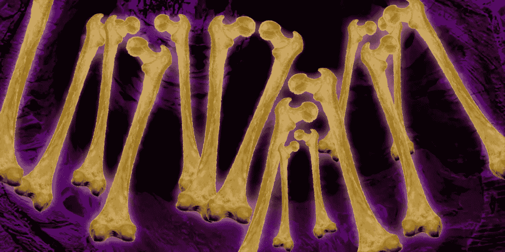

# 砰砰作响的骨头音乐之旅一直持续到结束

> 原文：<https://medium.datadriveninvestor.com/for-the-love-of-music-why-is-it-so-hard-to-make-a-living-being-a-musician-4a7af7fcd07?source=collection_archive---------5----------------------->

## 从音乐产品到一厢情愿的流媒体

五个疯狂敲打骨头的尼安德特人坐在一根中空的木头周围。奇迹般地，灾难开始切分，激励其他多毛类型的人也加入进来。一个客户的需求诞生了。

音乐是暂时的。它在那里…然后就不见了。

 [## 社交媒体收听让您随时了解|数据驱动型投资者

### 虽然社交媒体倾听是一种顶级趋势，但它应该是每个现代营销策略的一部分。保持和谐…

www.datadriveninvestor.com](https://www.datadriveninvestor.com/2019/02/26/social-media-listening-keeps-you-plugged-in/) 

随着托马斯·爱迪生对现场录音的实际应用，他把音乐变成了一种可重复的商品。我们可以捕捉声音，包装时间的瞬间。

然后是这个行业的音乐大师:唱片公司、出版商、代理商，所有这些东西。

然后是 Napster，这是一个简短的免费音乐分发网络应用程序，或者最有可能被认为是互联网音乐窃贼。

随着“物联网”的发展，音乐出版商开始失去对商品的控制。亚马逊等为内容定价。Streamers 很快就跟随支付许可证持有者很少，因为他们可以。Streamers 最近输掉了一场官司，导致版税支出增加了 15%。万岁！这对有五部戏剧的音乐家有什么影响，或者甚至不能被他们接受？

与此同时，我们越来越不开心的尼安德特人开始抱怨，抱怨音乐机器不能支付曾经盈利的出版计划。“怎么回事？”他们开始喃喃自语。“你连一个像样的骷髅头邦克都买不到！”机器说，“你要多巡演”！

几年后，在盛大的“撞骨之旅”之后，他们的配偶与毛发浓密的伴侣同居了。“该死的！真的…又来了！犯了大错怎么办？”

“孩子抬头看着妈妈说，‘嘿，妈妈，我想我长大后要成为一名音乐家。’？妈妈低下头，“你不能两者兼得。"

世界已经变了。变得更好？不确定？推动过去音乐业务的主要引擎仍然存在。也许是时候改变这一切了，或者至少是部分改变，转向一种更民主的草根音乐发行方式了？

有许许多多热情的音乐家想要分一杯羹。有些确实进入了机器的权限。大多数人从来没有……松了口气，他们可以负担下一场演出的油钱。

人才无处不在，并将随着我们的世界不断变化而增长。加上生产和销售价格的下降。添加便宜的自制录音。爱迪生的视野将继续扩大。

让我害怕的是很少有公司巨头控制这么多。对我来说，这个故事最终会有一个更好的结局，那就是发起一个支持许多人而不是少数人的替代品牌，这是对行动的呼吁。

*约翰·科尔，创始人/开发者*[T3【Muezbiz.com】](http://muezbiz.com)

其他阅读材料:

[*为了对音乐的热爱:兴趣 vs 社交媒体—第一部*](https://medium.com/@john_cole/for-the-love-of-music-interest-vs-social-media-part-1-1ffeac174a29)

[*为了对音乐的热爱:过滤重要的东西——第二部分兴趣 vs 社交媒体*](https://medium.com/@john_cole/for-the-love-of-music-filtering-what-matters-part-2-interest-vs-social-media-5196c7071450)