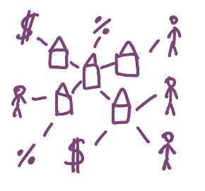
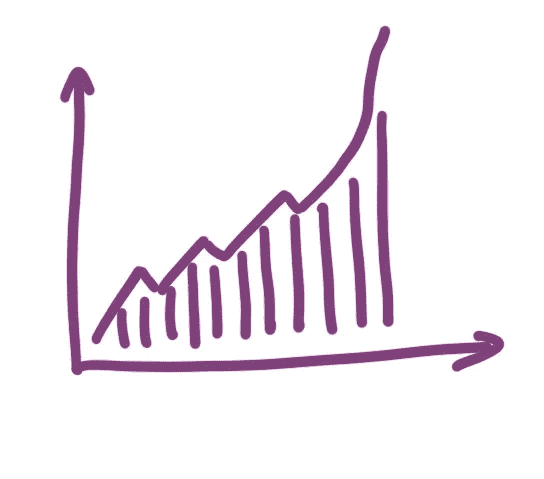

# 企业的强制社交网络

> 原文：<https://medium.datadriveninvestor.com/forced-social-network-for-enterprises-4378f0d23f24?source=collection_archive---------9----------------------->

当我在脑海中思考可能的新社交网络时，我再次回到了商业社交网络。以前有人尝试过创建这样的服务，据我所知，除了创建没人真正使用的弱销售线索生成平台之外，并没有取得多大成功。

但是今天我想——如果你是一个政府，你可以强迫公司加入这样的公共社交网络会怎么样？会发生什么？

首先，它意味着什么，企业之间的社交网络？我们可以识别公司之间多层次的相互联系。

1.  **所有权网络**。一个公司可以拥有另一个公司，一个人可以拥有几个公司的股份，可以有控股公司，姐妹公司，有大股东的上市公司，可能还有几十个更复杂的安排。这是最强的网络。
2.  **交易网**。公司买卖产品和服务。这是它们存在的主要原因。每笔交易都是与另一家公司或私人进行的。(如果私人也是另一家公司的所有者，并且交易超过一定规模，这就成为交易网络的一部分)。这是最广的网络。
3.  **社交网络。**公司与其他公司一起参加展览、行业协会、游说团体、赞助交易。这是最弱但可能非常有趣的网络。

政府知道网络的所有三层。他们知道谁拥有公司，因为它负责登记和发放贸易许可证，所以所有权被包括在内。

 [## 为什么包容性财富指数比 GDP 更能衡量社会进步？|数据驱动…

### 你不需要成为一个经济奇才或金融大师就能知道 GDP 的定义。即使你从未拿过 ECON 奖…

www.datadriveninvestor.com](https://www.datadriveninvestor.com/2019/03/08/why-inclusive-wealth-index-is-a-better-measure-of-societal-progress-than-gdp/) 

对于有严格增值税法律的国家，公司也很有可能必须报告他们为其开具发票的所有方以及他们为其支付发票的所有方。此外，对于与私人进行的超过一定规模的交易，往往会有额外的报告。

Crudely drawn network

所以，想象一下，政府拥有的所有这些数据都会被公布。每月一次或近乎实时，具体取决于如何设置报告。政府不需要构建任何花哨的用户界面，简单的 API 访问就足够了。也许还可以批量出口。人们会很快发现的。

直接的影响是，不同的市场参与者将有更加平等和透明的竞争环境。

投资者和贷款人将清楚地了解所有权网络。更容易判断谁更有心机，谁更诚实。谁面临的风险更大，谁更安全。这将降低投资者的风险，从而降低优秀市场参与者的融资成本。降低银行业的系统性风险。

竞争对手会了解彼此的供应链。他们大概的成本和利润。这将推动市场更趋向于完全竞争，这意味着公司的利润减少，但对消费者来说更划算。此外，这将使新的市场参与者更容易进入该行业，也将压低价格。

最终用户在做出购买决定时会更加知情。不仅是价格，还有基于道德的各种选择。当购买散养时，他们将能够检查特定生产商的供应商实际上有多自由以及范围有多大。或者该公司向哪些政党捐款。或者还有什么其他不想要的三级关系。提取这些信息很容易实现自动化，使明智或保守的选择变得更容易。

当然，各种义务数据分析师会忙活几天，指出政客、官僚和供应商之间的可疑联系。

从更宏观的层面来看，这意味着什么？随着国内竞争力的增强，许多公司将会失败，许多公司将会胜出，但最终，精干而强大的赢家将会出现。他们也将能够在全球范围内更好地竞争。

不那么明显的结果是更好的公司治理和更好的政府官员行为。透明度将通过选择首选供应商或友好折扣来润滑某些齿轮，从而减少自我交易和隐性腐败的发生。

随着生产率的提高，人口会变得更加富裕。随着竞争的加剧，价格会被压低，生活成本会下降。

当然，也可能有负面影响。坏玩家也将获得更多的知识，因此他们将能够进行更有针对性的企业欺诈。当某个供应商处于困境时，跟踪起来会容易得多，而且像发送假发票这样的事情会获得新生。

贷款人更准确的了解可能会减少挣扎中的公司的整体跑道，因此会发生更多的破产，这虽然在宏观层面上可能是健康的，但会给直接受影响的人带来许多不快。

在某些情况下，受到更好保护的外国竞争对手可能会获得本地公司的优势。尤其是在全球供应链的情况下，这种强制透明并不涵盖所有步骤。

还会有很多其他难以想象的后果。新的创业公司将在现有数据的基础上成长。将做出新的自动化商业决策。新的社会运动将会出现。社会将会永远改变，只有时间才能说明整体影响。

Amazing growth