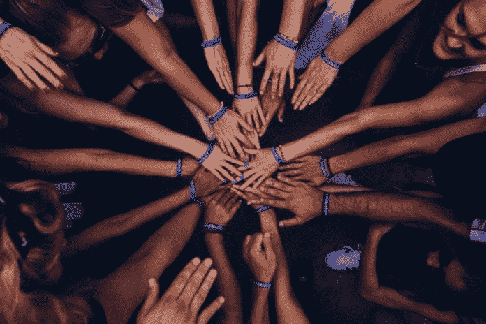

# 有力的对话会产生影响

> 原文：<https://medium.datadriveninvestor.com/forceful-conversations-create-impact-df95389d5f29?source=collection_archive---------6----------------------->

## 在线社区有广泛的网络优势

Photo by Perry Grone on Unsplash

无论是偶然的聊天还是改变世界的事件——网上对话都会产生深远的影响。在这两个极端，社交媒体社区都有意想不到的影响力，特别是在他们关心的事情上。

《T2》中的西蒙·奥凯洛(T3)就是这样一位令人揪心的人物，他是《T4》中的故事讲述者(T5)，企业家，也是旨在促进社会福利和经济权利的“One Vibe Africa”(T7)的创始人兼执行董事。在一次非洲推特聊天中，他谈到了社交媒体的影响。

Okelo 说:“T10 在线社区的影响不仅仅局限于参与者。”。“在过去十年里，由于在线社区，革命成为可能。

他说:“对袭击马拉维、莫桑比克和南部非洲其他地区的飓风等自然灾害的反应是全球性的。”。“由于在线社区的参与和连锁反应，受害者得到了更快的支持。”

在线网络中的社区具有共同的特征。

 [## 在创业之旅中，拥抱学习|数据驱动的投资者

### 好像建立一个数百万美元的公司还不够困难，企业家必须额外照顾他们的…

www.datadriveninvestor.com](https://www.datadriveninvestor.com/2018/10/16/on-the-entrepreneurial-trek-embrace-the-learning/) 

奥凯洛说:“关键是你是否能信任一个人、一个组织或一个品牌，只要你在网络上与之互动。”“你在网上寻找什么？你为什么选择在线网络来实现你的目标？

“另一个属性是你的在线行为对你的社区和世界的影响，”他说。“你必须对自己的线上和线下行为负责。”

# 广泛的支持范围

奥凯洛讲述了在线社区的对话是如何让他受益的。

“自 2008 年肯尼亚大选后发生暴力事件以来，我一直在运营 One Vibe Africa，”他说。“在线社区使我能够与 80%以上的现有工作支持系统建立联系。

他说:“我主要通过网络社区与一些最有天赋的艺术家建立了联系，如[索蒂索尔](https://twitter.com/sautisol)唱片公司、[闪电战大使](https://twitter.com/BlitzAmbassador)、[尼克韦斯特](https://twitter.com/Nikwestbass)、[乔克拉特](https://twitter.com/Choklate)、[洛基达乌尼](https://twitter.com/RockyDawuni)、[洛基达乌尼](https://twitter.com/RockyDawuni)、[梅克利特](https://twitter.com/meklitmusic)、[阿拉米德](https://twitter.com/AramideMusic)和许多其他人。

奥凯洛指出，不要认为这些在线联系是理所当然的。

“我通过在线社区与组织和合作伙伴建立了真实而持久的关系，”他说。“我始终如一，通过 One Vibe Africa 将我们的在线信息与我们在肯尼亚和西雅图的实地工作联系起来。”

 [## 无论在线还是离线，社区建设都是一个立竿见影的方法

### 击中正确的音符需要技巧，而不是昙花一现

blog.markgrowth.com](https://blog.markgrowth.com/online-and-off-community-building-is-a-quick-win-f8006bcb1958) 

如果对在线社区感兴趣，奥凯洛敦促那些受诱惑的人加入进来。

“从你所在的地方开始，”他说。“不要等待最佳时机。建立你的人际网络和拓展你的视野，永远没有最佳时机。

声音建立品牌，可以形成强大的社区。

“当你的声音可以被信任时，你可以在线或离线使用它来推动变革并形成强大的在线社区，”奥凯洛说。“在网上建立一个强有力的声音需要时间，这样你才能形成一个能够产生真正影响的在线社区。”

他引用了作者兼大使博尼法斯·恩旺吉作为有影响力的例子。这带来了意想不到的好处。

奥凯洛说:“彼此有意识，并理解我们为什么做我们所做的事情，可以推动在线对话。”"这促进了社区的发展，无论它们在哪里都会产生影响."

**关于作者**

吉姆·卡扎曼是拉戈金融服务公司的经理，曾在空军和联邦政府的公共事务部门工作。你可以在[推特](https://twitter.com/JKatzaman)、[脸书](https://www.facebook.com/jim.katzaman)和[领英](https://www.linkedin.com/in/jim-katzaman-33641b21/)上和他联系。

*原载于 2019 年 6 月 9 日*[*https://www.datadriveninvestor.com*](http://bit.ly/2WAQF86)*。*