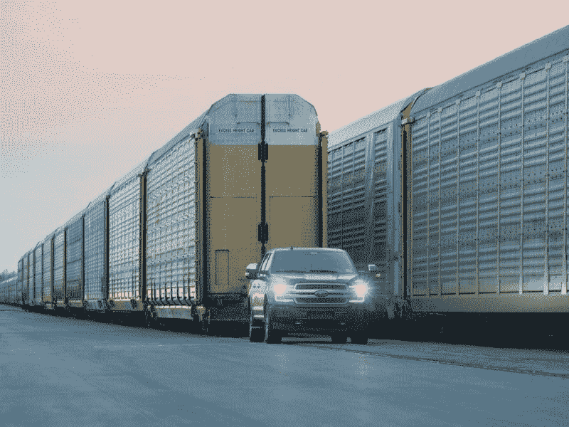
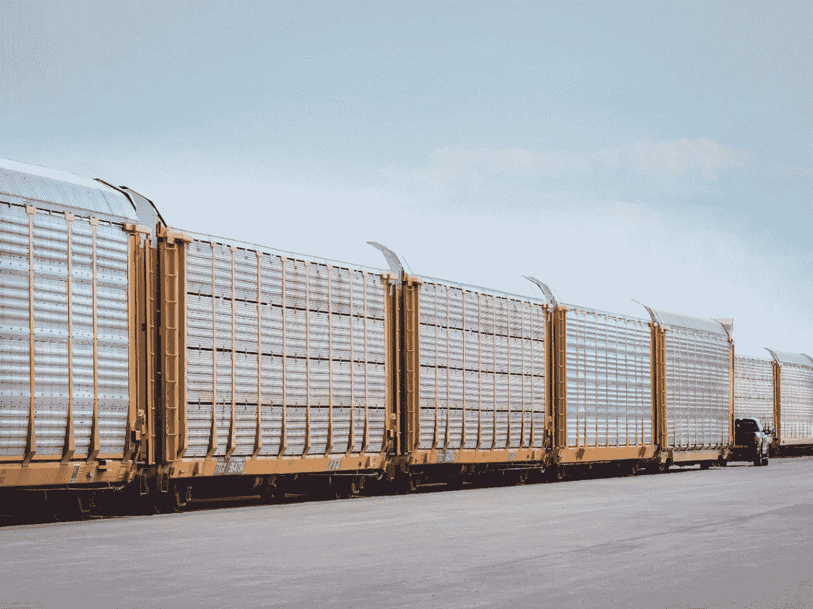
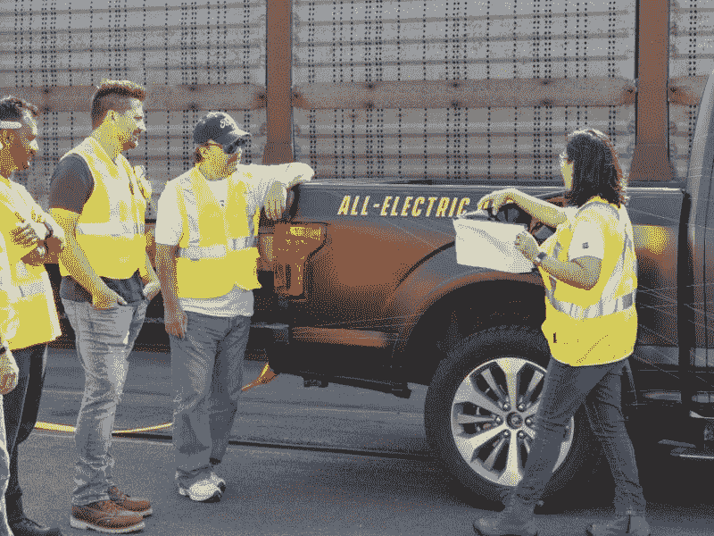
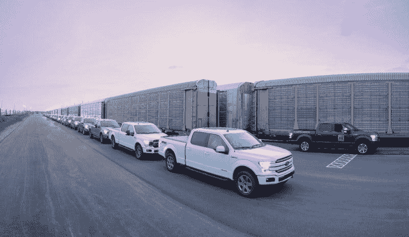
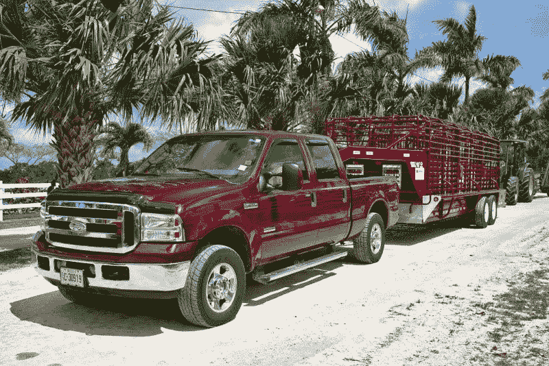

# 福特可能主宰电动卡车并亏损——市场疯人院

> 原文：<https://medium.datadriveninvestor.com/ford-could-dominate-electric-trucks-and-lose-money-market-mad-house-6414e251d45b?source=collection_archive---------9----------------------->

奇怪的是，福特可以在主导电动卡车的同时亏损。来解释一下，**福特(NYSE: F)** 凭借一段电动 F-150 拉火车的视频吸引了很多关注。

在[的视频](https://www.youtube.com/watch?v=bXFHgoon7lg&feature=youtu.be)中，一架全电动的 F-150 牵引着一辆价值 125 万英镑的火车，一群戴着棒球帽的工人在一旁观看。该视频是一个很好的营销噱头，但这种噱头几乎不可能或原创。

 [## 在自动驾驶汽车发生事故的情况下，谁应该承担法律责任？数据驱动的投资者

### 我仍然认为自动驾驶汽车是一种奢侈品，而不是必需品…

www.datadriveninvestor.com](https://www.datadriveninvestor.com/2018/11/02/who-is-legally-accountable-in-the-case-of-an-autonomous-vehicle-accident/) 

为了说明这一点，他们设计了易于牵引的火车。因此，小型机车；甚至人力手推车，也能短距离拉动巨大的火车。值得注意的是，像丹佛区域运输区(RTD)这样的运输机构一直使用卡车来牵引重型轻轨车和火车。

另外*公路和轨道*做得很好[解释了](https://www.roadandtrack.com/new-cars/a28506476/ford-electric-f150-train-tow-physics-explained/)在钢制车轮和铁轨上移动巨大负载背后的物理原理。这个特技就像一个魔术，看起来很惊人，但是没有什么特别的。

# 福特的营销天才将如何统治电动汽车

福特的视频是一个出色的营销策略，因为它表明全电动卡车是“做真正卡车事情的真正卡车”此外，它对那些不关心气候变化或环境的受教育程度较低的工人很有吸引力。

这可能会给福特一个优势，因为它在美国中部有着良好的信誉；不像**特斯拉汽车公司(纳斯达克股票代码:TSLA)** 和新创公司 Rivian。重要的是，福特展示了它可以工作的电动皮卡，而特斯拉的“[赛博朋克皮卡](https://www.ibtimes.com/tesla-pickup-design-gorgeous-new-concept-design-features-cyberpunk-look-2807822)仍在绘图板上。

我认为福特的营销天才使其在电动卡车方面具有优势。令人印象深刻的是，福特在 2019 年前三个月售出了 214，511 辆 F 系列皮卡，*底特律自由新闻* [估计](https://www.freep.com/story/money/cars/2019/04/04/ram-chevy-silverado-f-150-ford-pickup-sales/3352053002/)。因此，自由媒体声称 F 系列的“品牌”价值 500 亿美元。

# 福特无视 F-150 的批评

具体来看，福特 2018 年在美国销售了 90.9 万辆 F 系列皮卡，平均价格为 4.67 万美元。此外，自由新闻估计，福特在 2019 年从 F 系列销售中赚了 500 亿美元。

有趣的是，福特的营销人员认为 F-150 如此受欢迎，他们拒绝回应通用汽车公司(NYSE: GM)对这款车的大肆宣传的攻击。顺便说一句，所有新的 F-150 将于明年部分电动化，配备新的混合动力系统。动力传动系统的特征可以包括为工人在工作现场的工具提供动力的发电机。

福特需要升级游戏，因为 Rivian 正在[接受](https://products.rivian.com/)R1T 电动皮卡的预订。Rivian 声称 R1T 充电一次可行驶 400 多英里，三秒钟内从 0 到 60 英里/小时。他们设计了时尚的 R1T 将越野能力和灵活的横杆系统等设施。

# 福特在亏损吗？

尽管 F 系列取得了成功，福特还是遇到了一些问题。例如，其季度毛利从 2019 年 3 月 31 日的 40.45 亿美元降至 2019 年 6 月 30 日的 28.15 亿美元。

此外，福特的季度收入从 2019 年 3 月 31 日的 403.42 亿美元降至 2019 年 6 月 30 日的 388.53 亿美元。值得注意的是，福特的收入增长在 2019 年前两个季度有所下降。今年前三个月，收入增长下降了 3.85%，第二季度收入增长萎缩了 0.17%。

Courtesy Ford

引人注目的是，福特的营业收入从 2019 年 3 月 31 日的 12.03 亿美元降至 2019 年 6 月 30 日的 9000 万美元。此外，同期季度收入从 11.46 亿美元降至 1.48 亿美元。

福特并没有亏损，但肯定是赚钱少了。然而，该公司产生的现金比以往任何时候都多。

# 福特正在创造更多的现金

例如，福特的经营现金流从 2019 年 3 月 31 日的 35.44 亿美元增长到 2019 年 6 月 30 日的 64.63 亿美元。

与此同时，自由现金流从 19.11 亿美元跃升至 45.43 亿美元。相比之下，融资现金流从 2019 年 3 月 31 日的 18.73 亿美元下降至 2019 年 6 月 30 日的-26.81 亿美元。此外，投资现金流从-13.34 亿美元降至-24.9 亿美元。

因此，福特在运营上产生了大量现金，但在融资和投资上却损失了现金。我认为这些数字证实了*自由报关于“F-150 品牌”价值的说法很明显，福特公司的钱柜里有大量现金。*

Ford Marketing Electrics to working guys

因此，福特在 2019 年 6 月 30 日报告了 221.17 亿美元的现金和等价物，高于 3 月份的 208.48 亿美元。相反，福特在 2019 年 6 月 30 日报告的短期投资为 159.31 亿美元，低于 2019 年 3 月的 168.82 亿美元。

因此，福特在 2019 年 6 月 30 日有 380.48 亿美元的现金和短期投资。因此，福特手头有足够的现金来资助电动皮卡的开发或收购 Rivian。

# 福特会从遥控车辆中赚钱吗？

福特正利用这些现金在自动驾驶汽车技术领域进行引人注目的收购。

特别是，福特正在收购 Quantum Signal，这是一家为自动驾驶汽车开发控制系统的军事承包商，一个媒体帖子[透露](https://medium.com/self-driven/ford-acquires-quantum-signal-heres-how-it-advances-self-driving-vehicle-development-265d041562b2)。重要的是，Quantum 开发了软件，让美国军方可以从数千英里以外控制机器人车辆和无人机。

我认为福特可以加入 Quantum 的技术来制造遥控卡车和货车。因此，操作员可以从数百或数千英里外“驾驶”卡车或货车。

Courtesy Ford

例如，一名操作员可以坐在密歇根州的沙发上，在内华达州的一个矿场“驾驶”一辆卡车。一个虚拟现实耳机可以让司机在不离开弗林特娱乐室的情况下看到埃尔科外面的矿井发生了什么。

我认为这样的能力会增加福特的价值。从自主控制快速切换到人类操作员的能力将是自动驾驶汽车的一个卖点。福特似乎理解这一潜力，并试图利用 TaaS 平台赚钱。

# 福特能开发全自动驾驶汽车吗？

Randy Visintainer [在 Medium](https://marketmadhouse.com/ford-could-dominate-electric-trucks-and-lose-money/Chief%20Technical%20Officer,%20Ford%20Autonomous%20Vehicles,%20LLC)撰文称，福特可以将 Quantum 的算法加入其计划中的交通即服务(TaaS)平台。Visintainer 是福特自动驾驶汽车有限责任公司的首席技术官。

Visintainer 推测，Quantum 的高级建模和模拟虚拟环境将使福特测试和研究自动驾驶汽车变得更加容易。这样的模拟可以加速福特和 Argo AI 的自动驾驶汽车的开发。Argo 是福特在 2017 年投资[10 亿美元](https://media.ford.com/content/fordmedia/fna/us/en/news/2017/02/10/ford-invests-in-argo-ai-new-artificial-intelligence-company.html)的人工智能公司。

Visintainer 透露，福特还拥有以色列机器学习公司 SAIPS。SAIPS 正在开发一种视觉认知系统，可以让车辆“看到”路上的行人和其他车辆。

这种视觉认知对于自动驾驶汽车实现完全自动驾驶(FSD)能力是必要的。此外，SAIPS 正在为城市环境开发高分辨率 3D 地图系统，以帮助车辆在现实世界中导航。

在福特的领导下，SAIPS 的规模扩大了一倍，达到 30 人，并搬到了特拉维夫的新办公室。然而，目前还不清楚福特离完全自动驾驶汽车上路还有多远。

# 福特在自动驾驶汽车上亏损吗？

福特发现，让自动驾驶汽车上路成本高昂。事实上，福特在一家名为**Pivotal Software(NYSE:PVTL)**、*、*、[债权](https://fortune.com/2019/07/29/ford-pivotal-write-down)的云计算公司中损失了 1.81 亿美元。

福特拥有约 1.71 亿美元的 Pivotal 股票。Pivotal 于 2019 年 5 月 3 日报告净亏损-3174 万美元，运营亏损-3491 万美元。然而，Stockrow 报告称，截至 2019 年 5 月 3 日的季度，Pivotal 的收入增长率为 19.25%。

我猜福特需要 Pivotal 的云来容纳其自动驾驶汽车的操作系统和 Quantum 软件创建的应用程序。特别是，福特可以使用 Pivotal Cloud 来安装 TaaS，这是一种自动驾驶汽车的操作系统。

我认为这样的系统可以让福特在城市中部署消防车辆。福特可以通过出租消防队的车队作为出租车或送货车来赚钱。有趣的是，福特正在测试 Agility Robots 的数字行走机器人，以交付由其运输自动货车拖行的包裹， *IEEE Spectrum* [报道](https://media.ford.com/content/fordmedia/fna/us/en/news/2017/02/10/ford-invests-in-argo-ai-new-artificial-intelligence-company.html)。

福特的亏损可能会继续，因为管理层承诺在 2021 年推出完全自动驾驶的汽车。为此，福特正在迈阿密和华盛顿州 DC 测试自动驾驶汽车；美国消费者新闻与商业频道[声称](https://www.cnbc.com/2019/04/25/ford-aims-for-100-self-driving-cars-on-the-road-by-the-end-of-2019.html)福特希望到 2019 年底有 100 辆自动驾驶汽车上路。

# 福特和大众联盟

美国消费者新闻与商业频道[报道](https://www.cnbc.com/2019/03/20/ford-to-build-new-factory-in-michigan-for-autonomous-vehicles.html)最后，福特正在密歇根州建造可能是世界上第一家自动驾驶汽车(AV)工厂。该工厂是福特与世界上最大的汽车制造商大众汽车公司的自动驾驶和电动汽车合作伙伴关系的一部分。

在合作中，福特获得了大众的电动汽车架构，一份新闻稿[指出](https://media.ford.com/content/fordmedia/fna/us/en/news/2019/07/12/ford-vw.html)。作为交换，大众汽车正在投资 Argo AI，以获得该公司的自动驾驶汽车系统。

值得注意的是，电动 F150 就在福特和大众于 2019 年 7 月 12 日宣布扩大联盟后出现。因此，福特可能会使用大众技术来驱动全电动 F150。

# 福特仍然是一只价值投资和分红股票

我认为福特是一个价值投资，因为它的价格低，能够产生现金，价格低。值得注意的是，**福特(纽约证券交易所代码:F)** 的股票在 2019 年 8 月 2 日的交易价格为 9.26 美元。

与特斯拉不同，福特支付股息。目前，福特股东将于 2019 年 9 月 3 日获得 15₵股息。然而，福特的股息在过去一年没有增长。福特股息增长乏力是好事，因为这表明该公司正在将额外现金投资于新技术，以推动未来增长。

尽管股息增长乏力，福特投资者在 2019 年 8 月 2 日获得了 6.48%的股息收益率，即 60₵的年化派息，派息率为 43.5%。所以福特是很好的分红股。

如果你在寻找一只赚钱的电动和自动驾驶汽车股票，那就是福特。如果你想在电动汽车和自动驾驶汽车上赔钱，就买**特斯拉(纳斯达克代码:TSLA)** 股票。

*原载于 2019 年 8 月 2 日*[*https://marketmadhouse.com*](https://marketmadhouse.com/ford-could-dominate-electric-trucks-and-lose-money/)*。*