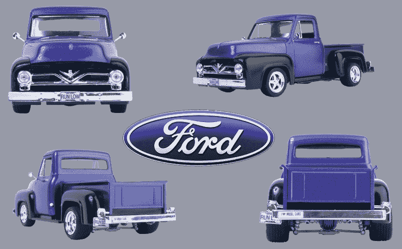
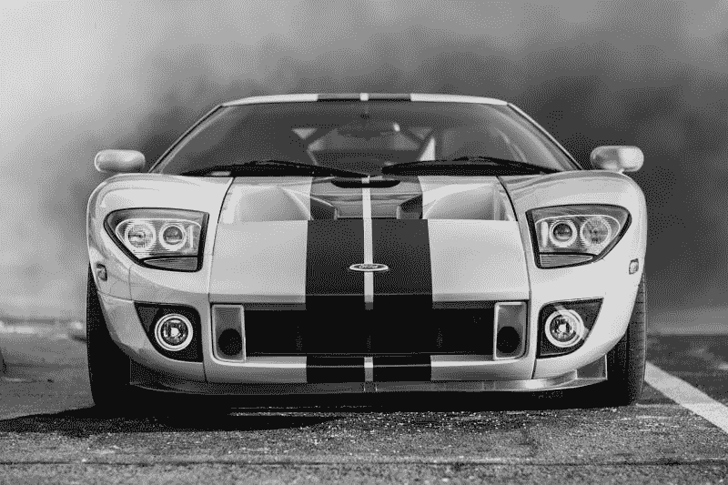
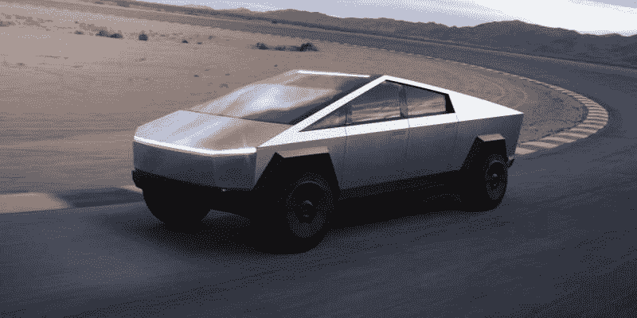
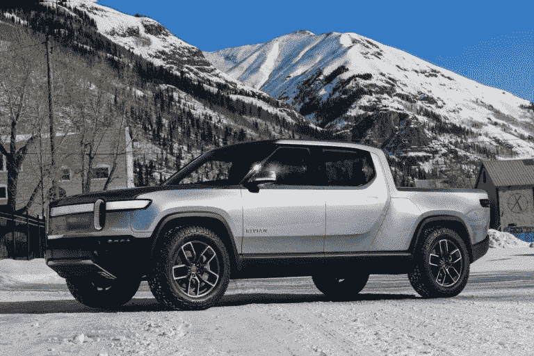
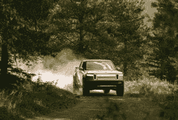
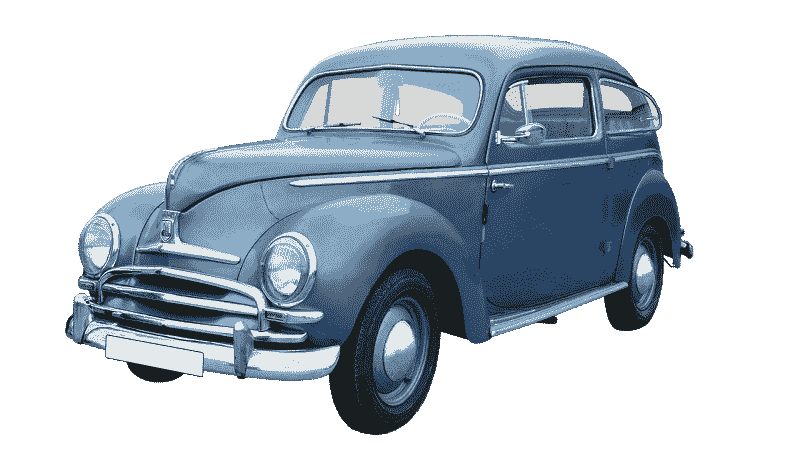
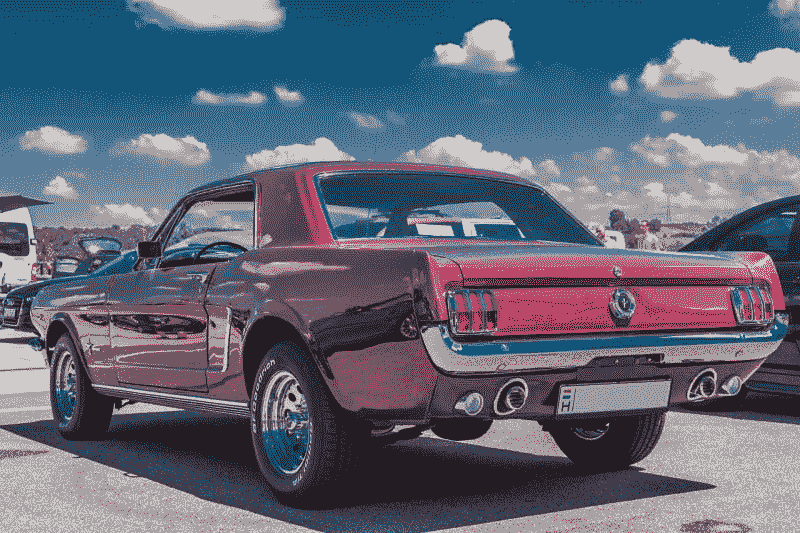

# 福特面临现金质疑和特斯拉 cyber truck——市场疯人院

> 原文：<https://medium.datadriveninvestor.com/ford-faces-cash-doubts-and-tesla-cybertruck-market-mad-house-f594ff11d3c9?source=collection_archive---------9----------------------->

市场先生对福特(纽约证券交易所代码:F) 和 T2(纳斯达克代码:TSLA) 之战的看法很奇怪。

福特赚了很多钱，产生了大量的现金，但是市场先生却把它当成垃圾。福特股票；例如，2019 年 11 月 29 日的交易价格为 9.03 美元。这使得福特当天的市值达到 359.22 亿美元。

然而，特斯拉股票在 2019 年 11 月 29 日的交易价格为 329.94 美元。因此，特斯拉当天的市值为 594.7 亿美元。

# 特斯拉 vs 福特

福特报告季度毛利为 23.4 亿美元，季度运营亏损为-2.61 亿美元，季度净收入为 4.25 亿美元，2019 年 9 月 30 日的收入为 369.9 亿美元。

对于一个历史混乱的小玩家来说，特斯拉做得很好。特斯拉报告季度营收为 63.03 亿美元；是福特在 2019 年 9 月 30 日的近三倍。

此外，截至 2019 年 9 月 30 日，特斯拉报告季度毛利为 11.91 亿美元，季度营业收入为 2.61 亿美元，季度净收入为 1.43 亿美元。因此，特斯拉在某些方面比福特做得更好。

福特最健康的东西是它的现金流。2019 年 9 月 30 日，福特报告运营现金流为 47.32 亿美元；投资现金流-45.47 亿美元，融资现金流-15.32 亿美元，自由现金流 29.27 亿美元。

 [## 数据驱动投资的兴起|数据驱动投资者

### 当 JCPenney 报告其 2015 年 2Q 的财务结果时，市场感到非常震惊。美国零售巨头…

www.datadriveninvestor.com](https://www.datadriveninvestor.com/2019/02/28/the-rise-of-data-driven-investing/) 

相比之下，特斯拉报告的运营现金流为 7.56 亿美元，投资现金流为-4.8561 亿美元，融资现金流为 1.1818 亿美元，自由现金流为 3.4607 亿美元。

# 福特拥有大量现金

令人印象深刻的是，福特手头有大量现金。2019 年 9 月 30 日，福特报告了 205.23 亿美元的现金和等价物以及 168.08 亿美元的短期投资。特斯拉当天报告了 55.71 亿美元的现金和等价物。

因此，特斯拉没有产生大量现金，但福特产生了。然而，福特陷入了亏损的遗留业务，消耗了大量现金。

美国消费者新闻与商业频道[报道](https://www.cnbc.com/2019/11/25/at-ford-37-billion-in-the-bank-and-strapped-for-cash.html)，福特明智地放弃了传统业务。福特将关闭其在南美的重型卡车业务，关闭其在巴西最古老的工厂，并在欧洲裁员 12，000 人。

此外，福特计划出售六家欧洲工厂，并在美国裁员 2300 人。最后，福特将在全球范围内裁员 10%或 7000 人。

# 福特 F 系列与特斯拉 Cybertruck

特别是，福特仍然提供美国最畅销的汽车 F 系列皮卡。CarSalesBase [估计](http://carsalesbase.com/us-car-sales-data/ford/ford-f-series/)福特在 2018 年售出了 909，330 辆 F 系列皮卡。此外，福特在 2019 年前六个月销售了 214，176 辆 F 系列卡车。

一个注意到 F-150 成功的人是埃隆·马斯克。马斯克终于在 2019 年 11 月 22 日推出了他的特斯拉 Cybertruck。我认为赛博卡车对福特没有威胁，因为它看起来又丑又蠢。

例如，赛博卡车看起来像是上世纪 70 年代的一部糟糕的科幻电影。用汽车术语来说，我认为赛博卡车像是德洛尔和庞蒂克阿兹特克的混合体。德罗宁和[阿兹特克](https://en.wikipedia.org/wiki/Pontiac_Aztek)是美国有史以来最不成功的两种交通工具。

此外，网络卡车在我看来不切实际。它似乎没有床和货物运输能力。是的，小型皮卡很常见，但你买皮卡的一个原因是为了在床上拖东西。

# 特斯拉赛博卡车会失败

在我看来，赛博卡车是由一个对皮卡一无所知的人设计的。或许，埃隆·马斯克需要去他位于加州弗里蒙特的工厂，问问装配线上的几个工人关于皮卡的问题。

最后，Cybertruck 可能是特斯拉最大的失败，因为它是第一辆丑陋的特斯拉。尽管有缺点，特斯拉早期的车型看起来还是很棒的。我认为 S 系列和 Model 3 是现代汽车风格和设计的典范。

网络卡车；然而，是一个恐怖的汽车黑暗时代的 80 年代。一辆如此丑陋的车注定要失败。此外，车辆的游戏是可怕的。这让我想起了赛博人，笨重的机器人*神秘博士*想把人类变成没有灵魂的机器人的坏人。

# 里维安不是特斯拉是电动卡车的未来

我的预测是，购买卡车的公众会看一眼 Cybertruck，然后买一辆 Rivian 或电动 F 系列。我的产品电脑车卖不出去，不管它表现得多好。

相比之下，里维安的 [R1T 卡车](https://rivian.com/r1t/)看起来像一辆卡车，而不是上世纪 80 年代电影中的道具。卡车买家是保守的，我预测他们会拒绝一种似乎是机械警察运输解决方案的车辆。

一份新闻稿显示，福特计划向 Rivian 投资 5 亿美元。除了里维安，福特在夏季推出的全电动 F-150 也让马斯克感到不安。在 YouTube 视频中，福特让全电动的 F-150 拉着一列自动运载轨道车，让这种侮辱回到了家。

这个视频让马斯克很不爽，他在他的网络卡车首映嘉年华上，让一辆网络卡车在牵引比赛中击败了一辆汽油 F-I50。*巴伦的* [报道](https://www.barrons.com/articles/tesla-beats-ford-in-tug-of-war-why-ford-is-right-to-be-upset-51574778575)，赛博卡车赢得了这场“挑战”可以预见的是，福特正在挑战马斯克在 Cybertruck 和全电动 F-150 之间进行战斗， *TechCrunch* [报道](https://techcrunch.com/2019/11/25/ford-vp-challenges-tesla-to-a-fair-f-150-vs-cybertruck-tow-battle/)。

我想象 Rivian 和通用汽车(纽约证券交易所代码:GM)会对特斯拉发起类似的挑战。据报道，通用汽车公司正在计划自己的电动皮卡。因此，营销大师马斯克给了他的竞争对手免费宣传。

归根结底，我预测马斯克将不得不回到绘图板，设计一款更好的皮卡。我希望那辆卡车能达到特斯拉早期高标准的设计和美学。

# 特斯拉可能很快就会推出全自动驾驶汽车

**《财富》 [声称](https://fortune.com/2019/11/20/tesla-full-self-driving-car-tsla-stock/)**特斯拉汽车公司(纳斯达克股票代码:TSLA)*可能会在几周内推出一款全自动驾驶汽车。《财富》杂志的这一说法基于马斯克在特斯拉 2019 年 10 月财报电话会议上的声明。*

然而，我认为马斯克的声明表明车辆将远离自动驾驶。“汽车能够自动驾驶，但有时需要监督和干预，”马斯克说。

因此，特斯拉可能会发布四级或高度自动驾驶汽车，而不是五级完全自动驾驶汽车。解释一下，真正的 FSD 车辆或五级自动驾驶汽车会自己做所有事情。

# 不，特斯拉可能不会有自动驾驶汽车上路

相比之下，四级自主车辆将执行 90%或 95%的驾驶功能。因此，四级自动驾驶车辆大部分时间都是自己驾驶。然而，一辆五级车一直在自动驾驶。

我的声明是基于美国国家公路交通安全管理局(NHTSA)创建的六个车辆自主级别。*如何定义*极客[这里的](https://www.howtogeek.com/401759/what-are-the-different-self-driving-car-levels-of-autonomy/) s 那些级别。

因此，特斯拉可能很快会有重大突破，但不是《财富》杂志声称的突破。此外，特斯拉在自动驾驶技术方面可能落后于 **Alphabet(纳斯达克代码:GOOG)** 子公司 Waymo。

*TechCrunch* 作家 Ed Niedermeyer [声称](https://techcrunch.com/2019/11/01/hailing-a-driverless-ride-in-a-waymo/)于 2019 年 10 月在亚利桑那州乘坐了一辆全自动 Waymo Chrysler Pacifica 小型货车。事实上，Waymo 正在亚利桑那州钱德勒测试无人驾驶出租车服务。

# 自动驾驶车辆在这里吗？

因此，特斯拉在自动驾驶汽车方面可能会落后于 **Alphabet(纳斯达克代码:GOOGL)** 和**菲亚特-克莱斯勒(纽约证券交易所代码:FCAU)** 。菲亚特-克莱斯勒生产 Pacifica。另一方面，特斯拉的技术可能是最先进的。

无人驾驶汽车已经出现，包括福特和特斯拉在内的许多公司都将推出无人驾驶汽车。在这种情况下，自动驾驶汽车技术对特斯拉来说并不像马斯克让我们相信的那样是一个大优势。

尽管马斯克言过其实，但四级自动驾驶汽车似乎已经出现，并将彻底颠覆汽车行业。尤其是四级自动驾驶车辆，会威胁到很多卡车和公交车司机的工作。

自动驾驶汽车技术将加剧关于就业扼杀技术的辩论，并提升杨安泽的总统前景。特斯拉和 Waymo 的一个噩梦可能是政府禁止自动驾驶汽车以保护“就业”。

# 福特是一个好的投资吗？

总之，我仍然认为**福特(NYSE: F)** 是一个很好的投资，因为它便宜；现金充裕，股息丰厚。福特股东于 2019 年 10 月 21 日收到 15₵股息。此外，Dividend.com 估计福特投资者在 2019 年 11 月 29 日获得的股息率为 6.59%，年化支付 60₵，支付率为 48.51%。

我认为**特斯拉汽车公司(纳斯达克:Tesla 相比之下，该公司定价过高，现金匮乏，而且不支付股息。我认为现在想赚钱的汽车行业投资者需要购买福特。那些想要一只 10 年都不会有回报的长期投机股票的人，可以选择特斯拉。**

*原载于 2019 年 11 月 29 日*[*https://marketmadhouse.com*](https://marketmadhouse.com/ford-faces-cash-doubts-and-tesla-cybertruck/)*。*