# 预测美国的经济衰退

> 原文：<https://medium.datadriveninvestor.com/forecasting-a-recession-in-the-usa-62e383c8c5bf?source=collection_archive---------7----------------------->

# 第三章:

# 特征选择和特征提取。

## 故事到此为止

在这项研究的第一部分，我分析了为什么衰退是重要的，以及它们如何影响股票市场的回报(S&P500)。第二章的重点是可用的数据集及其 EDA。总的来说，初步分析的结果相当令人欣慰，但是作为特性工程过程的结果，留给我的是一座需要攀登的巨大的特性山:210。

## 索引:

3.1 降维—概述；
3.2 特征选择；

*   单变量统计特征选择
*   特征选择:从模型中选择
*   递归特征消除

3.3 特征提取

*   主成分分析；
*   截断奇异值分解；和
*   因素分析。

3.4 结论

# 3.1 降维—概述和目标

在第二章，我经历了特征工程的过程。这一步的结果是，我现在拥有了 210 个功能。对于许多 ML 学习项目来说，这样的特征数量并不是特别高，但是考虑到我们的训练数据集的规模，673 个月的观察，这是过大的。在某一点上，更多的特征或维度会降低模型的准确性，因为需要归纳更多的数据——这被称为'*维度诅咒'*。降维是一种降低模型复杂性和避免过度拟合的方法。降维主要有两类:特征选择和特征提取。

**特征选择**或属性选择是选择数据集中最佳属性子集的过程。最后一句话的关键词是“最好”的定义。应该是相对于我要解决的问题。稍后，我将专门用一个章节来介绍评估指标，但是对于这里的分析目的来说，它意味着最高的准确性。

特征选择为分析带来了一些重要的好处，例如:

1.  它降低了模型的复杂性；
2.  它减少了模型训练时间；和
3.  它降低了过度拟合的风险。

有多种技术可以实现降维，但为了本次分析的目的，我将重点介绍四种不同的方法:

*   单变量统计；
*   从模型中选择；
*   递归特征选择；和
*   特征提取。

前三种方法通常被定义为**特征选择**，因为它们试图选择当前形式的特征子集。另一方面，**特征提取是**一种完全不同的解决‘维数灾难’的方法。它是一种无监督的线性变换技术，用于将数据集压缩到低维特征子空间，目标是保持大多数相关信息。正如在特征选择中一样，有几种工具可以实现特征提取，但这里我将集中讨论三种:主成分分析(PCA)、TruncastedSVD 和因子分析(FA)。

我不会深究这些工具的技术细节，因为这不是本文的目的，我把它留给读者和网上的优秀文章。

本章**的主要目标**是理解不同的降维过程对模型泛化性能的影响。想法是**列出一些策略**来解决“维度过程”问题，以便在稍后的分析中嵌入到管道中。

— — — — — — — — — — — — — — — — — —

**代码—准备数据:**在开始分析之前，我导入了所需的库和函数以及数据集。提醒一下，数据集从 1948 年 7 月到 2005 年 7 月，因为我已经把剩下的数据放在一边作为测试数据集。然后，为了本章的分析，我将数据集分为训练数据和验证数据。为了实现这个目标，我使用了 train_test_split 函数。在时间序列分析中，这个函数**并不理想**，但是我将在后面的特定章节中处理如何在训练集和验证集之间正确划分数据的问题。至于现在，我使用 80%的数据作为训练集，剩下的 20%作为验证。

# 3.2 特征选择:第一步。

在前一章中，我从 21 个原始特征中的每一个创建了一组滞后特征，范围从 3 到 12 个周期。如“斜率”变量的情况所示，源自相同根变量的结果特征显示出它们之间的高度相关性。

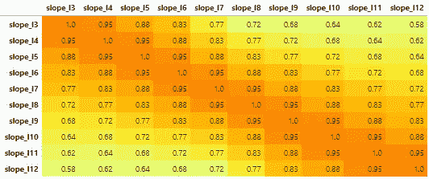

Tab.1 — Correlation Matrix for lagged features derived from ‘Slope’

降低模型复杂性的第一步是从来自同一根的每组变量中选择对解释目标更有意义的前两个特征。这个过程将特征的数量从 210 个缩减到 42 个或 80%。

通过使用 Scikit-Learn 的内置函数，使用 RandomForestClassifier 从模型中选择特性。产生的 42 个特征如下:

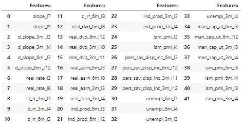

Tab.1 — Selected Features After the first screening

此外，由于一些模型受到数据相对规模的影响，我使用 Scikit-learn 的 MinMaxScaler 重新缩放数据集。同样，这不一定是最佳的扩展策略，但是这个主题将是特定章节的重点。

为了评估特征选择过程的性能，我将使用以下模型和设置:

*   **用‘L2’罚值和 C=1 作为正则化的逻辑回归**；
*   n_neighbors=5 的**KNeighborsClassifier**；
*   **LinearSVC** 以‘L2’为罚值，C=1 为正则化。

作为基线比较术语，我在精简数据集的所有 42 个特征上训练这三个模型，并存储它们在训练和验证数据上的得分(准确性):

Out.1 — Test Model score with all 42 Features

在评估特征选择/提取技术时，我将三个 ML 模型用它们选择的特征获得的分数与在 42 个特征的全集上获得的分数进行比较。特别是，重点将放在验证集的分数上。

# 3.2 功能选择

为了测试和评估不同的特性选择策略，我将把我们的特性数量从 42 个进一步减少到 25 个以下作为目标。这大约减少了原始数据集(210 个要素)的 90%。我将根据策略的准确性对其进行评估。在训练集上拟合模型之后，在验证集上计算准确度。如前所述，**准确性可能不是处理不平衡数据集时使用的最佳指标**，但是这个主题将在特定的章节中进行分析。

评估了三种不同的方法:

*   单变量统计；
*   从模型中选择；和
*   递归特征选择。

## 3.2.1 单变量统计特征选择

我测试了两种基于单变量统计的模型特征选择策略:

1.  使用默认得分函数选择百分位数:ANOVA F 值；和
2.  选择具有交互信息得分功能百分位数。

为了测试这些程序，我将通过要求选择从 2 到 25 的多个特性来重复该程序。在每次迭代中，我将存储在训练和测试数据上获得的分数。最后，我会将结果与使用所有 42 个特征获得的分数进行比较。

1.**使用默认函数选择百分位:**

第一个模型 I 测试是由 SciKit Learn 提供的“选择百分位数”方法，依赖于其默认得分函数，ANOVA F 值。用于迭代此过程的代码如下:

结果总结在以下三个数据框架中:

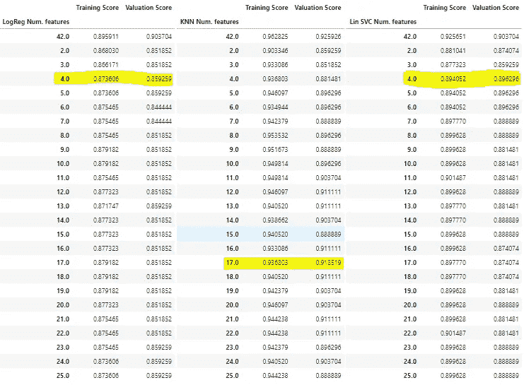

Tab.2 — Score on Training and Valuation Set selecting a different number of features using ‘SelectPercentile’ based on ANOVA F-Value.

**使用方差分析 F 值选择百分位—评估:**根据收集的统计数据，使用默认得分函数选择百分位所选择的特征无法改善使用整个数据集所能获得的结果。在逻辑回归的情况下，估价集上的最佳分数是用四个特征达到的，但是与用所有特征训练的模型相比有显著下降，从 90.4%下降到 85.9%。它对于 KNN 和 LinearSVC 模型表现稍好，分别具有 17 个和 4 个特征，其中信息损失最小。

作为参考，下图显示了使用此程序选择的 4 和 17 特性。所选特征以黑色标记，要将数字与相应的特征联系起来，请参考上面的表 1:

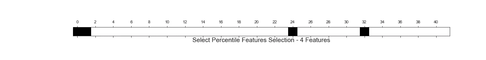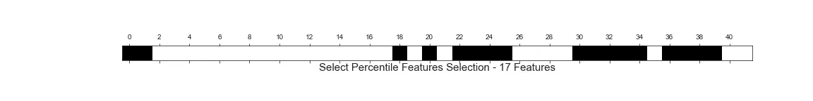

Fig.1 — SelectPercentile with ANOVA F-Value, 4&17 Selected Features

2.**选择具有交互信息分数的百分位:**第二种方法 I 测试是用交互信息分数替换选择百分位的默认分数函数。所使用的代码非常相似，所以我不会再次展示它(它可以在我的 GitHub 库中找到)。下表报告了获得的结果:

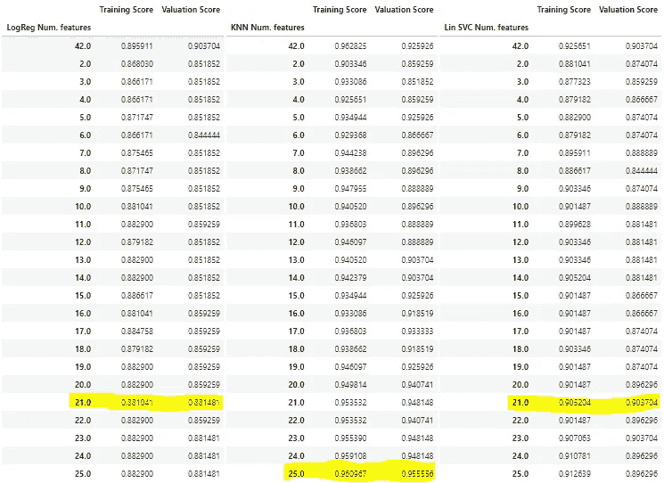

Tab.3 — Score on Training and Valuation Set selecting a different number of features using ‘SelectPercentile’ based on Mutual Information.

**选择具有互信息分数的百分位数—评估:**如果逻辑回归显示与具有所有特征的模型相比没有改善，KNN 模型能够在仅具有 5 个特征的评估集上再现相同的结果，而当使用 20 至 25 个特征时开始产生更好的分数(具有 25 个特征的最佳分数)。LinearSVC 模型可以使用 21 个特征子集在测试集上重现相同的分数。

作为参考，下图显示了使用此程序选择的 21 和 25 个特性。所选特征以黑色标记，要将数字与相应的特征联系起来，请参考上面的表 1:

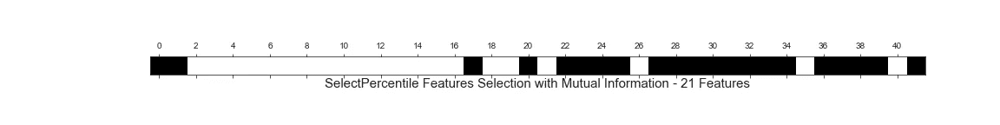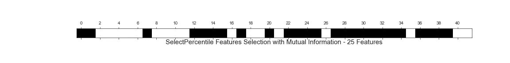

Fig.12 — SelectPercentile with Mutual Information, 21&25 Selected Features

## 3.2.2 特征选择:从模型中选择

SciKit-Learn 提供了一个非常方便的功能来根据模型进行特征选择。唯一的必要条件是用于选择特征的模型必须具有“feature_importances_”或“coef_”属性。用于选择特征的模型如下:

1.  随机森林分类器；
2.  树外分类器；
3.  LinearSVC 和
4.  后勤回归。

我将只展示用于第一个模型(RandomForest)的代码，因为它在其他模型上实现时经历了非常微小的变化。所有的结果都将存储在熊猫的数据框架中:

1.  从模型中选择:**随机森林分类器**

SciKit-Learn 对象 SelectFromModel 将根据*随机森林分类器*的‘feature _ importances _’属性自动选择前 n 个特征。

下表显示了用作测试器的三个 ML 模型(LogisticRegression、KNN 和 LinearSVC)的结果。在顶行(42)中，是使用所有特征的模型的结果，而其他行表示用特征子集获得的分数，如左列中报告的数字所定义的。

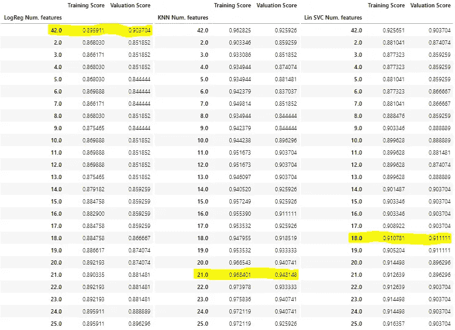

Tab.4 — Score on Training and Valuation Set with a different number of features using ‘SelectFromModel’ Method relying on a RandomForestClassifier.

然后，代码会存储为每个模型提供最佳性能的特性数量，以便以后进行比较。通过选择从 2 到 25 的特征子集，依靠随机森林分类器，与具有所有特征的模型相比，LogisticRegression 模型从未提高其在估价集上的性能。取而代之的是，对于 LinearSVC 模型，当选择 18 个特征时，从 0.904 提高到 0.91，特别是对于 KNN 模型，当使用 21 个特征时，从 0.926 提高到 0.948。

下图显示了所选的 18 和 21 个特征子集。请参考表 1，将编号与功能名称联系起来。

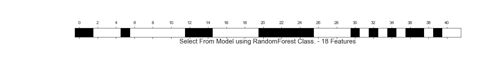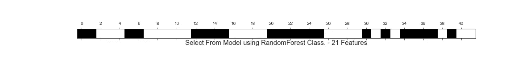

Fig.3 — Select From Model with RandomForestClassifier, 18&21 Selected Features

2.从模型中选择:**提取树分类器**

其他三个模型所遵循的过程与应用于具有 RandomForest 分类器的 SelectionFromModel 的过程相同。应用的第二个 ML 模型是*树提取分类器*。分析数据的程序再现了上一段中提到的步骤。迭代不同数量的要素子集后，结果汇总在一个表中:

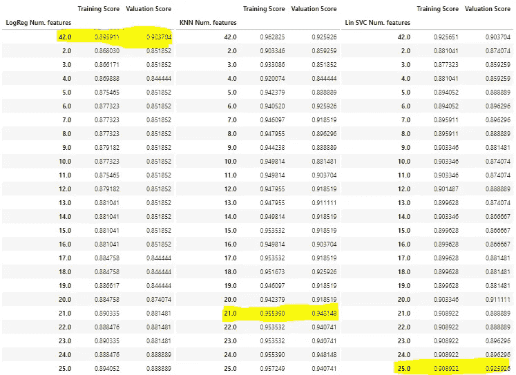

Tab.5 — Score on Training and Valuation Set with a different number of features using ‘SelectFromModel’ Method relying on an ExtraTreesClassifier.

然后，为每个模型提供最佳性能的特征的数量被存储在结果数据框中。通过选择从 2 到 25 的特征子集，依靠树外分类器，与具有所有特征的模型相比，LogisticRegression 模型再次没有提高其在评估集上的性能。取而代之的是，对于 LinearSVC 模型，当选择 25 个特征时，从 0.904 提高到 0.926，特别是对于 KNN 模型，当使用 21 个特征时，从 0.926 提高到 0.948。

下图显示了所选的 21 和 25 个特征子集。参考表 1，将编号与特性名称联系起来。

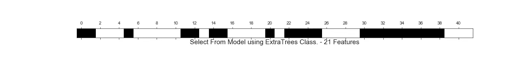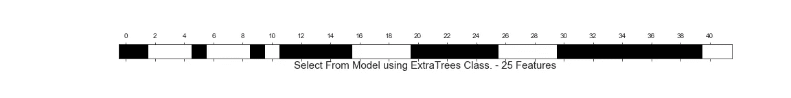

Fig.3 — Select From Model with ExtraTree-Classifier, 21&25 Selected Features

3.型号选择: **LinearSVC**

应用的第三个 ML 模型是*线性支持向量*分类器。分析数据的程序再现了前面段落中提到的步骤。迭代不同数量的要素子集后，结果汇总在一个表中:

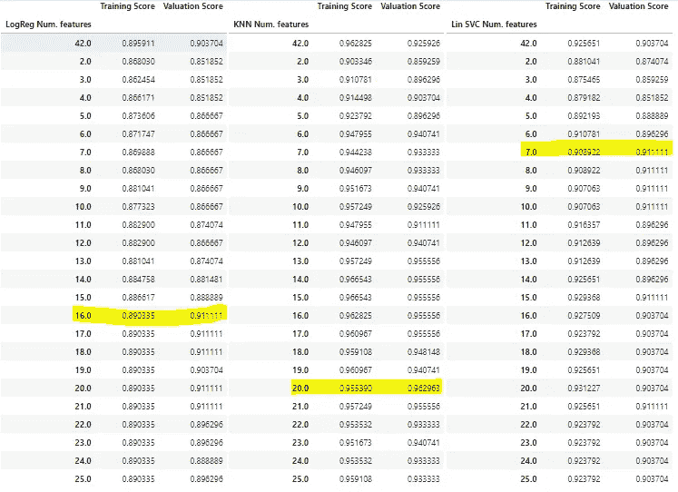

Tab.6 — Score on Training and Valuation Set with a different number of features using ‘SelectFromModel’ Method relying on a LinearSVC.

为每个模型提供最佳性能的特征数量存储在结果数据框中。通过选择依赖于线性 SVC 的特征子集，当在 16 个特征的子集上训练时，LogisticRegression 模型显示出边际改善，在验证集上为 0.91 对 0.904。在 KNN 模型中出现了显著的改进，当选择 20 个特征时，从 0.926 提高到 0.963，而 LinearSVC 模型设法将性能从使用 7 个特征时的 0.904 略微提高到 0.911。

下图显示了所选的 7、16 和 20 个特征子集。请参考表 1，将编号与功能名称联系起来。

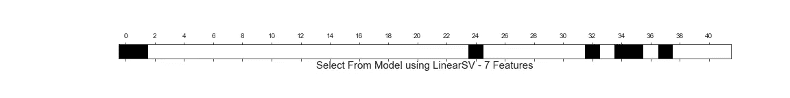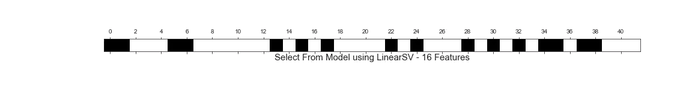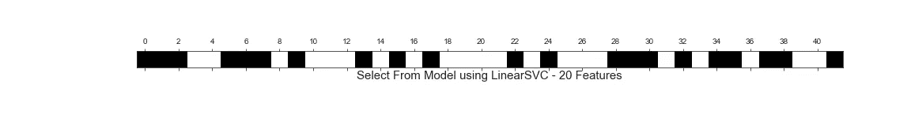

Fig.4 — Select From Model with LinearSVC, 19&20 Selected Features

4.从模型中选择:**逻辑回归**

最后一个接受功能选择测试的模型是*后勤返回*。当使用“l2”惩罚时，模型的正则化强度参数被设置为 1。从分析中收集的结果总结在常用表中:

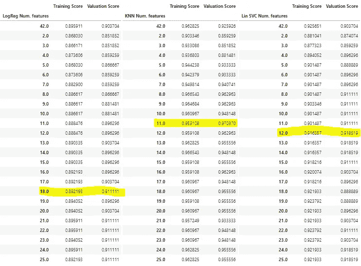

Tab.6 — Score on Training and Valuation Set with a different number of features using ‘SelectFromModel’ Method relying on a LogisticRegression.

然后，为每个模型提供最佳性能的特征的数量存储在结果的数据框中。这里的结果似乎很有趣。与具有 42 个特征的基线分数相比，所有三个模型的性能都有所提高。验证集上的逻辑回归得分从 0.904 上升到 0.911，KNN 得分从 0.923 上升到 0.97，线性回归系数从 0.904 上升到 0.92。但是，比分数本身更重要的是，这些结果是使用非常有限的特征获得的:18 个用于逻辑回归，11 个用于 KNN，12 个用于线性 SVC。与最初的 42 个特性相比，模型复杂度降低了 76%,与最初的 210 个相比，降低了 95%。

下图显示了所选的 11、12 和 18 个特征子集。请参考表 1，将编号与功能名称联系起来。

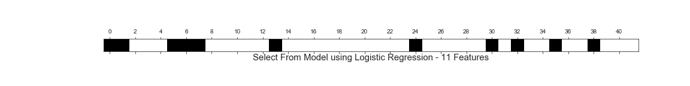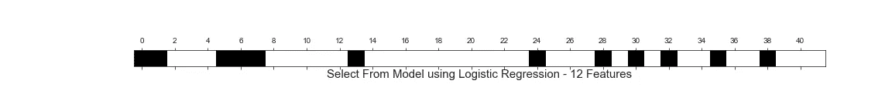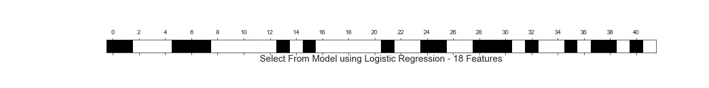

Fig.5 — Select From Model with Logistic Regression, 11, 20&18 Selected Features

5.从模型中选择:**结论**

下表总结了本分析中使用的四个“选择模型”中的每一个所获得的最佳分数。他们报告表格的行，而列代表三个测试模型。总的来说,**逻辑回归被证明是最好的特征‘挑选者’**。它设法提高了所有模型的验证分数，在 Log Reg 和 KNN 这两个模型中达到了最高分，而在 LinearSVC 上是第二名，但它通过仅使用 12 个特征而不是 25 个 ExtraTrees 分类器来达到这一结果。

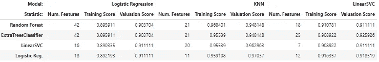

Tab.7 — Select From Model Results

## 3.2.3 特征选择:递归特征消除

特征选择的第三种方法是递归特征消除或 RFE。同样，SciKit-Learn 提供了一个非常方便的函数来执行它。根据 SciKit-Learn 教程在线描述，"*给定一个为特征分配权重的外部估计器…，递归特征消除(RFE)的目标是通过递归考虑越来越小的特征集来选择特征。首先，在初始特征集合上训练估计器，并且通过“* ***coef_*** *”属性或者通过“****feature _ importances _”****属性来获得每个特征的重要性。然后，从当前特征集中删除最不重要的特征。该过程在修剪后的集合上递归重复，直到最终达到要选择的特征的期望数量*(参见[链接](https://scikit-learn.org/stable/modules/generated/sklearn.feature_selection.RFE.html))。用于选择特征的模型如下:

1.  随机森林分类器；
2.  LinearSVC 和
3.  后勤回归。

用于实现 RFE 的代码与“从模型中选择”过程中使用的代码非常相似，因此我在此不再赘述。但是，它可以在我的 Github 存储库中找到。

1.  RFE: **随机森林分类器**

在 RFE 测试的第一个'*外部估计器'*是一个**随机森林**分类器。分析的一般框架没有改变，该程序通过选择 2 到 25 个特征来测试所获得的结果。结果以通常的方式报告:

Tab.7 — Score on Training and Valuation Set with a different number of features using ‘RFE’ Method relying on a RandomForest Classifier.

随机森林的结果也不是特别令人兴奋。当使用 13 个特征的子集时，没有一个变量的子集能够提高逻辑回归分类器模型的性能，而 LinearSVC 能够匹配“所有特征结果”。当处理 23 个特征时，只有 KNN 模型在验证集中看到了一些改进。然而，这种方法最大的缺点是训练它需要时间。总的来说，完成分析大约需要 10 分钟，而所有的研究都需要 30 秒，最多 1 分钟。

下图显示了所选的 13 和 23 个特征子集。请参考表 1，将编号与功能名称联系起来。

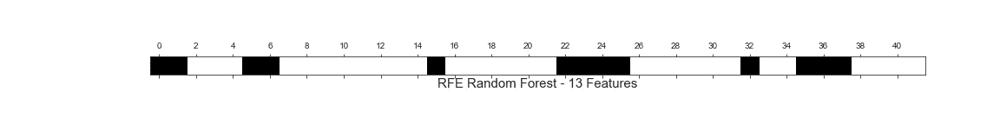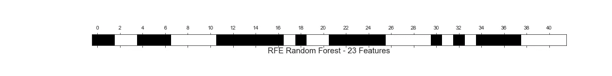

Fig.6 — RFE with Random Forest, 13&23 Selected Features

2.RFE: **线性 SVC**

使用 RFE 程序选择特征的第二个测试模型是 *LinearSVC* 。模型正则化惩罚类型和强度参数是“l2”和 1。下表报告了所取得的成果:

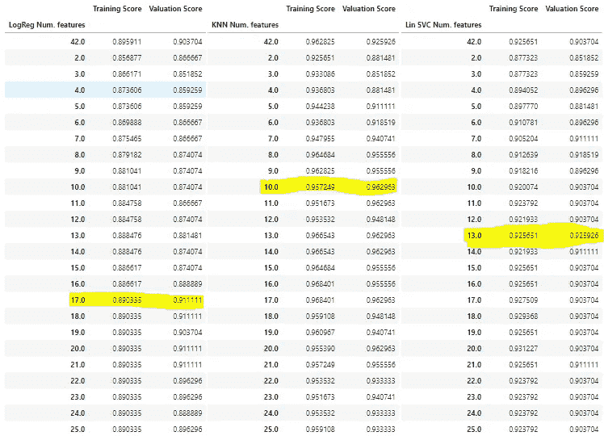

Tab.8 — Score on Training and Valuation Set with a different number of features using ‘RFE’ Method relying on a LinearSV-Classifier.

当 LinearSVC 模型递归地选择特性时，这三个测试模型似乎提高了它们的性能。LogisticRegression、LinearSVC 和 KNN 分别以 17、13 和 10 个特征在验证集上达到最高分。另一个积极的方面是，完成分析所用的时间回到了传统的范围(大约 2 秒):这表明当我使用随机森林分类器时观察到的更长的计算时间是由于模型本身，而不是 RFE 过程。

下图显示了所选的 10、13 和 17 个特征子集。请参考表 1，将编号与功能名称联系起来。

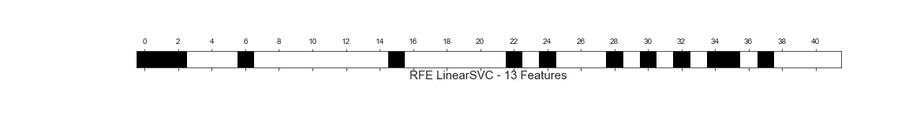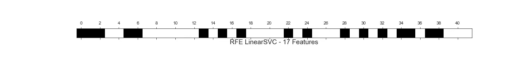

Fig.7 — RFE with LinearSVC, 10, 13 and 17 Selected Features

3.RFE: **后勤回归**

第三个也是最后一个接受 RFE 程序测试的模型是*后勤返回*。模型正则化惩罚类型和强度参数(C)分别设置在‘L2’和 1 上。下表报告了所取得的成果:

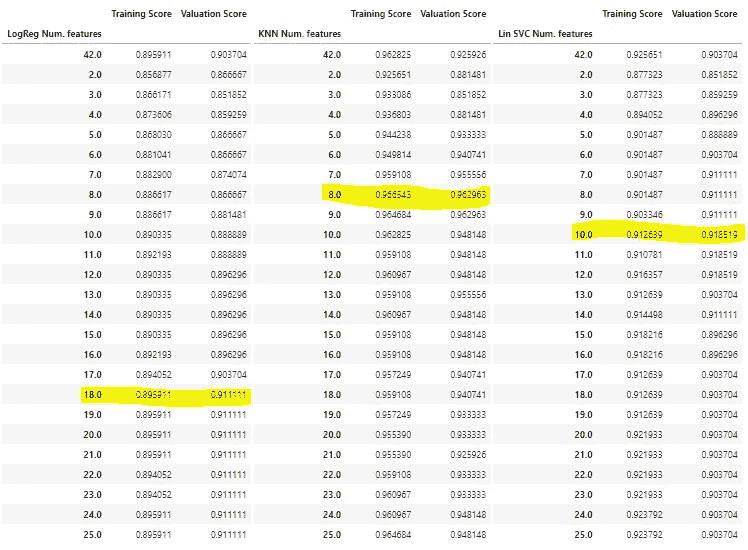

Tab.9 — Score on Training and Valuation Set with a different number of features using ‘RFE’ Method relying on a LogisticRegression-Classifier.

结果与使用 LinearSVC 模型获得的结果非常相似。当使用逻辑回归模型递归选择特性时，这三个测试模型似乎提高了它们的性能。三个测试模型 LogisticRegression、LinearSVC 和 KNN 分别以 18、8 和 10 个特征在验证集上达到最高分。同样，训练时间在可接受的范围内，少于 4 秒。

下图显示了所选的 8、10 和 18 个特征子集。请参考表 1，将编号与功能名称联系起来。

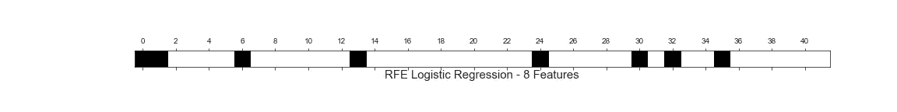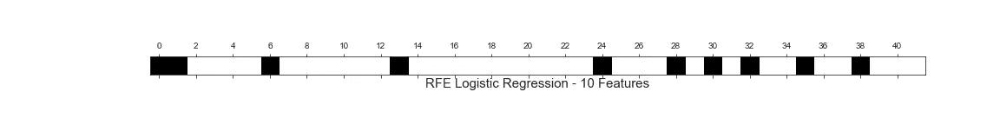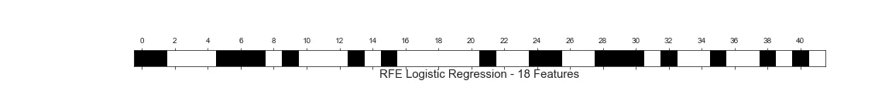

Fig.8 — RFE with LogisticRegression, 8, 10 and 18 Selected Features

5.RFE: **结论**

下表总结了本次分析中使用的三种“选择模型”中的每一种所获得的最佳得分。它们在表格的行中报告，而列代表三个测试模型。总的来说, **LogisticRegression 和 LinearSVC 提供了非常相似的结果。虽然 LinearSVC 在验证集的平均分数方面取得了微小的优势，但与 LogisticRegression 相比，它平均使用了更多的特征。**在开始讨论哪个模型是最佳模型之前，值得注意的是，RFE 的表现大体上符合“从模型中选择”的方法。然而， **SelectFromModel 有一个很大的优势:它更快，比 RFE 快得多。**使用 RFE 实现 LogisticRegression 和 LinearSVC 分别需要 0.06 分钟和 0.08 分钟，而使用 LogisticRegression 完成“SelectFromModel”分析需要 0.02 分钟，速度提高了 3 到 4 倍。出于这些考虑，我决定不使用 RFE 作为选择特性的工具。

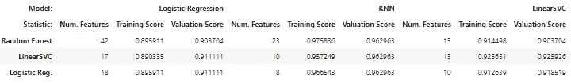

Tab.10 — RFE Results

# 3.3 特征提取

在特征选择中，通过选择信息量最大的变量子集来实现降维，而在特征提取中，我们从特征集中提取信息来构建一个新的更小的特征子空间。

在所有的特征提取技术中，在本段中我将测试以下模型:

*   主成分分析；
*   TruncatedSVD 和
*   因素分析。

我将不深究我将在本段中使用的工具的技术细节，因为这超出了本研究的范围。

## 3.3.1 主成分分析

主成分分析(PCA)是一个数学过程，它将一组(可能)相关的变量转换成一组(较小的)不相关的变量，称为主成分。通常，主成分分析受输入要素规模的影响。因为我在分析的最开始就对数据进行了缩放，所以这不再是一个问题。然而，数据缩放策略将在后面的特定章节中研究，为了本章的目的，我只考虑应用的最小最大缩放器。如前所述，我们将尝试使用三个测试模型来测量性能，从而将模型复杂性从 42 个特征减少到 2 到 25 个特征之间的子集。

表 11 总结了使用 PCA 方法的结果:

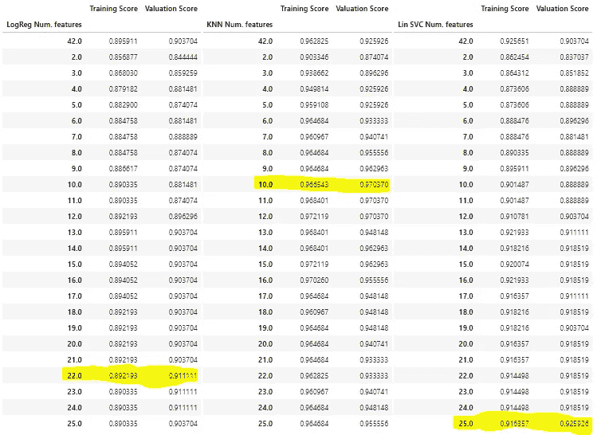

Tab.10 — Score on Training and Valuation Set with a different number of features using ‘PCA’.

所有三个测试者模型都使用 PCA 提取的一些特征来提高它们的分数。LogisticRegression、KNN 和 LinearSVC 的最佳特征数分别为 22、10 和 25，模型性能提高 0.8%至 4.5%。PCA 提取每个特征，以便尽可能多地解释数据集的方差。因此，第一个主成分占数据可变性的相对较高份额，每个后续成分尽可能多地占剩余可变性。因此，如果我决定使用前 N 个特征，就值得探究我解释了多少数据集差异。在下图中，我将分析扩展到了前 30 个特征。

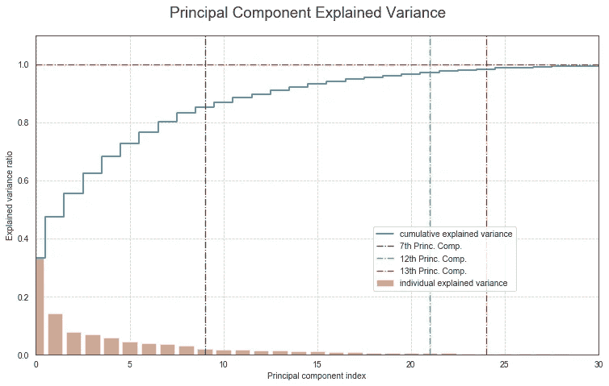

Fig.1 — PCA explained variance

前 10 个主成分可以解释大约 85%的整个数据集方差(不要被我提到 10 个特征时图中的垂直线设置为 9 的事实所迷惑:Python 的指数从 0 开始)。将主成分增加到 22 或 25 会将该值提高到 95%以上。

3.3.2。截断的 VD

提取待测特征的第二步是*截断奇异值分解*。所使用的程序与用于 PCA 的程序相同。下表显示了在三个测试模型中获得的分数:

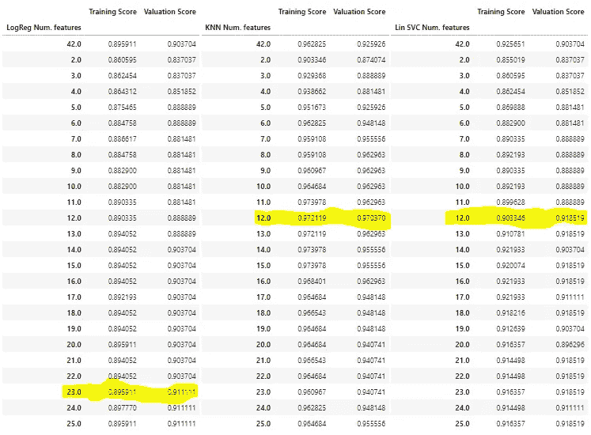

Tab.11 — Score on Training and Valuation Set with different number of features using ‘PCA’

总的来说，用截短的 VD 得到的结果与 PCA 得到的结果一致。同样，完成分析的时间也是一样的。PCA 似乎能够用更少的特征或更好的分数获得相同的结果。

**3.3.3 因子分析**

测试的最后一个特征提取过程是因子分析。结果报告在下表中:

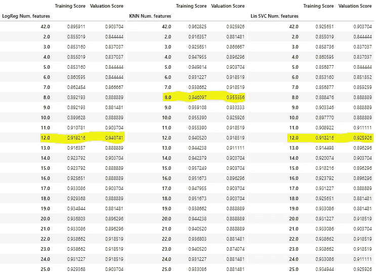

Tab.12 — Score on Training and Valuation Set with different number of features using ‘FA’

当 FA 提取的特征与逻辑回归和线性 SVC 模型一起使用时，FA 获得非常好的分数。当使用 FA 提取的特征训练时，KNN 模型也受益，但是程度较低。此外，这些改进仅使用了有限数量的功能:12 个用于逻辑回归和线性 SVC，8 个用于 KNN。

**3.3.5 特征提取:结论**

在下表中报告了由测试的每个特征提取过程提供的三个最佳性能:

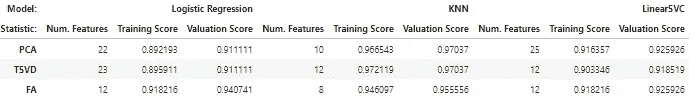

我在上面已经讨论过，PCA 似乎比 TruncatedSVD 略胜一筹。PCA 和 FA 之间的比较显示了并驾齐驱的情况。FA 提取的特征在用于训练逻辑回归并且具有少得多的特征时，在验证集上提供更好的分数。另一方面，KNN 分类器使用 PCA 提取的特征达到更好的结果。当使用 PCA 和 FA 特征时，LinearSVC 在验证集上达到相同的分数，即使后者需要一半数量的特征。然而，使我倾向于 PCA 的一个关键因素是实现两种分析所需的时间。FA 耗时 0.27 分钟，而 PCA 耗时 0.02 分钟，至少快了 13 倍。当我稍后在 GridsearchCV 中嵌套特征选择/提取时，选择 PCA 将节省我大量的时间。

# 3.5 结论

根据对上一段进行的分析和考虑，将降维的选择范围限制为两个似乎是合理的:

1.  **选择有物流退货的型号**；和
2.  **主成分分析**。

其他程序要么产生不太有希望的结果，要么如果结果是肯定的，从时间的角度来看效率较低。就选择/提取的特征数量而言，我将考虑 9 到 20 之间的范围。

*感谢阅读！*

— — — — — — — — — — — —

[第一章:引言](https://medium.com/@fabrbasso/forecasting-a-recession-the-usa-d6306adc9540)

[第二章:数据集、特征工程和解释性数据分析](https://medium.com/@fabrbasso/forecasting-a-recession-in-the-usa-82988caa556e)