# 预测美国的经济衰退

> 原文：<https://medium.datadriveninvestor.com/forecasting-a-recession-in-the-usa-82988caa556e?source=collection_archive---------0----------------------->

# 第二章—数据集、特征工程和解释性数据分析(EDA)

## 故事到此为止

在这项研究的第一部分，我分析了为什么衰退是重要的，以及它们如何影响股票市场的回报(S&P500)。然后简要分析了投资组合收益如何受益于正确预测衰退的能力。这强调了拥有能够实现这一目标的机器学习工具的优势。

## 索引:

2.1 数据集；
2.2 特色工程；
2.3 探索性数据分析；
2.4 结论。

# 2.1 数据集

在前一章，我强调了拥有能够预测经济衰退的机器学习(ML)工具的财务优势。但是在我可以开始训练任何 ML 算法之前，有相当多的步骤和初步工作要实现。任何 ML 开发的第一个基本阶段总是相同的: ***探索数据*** 。

在向前移动之前，数据被分成两组:

1.  目标变量；和
2.  解释性特征。

*1。目标变量*

目标时间序列(Target)是一个虚拟变量，代表扩张期和衰退期。值 1 表示衰退期，值 0 表示扩张期。这一时间序列每月一次，由国家经济研究局(NBER)制作。可以通过[链接](https://fred.stlouisfed.org/series/USREC)从美联储经济数据库(FRED II)下载。当我写这篇文章时，时间序列从 1854 年 12 月到 2019 年 7 月，是美联储数据库中最长的序列之一(图 1)。

Fig.1: US Recessions: blue bars highlight contraction months

然而，在分析中，出于两个考虑，我将只考虑二战结束后到今天这段时间:

*   衰退的频率和持续时间似乎在这段时间里发生了变化；和
*   在过去，几乎不可能找到迄今为止的解释变量。

*2。解释性特征*

解释变量的核心数据集由 10 个时间序列组成。在这里，我将提供一个非常简短的描述，并尽可能提供下载它们的链接。

1.  **CPI 指数**:是美国所有城市消费者，所有项目的消费价格指数。可以从[这里](https://fred.stlouisfed.org/series/CPIAUCNS)下载；
2.  **实际股息**:这些是 SP500 支付的实际股息，由 Robert Shiller 重新计算，可在本[网站](http://www.econ.yale.edu/~shiller/data.htm)上获得；
3.  **实际收益**:这些是由 Robert Shiller 重新计算的 SP500 成员公司实现的实际收益，可在本[网站](http://www.econ.yale.edu/~shiller/data.htm)上获得；
4.  **10 年期利率**:10 年期国债恒定到期利率，从 [FRED](https://fred.stlouisfed.org/series/GS10) 经济数据库中检索；
5.  **3 个月期国库券利率**:这是二级市场上定价的 3 个月期国库券，从 [FRED](https://fred.stlouisfed.org/series/TB3MS) 经济数据库中检索；
6.  **产能利用率，制造业**:美国制造业产能利用率，从 [FRED](https://fred.stlouisfed.org/series/CUMFNS) 经济数据库中检索；
7.  **工业生产**:工业生产指数(INDPRO)是一个经济指标，用于衡量美国制造业、采矿业、电力和天然气公用事业的所有设施的实际产出，从 [FRED](https://fred.stlouisfed.org/series/INDPRO) 经济数据库中检索；
8.  **个人储蓄占可支配收入的百分比**:美国个人储蓄率相关数据从该数据提供商下载:[链接](https://www.capitaliq.com/CIQDotNet/my/dashboard.aspx)(需要会员资格)；
9.  失业率:失业率代表失业人数占劳动力的百分比，来自弗雷德经济数据库；
10.  **ISM PMI 制造业**:这是供应管理协会(ISM)制造业采购经理人指数(PMI)。可通过此[链接](https://www.capitaliq.com/CIQDotNet/my/dashboard.aspx)(需要会员资格)或所有主要数据提供商(彭博、路透社、Capitaliq 等)获得。

所有数据都存储在我的 GITHUB 存储库中的一个 CSV 文件中。现在是时候开始探索数据，并动手做一些编码了。

*   导入所需的库:
*   现在，包含数据集的 CVS 被导入到熊猫的数据帧中:

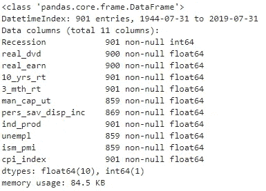

Fig.1 — Data info

从对数据的第一次探索中，可以注意到它们的范围从 1944 年 7 月到 2019 年 7 月，包括结束，涵盖了 75 年或 901 个月。目标变量(衰退)是一个 0–1 虚拟变量，其格式为覆盖整个周期的整数。解释性特征(从现在开始称为“特征”)都是浮动变量，因此不需要转换。其中一些涵盖了整个样本:10 年期利率(10_yrs_rt)、3 个月期票据利率(3_mth_rt)、CPI 指数(cpi_index)和工业生产(ind_prod)。其他特征涵盖了整个时期，但仍然缺少 7 月份的最后读数(SP500 实际股息-real_dvd-和收益-real_earn)，而其他特征缺少样本开始时的一些观察(失业-失业；ISM-PMI -ism_pmi，产能利用率-man_cap_ut，个人储蓄-pers_sav_disp_inc)。这些细节来自对数据集头部和尾部的探索:

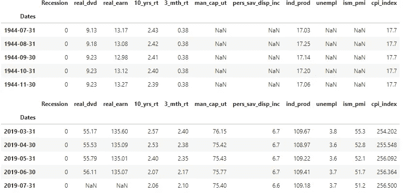

Tab.1 — Head and tail of the dataset.

数据集最开始的缺失值将迫使分析样本缩小，而对于 7 月份的读数，我们可以继续 6 月份的读数，只要该数据没有被打印出来。经过这些转换后，数据集中的时间序列具有以下特征:

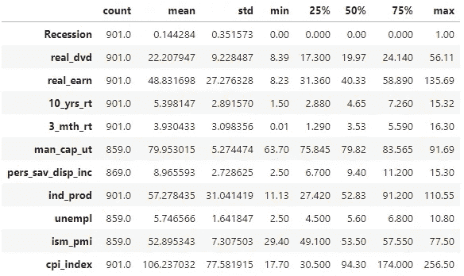

Tab.2 — Dataset Statistics

我从数据集中分离出目标变量(target)，即衰退时间序列，而该序列的其余部分将构成解释变量:

目标的一个重要特点就是不平衡。繁荣期的数量超过衰退期的数量，比例为 6:1(见图 2)。在构建和评估我们的 ML 模型时，这是一个需要解决和考虑的问题。

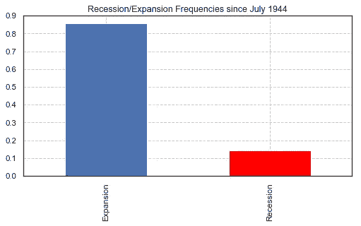

Fig.2 — Unbalanced Dataset: Expansions Periods Outnumber Recessions

# 2.2 特征工程

## 2.2.1 改造原有功能:

既然上传了原始数据，就必须对时间序列进行转换和处理，以获得关于目标的信息特征，并在 ML 算法中使用。

一些特征是水平的，但我更感兴趣的是它们在走向衰退时表现出的势头。因此，如下文所述，以下特征被转换:

*   **real_dvd** : 6 个月和 3 个月%变化；
*   **real_earn** : 6 个月和 3 个月%变化；
*   **ind_prod** : 6 个月和 3 个月%变化；
*   **man_cap_ut** : 6 个月和 3 个月数值变化；
*   **pers_sav_disp_inc** : : 6 个月和 3 个月的数值变化；
*   **unempl** : 6 个月和 3 个月数值变化；和
*   **cpi_index** : 12 个月百分比变化。

然后，一旦发生转换，原始变量将从数据库中删除，因为它们不是不稳定的，就是因为该级别中的序列本身很少或没有经济意义。特征 **ism pmi** 也使用 6 个月和 3 个月的值变化进行转换，与上述特征相反，我也保持时间序列水平，因为它传递经济信息:当其值超过 50 时，它表明经济扩张，而低于 50 则表明经济收缩。

*   **ism_pmi** :随 6 个月和 3 个月绝对变化的水平。

至于与长期和短期美国政府债券收益率相关的变量，我将收益率曲线的斜率计算为 10 年期美国国债和 3 个月期美国票据收益率的差异。然后，新变量被存储为**斜率**，并与 6 个月和 3 个月的变化一起被视为水平。

*   **斜率** : 10 年期国债— 3 个月票据利息。利率水平，3 个月和 6 个月变化。

最终，新特征“ **real_rate** ”被创建为 3 个月美国票据利率和 12 个月通货膨胀率之间的差。再次，该功能将被认为是在水平和在其 6 个月和 3 个月的变化。

*   **实际利率** : 3 个月国债利息。利率——12 个月的通货膨胀率，3 个月和 6 个月的变化。

为了执行以上列举的变换，我将原始数据框“特征”拆分，将经历相同变换或参与创建特定特征(如“坡度”)的变量组合在一起。一旦所有的操作结束，新的特征被合并在一起。新的数据帧被命名为:**特征 _1** 。

*   斜率和实际速率相关特征:
*   经历了 3 个月和 6 个月%变化的特性，原始变量随后被删除:
*   特征(pers_sav_disp_inc，unempl，cpi_index 和 ism_pmi)要在 3 个月和 6 个月内转换值变化并计算这些值，原始变量被删除。仅保留 ism_pmi:
*   现在，三个数据帧合并在一起:

Out.2

在这个阶段，我们正在处理 21 个特性。我们快速浏览特性“使用熊猫的数据帧”“描述()”属性:

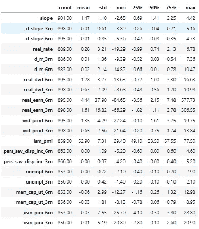

Tab.3 — Features general statistics.

从对数据的快速检查中，看起来 6 个月和 3 个月的实际收益变化在其最小值和最大值中表现出一些极值。我试图用图形来探究这些特征，以找出原因:

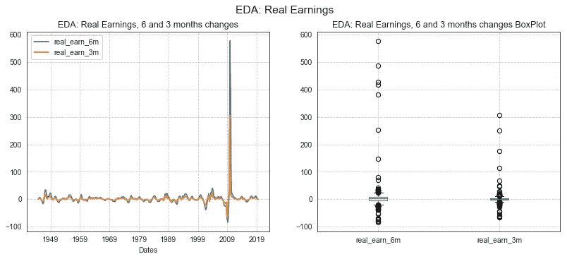

Fig.3 — Exploratory Analysis on Real Earnings 6 and 3 months changes

正如预期的那样，与收入相关的两个特征似乎显示出一些极值(例如在***“real earn 6m”***)和大量的异常值。事实证明，这些值与 GFC 有关。这些数字是真实的，不是由于一些“阅读错误”，而是由 2008 年危机的极端严重性造成的。

在继续之前，看一下我正在使用的其他数据的大小可能是有用的。这是通过绘制特征的箱线图来实现的。为了清楚起见，数据集被分成两批，每批 10 个和 9 个特征。与实际收益相关的变量被忽略了，因为我们已经研究过了。

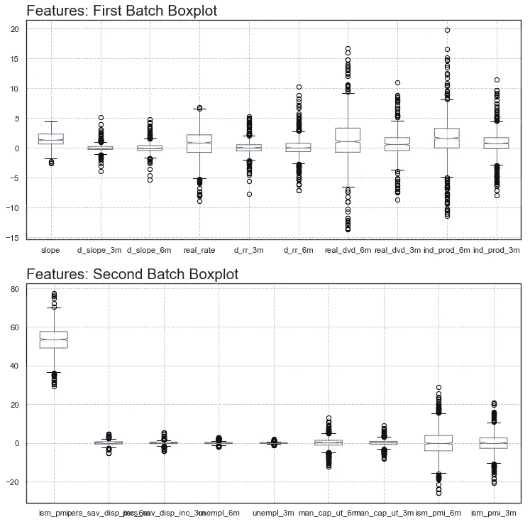

Fig. 4 — EDA: Features Boxplots

根据上面的图表，数据的一个特殊特征是在所有时间序列中广泛存在异常值。就规模而言，唯一表现出显著差异的特征是 ISM-PMI，徘徊在 53 左右，如表 3 所示。

# 特征的滞后

我将使用创建的特征集进行分析。然而，由于目标是至少提前三个月预测衰退事件，我将考虑滞后 3 到 12 个月的变量。数据框架指数将在未来延长 12 个月，以适应特征的滞后值。总的来说，由于我们有 21 个原始要素，这意味着要处理 210 个要素的数据集。为了执行上述转换，使用了下面两段代码。产生的数据帧被命名为**“特征 _2”。**

# 2.3 探索性数据分析(EDA):

要素数据集已创建！总的来说，我从最初的 10 个特征中生成了 210 个特征。现在，作为第一步，我将数据集分为训练集和测试集。EDA 将只考虑前者，以便不允许后者影响特征选择过程。

## 训练和测试数据集

从现在开始，数据将在训练数据集和测试数据集之间拆分。一旦移除“nan ”,作为实施变换的结果，数据集的范围从 1948 年到 2019 年。我留出 20%的数据集作为测试数据。这意味着原始的 71 年(841 个月)中有大约 14 年(168 个月)的数据。

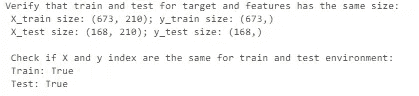

Out.3

最后一行检查目标和特征之间的训练和测试数据集的索引是否相同。

**注:从现在开始只使用训练数据**
数据泄露是一个持续存在的问题，可能会影响 ML。在阅读 Andreas C. Müller & Sarah Guido 的优秀著作*Python 机器学习简介*时，我获得了一些关于从训练中向测试数据集泄露信息是多么容易的精辟见解。有时这可能是数据转换或预处理的意外结果。在此基础上，从现在开始，我们将只使用训练数据集。仅出于评估目的，将在最后重新引入测试数据集。为了避免混淆，在数据集的任何进一步分割中，用于控制模型的泛化属性的数据集将被命名为“验证”。从时间的角度来看，我要回到 2005 年 7 月，我们的信息集到此结束！

为了实现 EDA，我创建了一个特定的数据帧，“ *eda_feat* ”。这样，如果我需要测试任何转换，原始数据将不会受到影响:

# 2.3 EDA —探索性数据分析

# 2.3.1 EDA:时间序列箱线图分析

作为 EDA 的第一步，我比较了我们生成的所有特征的箱线图。根据生成箱线图的原始要素，生成的箱线图按 21 个桶中的 10 个进行分组。对于每个特征，绘制了两个箱线图:在商业周期扩张阶段记录的观察值用蓝色**绘制，而在收缩阶段记录的观察值用红色**绘制。****

我们可以从初步分析中获得的第一个重要信息是，一个特征在商业周期的两个阶段之间是否表现出显著不同的统计特征。

为了不在本文中过多地使用图表，我选择了那些看起来更有希望的图表:

1.  坡度；
2.  三个月内的失业变化；
3.  ISM-PMI 级别

**斜率**:当考虑 8 个月以上至 12 个月的滞后时，斜率变量似乎显示出明显的分布。在衰退前的 8 至 12 个月期间，收益率曲线明显更加平坦(图 5)；

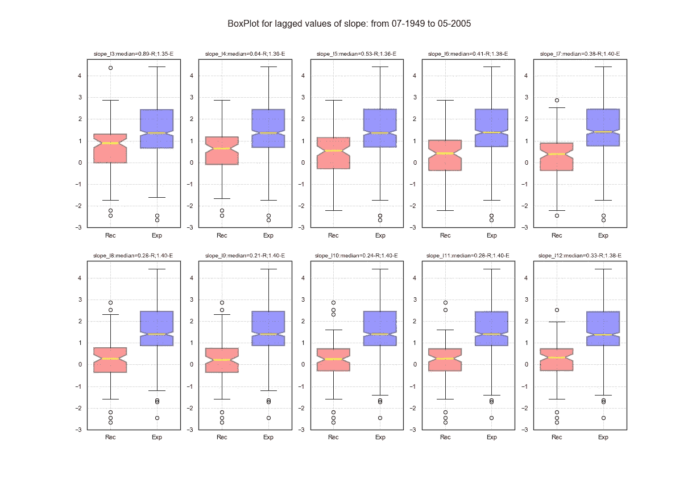

Fig.5 — EDA: Slope Lags Box-plots split between recessions and expansions

**三个月内的失业变化**:在衰退前的 3 到 4 个月内，失业呈现出明显的上升趋势，与繁荣时期不一致(图 6)；

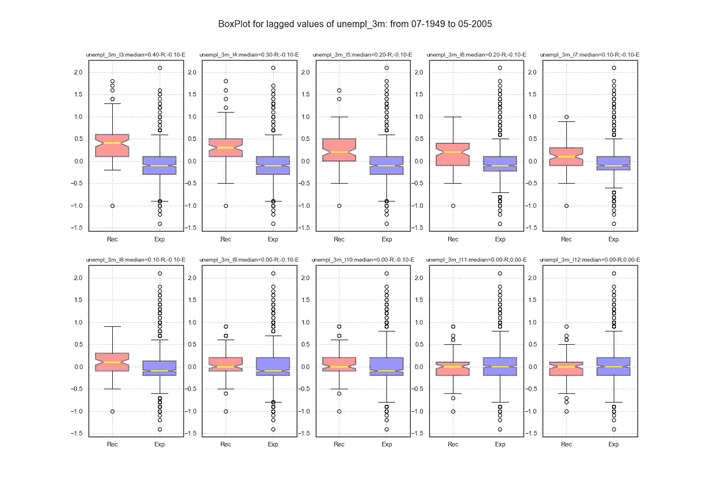

Fig.6 — EDA: Unemployment 3 Months Change Lags Box-plots split between recessions and expansions

**ISM-PMI 的水平**:ISM 指数的分布似乎与衰退前 3 至 4 个月的繁荣年份中观察到的分布明显不同(图 7)。

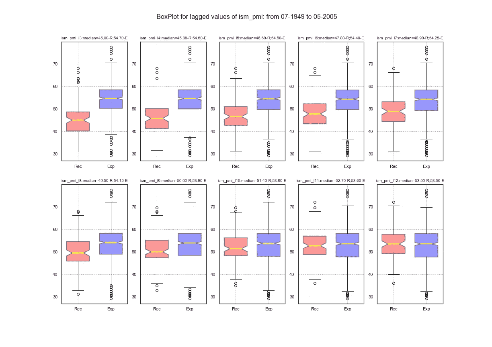

Fig.7 — EDA: ISM-PMI Lags Box-plots split between recessions and expansions

# EDA:相关性

由于我们处理的是一组等于 210 的时间序列，所以绘制整个 210x210 矩阵没有任何帮助。因此，我把分析的重点放在每个特征与目标之间的相关性上。首先，我根据变量对滞后特征进行分组(例如“斜率”或“ism_pmi”中的所有滞后变量)，然后计算与目标变量的相关性，最后从相关性最高的特征到相关性最低的特征对每组变量进行排序。

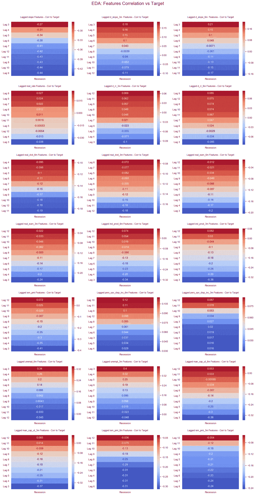

Fig.8 Features Correlation vs Target Grouped over different Lags

相关性分析证实了我们从箱线图分析中注意到的情况。一些变量，如滞后大于 8 的斜率和滞后小于 5 的 ISM、产能利用率和工业生产，在绝对值方面具有最高的相关性得分。总体而言，所考虑的特征没有一个具有非常高的相关性，但是，两个或更多变量之间的某种组合或相互作用可能有助于对衰退进行分类和预测。我将通过检查这些特性的分布直方图来进一步探究这一点:

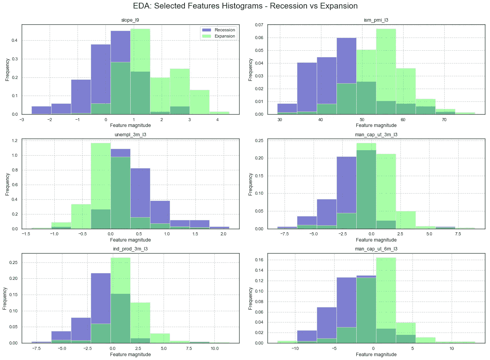

Fig.9 — Features Histograms, Observations divided according to their occurrence during Expansion or Recession Periods.

虽然与衰退相关的读数和与扩张年份相关的读数对于所选的大多数特征似乎有不同的分布，但它们都没有提供前者与后者的明确分类。事实上，对于大多数变量来说，在衰退和扩张期间，它们的分布有大量重叠的观察结果。

# EDA:成对图

然而，正如前面提到的，变量之间的交互对实现分类目标有很大的帮助。为了以非常简单的方式探索这种可能性，我考虑了之前入围的 6 个特征之间的配对图。在下面的图表矩阵中，主对角线外的每个图表代表两两选取的所选特征之间的散点图。与衰退相关的观察值用红色标出，而与扩张期相关的观察值用蓝色标出。这种表述多少有些令人欣慰:与衰退相关的观测和与扩张相关的观测的空间位置似乎被很好地分开和定义了。这对未来的分析是一个好兆头，因为识别这些区域的能力完全在机器学习算法的能力范围之内。

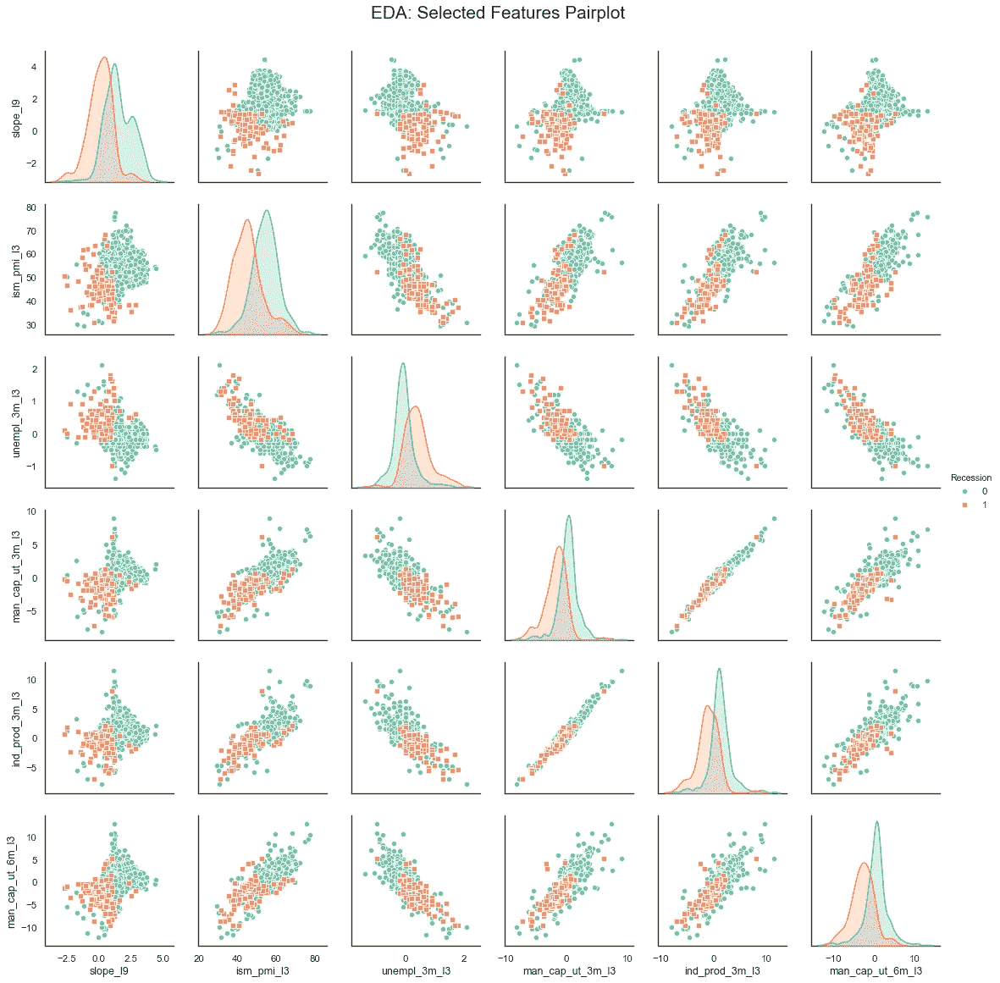

Fig.10 — Selected Features Pair-plots.

# 2.4 结论

数据清理和特征工程是允许 ML 模型表达其全部潜力的必要步骤。上传的数据已经很干净了，只需要对数据时间索引做一些小的修改。关于特性工程，我从最初的 10 个特性开始，经过一系列的转换，我最终得到了 210 个特性。探索性数据分析旨在获得解释目标变量的数据能力的第一个标准，以及在这些特征中哪个看起来比其他的更重要。总的来说，如果一个特定的时期属于衰退或扩张，为分析选择的特征似乎有一个不错的分类能力。当考虑到它们之间的特征相互作用时，它们的能力似乎增强了。在 EDA 过程中，我只分析了 6 个特征的相互作用，结果对未来的分析是个好兆头。然而，我们的训练数据库是由 673 次观察的 210 个特征组成的。使用所有特征得到的模型会过于复杂，特别是在数据集的大小方面。这就带来了研究的下一步:**特征选择**。

本章使用的代码可以在我的 Github 资源库中找到([这里](https://github.com/fabriziobasso/Forecasting_recession_in_US_chapterII/blob/master/Dataset%2C%20Feature%20Engeneering%20and%20Explanatory%20Data%20Analysis.ipynb))。