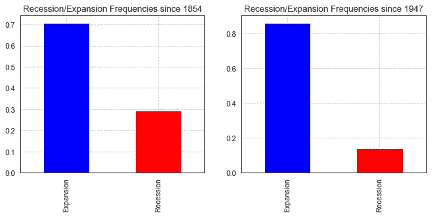
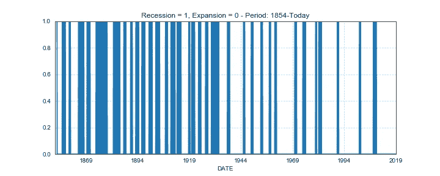
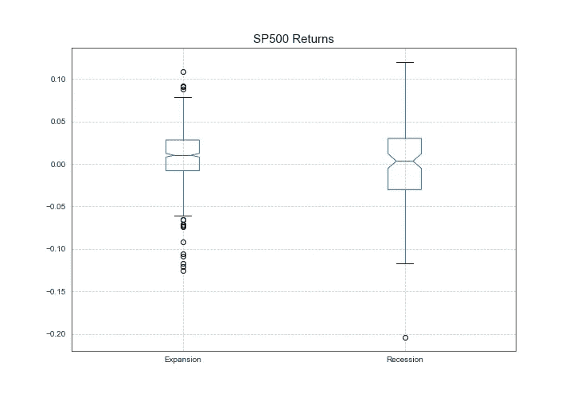
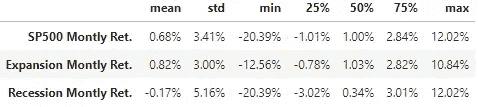
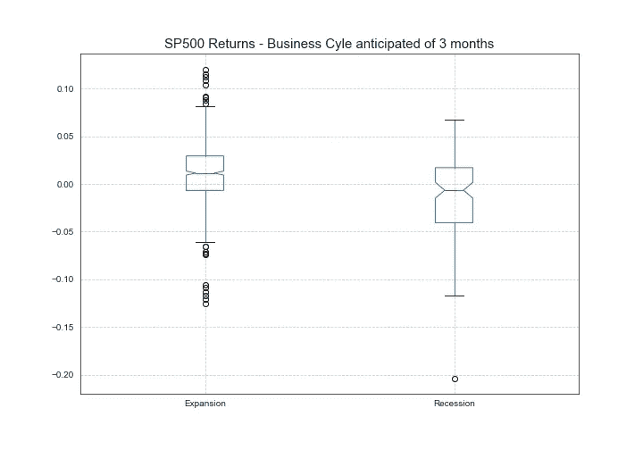
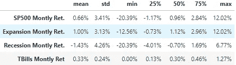
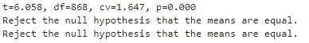
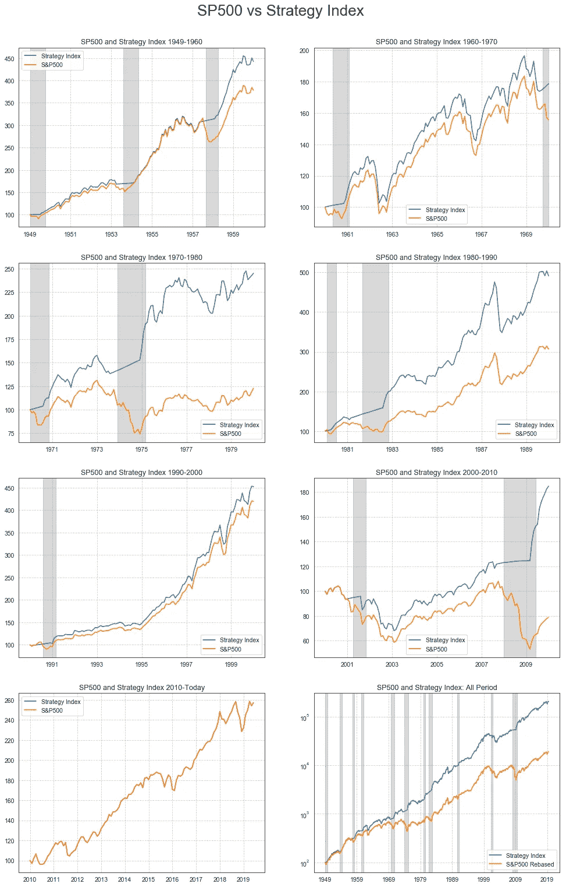
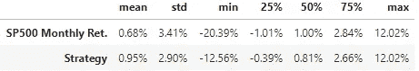
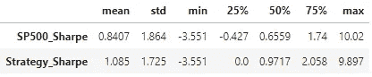

# 预测美国的衰退——我

> 原文：<https://medium.datadriveninvestor.com/forecasting-a-recession-the-usa-d6306adc9540?source=collection_archive---------4----------------------->

# 第一章——导言

这一系列文章的目的是探讨提前三个月预测美国经济衰退的可能性。衰退对经济活动的许多方面都有深刻的影响，但我将把注意力集中在一个简单的资产配置问题上。按照大片的最佳传统，我决定将这项研究分成 10 个不同的章节，包括你正在阅读的这一章(是的，10 章！我要和星球大战比赛！)

在这第一步中，我将对我要应对的挑战做一个非常高层次的介绍，我将探讨以下主题，分为 5 个段落:

# 索引:

1.1 预测衰退:重要吗？；要是我知道就好了……
1.3 目标；
1.4 研究概述；
1.5 技术说明。

# 1.1 预测衰退:重要吗？

在经济学中，衰退是一种妖魔。它们让经济学家夜不能寐，政府害怕它们，而央行行长们想尽一切办法阻止它们。然而，衰退是不可避免的灾祸。它们在一个社会的经济生活中发挥着举足轻重的作用，因为它们为繁荣时期积累的所有失衡带来了健康和必要的清理。

然而，经济低迷是痛苦的。它们会导致许多令人不快的后果:失业、收入停滞或下降、企业危机，如果事态发展非常糟糕，还会引发社会动荡。

但这里有一些好消息:商业衰退没有繁荣时期频繁(图 1 和图 2 ),至少在美国的经验中，它们从未抵消在之前扩张阶段取得的所有改善。如果我考虑到，与整个样本相比，自 1947 年以来，衰退的频率减少了一半以上，那么情况就更加明朗了。

Fig. 1: Recession Frequencies — All Sample and from 1947 on.

在过去的 60 年里，衰退时期占了所有观测值的 14%,与整个数据集的 29%相比，这是一个巨大的进步。

Fig. 2: Vertical Blue Bars identify Recession Years.

作为复杂的经济时钟中的重要一环，*金融市场*及其定价的资产类别深受商业周期的影响。利率、收入、收益、投资者风险厌恶、信用风险和许多其他特征都与宏观经济背景密切相关，反映了商业周期的起伏。资产表现受到经济周期的影响，经济衰退不会让任何人幸免。下图(图 3)和相关表格(表。1)考虑 S & P500 自 1949 年以来的月度表现。我根据衰退或扩张时期的发生率来划分回报。

Fig.3 — S&P500 returns during Expansions and Recessions

Table 1 — S&P500 Returns Statistics during Recessions and Expansions

繁荣时期的平均回报率为 0.82%，收缩时期为-0.17%。当考虑两个样品的挥发性时，存在差异，但差异不是特别显著。然而，这是一种误导。事实上，金融市场大多数时候能够提前几个月预测商业周期两个阶段的开始和结束。因此，一个更合适的分析方法是调查 S&P500 月度回报的差异**，假设市场能够提前一段时间预测衰退。为了测试这一点，我将比较衰退开始和结束前三个月的 S & P500 的月回报率和其余时期的回报率。假设市场平均能够提前 3 个月预测到衰退，情况会发生显著变化:**

Fig.4 — S&P500 returns during Expansions and Recessions when anticipated of 3 months

Tab.2 — S&P500 Monthly Returns Statistics if recession’s begins and ends are anticipated of 3 Months

现在，两个平均值之间的差异更大了，分别为-1.4%和+1%(验证两个平均值是否相等的测试拒绝了零假设——用于实施测试的代码和结果如下所示)。这两个中间值现在也有不同的符号，这意味着在衰退期间超过 50%的观察回报是负的，而在繁荣时期市场在超过 50%的情况下经历了正回报。此外，数据显示，在扩张期，市场波动性平均较低。

Gist.2 — Test Results.

# 1.2 如果我知道…

现在，假设一位基金经理有一个定量模型，可以提前三个月完美地预见到衰退。这对于回报率的提高意味着什么？为了评估它，我需要定义一些交易规则:

*   **有两种资产类别可供选择**:风险资产 S & P500 和安全资产 1 年期国库券；
*   当“模型”标记经济处于**扩张阶段**时，资金 100%投资于风险资产，0%投资于安全资产；
*   当“模型”预测三个月内会出现衰退时，这些资产被分配到 0%的风险资产和 100%的安全资产中；

从现在开始，我将把这种投资方式定义为“策略”。它的目标是在繁荣时期做多股票(S&P500 ),在收缩时期做多短期美国国债。下图(图 5)显示了在从 1949 年底到 2019 年年中的整个样本中，以及在此时间段内的每十年中，这种策略在 S&P500 中的表现。衰退时期以灰色阴影区域为标志。

Fig.5 — S&P500 and the Strategy returns

该策略在整个样本中，以及在除一个十年之外的每一个十年中，都成功地跑赢了 S&P500。两个指数唯一回报相同的时期是在 2010 年至今的子样本中:这十年没有发生衰退，策略一直都是全投 S&P500。就月平均回报率(表 3)而言，S&P500 的年化回报率为 0.68%或 8.5%，而该策略的月平均回报率为 0.95%或 12%。

Tab.3 - S&P500 and Strategy monthly returns statistics.

该策略在波动性方面也有所改善。这并不奇怪，因为如前所述，在经济紧缩时期，股票市场表现出更高的波动性。平均而言，S&P500 回报率的年化标准差为 12%，而策略回报率为 10%。总的来说，与 S&P500 相比，该策略的收益分布(图 6)显示了较细的尾部，但是，总的来说，左尾部(负收益)的观察次数减少得更多。

Fig.6 — S&P500 and Strategy monthly returns distribution.

在 S&P500 和概述的策略之间的夏普比率比较中可以看到类似的改进。表中显示的统计数据是使用 12 个月滚动回报和 1 年期美国国债收益率作为无风险利率计算的。S&P500 在整个时间段内的夏普比率为 0.84，而该策略的得分为 1.085。

Tab.4 — Sharpe Ratio Comparison

# 1.3 目标

这项研究旨在创建一个能够提前三个月预测美国经济衰退的机器学习(ML)模型。任务是预测在可预见的未来，经济将处于扩张还是收缩阶段。它不关注增长率是 3%而不是 4%还是-1%。因此，这是一个**分类问题**。理想情况下，如果我设法提前三个月创建一个分类器，完美区分衰退和繁荣时期，我将能够提供与模拟策略一致的回报。虽然这个主题将在后面进行更详细的探讨，但现实生活中很少有人会慷慨地提供“完美分类器”这样的奖励:错误分类确实会发生。因此，一些衰退时期将被称为扩张(或假阴性——第二类错误)，反之则被称为扩张(或假阳性——第一类错误)。因此，该战略将在经济衰退期间投资于高风险资产，在对业绩产生不利影响的扩张期间投资于安全资产。未来工作的一个关键方面是了解错误的性质和后果，以及如何在它们之间达成适当的平衡。

# 1.4 研究概述

这项研究由几章组成，涵盖了创建 ML 模型的主要步骤。每一步都将有专门的一章。我将在分析中涵盖的章节/主题如下:

1.  数据上传、特征工程和探索性数据分析；
2.  特征选择；
3.  数据缩放；
4.  交叉验证的替代方法；
5.  模型的评估指标；
6.  模型测试&Selection;和
7.  模型的性能评估和回测。

在分析每一个段落时，我们将研究一些可用的选项和做出的决定，试图评估它们对模型最终性能的影响。好吧，看来通往最终目的地的路还很长…让我们开始吧！

# 1.5 技术说明

所有的代码和图表都是在 Phyton 中利用 Jupyter Notebook & JupyterLab 和 Google Colab 创建的。我使用了大量的库。除了必不可少的熊猫和 Numpy，我还要感谢 Matplotlib、Seaborn 和 Scikit-learn。您可以在我的 GitHub 知识库中找到我用来生成本文中显示的结果和图表的代码，这里是。

如果你觉得这篇文章有用，给它一个**掌声**并与他人分享。

— *谢谢你*