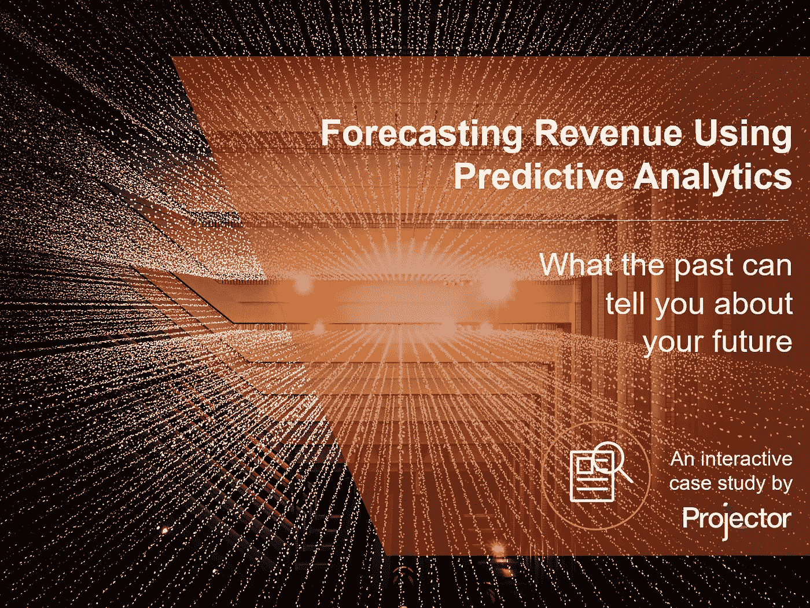

# 使用预测分析预测收入:交互式案例研究

> 原文：<https://medium.datadriveninvestor.com/forecasting-revenue-using-predictive-analytics-an-interactive-case-study-e26164f67df9?source=collection_archive---------7----------------------->

> 你认为预测分析等奇特的定量技术遥不可及吗？再想想。

已经有很多关于在工作场所使用人工智能、机器学习和预测分析等新奇技术来做一切事情的文章，从[确定最有效的项目经理](https://www.projectorpsa.com/blog/artificial-intelligence-effective-project-managers)到[对网飞提出建议](https://www.fastcompany.com/90234726/5-lessons-of-the-ai-imperative-from-netflix-to-spotify)。读者往往会有这样的印象，即该技术只能在高端、难以实施的黑盒系统中使用，只有企业愿意雇佣一小群非常专业的数据科学家才能实现。

为了帮助消除这个神话，我们构建了一个交互式案例研究，解释我们如何使用 Microsoft Excel 中的一些数据分析来为我们的一个客户构建一个基于[预测分析的收入预测模型](https://www.projectorpsa.com/blog/forecasting-revenue-predictive-analytics-interactive-case-study)。它使用一些有趣的动画来说明如何将普通的资源调度数据转换为动态的、自我调整的模型，从而提供更可靠的收入预测:

如果您对完整的动画和故事的其余部分感兴趣，请查看 Projector 的专业服务自动化博客上的文章:[https://www . Projector PSA . com/Blog/forecasting-revenue-predictive-analytics-interactive-case-study](https://www.projectorpsa.com/blog/forecasting-revenue-predictive-analytics-interactive-case-study)。

*最初发表于*[*www.projectorpsa.com*](https://www.projectorpsa.com/blog/forecasting-revenue-predictive-analytics-interactive-case-study)*。*