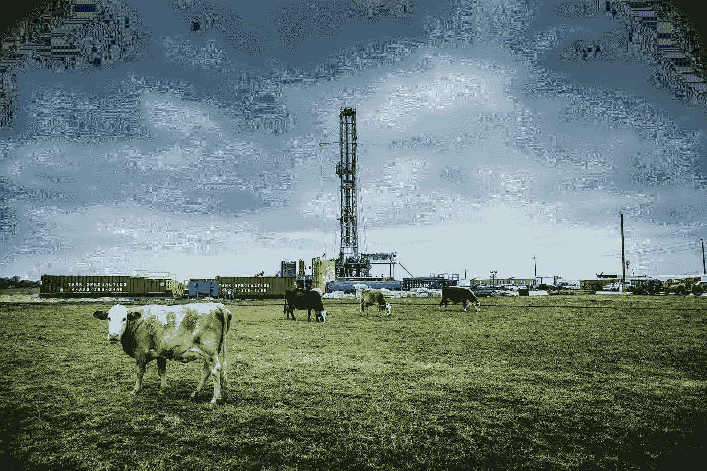
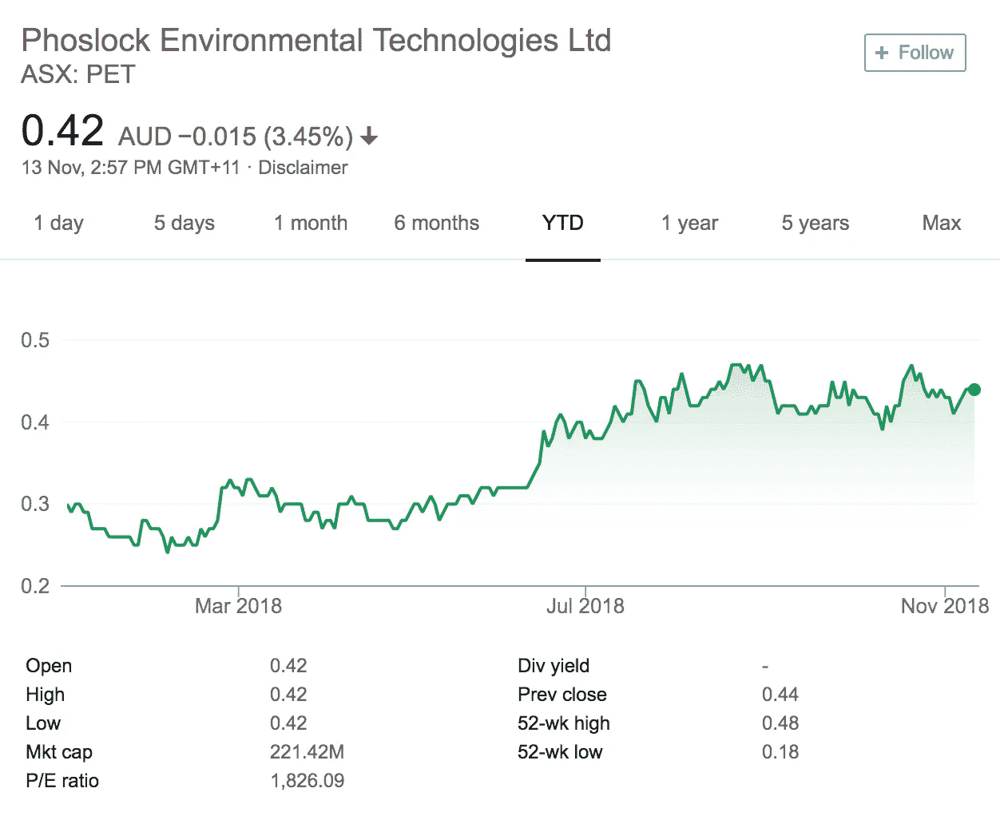

# 忘记石油吧，水是未来。

> 原文：<https://medium.datadriveninvestor.com/forget-about-oil-water-is-the-future-5506f0b21251?source=collection_archive---------30----------------------->

## 我们不会耗尽燃料的替代品。

“white cattle on green grass at daytime” by [Donald Giannatti](https://unsplash.com/@wizwow?utm_source=medium&utm_medium=referral) on [Unsplash](https://unsplash.com?utm_source=medium&utm_medium=referral)

无论市场状况如何，能源行业都曾是投资者的繁荣荣耀——这一论点总是可以用在流动性黄金上。

**石油。**

所有投资者的巅峰，能源行业的母载。

我们很少意识到，这不是关于现在，而是关于未来。

实事求是地说，我们并没有耗尽能源的替代品。

我们正在耗尽水的替代品。

最重要的资源，一个被我们滥用和忽视太久的资源；一种比石油占地球更大部分的物质。

投资策略师经常用图表和统计数据来躲避激光束。

对普通投资者来说，这完全没有意义。

绝对没有预测下一次市场崩溃的图表，也没有预测政治不稳定的图表。

然而，纵观历史，我们一直严重依赖石油。

为了追求这种神奇的资源，人们发动了战争。

然而，几乎没有人注意到大自然无情的燃料有多少替代品。

水，无疑是我们正在耗尽的资源。

一种资源，在适当的时候；甚至可以成为模型投资的缩影。

信不信由你，净化水是维持水资源最可行的方法之一。

因此，我的努力，研究什么工作正在进行追求水净化的过程中。

一个发现被发现了，这个机会看起来太有趣了，我不能忽视。

> 有前途吗？我想是的。
> 
> 它会让你在未来几年变得富有吗？大概不会。
> 
> 是否可持续？当然可以。

密码、安全、硬件技术、软件技术— ***随你挑。***

***我就赌水。***

因为，水是生存之本——而且一旦有必要时；正如历史多次告诉我们的那样，人类诉诸最基本的东西。

> **食物。**
> 
> **水。**
> 
> **电。**

我们有食物和电力的替代品。

尽管水是不可替代的。

唯一可行的解决办法是净化水体，这些水体支撑着农田，为我们提供食物。

甚至可以为水力发电提供动力的水。

我还是赌水。

现在可能不会，未来五年也不会——但如果你想投资未来，水是我愿意投资的领域。

于是，我的选股——**福洛克(ASX:宠物)** *以前(ASX: PHK)。*

 [## 磷锁|赛普罗公司

### Phoslock 是一项专利磷锁定技术，用于恢复池塘、湖泊和水库的水质。

www.sepro.com](https://www.sepro.com/aquatics/phoslock) 

目前，Phoslock 看起来财务状况并不稳定；它在向进一步的研发投入资金的同时也在消耗现金。

虽然该公司在中国市场持有合同并进行测试，但该产品的可靠性高度依赖于水净化的适应性和政府法规。

对于进一步的技术分析，我建议阅读下面的文章。

 [## 亏损的 Phoslock 水解决方案有限公司(ASX:PHK)何时需要更多现金？

### 市值 1.3491 亿澳元的 phos lock Water Solutions Limited(ASX:PHK)公布了又一年的负收益…

简单墙街](https://simplywall.st/stocks/au/commercial-services/asx-phk/phoslock-water-solutions-shares/news/when-will-loss-maker-phoslock-water-solutions-limited-asxphk-need-more-cash/) 

**为什么我相信 Phoslock 会是赢家？**

***简约*** 和 ***多功能*** 。

就我个人投资而言，我认为 Phoslock 是一个有趣的竞争者的两个主要原因。

***简单性*** ，因为该产品只需在水体中铺展，因为它沉淀在下面的床上以防止磷，因为它将磷密封在其化学结合层之下；当它吸收并锁住污染层时，提供了一个更干净的水体。

**为维持海洋生物提供更清洁的水源；于是与**的*渔业相结合。*****

目前，股票交易价格为***【0.42 澳元(撰写本文时)。***

我会等着看股价进一步下跌，然后以每股 0.38-0.40 美元的价格买入。

**Source: Google Finance.**

一如既往，我想说，这是我的个人意见。同时，Phoslock 是净水行业的一个突出竞争者；当然不是唯一的一个。如果分析有所帮助，我会建议在从事类似产品和目标的公司中做进一步的研究。

我绝不附属于或出于经济动机做出这篇文章中引用的投资建议。

> **公平披露:**
> 
> 这是我的观点，人们必须——一如既往，在投资前进行自己的研究。本文中表达的观点是我个人的发现，我与我在报告中推荐或引用的公司没有任何关系。
> 调查结果基于个人投资研究，概述的投资机会具有很高的可信度和极高的风险。
> 因此，我真的希望恳求人们在进行大量投资之前，先进行自己的研究。
> 因此，我希望强调这样一个事实，即一个人必须通过适当的研究和尽职调查得出自己的结论并形成自己的观点，或者就自己的投资目标咨询专业的财务顾问。

对于我之前的投资建议，

**免疫肿瘤学，**

引用如下。

 [## 投资对生存至关重要。

### 开始学习，这将是每一个人为自己。

medium.com](https://medium.com/datadriveninvestor/investment-will-be-crucial-for-survival-e5178f7ddebb) 

原发表[此处。](https://www.datadriveninvestor.com/2018/11/14/forget-about-oil-water-is-the-future/)

