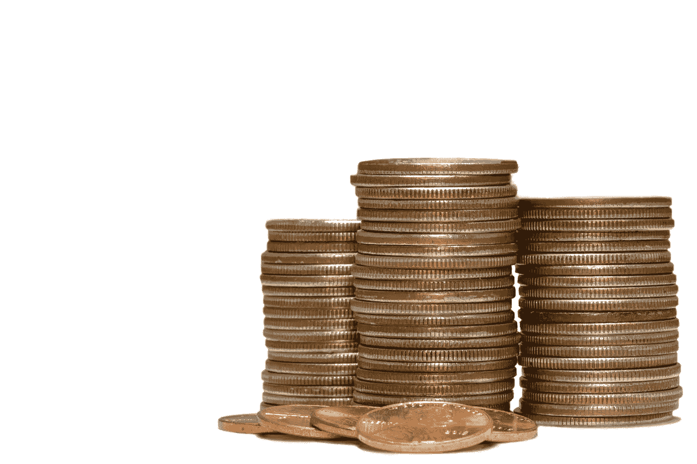

# 忘了为“应急基金”存钱吧——这样做反而可以免除债务

> 原文：<https://medium.datadriveninvestor.com/forget-saving-for-emergency-funds-do-this-instead-to-be-debt-free-6a174af93696?source=collection_archive---------19----------------------->

Photo by Michael Longmire on Unsplash

当我每个月只能勉强维持自己的开销时，我怎么能存下“应急基金”呢？

对我们中的一些人来说，每个月都像是一个紧急时刻！

我的账单每个月都让我不堪重负。

抵押贷款、信用卡债务、电费、水费、交通费、食品杂货费、孩子的学费等等。

以备不时之需！花的比赚的少！停止支付信用卡利息！投资你的退休生活！

我们*知道*这些事情。

但是*我们怎么做呢？*

当我付完账单后几乎没有钱的时候，把三到六个月的工资存起来以备不时之需似乎不现实。

直到凯伦·麦考尔在她的书《T4 金融复苏——与金钱发展健康的关系》中教了我一些聪明的策略。

# 优先考虑你的储蓄

朝着一个像“应急基金”这样大而不明确的目标努力是很难的。

但是 Karen 将这个看似庞大而不切实际的“应急基金”目标分成了三类。

# #1.定期储蓄

定期储蓄是为应付意外开支而存起来的钱。

我们毫无愧疚地使用这些资金来支付每月没有计划的开支。

汽车修理、修理漏水的屋顶、洗衣机等费用。

它们是“旋转门储蓄”,因为它们进入账户，就意味着离开账户。

# #2.安全网储蓄

安全网储蓄弥补了意外的收入损失。

也被称为自由基金，因为我觉得更安全，知道如果我失去了工作，我会在经济上没问题。

安全网储蓄也为我的副业提供了资金。我的副业是我获得财务自由的门票，因为这是另一个收入来源。

有了这些积蓄，我就从工作监狱中解脱出来了。

# #3.长期投资储蓄

当我们谈论储蓄时，大多数人首先会想到这一类。

长期储蓄是指为我们的退休储蓄。

这最后一类储蓄给我们带来了更大的金融安全。

是的，为退休储蓄很重要。

然而，如果我们没有定期储蓄和安全网储蓄，退休储蓄可能会适得其反。

这实际上会让我们陷入更深的债务，使我们更难摆脱债务循环。

# 如何利用这三种储蓄来摆脱债务

这 3 种类型的节约按优先级排序。

# 如果你的钱有限，首先把你的钱放在定期储蓄中

暂时忘掉另外两个。

当我们试图摆脱债务时，知道首先关注什么会有所帮助。

当我们忙于工作而无力支付利息高达两位数的信用卡债务时，谈论退休储蓄是毫无意义的。

# 阻止你的资金流失，然后将你的钱存入第二安全网储蓄

当你[停止撒钱](http://www.sharonrajsingh.com/stop-your-money-leaks/)时，找更多的钱，哪怕只是每月 50 美元，放在第二优先的安全网储蓄中。

只有当你已经覆盖了第一和第二项时，才开始把钱投入第三项长期投资储蓄。

# 退休储蓄排在最后，是第三大长期投资

不要犯和我一样的错误。

我认为我在财务上是安全和自由的，因为我把我的钱放在第三项长期投资储蓄中。

像捐赠基金、共同基金或指数基金这样的长期投资是不流动的。

最好让它们保持 10-20 年或更长时间，以获得复利和市场表现的最大收益。

当你被迫出售这些股票时，你往往会亏损，因为你没有其他流动资金来源来应付意外支出。

那么最简单的办法就是从你的卡上收取意外费用，让自己在债务的深渊中越陷越深。

事实上，由于我的钱被用于长期投资，我最终从信用卡上收取了更多的费用，包括日常开销。

当然，我合理化地说，我在为未来存钱，加上我在用信用卡赚取回扣和积分，所以这是“没问题的”。

我以为我为自己的退休和孩子的大学投资是在做财务上“正确”的事情，但另一方面，我为此背负了更高的债务。

但是，不要误解，长期投资很重要。我只需要*重新安排*的优先次序，首先停止陷入更多的债务。

但是*当我每个月付完账单后什么都没剩下的时候，我去哪里找钱来进行定期储蓄和安全网储蓄呢？*

# 如何投资你的储蓄——不要全额支付信用卡余额

没错。你没听错。

不要全额支付你的信用卡余额。

如果你有信用卡债务，无论如何你都不会全额还款。

即使你是，你也可能只剩下很少或根本没有钱来进行定期储蓄或安全网储蓄。

卡伦·麦考尔教我“设法摆脱债务”。

这个概念在智力上很简单，但在心理上很难执行。

尤其是当你像我一样，每个月都要还清我所有的信用卡余额。

如果你靠薪水过活，你应该从哪里找到更多的钱来储蓄呢？

除了我在之前谈到的[发现你的资金漏洞之外，你可以从你的信用卡支付中“发现”更多的钱。](http://www.sharonrajsingh.com/stop-your-money-leaks/)

如果你支付 1000 美元的信用卡账单，而你的最低金额是 700 美元，只需支付最低金额，然后将 300 美元转到储蓄账户。

随着时间的推移，你的定期储蓄和安全网储蓄账户将开始增长。

然后，当你遇到肯定会发生的意外支出时，你可以利用你的定期储蓄，而不是从你的卡上收取。

我们都知道这些意想不到的花费总是发生在我们最不需要的时候！

所以现在就开始计划，采取必要的行动来减轻我们的焦虑，而不是每次遇到意外开支时就惊慌和紧张。

# 重塑你对储蓄和债务的看法

我很难克服这种心理上的转变，即不尽可能多地支付信用卡余额，因为当你试图偿还债务时，这是如此反直觉。

但我决定试试。

最后，我从定期储蓄中拿出 1000 美元，用现金买了一套新车轮胎。

以前，我会把它放在我的卡上，让债务越陷越深。

这个简单但有力的时刻对我来说是一个巨大的心理胜利。

它激励并说服我将定期储蓄作为摆脱债务的一种手段。

这样做可能意味着你会更慢地偿还信用卡债务，但正如凯伦正确指出的那样，“以任何速度朝正确的方向缓慢前进都比朝错误的方向前进好得多”。

定期和安全网储蓄填补了我内心深处的心理和情感健康需求。

消除债务需要时间。债务越大，需要的时间越长。但是这个储蓄系统将帮助我们以一种可预测和有效的方式实现这一目标。

当我们与债务作战时，在精神上和情感上照顾好自己同样重要，因为这是一场需要耐力的马拉松。

在减少债务的同时，我不能让我的生活停滞不前。生活就是要活着。

采用这个系统来储蓄是在消除债务的同时过上无债务生活的方法。

我觉得这听起来不错！

你向定期储蓄和安全网储蓄迈出第一步了吗？请在下面的评论中告诉我进展如何！

下载你自己的[财务自由路线图](http://www.mommymakesthemoney.com/financial-freedom-roadmap/)，在 14 天内掌控你的钱！

*原载于 2018 年 11 月 22 日*[*【www.sharonrajsingh.com*](http://www.sharonrajsingh.com/forget-saving-for-emergency-funds-do-this-instead-to-be-debt-free/)*。*

*下载我的* [*免费分步指南 14 天掌控你的钱*](http://www.mommymakesthemoney.com/financial-freedom-roadmap/) *。*