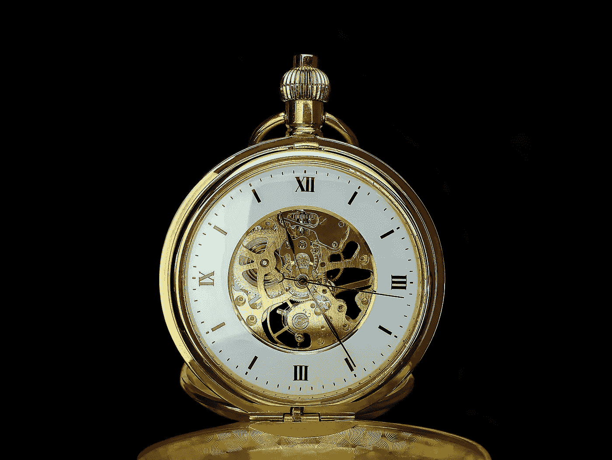

# 忘记工作与生活的“平衡”。相反，寻求和谐

> 原文：<https://medium.datadriveninvestor.com/forget-work-life-balance-instead-seek-harmony-d706d39a7f6?source=collection_archive---------39----------------------->

人生就像一块制作精良的机械表。

你是工匠。这位瑞士大师修补了大量的齿轮，创造了一个描绘时间流逝的系统。

对于那些不熟悉机械表工作原理的人来说，手表需要运动(即左右摆动手臂、摇晃手表或用力握手)来给弹簧上紧发条，这将使所有机构(即数百个齿轮)开始运转。现在大多数手表是石英表，这意味着它们通过电子方式显示时间，而不是使用齿轮。然而，如果你看看大多数高端手表(1000 美元至 20 万美元)，它们将是机械的。

现代人和未来主义者可能会问，为什么这种古老的看时间的方法仍然存在，并且以比普通智能手表高得多的价格出售，但我认为理解和欣赏机械表的美丽可以对我们如何思考我们生活的操作系统产生积极的影响。

这只表需要精确。如果掉了一个档，机械表就不能用了。那时你就看不清时间了。时间会继续流逝，但你不会知道。

这是我对生活的看法。

我认为我的生活就像一个有着无数齿轮的手表，需要优化运转才能正常运转。齿轮描绘了我生活的各个方面，如朋友、家庭、工作、健康(精神和身体)、我拥有的乐趣、我接受/给予的爱以及其他一切。

这是一个完全统一的系统，如果其中一个发生故障，将会毁掉所有其他系统。

**怎么会这样？**

好吧，如果你的职业让你痛苦，你讨厌你的生活，我真的怀疑你会在乎你的身体健康。我还会假设你的心理健康也在下降，因为我很难想象一个讨厌自己工作的人会有一个稳固的心理状态。这可能会影响到你的人际关系。你的朋友和爱人可能已经厌倦了听你的抱怨，消极的态度和多年来不去解决你的痛苦。你有时甚至会生气，这也可能使你与其他人疏远。

身体健康也一样。我认为努力工作，尽情玩乐是愚蠢的。我认为这是愚蠢的，因为倾向于体现这一点的人似乎没有考虑到糟糕的饮食、糟糕的睡眠、缺乏锻炼、久坐不动和过度疲劳等不良习惯会带来怎样可怕的后果。忽视锻炼和适当的营养会影响你的工作能力。不仅仅是身体上的能量，还有你头脑的创造力和/或心流。特别是随着“工作”变得更加“知识”集中，创造力将是必不可少的。我的意思是，如果你没有创造力，那么你和一个软件程序没什么不同(实际上你比软件程序更糟糕)，所以你可能很快就会失业。

只是几个例子，但我想你明白我的意思。

**不平衡。和谐。**

你必须持续关注你的系统。我并不是说你必须在生活的每一部分都分配相同的时间。有些人比其他人需要更多的时间。随着时间的投入越来越多，你生活中的某些部分实际上可能会变得更加消极(即收益递减到负收益)。甚至当你看手表时，也有小齿轮和大齿轮。不是所有的档位都一样。

这也是我不相信“工作生活平衡”的原因。我认为那只是一张变得平庸的单程票。

我相信“工作与生活的和谐”。

为什么和谐高于平衡？

我是不是对技术细节太挑剔了？

是啊，可能吧。但是魔鬼在细节中，细节才是最重要的。

正如我之前提到的，手表需要各种尺寸的齿轮，并且不是所有的齿轮都一样。因此，生活的不同部分需要不同的努力、时间和资源来优化。在某个时间点，你的工作可能是需要最多能量的大齿轮，而你的健康可能是需要较少能量转动但需要更频繁旋转的小齿轮，反之亦然。

**更多的例子。**

我的职业生涯可能需要我将事情推向一些极端，比如每周工作 60-80 小时，持续数周、数月甚至数年来启动一家公司或一个项目。然而，我与人的关系并不像一个 4 周或 5 个月的项目。这些都需要持续的增量投资。一年中每天花 1 小时 100%真正有质量的时间和我的女朋友在一起，我真正“在场”(即不检查电子邮件，不回复愚蠢的社交媒体通知)，这可能相当于 365 小时，但这与每周花 80 小时和她在一起 4-5 周，然后在另外 47-48 周忽视她是非常不同的。类似地，如果我不预先投入大量时间来创办一家公司，它可能永远不会有结果。没有普遍的答案，但是你必须知道谁将独唱，谁将是主旋律，谁将在你的生活中扮演配角。

同样的逻辑也适用于体育活动。当你在一年的剩余时间里整天坐在笔记本电脑前吃垃圾食品时，你将无法保持你在 4 周的艰苦训练中发展起来的耐力、力量或肌肉发展水平。实际上你的情况可能更糟。这也是考虑到你的身体需要时间恢复才能有身体的成长。我个人每周训练大约 12 个小时，但这不包括每周 4 次桑拿浴、每天 2 次冷水淋浴、节食、高质量睡眠、冥想和所有其他我做的事情，以确保我的身体恢复最佳状态，以便在下一次训练中变得更强。这是一个完整的系统。任何事物都不能独立运作，如果走极端，大多数系统都会崩溃。

哦，对了，你也不能补上你错过的睡眠。你也不能把孩子的年龄倒回到他们 7 岁的时候，也不能通过几十年后去医院看望他们来弥补你错过的与父母 50 多岁时的时光。一些系统需要持续的增量投资。

你的分配将会改变。这很自然。

每个人自己的体系不一样。我的需求、价值观、原则和我的女朋友、家人、朋友、你都不一样。不仅仅是不同，它还会随着我的成长而不断进化，明年我会变成一个不同的人。这意味着系统必须灵活。

如果我想取得重大的职业成就或运动成就，我可能需要将我的时间、精力和资源重新分配到不同的领域。这就要求各种系统具有灵活性和适应性。为了具有适应性，系统需要不断地保持和谐。

这看起来好像我只是从“时间投资”的角度来说，但是和谐包含了你生活中不同系统之间的整合。

它是关于把工作和你的社交生活结合起来，把身体健康活动和工作结合起来，把人际关系和精神健康结合起来等等…

我发现人们在寻求“平衡”时，会试图将生活的各个方面划分开来。根据我的经验，人们会为他们讨厌的那部分生活寻找划分。带来失望、悲伤和整体负能量的部分。他们不想让它蔓延到他们生活的其他部分。我明白了。你不想成为“抱怨者”和“扫兴者”。你不希望它影响你期待了一整天的健身课。

但是你猜怎么着？你不能把它划分开来。它会慢慢流出来的。无论是精神上还是身体上。会的。因为工作中的一些琐事，你可能不会出席和父母的讨论。你可能无法专注于工作，因为你和你的伴侣大吵了一架。你可能会因为糟糕的饮食而睡不好觉，这可能会导致第二天早上在健身房的表现不佳，这将导致你上班时对自己不满意，失去工作的动力，这可能会导致老板对你失望，所以你变得更加沮丧，然后你在晚餐时就此抨击你的朋友，然后他们不邀请你出去，然后你感到孤独……好吧，你明白了。

这是一个大循环，一切都是相互关联的。当一个齿轮停止时，它最终会损坏整个手表。根据齿轮的大小，可能需要更长或更短的时间来打破整个手表，但它最终会。

**所以，和声。**

不要否认或划分它。如果你讨厌你的工作，那么告诉你的朋友并寻求帮助。也许你需要花时间去寻找一个全新的职业，所以减少你在健身房的时间。改变你的培训计划，减少心理压力，在你寻找新工作时减轻压力。花你的社交时间和家人朋友在一起，获得建议和帮助，弄清楚你是谁，弄清楚你更愿意为工作做什么。如果训练不顺利，那么调整你的饮食，调整你的睡眠，告诉你的老板你工作过度，身体健康状况不佳，这让你精神紧张，影响了你创造伟大作品的能力。

协调你生活中的所有系统。

手表需要所有的齿轮运转正常才能报时。

不要因为手表坏了，就错过了时间的流逝。确保你有一只可以工作的手表来记录时间的流逝。

你生活中有哪些齿轮没有发挥作用？为什么是次优？你打算怎么办？

*最初发表于*[*【www.oldmandan.com】*](https://www.oldmandan.com/essays/forget-work-life-balance-instead-seek-harmony)*。*