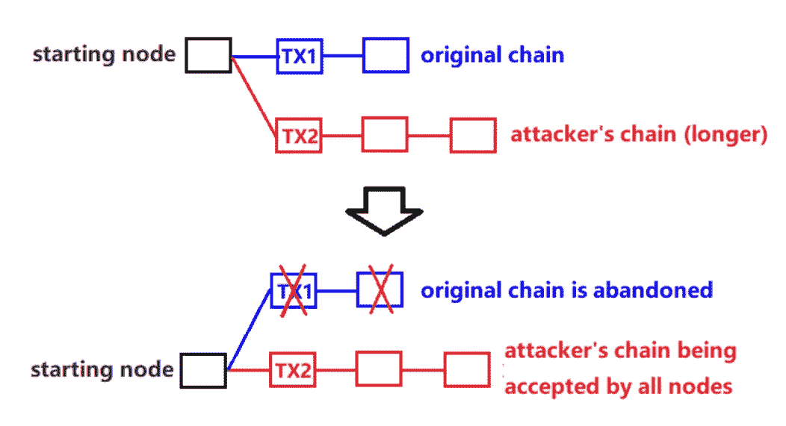

# 区块链的分叉——繁荣还是祸根？

> 原文：<https://medium.datadriveninvestor.com/forks-in-blockchain-boom-or-bane-d9ed0cee7668?source=collection_archive---------51----------------------->

*散户投资者面临的痛苦和机遇*

If only forks were so beautiful

比特币 vs 比特币现金。以太坊 vs 以太坊经典。最近，比特币现金 ABC vs 比特币现金 SV。随着许多人将最近的比特币现金硬分叉作为比特币价格跌至 6000 美元以下的主要原因，(至于这是否是真正的原因，我不确定，但这是另一篇文章的主题)，以及分叉是区块链的一个特征，这是很重要的，至少要理解分叉的性质，不要被周围的炒作或恐惧所困扰。

叉子是如何工作的，为什么它们会首先发生，以及我对叉子的人性的想法在这篇文章中与你分享。请继续阅读了解更多信息！

# 硬分叉 vs 软分叉

在我们深入讨论分叉之前，这里有一个发生在区块链领域的两种分叉的基本定义——硬分叉和软分叉。

把福克斯看作是区块链的**软件更新**。每个节点都需要运行区块链软件来访问分布式账本并进行验证。对区块链的软件更新包括对**块大小**、**共识机制**和**挖掘算法**的更改，仅举几例。硬分叉和软分叉是对区块链的两种不同类型的软件更新。在任何分叉中，至少有 51%的节点需要同意分叉才能发生。

在**硬分叉**中，进行了主要的软件更新，例如对共识模型和块大小的改变。这使得更新的软件与以前的软件不兼容。没有更新到最新软件的节点将不再与更新的节点兼容。

而在**软分叉**的情况下，在先前软件版本上运行的节点将仍然与运行更新软件的节点兼容。事务仍然可以在这两个不同的节点之间发送。运行先前版本软件的节点将产生无效块，但这没关系，因为“旧链”将被“新链”取代(记住，至少 51%的节点将为“新链”产生块)

# 福克斯的免费钱？

Free money, anyone?

如果我们遇到一个硬分叉的情况，我们没有 51%的节点支持更新的软件，该怎么办？这可能是由于两个社区对软件更新中提议的更改的意识形态不同而引起的。正如人性一样，我们所想的和所能认同的必然会有差异。

因为我们总是需要 51%的节点同意执行一个决定，所以另一个硬分叉和创建新链的方法是**创建一个新令牌**。以比特币现金(BCH)为例，当时比特币(BTC)的持有者在钱包里每持有一个 BTC 就能获得一个 BCH。BTC 的价格没有像一些人预期的那样下降，BTC 和 BCH 都走上了牛市，促使人们把福克斯看作是一种赚免费钱的方式。

真的是这样吗？

# 战争中没有人会赢

我们已经确定，至少 51%的节点需要达成共识，才能对区块链软件和区块挖掘做出更改。然而，如果攻击者通过挖掘单独的块来创建单独的链，该怎么办呢？然后呢？下图很好地说明了这种情况的后果。

Photo credits go to [Jiang Zhuoer](https://medium.com/@jiangzhuoer/abc-vs-bsv-hash-war-part-iii-the-war-of-the-hash-power-45fef8010467)

从图中可以看出，如果攻击者决定进行一场全面的“赢家通吃”战争，他们将尽快建立自己的独立链，直到他们的链更长，他们将**完全控制所有以前的交易**，成为主链。这是因为诚实节点将遵循更长的链，并在该链上产生块。

这就是比特币现金 ABC 和比特币现金 SV 之间一直在发生的事情。比特币现金 SV 的代言人克雷格·赖特宣布，比特币现金 SV 将继续这场哈希战争，并努力成为更长的链，成为比特币现金的主链。

我认为如果我们回顾历史，有一件事是非常清楚的:**战争中没有真正的赢家。即使是胜利者也不行。在这种情况下，也是如此。真正的输家很可能是区块链社区的人。然而，它确实让人们注意到了哈希能力的重要性，并考验了通过形成最长的链来入侵网络需要投入多少资金。我们只能等着看这件事最终如何发展。**

# 分权的代价

尽管是权力下放和区块链技术的大力倡导者，但对我来说，forks 的概念代表了社区必须付出的代价。排除了进行分叉的可能性，就等于说，中央权力机构负责，区块链的一切事情，从街区大小到共识模式，都不能凭借中央权力机构而改变。

如果社区中有很大一部分人有不同的意识形态，他们应该被允许离开中央权威(在这种情况下是主链)并执行分叉。

即使它带来了社会不稳定和混乱的代价，并成为投机者期待获得“免费资金”的事件，引起市场价格的广泛波动。除此之外，区块链还需要不断更新(没听说过不需要任何更新的技术吗？)

然而，从长远来看，我乐观地认为，社区内的分歧和分歧将使久而久之落后。这有两个原因。首先，随着区块链空间的成熟，区块链的各个方面将会改善，分歧将会减少。其次，人们可能会对福克斯保持警惕，不再想参与其中。

# 给你的一篇文章

为了实现大规模采用，区块链内容需要被分解，并以大众理解的术语传达给他们。这也是我写这样的观点文章的原因——让大众更好地了解区块链技术和加密货币。

喜欢你读的吗？如果你是一家寻求内容营销支持的区块链公司，让我为你写更好的文章！

[今天就提升您的营销水平](http://blockconstellation.com/contact/)

【联系我
**网站**:[http://blockconstellation.com/](http://blockconstellation.com/)
**邮箱**:jiayung@blockconstellation.com
**LinkedIn:**[https://www.linkedin.com/in/jia-yung/](https://www.linkedin.com/in/jia-yung/)