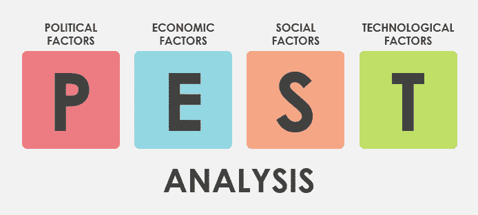
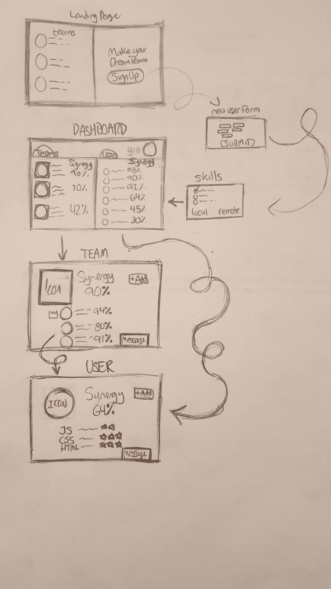

# 组建你的梦之队

> 原文：<https://medium.datadriveninvestor.com/forming-your-dream-team-b5ffd5ba6502?source=collection_archive---------21----------------------->

## 伟大的团队应该不难组建…

… *但他们是*。你有多少次发现自己在一个不起作用的团队中？你曾经承担过你项目的大部分工作吗？你喜欢当你必须创建一个团队的时候吗？

如果你诚实地回答，你们中的许多人会有负面的反应。团队组建*烂透了。*我们讨厌过程。与此同时，团队以一种非常大的(可能是积极的)方式影响着我们每个人的生活。从专业角度来说，这很容易做到——尽管我想指出，人们是如此系统地社会化，以至于这也渗透到我们个人生活的每一个角落。

*   厨房是一个厨师团队。
*   婚姻是一队情人。
*   学校俱乐部和学生会一样，都是学生组成的团队。
*   体育被视为经典的团队建设活动。
*   某些电子游戏是以团队为基础的，需要大量的合作。
*   角色扮演游戏，如 D&D，是面向团队的休闲游戏。
*   只有能够协作的团队才能赢得竞赛活动，如[黑客马拉松](https://mlh.io/)。

伟大的团队是令人敬畏的。它们很神奇，里面的人也是。作为人类，我们以自己的方式努力成为这样一个团队的一部分。

但是，如果团队形成在我们的生活中如此普遍，如果人们天生就是社会性的，那么为什么弄清楚我们如何在一起会如此困难呢？要回答这个问题，我们需要确定大图，并从那里分解它。

## 发现正确的领域

协作、沟通、生产力和社交媒体是该领域涉及的主要细分市场。这意味着脸书、LinkedIn 和 Slack 已经部分解决了团队合作的问题。

也就是说，这个领域的核心是一个单一的应用:团队生成。团队生成本身并不是这些产品的核心特性，所以它们的应用是有限的。

似乎有一些有效的理由来进一步探索这个领域…让我们使用各种工具来进一步分解它。

# 领域问题和解决方案

以便确定该域中是否有任何未解决的问题。将领域中的问题与它们的解决方案进行比较，可以很容易地看出人们是否对当前的领域生态系统感到满意。

## 当前的问题

*   *缺乏社会多样性成为创新的瓶颈。*在你的朋友圈之外很难创建团队。在这种情况下，文化和种族多样性往往也很低。
*   *缺乏技能多样性是创新的瓶颈。很难找到精通你不擅长的特定领域的人，因为这不是你的专业领域。*
*   *领导者有着高度集中的重要性。*一个像钟表一样运转的团队不会总是有一个领导者，那些有领导者的人不应该高估他们相对于其他团队成员的价值。
*   团队是临时组建的。如果一个团队组建得太快，成员们自己都不知道他们将面临什么。事先很少花费时间或精力来确保团队的平衡。
*   *未优化的团队工作更少。*当你发现你的团队没有优化时，往往已经太晚了。它推迟了最后期限，浪费了时间，沮丧的成员找到借口再次独自工作。

## 当前解决方案

*   **我在你旁边:**根据团队坐的位置将他们聚集在一起。
*   **帽子里的名字:**强制队伍随机形成。
*   **在这里注册:**让团队通过相似的兴趣有机地形成。
*   **复杂化:**有人走到幕后，故意根据一个庞大但往往有限的数据集创建团队。变量的数量之多意味着某些东西总是会被忽略或妥协。

## 得出结论

在这种情况下，解决问题的办法很少，也很乏味。如果有另一个简单、有趣、有深度的选择，那么人们将能够更有效地组建团队。

这个域名可能需要一个新的应用程序！

# 竞争分析

这张图表描绘了具有两个主要因素的产品——功能的多样性和团队建设功能的质量。

*   [脸书](https://www.facebook.com/)
*   [领英](http://linkedin.com)
*   [松弛](https://slack.com/)
*   [不和](https://discordapp.com/)
*   [蒸汽](https://store.steampowered.com/)
*   [梦之队](https://dreamteam.gg/) & [UGC](http://ugcleague.com/)
*   各种约会应用

## 得出结论

这些信息向我们表明，很少有应用程序既有深度的团队生成功能，又有广泛的直接应用。

脸书是你可以用来组建团队的最佳平台之一，但即便如此，在这样一个随意的平台上也很难比较潜在的团队和队友。此外，你的朋友圈实际上是一种限制，因为它让你无法找到新的、有吸引力的队友。

DreamTeam 拥有优秀的团队生成功能，但它的范围仅限于非常特定的游戏子集。除了你的技术水平、偏好的打法和本地化之外，它不会考虑任何因素。也就是说，它是利基市场的强大工具。

# 害虫分析

领域的外部影响决定了环境因素，如新产品的生存能力或当前产品的表现。害虫分析是一个很好的工具。

## 政治趋势

今天的政治环境动荡不安，咄咄逼人。很难预测未来四年内会发生什么，正因为如此，市场的未来将会不稳定。目前，市场稳定并不断改善。

布雷特·卡瓦诺最近被任命为最高法院法官。在对他进行了这么多可信的性指控后，他的形象让整个法院系统蒙羞。美国的士气非常低落。

特朗普总统及其追随者发布了数量惊人的假新闻。这本身就是一种流行病。选举季节即将到来，有可能会有足够多的民主党人当选，共和党人将不再掌权。

在这个时代，政治是一个令人难以置信的分裂话题。我只希望爱与和平最终会胜出。

## 经济/人口趋势

多样性是经济、政治、技术和教育领域的头号问题。它的影响是巨大的，几乎每个美国人都能感受到它的冲击波。

在团队中包含多样性是非常重要的。一个没有多样性的团队是一个糟糕的团队。美国政府由年老富有的白人男性组成。美国的公司由年老富有的白人男性领导。按照定义，这些强大的实体是由糟糕的团队领导的。

这是一个大问题！至少在这个时代，许多人愿意承认这是一个问题。这是修复系统的第一步。接下来就是做点什么了。

## 社交/品味趋势

人们希望通过手机即时、按需获得所需的东西。他们希望东西是免费的，没有广告。

趋势显示，与一次性购买套餐相比，他们更有可能支付每月套餐，尽管从长期来看，后者更昂贵。

## 技术趋势/突破

计算机硬件比以前进步得更慢了。软件保持其速度并不断改进，以满足低层硬件的更高性能。

大多数用户拥有的移动设备平均价格约为 100 美元。这给了你一个低于平均水平的表现。因此，您的网站需要在这样的底层硬件上运行，以便将内容快速交付给最终用户。只需要几秒钟，就会有人厌烦并退出你的网页。

渐进式网络应用是一种创建应用的新方式。它们各有利弊，但总的来说，如果做得好，它们的性能更好。

## 得出结论

这些信息表明，当前的环境并不适合该领域的新产品，但社会和技术趋势带来的机遇仍使其成为一项合理的投资。

# 产品创意

考虑到这些数据，我相信这个细分市场需要一个新的团队生成应用程序。这个应用程序将人们聚集在一起进行各种活动。该应用程序不是针对某个特定人群，而是为结识新朋友打开了一扇大门。

然而，在过渡到更大的规模之前，针对利基市场可能是项目第一次迭代的好主意。

就目前而言，它最简单的形式是拥有用户、团队和搜索这两者的能力。

以后的迭代可以为团队和用户匹配百分比，并使用算法推荐用户与有共同目标的其他人合作。这个应用程序可以帮助你找到一个多元化的团队。

这个应用程序甚至可以专注于社交朋友团体，而不是正式的团队。就像约会软件帮助你找到灵魂伴侣一样，这个群组软件可以帮助你找到你的灵魂- *团队*。

This wireframe outlines key features of this app

## 三维线框模型

考虑到这些事情，我创建了一个线框来模拟这个应用程序的想法。当用户查找“团队生成应用”或类似的东西时，他们会被引导到这个登陆页面。

这个想法是，用户将会看到已经产生的各种质量团队，并且想要为他们自己创建一个..

他们将点击“注册”，在一个基本表单中填写一些用户详细信息，填写一份关于他们的兴趣和技能的快速问卷，然后继续到他们的仪表板。

仪表板将根据团队和用户的位置和协同作用来匹配他们。点击用户或团队会将您带到他们的个人资料页面

用户或团队简介将包含关于他们的信息，包括技能和怪癖，这将帮助用户决定该团队是否适合他们。

## 用户故事

**仍需更新本节……*

*黑客马拉松的开发者(需要面对面团队)
游戏玩家(需要远程团队)
足球玩家(需要面对面团队)*

# 用户访谈

*希望尽快获得用户访谈。*

## *预备问题:*

1.  你做什么娱乐？
2.  你多久和你的朋友出去玩一次？
3.  你最后一次和新朋友出去是什么时候？
4.  你的工作是面向团队的吗？
5.  你多久会觉得你的团队表现不佳？
6.  在团队工作中，你最喜欢的部分是什么？
7.  你最不喜欢的部分是什么？

## 更深层的问题:

对于进一步的问题:我用“团队”这个词来概括许多不同的群体——商务人士、音乐家、已婚夫妇、朋友圈、在线游戏团队、运动团队…

1.  你认为这有意义吗？
2.  你尝试过自己组队吗？
3.  是远程的还是面对面的？
4.  你的体验如何？
5.  你尝试过用脸书组建一支球队吗？
6.  你有没有尝试过利用其他网站或应用组建团队？

## 流动问题:

从这里开始，访谈将打破结构，引导用户想要体验的东西。保持客观，不要询问具体的功能，并吸引用户的反应。

# 更近的

为什么团队组建如此困难？答案很简单。因为，没有任何应用程序可以简化这一过程并使之令人愉快。事实上，创建一个团队既困难又乏味。

# 来源

团队发展阶段:
[https://medium . com/swlh/team-Development-Stages-51df 5606 c0a 2](https://medium.com/swlh/team-development-stages-51df5606c0a2)

了解性格类型:
[https://www . Myers Briggs . org/my-MBTI-Personality-type/MBTI-basics/](https://www.myersbriggs.org/my-mbti-personality-type/mbti-basics/)

了解团队动态:
[https://lattice . com/library/how-to-establish-good-Team-dynamics](https://lattice.com/library/how-to-establish-good-team-dynamics)

核桃结构:
[https://blog . method kit . com/the-Walnut-explains-how-you-as-a-a-group-functions-c 10 f1 c 67 EB 69](https://blog.methodkit.com/the-walnut-explains-how-you-as-a-group-functions-c10f1c67eb69)

拉请求和团队动态:
[https://medium . com/@ Bernardo . AMC/pull-Requests-and-Team-Dynamics-978 faca 267 C2](https://medium.com/@bernardo.amc/pull-requests-and-team-dynamics-978faca267c2)