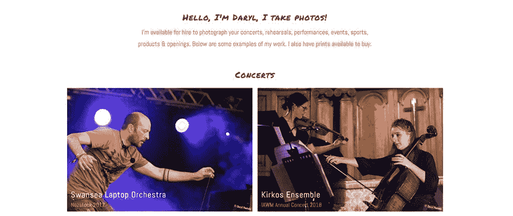
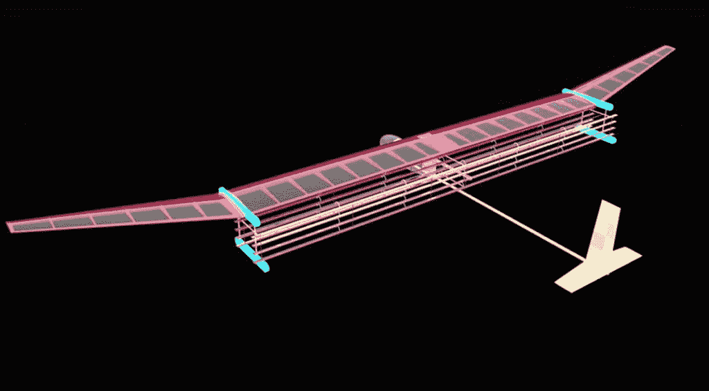
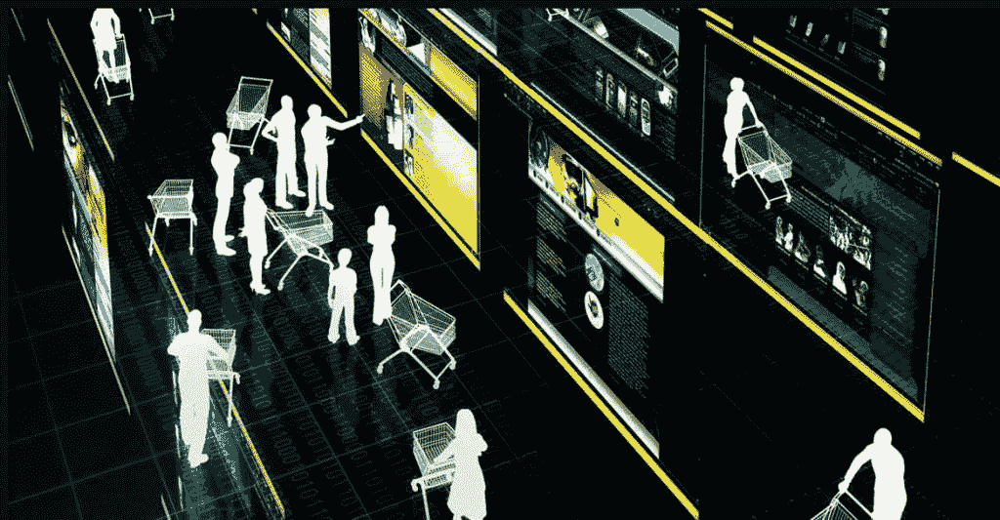
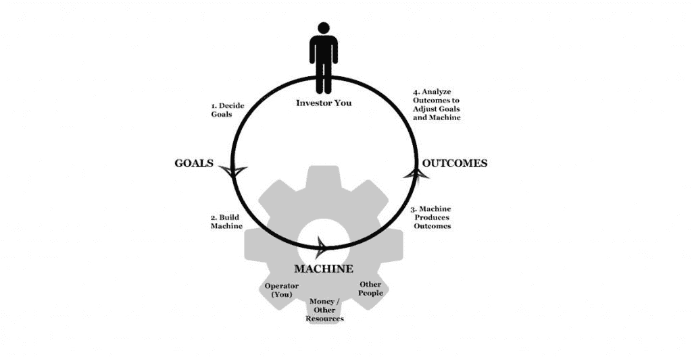
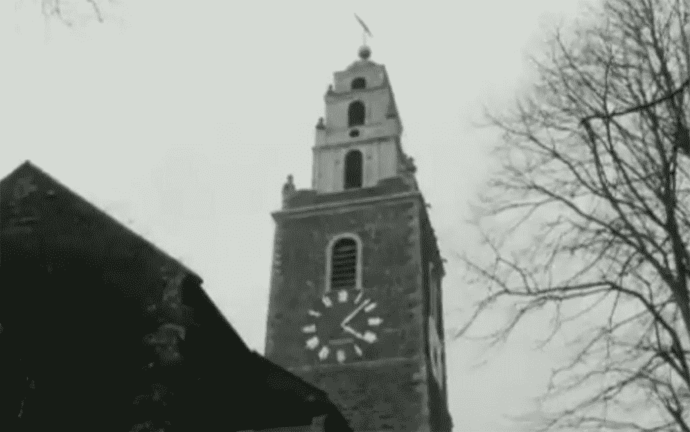
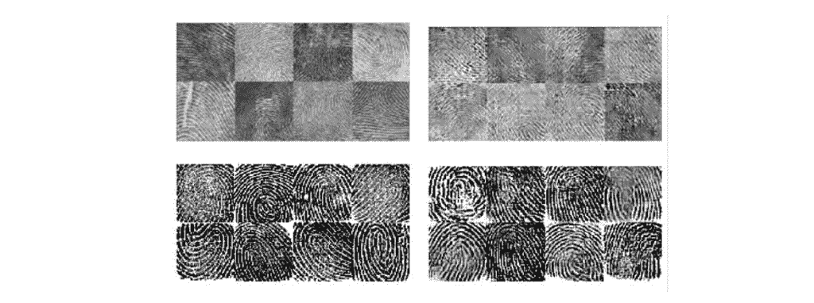
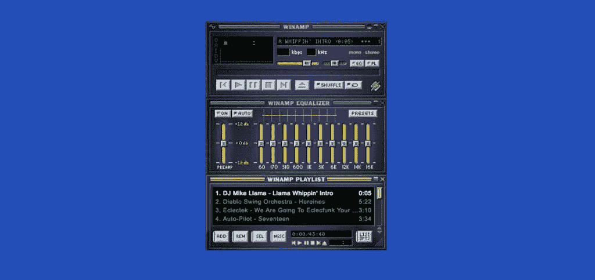

# 本周发现#134

> 原文：<https://medium.datadriveninvestor.com/found-this-week-134-2f8d926fe206?source=collection_archive---------31----------------------->

本周照片

Sunset Clouds, this photo is available to [licence on EyeEm](https://www.eyeem.com/p/132824273).

**本期:**摄影，离子飞行，空间网，克服失败，1961 年软木塞，AI 指纹，Winamp，AI 成全&一架神奇的直升机！

*原载于 2018 年 11 月 23 日 www.foundthisweek.com**的* [*。*](https://www.foundthisweek.com/editions/134)

[点击此处订阅](https://www.foundthisweek.com/subscribe)每周周五在你的收件箱中找到你:-)

## 摄影作品集&印刷品

本周，我建立了一个小型的[摄影作品集网站](http://photos.darylfeehely.com/)，展示我的一些音乐会、活动和体育摄影作品。如果你正在为你在南威尔士或爱尔兰的活动或业务寻找摄影师，请告诉我。我也有[的照片可以在网上购买，由](http://photos.darylfeehely.com/index.html#prints) [PicFair](https://dfeehely.picfair.com/) 驱动。

[Purchase Print on PicFair](https://dfeehely.picfair.com/pics/06071670-the-horion-at-sunset)

## 第一次离子飞行

Image: MIT

受《星际迷航》中航天飞机的启发，[麻省理工学院的研究人员利用电动空气动力推力成功完成了固态固定翼飞机的首次离子飞行](https://news.mit.edu/2018/first-ionic-wind-plane-no-moving-parts-1121)！翅膀下面的电线层在前后电线之间产生了 20，000 伏的电压差，导致带电电子从正极电线穿过空气到达负极电线。带电粒子在飞行时推动机翼上的空气粒子，产生少量升力。该团队创造了一个比空气重的原型飞机，成功地使用离子飞行旅行约。室内 60 米。

## 空间网络和网络 3.0

Image: Singularity Hub

这是奇点中心的一篇有趣的文章，关于下一代网络的可能性，他们称之为空间网络和网络 3.0。这篇文章描述了 5G、人工智能和物联网景观如何允许实时生成来自多个公共摄像机的 AR 和 VR 场景源，允许用户嵌入街头抗议、体育或新闻事件。讨论的其他技术可能性是随时可用的 AR 虚拟销售人员和广告，耶！:-p

## 克服失败

Image: Medium, Taylor Pearson

泰勒·皮尔森有一篇关于克服失败的很棒的文章，他以巴克明斯特·富勒的名字命名为巴基方法。我不会为你破坏这篇文章，它值得一读，看看泰勒如何将来自多个来源的理论和思想结合到一个结构化的建议方法和实用的框架中，以便在项目中重复工作，同时将建设性的失败融入其中。

## 1961 年科克

Image: Twitter, BBC Archive

[BBC 档案推特账户发布了一个有趣的视频](https://twitter.com/BBCArchive/status/1064569752302092292)，是作家弗兰克·康纳在 1961 年谈论他的家乡科克的。虽然他关于科克的怀旧情节有些有趣，但这里真正的瑰宝是 1961 年科克内城及其居民日常生活的镜头。

## 人工智能大师指纹

Image: Motherboard

纽约大学和密歇根大学的研究人员使用人工智能生成对抗网络(gan)生成一组主指纹，该指纹可以在 76%的时间里骗过低安全性指纹扫描仪。在更现实的安全级别上，主指纹有 22%的时间会被传感器误匹配。

## Winamp！

Image: Internet Archive

互联网档案馆为 craic 复活了 Winamp ！你可以[在这里使用 Webamp](https://webamp.org/)甚至播放美洲驼的叮当声！

## 奥托人工智能实现

Image: Otto

[德国电子商务网站 Otto 使用人工智能算法预测其需要购买的股票](https://www.economist.com/business/2017/04/12/how-germanys-otto-uses-artificial-intelligence)。该算法最初是为欧洲粒子物理研究所的粒子物理实验开发的，它以 90%的准确率预测未来 30 天内将出售的 20 万种产品。

## 本周最酷的东西:帧率转子

Image:YouTube, Chris Chris

[YouTube Chris Chris 的这段视频展示了将相机的帧速率与直升机旋翼的旋转同步的效果。](https://petapixel.com/2017/03/04/cameras-frame-rate-synced-helicopters-rotor/)

下周见！

附:如果你喜欢这个发现，请点击下面的拍手图标。
还有，[订阅](https://www.foundthisweek.com/subscribe)，或者告诉朋友，或者两者兼而有之！谢谢:-)

*原载于 2018 年 11 月 23 日 www.foundthisweek.com***。**

## *关于本周发现的*

*“本周发现”是一个精心策划的博客，里面有关于技术、科学和生活的有趣文章、文章、链接和故事。每个版本都是由 Daryl Feehely 在每周五策划，并强调每周发现的酷东西。前 104 版在[媒体](https://medium.com/@dfeehely)上发表于[foundthisweek.com](http://foundthisweek.com)创建之前，点击查看[档案。](https://medium.com/@dfeehely)*

## *达里尔·费赫利*

*我是一名网站顾问、签约网站开发人员、技术项目经理和摄影师，来自科克，现居斯旺西。我为我的客户提供战略、规划和技术交付服务，远程和面对面。我还为需要技术提升或创新的公司提供自由职业 CTO 服务。如果你认为我能在你的生意上帮到你，请查看我在 http://darylfeehely.com 的详细信息*