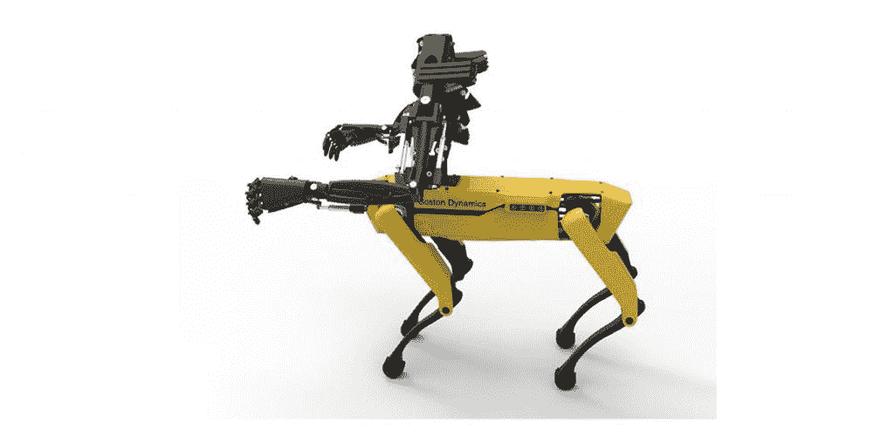
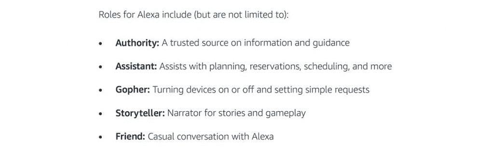
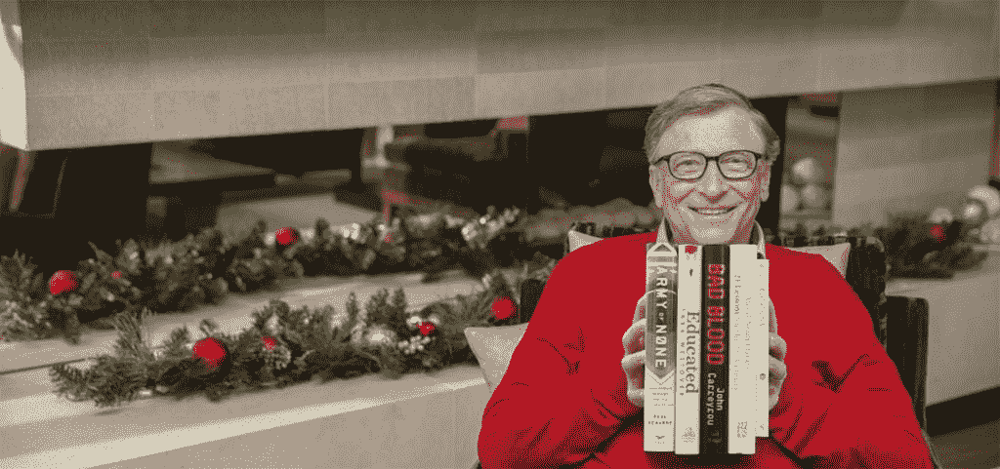
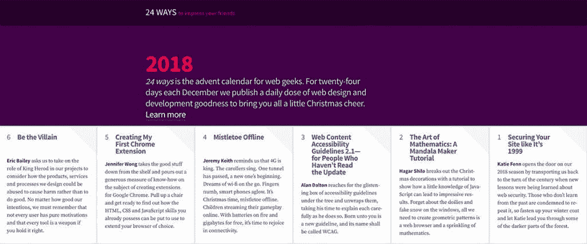

# 本周发现#136

> 原文：<https://medium.datadriveninvestor.com/found-this-week-136-7ce7e2f2fae4?source=collection_archive---------26----------------------->

本周照片

我在可爱的 UL 校园度过了这一周，每次我去那里，都会看到一栋新的建筑。新的图书馆扩建部分现已开放运行，看起来非常壮观。当香农河的声音在桥下流淌时，走过这座活着的桥的体验是无法被低估的。

**本期:** Swanlork，spotmini arms，Alexa skills，Tom Cruise Vs TV 运动平滑，比尔盖茨书单，web dev 降临节日历，2018 年的 52 个事实，Google Pixel 3 人像模式和 Chromium 上的 Edge！

*原载于 2018 年 12 月 7 日 www.foundthisweek.com**的* [*。*](https://www.foundthisweek.com/editions/136)

[点击此处订阅](https://www.foundthisweek.com/subscribe)每周周五在你的收件箱中找到你:-)

## 高尔豪斯的斯旺西笔记本管弦乐团

本周，斯旺西笔记本电脑管弦乐团在圆形阅览室的高尔豪斯斯旺西艺术学院展示活动中表演了这首字母歌曲。[点击这里查看片场的一些照片](https://www.facebook.com/media/set/?set=a.1133704650139282&type=1&l=1d1726d163)。

## Spotmini Arms

Image: Design Boom, Youbionic, Boston Dynamics

[youbionic 开发了一套 3D 打印的遥控机械臂，可以安装在东西上](https://www.designboom.com/technology/spotmini-the-robot-dog-3d-printed-bionic-arms-youbionic-one-11-27-2018/)。为了证明这一点，他们在波士顿动力公司的 Spot 微型四足机器人上安装了仿生手臂。3D 打印这套仿生手臂的 STL 文件可以从 youbionic 网站下载[，售价 179 美元](https://www.youbionic.com/#one)。

## 设计一个 Alexa 技能

Image: Amazon

[亚马逊制作了一份方便的资料表](https://m.media-amazon.com/images/G/01/mobile-apps/dex/alexa/alexa-skills-kit/guide/How-to-Design-VUI-Guide.pdf)，描述了如何着手设计 Alexa 技能，从定义语音界面的客户价值开始，并将其与 Alexa 语音技能的可用功能相匹配。

## 汤姆克鲁斯 Vs 电视运动平滑

Image: Twitter, Tom Cruise

谢谢汤姆·克鲁斯！多年来，我一直向那些愿意听的人宣讲，高清电视上的愚蠢设置是如何让事情看起来一团糟的！最后，汤姆·克鲁斯和他的好莱坞伙伴们拯救了我，告诉世界运动平滑是错误的，即使它在大多数高清电视上是默认开启的。收回你的高质量高清电视观看体验，关闭运动平滑，因为汤姆克鲁斯要求你这样做！:-p

## 比尔·盖茨书单 2018

Image: gatesnotes.com

比尔·盖茨发布了 2018 年他最喜欢的 5 本书，正好赶上买礼物(提示提示！:-p)。[点击这里查看 5 本书的清单](https://www.gatesnotes.com/About-Bill-Gates/Best-Books-2018)。

## 24 小时网络开发降临日历

Image: 24ways.org

[24ways 创建了一个网络开发降临日历](https://24ways.org/)，并在圣诞节前发布了一些非常有趣的文章，比如如何最好地保护你的网站或者如何创建你的第一个 Chrome 扩展。

# 2018 年学到的 52 件事

Image: Medium Tom Whitwell

汤姆·惠特韦尔在 2018 年发表在 Fluxx Studio Notes 上的 52 个事实中有一个有趣的列表，例如 Peppa Pig 纹身在中国很大，纽约市的 1000 个人行横道按钮中只有 100 个可以使用。

## 谷歌 Pixel 上的人像模式 AI

Image: Google AI Blog

[这是谷歌人工智能博客](https://ai.googleblog.com/2018/11/learning-to-predict-depth-on-pixel-3.html)上的一篇有趣的帖子，描述了他们如何用一个摄像头在谷歌 Pixel 3 上实现人像模式。使用 CNN，图像中的锐度深度线索可以与日常物体的形状估计相结合，作为使用 Tensorflow 光在手机上运行的 AI 的组件，以精确地产生人像模式的模糊背景。

## 微软在 Chromium 上的优势

Image: The Verge

[微软宣布计划在开源 Chromium 网络渲染引擎上重建 Edge 浏览器](https://www.theverge.com/platform/amp/2018/12/6/18128648/microsoft-edge-chrome-chromium-browser-changes?)。新的 Edge 将在旧的 Windows 7 和 Windows 8 操作系统以及 Mac OS 上提供！

下周见！

附:如果你喜欢这个发现，请点击下面的拍手图标。
还有，[订阅](https://www.foundthisweek.com/subscribe)，或者告诉朋友，或者两者兼而有之！谢谢:-)

*原载于 2018 年 12 月 7 日*[*【www.foundthisweek.com】*](https://www.foundthisweek.com/editions/136)*。*

## 关于本周发现的

“本周发现”是一个精心策划的博客，里面有关于技术、科学和生活的有趣文章、文章、链接和故事。每个版本都是由 Daryl Feehely 在每周五策划，并强调每周发现的酷东西。前 104 版在[媒体](https://medium.com/@dfeehely)上发表于[foundthisweek.com](http://foundthisweek.com)创建之前，点击查看[档案。](https://medium.com/@dfeehely)

## 达里尔·费赫利

我是一名网站顾问、签约网站开发人员、技术项目经理和摄影师，来自科克，现居斯旺西。我为我的客户提供战略、规划和技术交付服务，远程和面对面。我还为需要技术提升或创新的公司提供自由职业 CTO 服务。如果你认为我能在你的生意上帮到你，请查看我在 http://darylfeehely.com 的详细信息