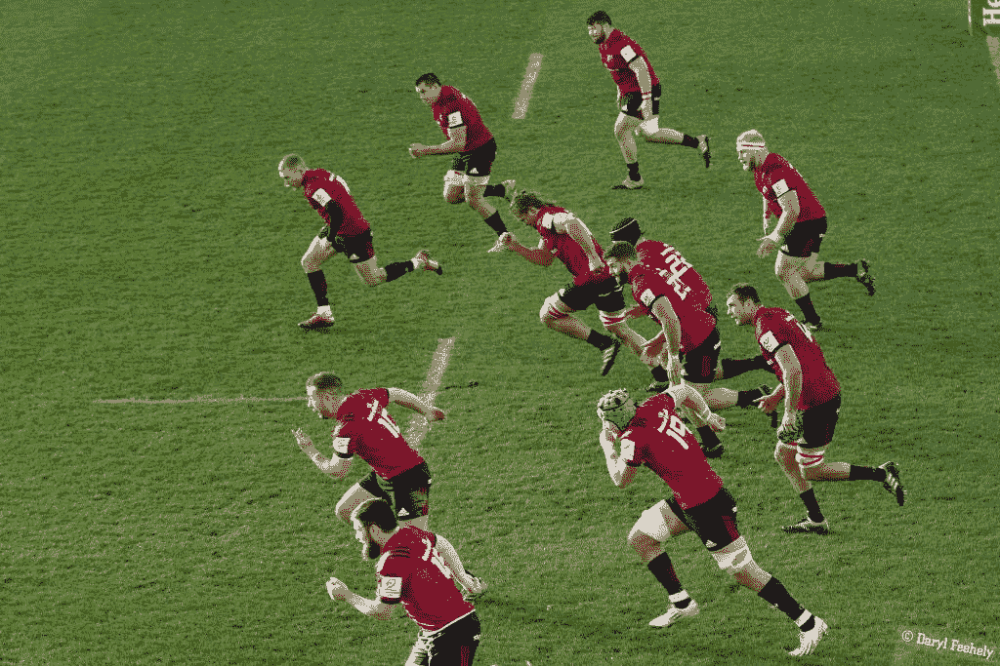
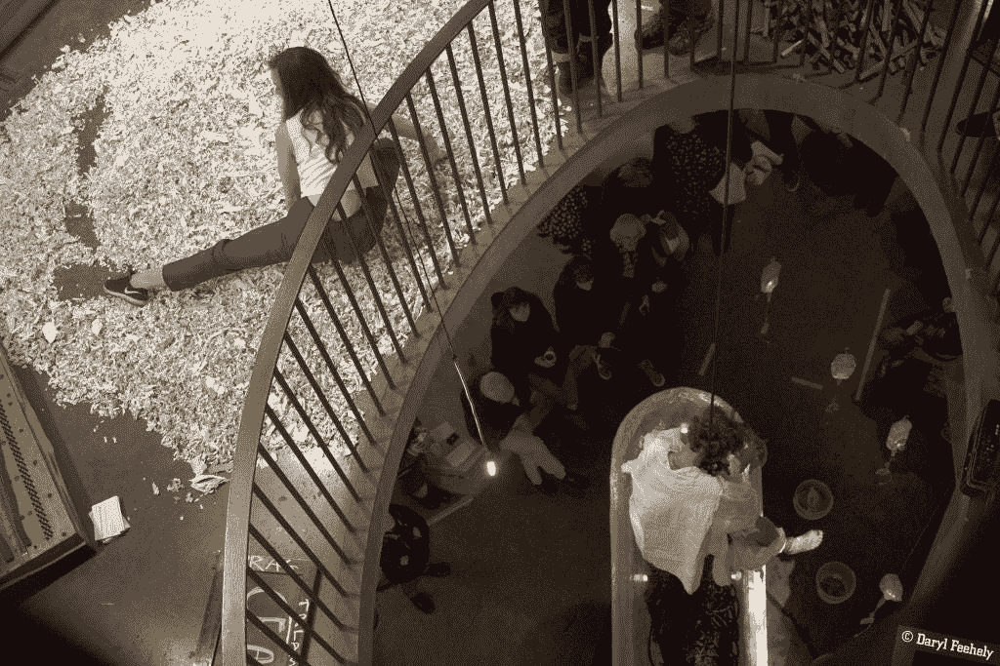
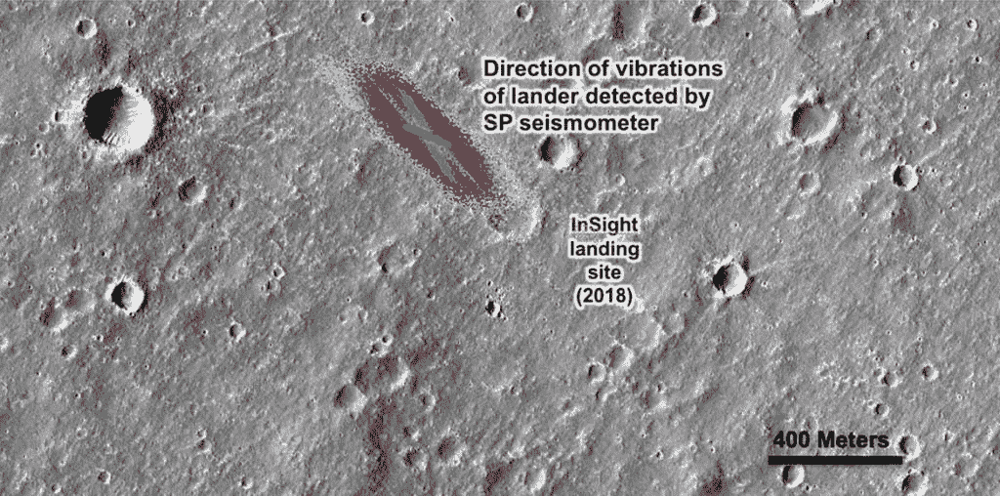
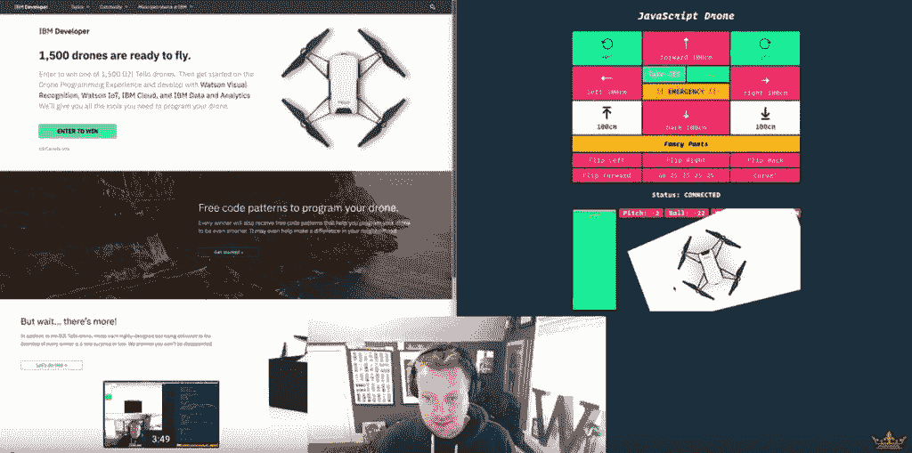
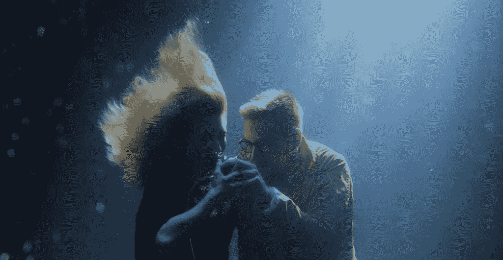
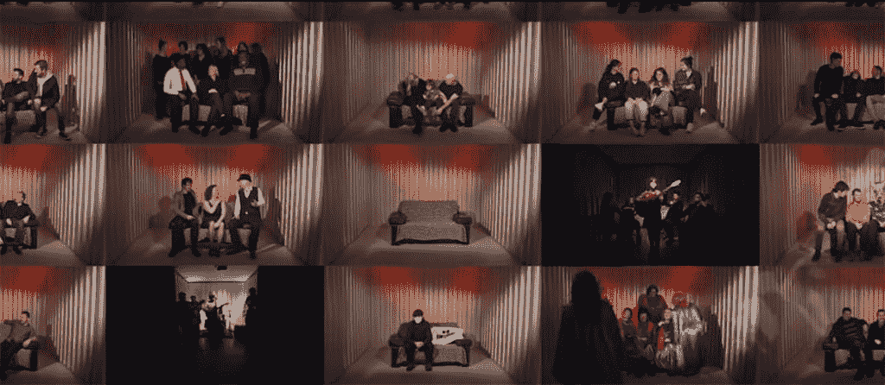

# 本周发现#137

> 原文：<https://medium.datadriveninvestor.com/found-this-week-137-527c2f12b425?source=collection_archive---------32----------------------->

本周照片

Image: A Bed Of Clouds. This photo is available to [licence on EyeEm](https://www.eyeem.com/p/133715353).

一个温和的圣诞礼物主题提醒，我有很多未装裱的、装裱的和帆布的印刷品可以在我的 Picfair 商店上购买。

**本期:**明斯特，柯克科斯，火星风，Javascript 无人机，植物动力，维珍银河太空飞船二号，Softday 的 Uisce Salach，Delush 别让我赢，Loah From Your Heart，From Limerick 和 blind boy&Bernadette Devlin McAliskey！

*原载于 2018 年 12 月 14 日 www.foundthisweek.com**[*。*](https://www.foundthisweek.com/editions/137)*

*[点击此处订阅](https://www.foundthisweek.com/subscribe)每周五在您的收件箱中找到本周:-)*

## *明斯特诉卡斯特雷斯*

**

*本周，我回到利默里克，观看了蒙斯特在托蒙德公园以 30 比 5 击败卡斯特雷斯的比赛。[在这里看看我在东看台拍的几张照片](https://www.facebook.com/media/set/?set=a.603642740054117&type=1&l=adec12c070)。*

## *Kirkos 人体噪音工作*

**

*Image: Laura Sarah Dowdall & Natasha Bourke*

*本周，我有幸拍摄了由 Kirkos Ensemble 在都柏林圣殿酒吧画廊和工作室组织的身体噪音工作活动。多学科之夜结合了艺术、音乐和四层楼的表演艺术，并以滑降浴和康普茶等许多令人惊叹的表演为特色。你可以在这里阅读《音乐杂志》对此事件的评论。你可以在这里查看我拍摄的照片。*

## *火星上的风声*

**

*Image: NASA/JPL-Caltech/University of Arizona/Imperial College London*

*美国宇航局的 InSight 火星着陆器[上的两个振动传感器捕捉到了红色星球](https://www.nasa.gov/press-release/nasa-insight-lander-hears-martian-winds)上由风引起的振动记录，风速为 10 至 15 英里/小时。[这个视频将风的声音提高了两个八度，让它更容易听到](https://www.youtube.com/watch?time_continue=7&v=IkpZXYrOCyg)。*

## *韦斯·博斯用 React & Node.js 驾驶无人机*

**

*Image: YouTube, Wes Bos*

*韦斯·博斯上周发布了两个视频([第一部分](https://www.youtube.com/watch?v=JzFvGf7Ywkk&feature=youtu.be)、[第二部分](https://www.youtube.com/watch?v=ozMwRq-IT2w&feature=youtu.be))，展示了他用 React 和 Node.js 控制 DJI·泰洛无人机的工作！这些视频是为了帮助宣传 IBM 开发者的新[无人机赠品。](https://developer.ibm.com/contest/)*

## *工厂动力*

**

*Image: IIT-Istituto Italiano di Tecnologia*

*位于意大利庞得拉的 IIT 微生物机器人中心的研究人员发现，某些[植物被触摸时会产生电能](https://www.sciencedaily.com/releases/2018/12/181212093308.htm)，每片叶子可以为多达 100 个发光二极管(150 伏)供电。由于接触带电，叶子在其表面聚集电荷，并将电流直接传输到植物的茎干，然后可以收获。研究人员用人造叶子建造了一棵杂交的夹竹桃树，人造叶子接触自然叶子并产生电能。*

## *维珍银河太空船二号*

**

*Image: Twitter, Richard Branson*

*本周，维珍银河的“太空飞船二号”在一次测试飞行中成功抵达太空，最高飞行高度达到地球上空 82.7 公里。理查德·布兰森在推特上发布的视频展示了从驾驶舱看到的地球。*

## *Softday Uisce Salach*

**

*Image: Softday*

*艺术-科学组合 Softday 发起了一个名为 Uisce Salach(脏水)的新社区艺术项目，该项目基于对来自 Liffey 河、其在都柏林市的支流以及都柏林港的生活用水的分析。该项目将利用水取样和创造性技术，协同科学和艺术实践，围绕水资源的可持续性发展新思维和新意义。*

*Softday 将分析所有样本，并使用这些数据构建一个具有基础数据集的地图，以及制作一个独特的声音作品，作为一个大型多媒体装置的一部分，可以由人和计算机播放，并通过网络和社交媒体共享。Uisce Salach(脏水)的世界首演将于 2019 年 11 月在都柏林由爱尔兰室内乐团结合“软日公民科学家合奏团”(一种公共笔记本电脑乐团的形式)进行现场演出。*

## *德卢斯——别让我赢*

**

*Image: YouTube, Delush*

*在本周三个音乐推荐的第一个中，[看看这个来自柏林的爱尔兰艺术家 Delush 的名为不要让我赢](https://www.youtube.com/watch?v=WqhJvRH-qDM)的音乐和视频。敬请期待他 2019 年即将推出的首张专辑。*

## *Loah::保持你的心*

**

*Image: YouTube, Loah*

*本周的第二个推荐，来自 [Loah 的名为 Keep Your Heart 的热门合作曲目，由 God Knows (Rusangano Family)、Bantum、Ben Bix & Dunny (Meltybrains？)](https://www.youtube.com/watch?v=htKdn63IEIE)。*

## *来自利默里克*

**

*Image: YouTube, Limerick Self Storage*

*本周音乐视频排行榜的最后一首是来自利默里克的[，这是对德洛丽丝](https://www.youtube.com/watch?v=OBpWKGjUTSQ)的致敬。Limerick Self Storage 发布了小红莓乐队歌曲《当你被来自 Limerick 的一系列艺术家覆盖时》的谢恩·塞拉诺的精彩视频，以帮助中西部的西蒙社区。*

*视频描述写道:“每周，数十名音乐家将他们的设备搬进搬出利默里克自助仓库的租赁单元，磨练他们的技艺，梦想着有一天像小红莓乐队一样将他们的音乐带到世界各地。2018 年 1 月 15 日，利默里克失去了他们最心爱的女儿。从利默里克自我存储和利默里克艺术家的每一个流派，这是我们的敬意和感谢多洛丝·奥·瑞沃丹和小红莓乐队。这部影片的所有收入将捐给中西部西蒙社区，请现在就捐款。[http://www.midwestsimon.ie/donate/](https://www.youtube.com/redirect?v=OBpWKGjUTSQ&redir_token=T1Kkp9dp64MNUhvYDk7yPMZDncd8MTU0NDg4OTY2N0AxNTQ0ODAzMjY3&event=video_description&q=http%3A%2F%2Fwww.midwestsimon.ie%2Fdonate%2F)*

## *本周播客:盲孩播客——伯纳黛特·德芙琳·麦卡利斯基*

**

*Image: Acast*

*我正在浏览盲孩播客的前几集，本周我听了他对伯纳黛特·德芙琳·麦卡利斯基的现场采访。这一集以一段激动人心的序言开始，在序言中，Blinboy 描述了外出跑步时发生的一件事如何让他直面人生的短暂。这个故事本身就足以带走和思考，但接下来是对伯纳黛特·德芙琳·麦卡利斯基的精彩现场采访。伯纳黛特是民权领袖，在骚乱之前和期间，她在德里和北爱尔兰为天主教权利而战。Blindboy 称她为爱尔兰版的马丁·路德·金。她还在 1969 年至 1974 年间担任过北爱尔兰议会的民选议员。*

*在这个引人入胜的采访中，她讲述了她在美国的旅行，在那里她收到了纽约市的钥匙，随后在 1970 年将它们赠送给黑豹，她亲眼目睹了 1972 年[血腥星期天，当时英国军队在一次反对拘留的和平抗议中枪杀了 13 名平民](https://en.wikipedia.org/wiki/Bloody_Sunday_(1972))， 下议院议长拒绝让她在几天后关于血腥星期日事件的紧急辩论中发言，导致她打了内政大臣雷金纳德·莫尔丁的耳光，因为她在下议院撒谎说英国伞兵是为了自卫才开枪的，以及她在她孩子面前被 UFF 枪击的经历。*

*她分享了她对当前爱尔兰[直接规定](https://en.wikipedia.org/wiki/Direct_Provision)的做法的看法，这种做法类似于对寻求庇护者的拘留或监禁，她还谈到了每个人用脚以非军事化的方式为他们想要的东西游行的权力。采访很鼓舞人心，值得一听。*

*下周见！*

**

*附:如果你喜欢这个发现，请点击下面的拍手图标。
还有，[订阅](https://www.foundthisweek.com/subscribe)，或者告诉朋友，或者两者兼而有之！谢谢:-)*

**原载于 2018 年 12 月 14 日 www.foundthisweek.com**。**

## *关于本周发现的*

*“本周发现”是一个精心策划的博客，里面有关于技术、科学和生活的有趣文章、文章、链接和故事。每周五，每一期都由达里尔·费赫利策划，并重点展示每周发现的酷东西。前 104 版是在[foundthisweek.com](http://foundthisweek.com)创作之前在[媒体](https://medium.com/@dfeehely)上发表的，点击查看[档案。](https://medium.com/@dfeehely)*

## *达里尔·费赫利*

*我是一名网站顾问、签约网站开发人员、技术项目经理和摄影师，来自科克，现居斯旺西。我为我的客户提供战略、规划和技术交付服务，远程和面对面。我还为需要技术提升或创新的公司提供自由职业 CTO 服务。如果你认为我能在你的生意上帮到你，请查看我在[http://darylfeehely.com](http://darylfeehely.com)的详细信息*