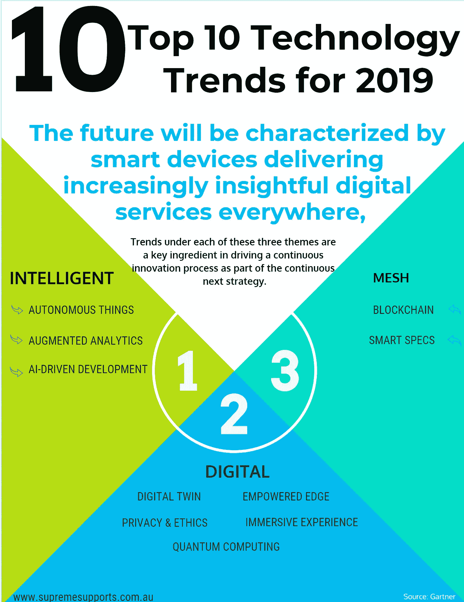

# 主导 2019 年的四(4)种技术趋势

> 原文：<https://medium.datadriveninvestor.com/four-4-technology-trends-that-will-dominate-2019-cecfaed73cce?source=collection_archive---------5----------------------->

2018 年底近了。而现在正是重新收集和总结今年成绩的绝佳时机。但人类一直做的是向前看。因此，现在让我们总结一些肯定会在明年，2019 年占据主导地位的技术。嗯，你猜的是人工智能、混合现实还是区块链？是的，其中一些会，但 2019 年将会有更多。以下是对 Gartner 趋势报告的简要总结，结合了我们专家和未来主义者[网页设计和移动应用程序开发团队对哪种技术将主导下一年的观点。](https://www.supremesupports.com.au/about/)

# 区块链、人工智能(AI)量子计算、增强分析将成为科技企业的新榜样。

正如我们在科幻电影中看到的那样，人工智能机器人是坏男孩。但是一些大公司已经在用它们了，理由很充分。微软和优步正在使用[骑士镜 K5 机器人](https://www.knightscope.com/knightscope-k5/)在他们的停车场和巨大的室外区域巡逻，以预测和防止犯罪。你想知道他们能做些什么来预防或预测犯罪吗？有趣的是，它们可以读取你的车牌，监控任何可疑活动，并将报告反馈给它们的主人。使用人工智能驱动的机器人只是科技世界发展的一个例子。这种实践将为科技公司在未来 6 年大规模实施人工智能技术提供大量机会。

> Gartner 副总裁 David Cearley 表示:**未来的特征将是智能设备在任何地方提供越来越有洞察力的数字服务。**我们称之为智能数字网格。**”**

那么什么是数字化、智能化、网状化呢？

智能人工智能几乎存在于每一项现有技术中，它创造了全新的类别。通过结合数字世界和物理世界，它创造了一个科技世界。将一群人、设备、服务和内容结合在一起，它在硅芯片和人体细胞之间建立了一种剥削性的联系。

> "**这三个主题下的趋势是推动持续创新过程的关键因素，也是持续 next 战略的一部分。“切利说。**

**[* * *作为第一章，今天我将简要介绍 2019 年的 4 大技术趋势。这将是一个 3 章的系列，将包括所有 10 个主导明年的技术趋势。***]**

# 趋势№1:自主的东西。

熟悉特斯拉汽车吗？如果你是，那么你显然知道这辆车可以自主行驶，不需要驾驶员的帮助。所以，科技现在和人类分享它的手。无论是汽车、机器人还是农业，自主的东西都使用人工智能来执行本来应该由人类完成的任务。复杂性可能因设备而异，但所有设备都使用人工智能来与环境进行交互并表现得更加自然。到目前为止，自主事物存在于 5 种类型的设备中，

1.  机器人
2.  嗡嗡声
3.  （家用）电器
4.  车辆
5.  代理人

这五种类型的设备涵盖了我们的四个环境，陆地、空中、海洋和数字。它们都可以用不同的能力、智能和协调来操作。假设，我们可以使用一架由人类智能操作的无人驾驶飞机，它可以自主地用于农业。我们可以用它们来覆盖和监控一个大农场。因此，我们可以预测人工智能驱动的自主事物的能力的可能性。我们可以用人工智能驱动的自主事物来代替任何组织的任何物理对象。但是有一个但是。我们必须知道和理解人工智能是人工的。他们完全不具备人脑在决策、自我学习和上帝赋予的智力方面的能力。

# 趋势 2:增强分析

在现代，数据科学家必须管理、准备、分组和分析大量数据。当管理如此大量的数据时，探索数据的所有角落变得不可能。因此，企业可能会错过数据科学家在假设中找不到的关键见解。

增强分析是一种自动化算法，数据科学家使用它来探索更多假设。增强分析已经将数据科学和机器学习技术转变为新的数据管理水平。我猜测，到 2021 年，超过 50%的数据科学工作将实现自动化。

增强分析所做的是在消除个人偏见时搜索并识别隐藏的模式。但是，企业无意中将偏见插入到算法中，而增强分析可以嵌入到企业或商业应用程序中。到 2021 年，公民数据科学家的人数将是专业数据科学家的五倍。公民数据科学家使用人工智能增强分析工具，这些工具可以自动识别数据集，开发假设并识别数据中的模式。企业将追随公民数据科学家，以此作为一种扩大规模和实现数据科学能力的方式。

Ten technology trends that will dominate 2019

# 趋势№3: AI 驱动的发展

基本上，人工智能驱动的开发侧重于工具和技术，以便将人工智能嵌入到应用程序中。这种趋势围绕两个维度发展，

1.  用于开发人工智能解决方案的工具正在迅速扩展。它正在从针对数据科学家的工具扩展到针对专业人工智能开发人员的工具。数据科学家在人工智能驱动的解决方案中所做的是，他们创建人工智能基础设施、人工智能框架和人工智能平台。专业开发者社区所做的是。他们可以在没有数据科学家参与的情况下，将人工智能的能力注入到应用程序中。因此，企业将更多地搜索和使用面向专业开发人员社区的工具，而不是面向数据科学家的工具。
2.  用于构建人工智能驱动的解决方案的工具也正在被人工智能驱动的能力所使用。这些功能有助于专业开发人员，并自动执行与开发人工智能解决方案相关的任务。增强分析、自动化测试、自动代码生成加速了开发过程，并且它可以被广泛的开发人员用来开发工具。

# 趋势№4:区块链

区块链是一种分布式分类帐，是一个由加密签名的不可撤销的交易记录组成的按时间顺序递增的列表，由网络的所有成员共享和查看。区块链允许公司追踪任何商业交易。通过区块链，公司可以与不受信任的一方合作，而无需与银行等任何集中的一方合作或谈判。它减少了各方之间的冲突，并且不存在信任问题。一切都被自动检查和监控。这已经扩展到政府办公室、医疗保健、供应链和其他企业业务。

内容鸣谢:[https://www.supremesupports.com.au/](https://www.supremesupports.com.au/four-4-technology-trends-will-dominate-2019/)