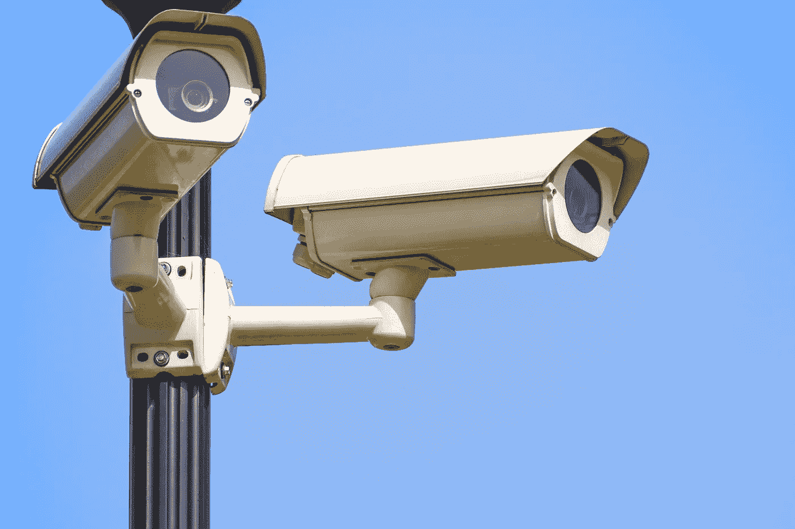

# 大型科技公司和政府合作的四个领域值得关注

> 原文：<https://medium.datadriveninvestor.com/four-areas-to-watch-as-big-tech-and-government-work-together-76aaf4f2cc8d?source=collection_archive---------9----------------------->

# 大型科技公司和政府之间模糊的界限

亚马逊最近一直在新闻中出现，因为它与政府几乎敲定了云合同。亚马逊的云托管服务亚马逊网络服务(Amazon Web Services)一直是该集团的巨大收入来源。相比竞争对手，国防部更倾向于亚马逊网络服务来托管其用于军事任务的数据。亚马逊仅在这份合同上就能赚 100 亿美元。然而，与国防部的合作关系并不是亚马逊与政府关系的程度。

亚马逊还发布了一款名为 [Ring](https://www.amazon.com/gp/product/B072QLXK2T/ref=as_li_tl?ie=UTF8&camp=1789&creative=9325&creativeASIN=B072QLXK2T&linkCode=as2&tag=bunkerbasics-20&linkId=65ce9de2ae3043b49b02dc81f4d49f01) 的产品，这是一款充当私人监控网络的家庭安全系统。环形镜头正在与当地警方共享，以打击犯罪。这些伙伴关系无疑有助于提高政府的效率。也就是说，我们应该不愿意把这么多数据交给一家公司。

 [## 大科技很抱歉！数据驱动的投资者

### 大科技很抱歉。在几十年来很少为任何事情道歉之后，硅谷似乎突然开始道歉了…

www.datadriveninvestor.com](https://www.datadriveninvestor.com/2018/06/17/big-tech-is-sorry/) 

世界各地的大型科技公司正在快速部署尖端产品。随着各国政府继续[争夺世界霸权](https://bunkerbasics.com/rise-of-china-and-fall-of-democracy/)，我们开始看到大型科技公司和政府之间更紧密的联系。谷歌因帮助中国建立审查的搜索引擎而受到抨击。华为实际上是一家国有企业。当这些合作进行的时候会发生什么？我将指出大型科技公司和政府合作的四个领域。

# 监督

亚马逊的环形安全系统只是大型技术支持政府监控的一个例子。在中国，“智能城市”正在成为面部识别技术开发的中心。在北京的一些地区，政府可以追踪人们去哪里，他们在做什么，以及他们做了多长时间。这些监视能力正在帮助中国识别和消灭其境内的反对势力。这是中国想要走向的威权模式。最近的事态发展表明，西方也在增强其监视能力。

彼得·泰尔的数据挖掘公司 Palantir 为美国政府提供监控软件。帕兰蒂尔在阻止中国间谍活动、阻止恐怖分子阴谋得逞以及阻止银行诈骗方面发挥了重要作用。该公司享有与中央情报局、联邦调查局、国防部、国家安全局和其他政府机构的利润丰厚的合同。也就是说，帕兰提尔对我们了如指掌。监视的水平是前所未有的，并且随着技术的进步只会继续增加。Palantir 是如此的成功，以至于现在它的价值达到了 200 亿美元。随着它在政府之外和私营部门内部寻找客户，我们可以预计监控网络的规模将会扩大。

# 军队

一年多前，谷歌员工公开抗议“专家项目”。Project Maven 是谷歌签约为国防部执行的一个人工智能项目。随着时间的推移，人工智能可以用于改善军事无人机打击。谷歌员工担心其人工智能的武器化偏离了谷歌“不作恶”的座右铭。虽然谷歌可能被迫放弃合同，但其他技术公司已经证明愿意与军方接触。上面提到的亚马逊国防部合同显示了从军队中能赚多少钱。微软正在将它的增强现实耳机 HoloLens 放在美国士兵的手中。全息透镜可以帮助军方更好地训练军队。微软也面临着员工的强烈反对，因为 50 多名员工向公司请愿，要求停止开发这项技术。不过，在反对声中，你会发现大型科技公司正在努力加强与政府实体的关系。

# 人工智能

中国希望在 2030 年成为人工智能的世界领导者。加拿大发布国家人工智能战略。中东在人工智能上投入了数十亿。人工智能正被证明是一项大业务，而如今，大业务需要大技术。美国政府也不例外。国防部已经发布了它的人工智能战略来促进美国的安全和繁荣。商业企业合作伙伴关系对实现他们的目标至关重要，因为政府已经承认最好的人工智能人才在私营部门。除了使用人工智能提高军事能力，美国政府还希望使用人工智能来加强人道主义援助的部署。通过使用卫星图像更好地识别受损建筑和卡车，美国可以更快地帮助那些需要帮助的人。除了亚马逊，IBM、甲骨文和 SAP 都在讨好政府，因为政府的人工智能预算被分配。然而，馅饼的大小并不是无限的。大型科技公司和政府的合作变得越来越有竞争力，因为不公平竞争的指控正在法庭上进行诉讼。有这么多钱处于危险之中，我们可能会看到法庭上的戏剧继续下去。

# 电信

电信公司正在竞相开发 5G 技术，因为它将彻底改变数据传输的方式。威瑞森声称，5G 无线通信将比其 4G 前身快 200 倍。中国电信公司华为是少数几家将 5G 电信网络商业化的公司之一。5G 网络有可能成为构建智能城市、人工智能和其他创新技术的基础设施，因此是一个巨大的商机。正如你所料，[美国和中国](https://bunkerbasics.com/us-china-cold-war/)都在竞争成为 5G 领导者。

5G 领导权之争已经演变为国家间的冷战。美国指控华为代表中国政府监视美国公司。特朗普政府因此将华为列入黑名单，实际上禁止美国公司与这家中国电信公司进行交易。随着国家政府战略需要技术进步，大技术和政府将变得密不可分。

# 我们应该如何看待大型科技公司和政府的合作？

让我明确一点:我对大型科技公司和政府合作的恐惧超过了其他任何威胁。随着国家间的竞争被技术进步所推动，我看到一场灾难即将发生。不断增长的军事预算正在推动技术公司争夺合同，即使这些项目侵犯了平民的隐私。更糟糕的是，我不希望美国大型科技公司放慢他们的技术发展。如果他们这样做，中国将构成更大的威胁。因此，我们发现自己陷入了一场可怕的军备竞赛。谁赢得这场比赛并不重要，因为这将是一场得不偿失的胜利。

最初发布于[https://bunkerbasics.com/big-tech-and-government/](https://bunkerbasics.com/big-tech-and-government/)