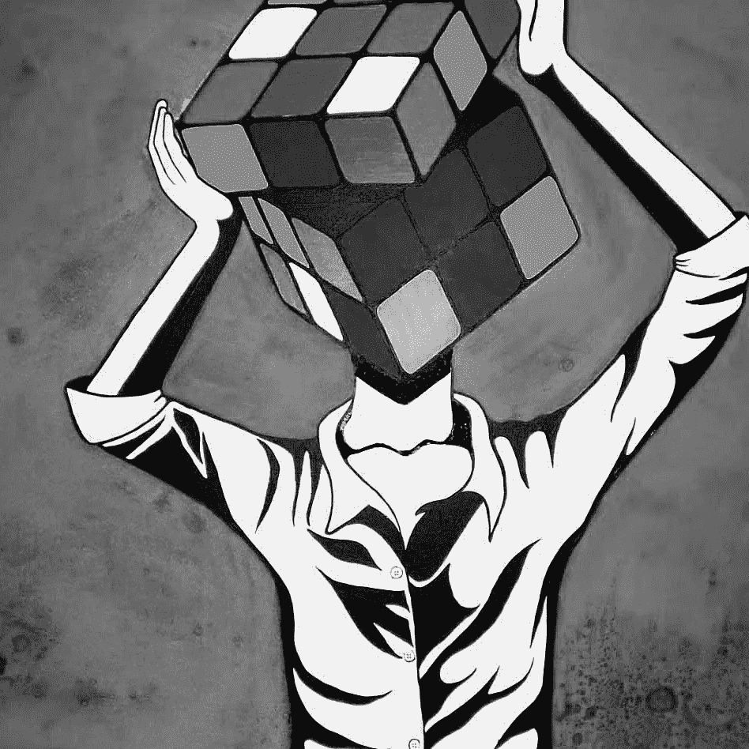

# 三年内换了四份工作——头脑混乱

> 原文：<https://medium.datadriveninvestor.com/four-jobs-in-three-years-a-confused-mind-fffe1389053a?source=collection_archive---------15----------------------->

这一切都要从 9 年前说起…

电影摄影和音乐一直是我的激情所在，来自电影技术员的家庭，我认为我可以轻松地进入电影行业。

"不要再争论了，选择计算机科学而不是商业"，爸爸说。“一旦你完成了第 12 门课程，你将永远有机会选择工程学或视觉传达”，他补充道。

而从这一点，开始了迷茫。

____

从那以后，我更喜欢听我的想法，而不是听我的心。我计算了一下大学考视觉传达的风险，最后还是考了工科。老实说，对我来说，工程学的未来似乎比视觉传达更好。除此之外，还有一些导演、演员拥有工程学位，但仍在电影业工作。

我和爷爷坐在一起，深入讨论了我为什么想继续学习工程而不是视觉传达或电影学院。爷爷，作为电影界最好的技术人员之一，他明白我只是把电影摄影当作一种爱好，而不是一份全职工作。

“你到底想成为什么？软件工程师？音乐家？电影摄影师？决定吧。你显然很困惑，”他说。"如果你想成为一名电影摄影师，为什么你要花 4 年的时间去学习别的东西"，他补充道。

令我震惊的是，我还没有清楚地想到 4 年工程生涯之后的未来，以及他对此的看法有多正确。

我决定再次倾听自己的心声。4 年将给我足够的时间去思考我真正想要的是什么。

学了四年机械工程，随着时间的流逝，我意识到我的兴趣是在国外读一个工程管理的 MBA，然后转到一家制造企业的业务部门。大学的最后一年，我必须做出选择，是去找工作还是去国外攻读 MBA。

_____

“Zoho 或 Infosys”，你打算加入哪个，爸爸问。

我成功地找到了一份双份工作，爸爸想让我加入其中一份。

攻读 MBA 的想法开始从我的脑海中消失，我选择了 Zoho，一家 SaaS 公司，因为薪水不错。

2015 年，我开始了我的职业生涯。我是一名技术支持工程师，在美国值夜班。每个人拿到第一份薪水时都会觉得自己很特别，我也不例外。

我不知道，它只是把我推离了我真正想要的东西。时间飞逝，我在这个组织完成了一年的工作，而日常工作还是老样子。去办公室，登录，澄清使用产品的客户的疑惑。我真的不能说我讨厌我的工作，因为我喜欢与人互动，主要参与与客户建立融洽的关系以获得更好的支持，而不是专注于为他们的问题提供直接的解决方案。

又过了 6 个月，评估很好，利润分成也很可观，但有些事情开始变得不合适了。

我是一个非常担心自己职业前途的人。如果我看到一份简单的报告说，30%-40%的工作将在未来 10 年内被机器人取代，我会抓狂，并开始担心 10 年后我的职业生涯会发生什么。

我意识到钱是必需品，但它不是我想要的全部。

我决定听从自己的心声。

____

3 个月后，我决定辞职。不是因为我厌倦了它或讨厌我的工作，而是因为我想走出我的舒适区。我决定开始并追随我的热情，在一个组织的业务部门工作。对我来说，商业的一面意味着向观众展示产品，谈论数字，大规模销售。

我搬到了新德里，与我以前的一位同事携手创办了一家初创公司。这与航空业有关，我们想创造一个独一无二的订票引擎。事情开始进展顺利，我们成立了一个办公室。网站的工作也在进行中，进展顺利。

10 个月后，我屈服于创业的残酷现实。也许这就是为什么你需要经验和路线图，然后才开始尝试新的东西。

我从德里搬回钦奈，精神上和经济上都一文不名。我加入了一家初创公司，由我在 Zoho 的前同事创建。我在这个产品和我的职业生涯中看到了巨大的潜力，因为它是一家只有 8 名员工的初创公司。我也是这里的一名技术支持工程师，当时又在美国轮班。回到原点，除了我从一年前的收入中拿了一大笔薪水。

我是唯一的技术支持人员，孤独的夜晚拿着一杯又一杯的劣质咖啡(我做的)让我觉得我又一次只听从了自己的想法。紧张的教育管理和与人隔绝开始让我陷入抑郁状态。6 个月后，我决定再次换工作。

我联系了我的一个好朋友，他在 SaaS 的另一家公司 Orangescape 工作，请他推荐我。他把我的简历推到一个销售口，我参加了面试。面试进行得很顺利，最后一轮面试直接面向该组织的首席执行官。

我被邀请成为合作伙伴管理团队的一员，我毫不犹豫地接受了这个选择，因为这是一个既涉及业务又涉及销售的角色。

____

source : pinterest.com

时光飞逝，10 个月过去了，我从周围的人那里学到了很多，也从 CEO 那里学到了知识，这种感觉很棒。这个组织让我有宾至如归的感觉，我从来不知道我会在一个组织呆更长时间，因为我是一个困惑的人，而且我过去也跳槽过。

当然，如果我说我没有想过 10 年后我会是什么样子，那我是在撒谎。

我确实考虑了一下，但是现在，困惑的头脑很高兴，并且发现了一些清晰！