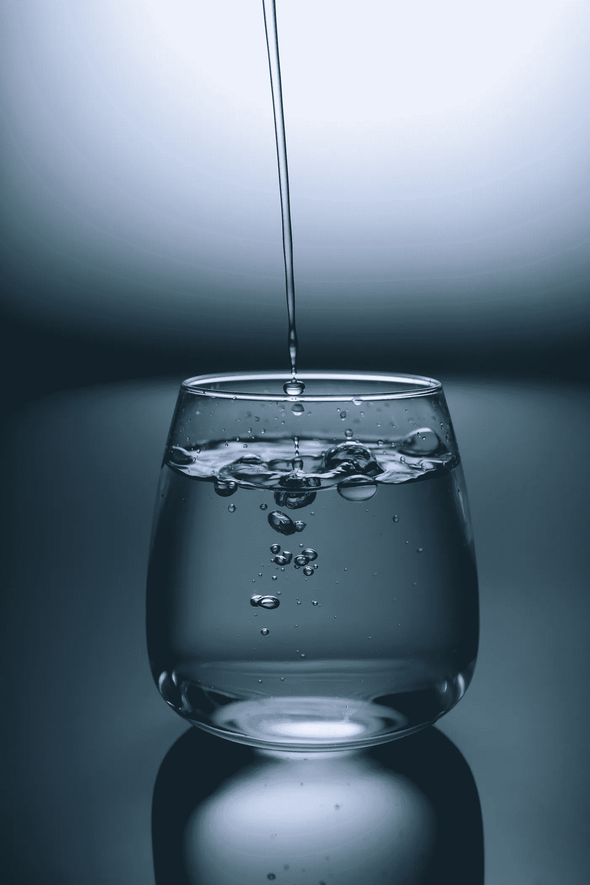

# 健康生活饮水的四大原则

> 原文：<https://medium.datadriveninvestor.com/four-principles-of-drinking-water-for-healthier-life-8d3954c86761?source=collection_archive---------1----------------------->

## 防胜于治

Photo by [Kobu Agency](https://unsplash.com/@kobuagency?utm_source=unsplash&utm_medium=referral&utm_content=creditCopyText) on [Unsplash](https://unsplash.com/s/photos/drinking-water?utm_source=unsplash&utm_medium=referral&utm_content=creditCopyText)

大约一年前，我妻子给我看了 Rajiv Dixit 在 YouTube 上的一个视频(用印地语)——它向我介绍了为了更健康的生活而喝水的原则。

这些原则基于[阿育吠陀](https://en.wikipedia.org/wiki/Ayurveda)，这是一种起源于印度次大陆的医学体系，已有 3000 多年的历史。阿育吠陀(Ayurveda)这个词是由[梵语](https://simple.wikipedia.org/wiki/Sanskrit)语言、*Ayur’*(意为生命)和’*吠陀’*(意为知识)两个词组成的。

这些原则是由瓦格巴塔写的，他被认为是阿育吠陀最有影响力的作家。

去年我一直遵循这些有用的原则，并注意到了明确的好处。由于这些不涉及任何药物和涉及何时和如何喝水，我看不到任何副作用，但我想指出，如果任何人有任何医疗条件，他们应该听从医生的建议。

## 原则一:饭前饭后不要喝水

梵语中 Vagbhata 的原始*佛经*(梵语单词，意思是格言)提到了“*Bhojanante visham vari”——*，意思是饭后喝水等同于喝毒药。

 [## 医疗保健的未来正在被一场大型技术入侵所塑造|数据驱动型投资者

### 过去十年，全球经济的所有部门都经历了大规模的数字颠覆，而卫生部门现在…

www.datadriveninvestor.com](https://www.datadriveninvestor.com/2018/11/02/the-future-of-healthcare-is-being-shaped-by-a-big-tech-invasion/) 

胃是人体消化系统的一部分，食物在这里消化一个半到两个小时。[幽门](https://en.wikipedia.org/wiki/Pylorus)，胃的最低部分，通过[幽门管](https://en.wikipedia.org/wiki/Pyloric_canal)与[十二指肠](https://en.wikipedia.org/wiki/Duodenum)相连，包含无数腺体，分泌包括胃泌素在内的消化酶。这个过程与梵语中所谓的“ *Jatharagni* ”有关——这是胃中为消化过程产生的能量。

> 饭后喝水相当于喝毒药。

饭后一个半小时对于食物的正确消化至关重要。在此期间喝水会抵消(或稀释)能量生成过程，并杀死消化酶的作用。这导致消化不良和消化系统产生气体，然后开始恶性循环。

根据 Vagbhata 的说法，这可能导致 103 种不同类型的疾病，包括胃酸倒流、胃灼热、胃酸过多、溃疡、痔疮和许多其他疾病。消化不良还会导致胆固醇水平升高，进而导致多种其他疾病。

基于这个原则，我们不应该在饭前 40 分钟和饭后一个半小时内喝水。

少量的水可以在吃饭时饮用，不会造成任何伤害，只喝两三口，饭后再喝两三口，只是为了清嗓子。

那么如果我们在这个时期口渴了呢？

根据 Vagbhata 佛经的建议是早餐后喝新鲜果汁，午餐后喝酪乳，晚餐后喝牛奶。这是基于早上、下午和晚上产生的酶的类型，这些酶对果汁、酪乳或牛奶的消化是有用的。

## 原则二:小口喝，不要大口喝

许多人都有一杯接一杯地喝满满一杯水或多杯水的习惯。

瓦格巴塔告诉我们要像喝热牛奶一样慢慢地喝水，不要大口喝水。

口腔中产生的唾液含有舌头上的[唾液腺](https://en.wikipedia.org/wiki/Salivary_gland)和[浆液腺](https://en.wikipedia.org/wiki/Serous_glands)分泌的[消化酶](https://en.wikipedia.org/wiki/Digestive_enzyme)。这是碱性的，一整天都会产生。

在消化系统中，消化酶受到胃中产生的酸的帮助。因此，胃通常更酸。

酸和碱混合变成中性。根据 Vagbhata 的说法，一个中性的胃(pH 值约为 7)可以使身体更健康，寿命更长。

当我们喝水时，唾液混入其中，因此它通过提供更多的碱来对抗胃中的酸，帮助胃保持接近中性。但是当我们大口喝水时，这种优势就被剥夺了，因为只有水会流动，而不会与唾液混合。

你注意到鸟类和动物是如何喝水的吗？他们总是啜饮它。

## 原则三:绝不喝冷水

瓦格巴塔告诉我们要喝温水——温度接近体温的水。

我们都喝凉水，有时甚至掺了冰。

当冷水到达胃部时，它试图将温度降低到接近体温。为此，需要能量，然后由血液提供。为了有足够的能量，流向胃部的血液增加，减少流向更需要它的其他器官的血液。如果这种情况经常发生，会造成不良影响。

经常喝冷水的典型结果是便秘。

## 原则四:早上起床后立即喝温水

当我们睡觉时，唾液产生的过程从未停止。这导致了我们早上醒来时口腔中唾液的积聚。

这种唾液需要被传递到胃里而不被浪费掉。因此，清晨喝温水，小口喝，效果最好。

这甚至应该在刷牙之前就做。

建议儿童和老年人两杯，其他人三杯。

我已经遵循这些原则一年多了，并且在这段时间里发现了很好的收益。

我开始的时候想“嘿，只要遵循一些简单的原则，对于喝水来说，这是最简单的事情。如果这有助于增进健康，为什么不试试呢？”

你怎么想呢?

尝一小口，然后告诉我。

## 综上所述，以下是再次快速参考的四个原则:

1.  *饭前饭后不要喝水*
2.  *小口喝，不要一饮而尽*
3.  *千万不要喝凉水*
4.  *早上起床后马上喝温水*

2019 沙希·库尔卡尼。保留所有权利。

