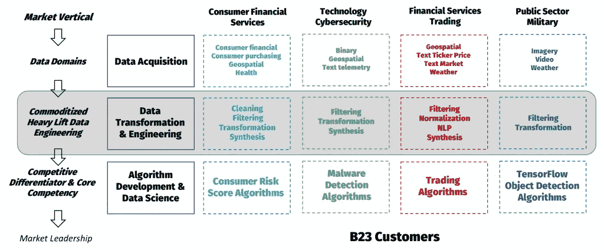

# 数据工程对大多数组织来说是零和游戏的四个原因

> 原文：<https://medium.datadriveninvestor.com/four-reasons-why-data-engineering-is-a-zero-sum-game-for-most-organizations-f53b983f751?source=collection_archive---------11----------------------->

数据工程很难，做到 100%正确只会产生一个结果——机器学习工程师和定量分析师现在可以有效地完成他们的工作。数据分析以及随后对这些见解的执行是企业的竞争优势和核心竞争力，也是企业的心脏和灵魂。数据工程是每个组织都需要执行的*商品化的繁重任务*以获得正确的分析。这就是为什么我们认为数据工程是一个零和游戏。获得正确的数据工程意味着组织只是收支平衡——它只是允许其他员工正确地做他们的工作。出错意味着依赖数据工程的一切和所有人都无法有效运作。外包商品化的重型数据工程是风险最小、最具成本效益的途径，可以实现组织竞争所需的经济和市场领先的竞争优势。

B23 Serving Common Needs Across Markets

***将算法开发置于数据工程之上***

现代组织*应该*优先考虑并投资数据科学的算法开发、定量研究和机器学习方面。这些活动可以成就或摧毁那些利用数据获取竞争优势的公司。使用专门为这些算法格式化的数据，以有意义的方式应用机器学习不是一项简单的任务。为了取得成功，组织应该认识到与从数据中提取洞察力相关联的无差别和差异化活动，并将将数据转换为特定格式(或模式)以支持这些算法所需的活动从这些算法的开发和调整中分离出来。

***赛车手和数据机械师***

我们在过去几年中观察到的一个有趣的社会现象是，我们还没有遇到一个数据工程师没有秘密策划职业转变，成为机器学习工程和/或 quant，并且拥有更多以数据科学为中心的职称。如果机器学习工程师和定量分析师是现代数据驱动业务的赛车手，那么数据工程师就是机械师。组织迫切需要数据机制来服务和维护他们闪亮的新机器学习算法。不可否认，在薪酬、影响力和需求方面，定量分析师、研究人员和机器学习工程师通常被视为处于更高的企业社会结构中。因此，找到并留住有能力的*和*喜欢自己工作的自满的数据工程师通常是组织面临的最大挑战。

***数据工程的挑战与机遇***

大多数组织并不总是 100%正确地进行数据工程。数据工程对于没有做好的组织来说可能是不必要的昂贵。这意味着数据科学、定量研究和应用机器学习计划被搁置和停止，成本不断上升，使情况变得更糟。出现这种情况有几个原因。

1.  ***【DIY】既贵又不及时***

我们经常观察到组织最初试图建立他们自己的数据工程团队。这是一个显而易见的选择，没有事后的认识和经验。通常，这种企业计划通常被称为“数据分析”或“数据科学”组织没有意识到数据工程是一个与数据分析非常不同的学科。关于谁负责数据采集、争论和工程设计，员工的职责通常是模糊的；以及谁负责分析和算法开发。我们经常观察到一些组织“指定”可能知道像 python pandas 这样的笔记本电脑级工具的员工作为他们的首席数据工程师，但当他们意识到他们真正需要在 Apache Spark 这样的基于云的分布式平台上运行的高性能 ETL 代码时，却失败了。祝你好运，确保你的数据在云中是安全的。

雇佣具备适当技能的新员工需要花费太多的时间和金钱——这是假设组织能够在竞争激烈的就业市场上找到他们。即使这些拥有适当技能的员工确实存在于组织中，优秀的员工通常也不会坐在办公桌前无所事事。利用内部资源启动内部数据工程和分析项目通常不会像业务发展速度那样快。

**2*。承包补充资源是一场赌博***

一旦一个组织意识到他们没有能力自己动手，他们就会向外部寻求帮助。一个常见的反应是用外部承包商补充现有员工，或者将工作外包。这种决策通常只会加速组织的失败，并很快导致更多的成本超支。外包外部资源就像掷骰子——你永远不知道在技能和能力方面你最终会得到谁。雇佣员工来补充内部团队增加了合同和沟通方面的挑战，导致更多的延迟、成本和公司与社会的摩擦。

***3。以人为媒介的知识共享的神话***

这个星球上没有一个承包或咨询组织有知识渊博、经验丰富的数据工程人员随时待命。此外，知识共享的概念，即承包商可以分享基于先前工作经验的最佳实践知识，是一个神话。从一开始，承包公司和咨询公司就一直在推销他们的主张，即在不同的计划之间共享以人为媒介的知识。我们知道，技术实施和数据安全方面的最佳实践最好通过软件而不是人来编写。最终，承包组织只是想运送人员到项目，收取他们的费用，并希望没有人抱怨。

***4。公司责任和共担风险***

将数据工程和数据科学外包给承包商时，通常不考虑共同的业务风险。B23 观察到，与那些试图自己动手的客户相比，由第三方承包商执行的活动导致明显的技术错误和安全问题的频率更高。对于承包商来说，要把事情做好没有什么难度。承包商事故使采购业务面临数据泄露和各种安全、治理和法规遵从性问题的巨大风险。他们的工作是一系列的“打勾”，以满足他们的合同义务。可以理解的是，他们的动机经常与签约和采购组织的需求相冲突。

**利用托管服务实现双赢**

在我们的下一篇文章中，我们将展示如何使用 B23 的数据工程管理服务来解决前面描述的挑战并加快业务竞争优势。

*最初发布于*[*www . b23 . io*](http://www.b23.io/four-reasons-why-data-engineering-is-a-zero-sum-game-for-most-organizations/)*。*