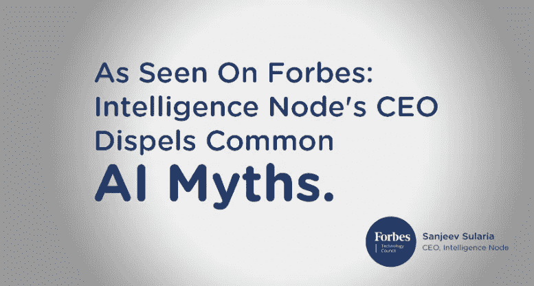

# 零售商需要忘记的关于商业人工智能的四件事

> 原文：<https://medium.datadriveninvestor.com/four-things-retailers-need-to-unlearn-about-ai-for-business-9a549e20d2b?source=collection_archive---------46----------------------->

像任何有潜力改变世界的新技术一样，人工智能激发了一个似乎越来越可信的末日叙事。随着这十年的长足进步，人工智能似乎终于到来了。无论从现在起它采取何种形式，有一件事是肯定的:这是一股能够造成破坏的分裂力量。不管准备好了没有，它都会影响你的行业。

不幸的是，与旅游和金融等行业相比，零售业在采用人工智能方面起步相对缓慢。但随着该行业试图度过危险的低迷时期，并在网购巨头的时代生存下来，越来越多的零售商开始对人工智能驱动的业务的想法产生兴趣。

当我们准备好面对这一未来时，现在似乎是从虚构中梳理事实的时候了。

# 虚构:AI 是一种策略。

不是的。你如何使用它。

随着主要科技公司加大对人工智能应用的投资，每个人都希望用自己的人工智能战略来应对——修改投资组合，收购初创公司等。正是这种神奇的人工智能仙尘的愚蠢管理理念，将突然使他们的商业智能。

人工智能可以做出惊人的事情。然而，在这之前，你的团队需要知道如何充分利用它。虽然你担心它接管人类，但不要低估设计不良的预测系统的影响。投资于一个愿景，然后选择正确的人工智能来执行它，将人为错误和延迟的范围降至最低。

最佳用例是那些具有非常具体、定义明确的挑战的用例—配色、跟踪价格、收集反馈。将更大的业务目标分解成更小的挑战，尤其是那些涉及在不断增长的海量数据中跋涉的挑战。人工智能在这里帮助和增强人类的任务，为解决更大的问题腾出更多的时间和空间。第一步也是最重要的一步是确定这些特定的用例，这些用例将为您的业务带来优势，或者至少使其更容易运行。

# 虚构:AI =聊天机器人。

这些应用远远超出了营销和客户参与。

在零售业，人工智能更多时候被认为仅仅是一种忙碌的工具。这是一种被误导的想法。人工智能的能力每天都在越来越接近影响传统上由人类触觉和直觉驱动的领域——如零售销售和库存规划。人工智能不仅可以改善那些已经依赖机器的过程，还可以帮助消除决策中的情绪和错误。

零售商现在可以获得复杂的洞察力，以根据竞争市场中每秒钟的变化做出商业决策，这些变化可能会被人眼忽略，特别是在全球范围内。这项技术为库存注销和销售损失等检查和纠正开辟了新的途径。人工智能有能力在不久的将来颠覆零售业的运营方式，如果早起的鸟儿有一点点创造力，它们就可以阻碍指数级增长。

# 虚构:人工智能是一项昂贵的长期投资。

投资数据和数据科学家一开始可能会让人望而生畏，尤其是在零售业。高昂的成本和缓慢的回报通常是公司将其视为高风险赌注的原因。这种误解的根源是获得内部团队和基础设施的想法。在投入和投资人工智能垂直领域之前，弄清楚你是否需要自己的人工智能、团队和一切。

科技公司已经在斥巨资吸引人才，挖掘优质数据，开发专有算法。如果你的业务需求不要求拥有人工智能，投资与正确的合作伙伴合作。您可以缩短交付周期、削减成本，同时还拥有相当大的灵活性来升级和修改您的策略。

如果所有权是必要的，人工智能投资可以错开。分阶段推出，随着时间的推移构建神经网络层。这给了你测试、收回和修改的资金和操作上的灵活性。从技术合作伙伴那里获得支持，开发你自己的人工智能，降低 R&D 成本。

# 虚构:人工智能只是另一个泡沫。

它肯定会留在这里。

如果你超越行话，你会发现它是我们数据交易的副产品。无论您的商店是大是小，您和您的客户每秒都会产生数量惊人的数据。即使业务是线下的，竞争也不是。发现、消费和服务渠道几乎不可逆转地走向数字化。在利用信息开展业务方面，不会有太大的变化，那些不搭上这趟列车的人将会错失良机。

现在，它可能感觉像一个泡沫，可能很快就会破裂。这种看法很大程度上源于“人工智能”被用来营销产品，就像前几十年使用的“蜂窝”、“电子”或“无线”一样——这是一种新奇的东西，直到它变得无处不在。这并不意味着我们停止使用手机——远非如此。我们将来也不会减少或放弃使用和生成数据，不管它采用什么命名法或形式？

# 忘却和提高技能

一旦你有了 AI，你还有一半的胜算。基于人工智能提取的分析来开发商业洞察力和战略的组织能力比我们愿意相信的更有限。大多数经理和高管仍然不具备消费人工智能基础设施可以产生的分析的专业知识。缺乏对人工智能和数据本质的了解往往是问题所在。现在是投资再培训的大好时机。让这成为你的人工智能策略。

这篇文章于 2018 年 11 月 5 日首次发表在[Forbes.com](https://www.forbes.com/sites/forbestechcouncil/2018/11/05/four-things-retailers-need-to-unlearn-about-ai-for-business/#132746d11ed4)上，由 Intelligence Node 首席执行官 Sanjeev Sularia 以福布斯技术委员会成员的身份撰写。