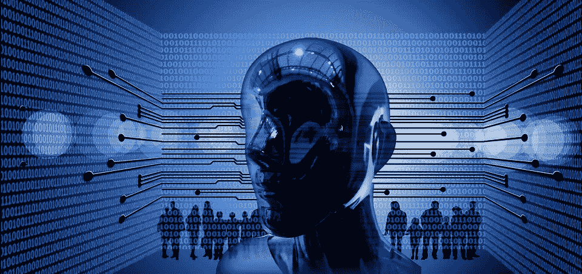

# 人工智能影响工作场所和社会的四种方式

> 原文：<https://medium.datadriveninvestor.com/four-ways-artificial-intelligence-can-impact-the-workplace-and-society-6a5177e58aa8?source=collection_archive---------2----------------------->

人工智能(AI)和机器人会取代你的工作吗？那是每个人都在担心的百万美元问题。无论你是人力资源还是财务顾问，谈论采用人工智能和机器人都会让你问这个问题。[(跟上这里的对话)](https://intelligentautomationbfsi.iqpc.com/downloads?utm_source=4waysarticlemedium&utm_medium=ad&utm_campaign=-external-ad&utm_term=4waysarticlemedium&utm_content=text&mac=medium_aguis&disc=medium_aguis)

机器人和机器学习通过提高生产率改善了许多发达国家的工作场所和经济。人工智能已经迅速进入金融、交通和国防行业。人工智能和机器学习的采用在初创公司中很常见，并且正在被企业慢慢采用。不管你的职位是什么，人工智能几乎不可避免地会进入你的工作场所。[(确保您的团队了解最新的信息架构趋势)](https://intelligentautomationbfsi.iqpc.com/landing/intelligent-automation-for-banking-financial-services-and-insurance-agenda?utm_source=4waysarticlemedium&utm_medium=ad&utm_campaign=-external-ad&utm_term=4waysarticlemedium&utm_content=text&mac=medium_aguis&disc=medium_aguis)

尽管人工智能有可能让人们的生活变得更容易，但人们普遍担心机器人和人工智能会夺走人们的工作。

**卸下负载**

研究人员 Autor、Levy 和 Murnane 强调，技术可以在常规任务中取代人类劳动，无论是体力还是认知，但不能在非常规任务中取代人类劳动。

人工智能正在以各种方式被使用:帮助人力资源部门通过数据库找到理想的候选人，以快速有效地填补职位空缺，甚至通过取消员工必须手动完成的流程来帮助 IT 部门。机器人正被用来完成乏味冗长的任务。企业想要采用这种做法并不奇怪——它节省了时间，反过来也节省了金钱。

根据 ABBYY 进行的一项调查，三分之二的员工表示，他们很乐意将任务交给机器，如记笔记或阅读冗长的文件。

摩根士丹利(Morgan Stanley)率先表示，人工智能接管了员工的繁琐任务，为他们节省了时间和金钱，并延续了客户的快乐。摩根士丹利是第一批用人工智能帮助他们业务各个领域的实验者之一。该公司正在利用它来帮助更好地管理客户的资金，并正在研究算法、数据挖掘和自然语言处理等工具来管理人们的资金，让他们变得更富有。

作为回报，摩根士丹利表示，人工智能正在帮助增加他们的工作和工作量，让他们有更多时间与客户进行长时间、深入的人际交流。有了这个优势，财务顾问就有机会更快地接近他们的客户，并进行彻底的沟通。

**影响社会**

据说机器人很可能不会取代工作，只会减轻现有员工的负担，但根据圣乔治·彼得罗保罗斯关于“人工智能对就业的影响”的研究，情况并非如此。

彼得罗保罗斯指出，由于机器学习，对“中等工作”的需求正在下降，如职员、机器操作员和装配工。然而，管理人员、工程师和卫生专业人员等高学历工作以及店员等低学历服务职业仍在持续增长。这是因为它们是非标准工作，难以被自动化取代。

相比之下，彼得罗保罗斯还指出，技术突破对劳动力市场的影响可能会周而复始。例如，“汽车在日常生活中的引入导致了与马相关的工作岗位的减少，但新的行业出现了，对就业产生了净积极影响。”人工智能和机器学习可能会夺走工作，但也会产生更多工作，对就业和产业繁荣产生积极影响。然而，麦肯锡全球研究所的研究估计，人工智能对社会的破坏速度是工业革命的 10 倍，规模是工业革命的 300 倍。因此，它的影响大约是 3000 倍。

当然，人工智能有办法完全消除人类接触，这与摩根士丹利(Morgan Stanley)发现的做法相反。苹果的 Siri 和亚马逊的 Alexa 等自然语言技术可以回答基于任务的请求，例如“今天纽约的天气如何？”此外，还有一些移动应用程序和功能可以即时帮助你，比如美国银行的虚拟助理 Erica。

尽管众所周知，客户将糟糕的客户服务归咎于机器人和机器学习，但 Genesys 进行的一项新调查显示，在与机器人交谈的消费者中，只有 8.6%的人在他们的客户服务挫折列表中名列前茅。

Rebellion Research 的首席执行官亚历山大·弗莱斯(Alexander Fleiss)表示，机器人“在 99 个常见问题上表现出色:一个账户将花费他们多少钱、佣金、费用、营业额和标准问题类型的问题。”但他会说，机器人的头号问题是与客户的特定一对一需求。[【点击此处访问他的采访】](https://www.youtube.com/watch?v=RTBWpND0zGw&feature=youtu.be&a=)

**与艾合作**

根据 Gartner 的数据，到 2020 年，30%未能有效应用人工智能和机器学习来支持企业业务的数据中心将停止运营和经济可行性。对于任何想留在游戏中的企业来说，人工智能似乎就在眼前，但 SigOpt 的首席执行官斯科特·克拉克认为，机器学习和人类有机会合作。

在接受 techrepublic.com 采访时，克拉克表示，“大多数机器学习工作都是为了改善组织实践和幕后发生的事情”，人类和机器人应该合作，自动化和优化任务。

“人类擅长提出正确的问题，而机器学习擅长吸收大量信息，往往超过一个人一生所能看到的信息，以得出正确的答案。他们一起可以产生巨大的商业影响，但你需要确保你首先问了正确的问题，不要让马车牵着马走，”克拉克说。

**适应人工智能**

当谈到机器人接管人类工作时，克拉克似乎认为恐惧是错误的。仅在 8 月份，雇主就招聘了 151，717 名数据科学家，克拉克认为 IT 专业人士有机会调整他们的技能组合来满足需求。

弗莱斯还认为这也将增加就业机会。

“机器学习将有助于巨大的就业增长……问题是美国能跟上这种就业增长吗？”亚历山大.弗莱斯说。

人工智能可以通过使事情自动化来消除员工手工和乏味工作的压力，允许员工保留他们的工作并应用新的技能。但它也可能发生转折，并证实人们对失业的担忧。人工智能的未来尚不明确，但它肯定会对工作场所和社会产生影响——这种影响是积极的还是消极的，我们将拭目以待。但当谈到人工智能是否或何时会取代人类工作的问题时——这取决于你问谁。

获取更多关于智能自动化的信息:【http://bit.ly/IABFSIMediaCenter 