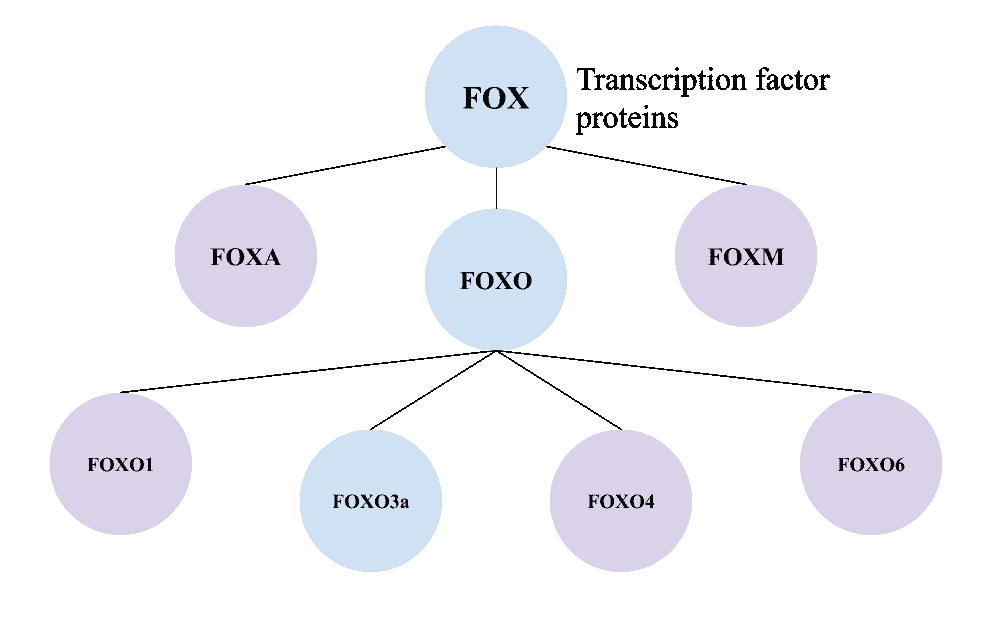
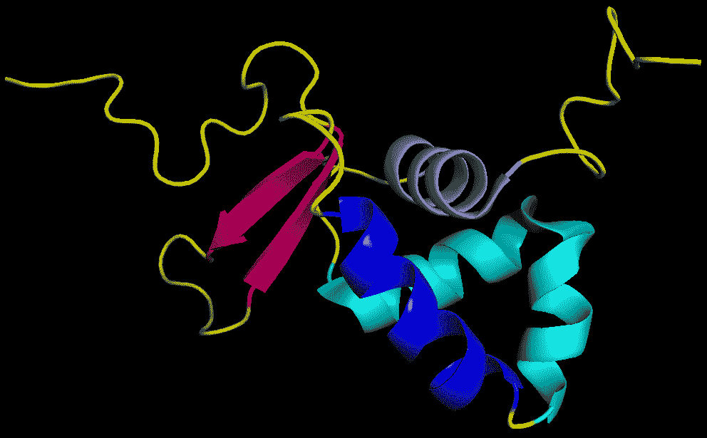

# FOXO3a-阻止癌症的基因？

> 原文：<https://medium.datadriveninvestor.com/foxo3a-the-gene-stopping-your-cancer-453c7ac68c11?source=collection_archive---------16----------------------->

互联网上有一百万种关于癌症的理论。有人说是遗传，有人说是外因。有人说是巧克力阻止的，有人说是巧克力引发的。有人说我们永远无法预测它，有人说他们有技术可以预测。不管是什么理论，我想我们都同意它始于细胞的突变。

## **基因及其家族**

让我们从基因的解释开始。 **FOXO3a 实际上是 FOXO 家族的一部分，FOXO 家族实际上是叉头盒(FOX)蛋白质的一个亚家族**。叉头盒蛋白是按有翼螺旋分类的，我稍后会解释。它们也是**转录因子**蛋白质，这意味着它们有助于参与身体**发育和调节**的各种过程。狐狸家族有很多亚科包括 FOXA，FOXM，当然还有 **FOXO** 。

**FOX 亚家族‘O’(FOXO)**是一种特异参与高等生物的转录因子**。它由四个成员 FOXO1、FOXO3a、FOXO4 和 FOXO6 组成，调节发育过程和能量代谢。**FOXO 功能的降低会导致细胞数量的快速增加和 DNA 损伤的积累**。**

 [## 流氓基因组编辑扭曲 DNA 伦理|数据驱动的投资者

### 基因组编辑是科学的前沿。这在道德上也是有问题的，在许多方面可能是非法的…

www.datadriveninvestor.com](https://www.datadriveninvestor.com/2019/02/18/rogue-genome-editing-twists-dna-ethics/) 

由于 **FOXO3a** 位于染色体 6q21 上，它**通过靶向效应基因**的表达和活性来调节多种细胞过程。FOXO3a 通常也存在于细胞核中，但由于其组成成分，它可以向外传播到细胞质中。如果它与细胞质中的蛋白质结合，它就不能再进入细胞核。

## **什么样子**

上面是我在 [pyMOL](https://pymol.org/2/) 做的 FOXO3a 基因的图片，这是一个基因模拟器。这是基因本身的样子，没有任何绑定。看到那些蓝色的卷曲的、春天般的东西了吗？那些被称为**螺旋，基本上是原子的螺旋链**。它们是将基因归类为“狐狸”类型的原因。最轻的蓝色螺旋被称为**有翼螺旋-转向螺旋**，因为它弯曲，这使它看起来像两个螺旋。现在看看那些亮粉色的箭头。这些被称为**β-折叠** **，由**多肽链构成，而多肽链由**氨基酸**构成。

## **它对你身体的影响**

好了，现在让我们最终进入你点击这个故事的原因；为了找出这个微小的，看似无关紧要的基因是如何帮助阻止癌症的。FOXO3a 通过螺旋与细胞核外的蛋白质结合。**当它与蛋白质结合时，蛋白质的路径和组成被改变，因此它们不能滋养/帮助癌细胞**。这也阻止了更多细胞的突变。一个具体的例子是乳腺癌。FOXO3a 与蛋白质 ER-a 和 ER-β结合，因此蛋白质不能再为导致乳腺癌的细胞提供营养，这意味着细胞死亡，癌症停止发展。肿瘤也是如此，因为 **FOXO3a 基因与蛋白质结合，所以肿瘤不再有营养来源**来帮助其生长。

**FOXO3a 可以作为生物标志物**来确认你患有癌症，因为如果它更明显，那么它就在细胞核外，很可能与一种蛋白质结合。例如，FOXO3a 的过度表达可能意味着你患有霍奇金淋巴瘤(来自白细胞的癌症)。由于它具有这种能力，科学家们一直在研究在化疗药物中使用 **FOXO3a。到目前为止，他们的测试是成功的，但是在临床应用之前，还需要做更多的研究。**

**关键要点**

*   FOXO3a 是转录因子蛋白大家族的一部分
*   FOXO 功能的降低会导致细胞数量的快速增长
*   当 FOXO3a 与蛋白质结合时，它们不再能帮助癌细胞
*   科学家正在研究使用 FOXO3a 作为生物标志物和化疗药物

感谢您阅读我关于 FOXO3a 的文章！希望你学到了很多！如果你有任何问题、意见或建议，请在评论中告诉我。另外，如果你想读更多我的文章，看看这篇关于基因组学基础的文章！