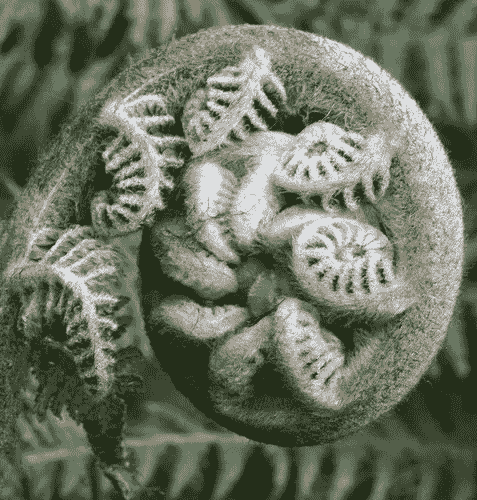
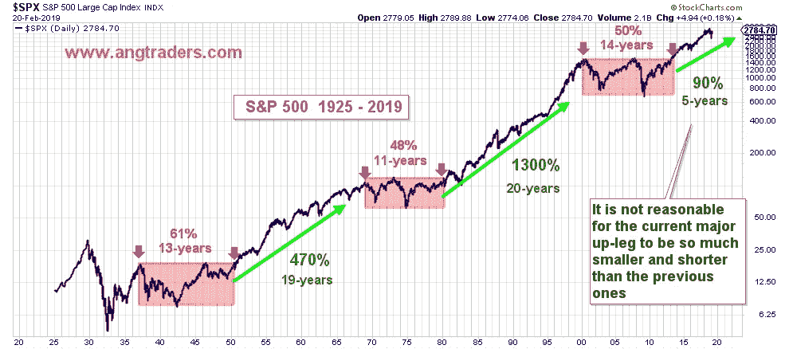
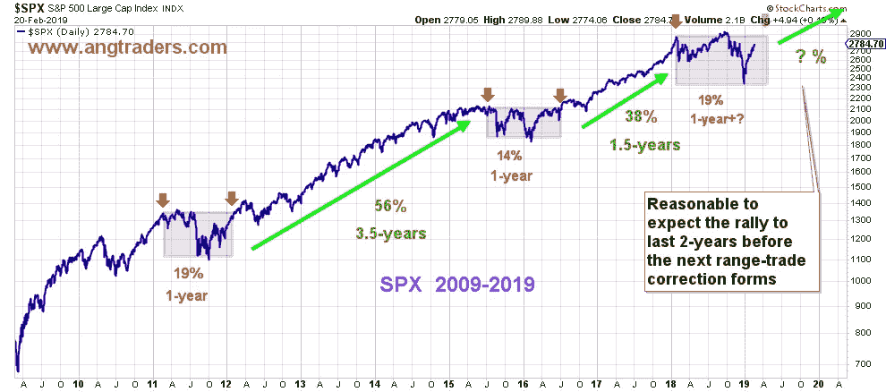

# 股票市场中的分形模式

> 原文：<https://medium.datadriveninvestor.com/fractal-patterns-in-the-stock-market-9912dceda57a?source=collection_archive---------4----------------------->

分形是以不同尺度(物理或时间)重复的模式。它们出现在许多自然系统中，如海岸线、河流和许多植物，包括蕨类植物。

由于股票市场是一个源于自然人类行为的系统，分形也是其价格历史的一部分，而且由于人类行为是重复的，分形应该有助于我们计算未来市场波动的概率。

下图显示了从 1925 年开始的标准普尔 500 (SPX)价格历史。这种超长视角让我们能够洞悉一些大尺度的模式。具体来说，三个时间段，在此期间，SPX 的范围内(粉红色区域)和三个干预期间，产生了重大的价格上涨(绿色箭头)。

对这些模式的*原因*的猜测可以成为一个有趣的讨论，但当涉及到给未来价格运动分配概率时，它们就无关紧要了。我们的假设是，这些模式是不可改变的人类行为的结果，并且这种行为(以及由此产生的价格模式)是重复的。**因此，我们不需要知道*为什么*模式存在，我们只需要知道*它们如何存在(即它们存在的时间)以便进行概率预测。***

区间交易区间的定义是从最初的高点开始，当高点被超越时结束(上图中的红色箭头)。上升段被定义为从超过交易区间的高点开始，到下一个交易区间的高点结束(红色指针之间的绿色箭头)。

注意区间交易的周期长度非常相似；13 年、11 年和 14 年。并且两个完成的主要上行段(当前上行段仍在进行中)同样具有相似的长度；19 年和 20 年。

区间内交易模式的差异(区间最高价和最低价之间的差异)占区间最高价的百分比也非常相似:61%、48%和 50%。然而，上腿模式的情况是非常不同的。虽然两次上涨的持续时间基本相同(19 年、20 年)，但价格上涨的*幅度*非常不同——1950 年至 1969 年上涨了 470%，1980 年至 2000 年上涨了 1300%。

当前的上升期始于 2014 年，仍处于起步阶段:五年来只有 90%的增长。期望这个主要的上升段与另外两个上升段如此不同是不合理的。**有理由预计当前的上升趋势将持续类似的时间，这意味着它应该再持续 14 年。**

这种非常长期的模式，即区间交易期之后是价格大幅上涨期，也可以在较短的时间尺度内发现。下图显示，过去十年形成了与过去 90 年相同的模式，区间交易，随后是明显的上涨——但形成的时间框架要短得多，这将它们定义为分形。

区间交易周期接近相同的长度(一年)并具有相似的方差(14%-19%)，而上行周期的长度和幅度都不同——长度分别为 3.5 年和 1.5 年，幅度分别为 56%和 38%。我们接近突破最近的修正区间交易，并开始下一轮上行，一旦我们超过 2940 点的区间高点，这将开始。过去的上涨行情持续了 1.5 至 3.5 年，**因此，有理由预计下一轮上涨行情一旦开始，将持续大约两年多，然后才会调整到另一个短期区间交易。**

总之，来自非常长期和短期分形模式的证据都支持我们的论点，即当前的牛市仍有数年的生命。

[**昂商**](https://seekingalpha.com/article/4241577-fractals-future-market)

**在**[**www.angtraders.com**](http://www.angtraders.com)**加入我们，复制我们的交易和利润。**