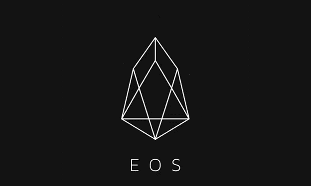

# 免费霍比代币将使 EOS 转让无痛

> 原文：<https://medium.datadriveninvestor.com/free-huobi-tokens-will-make-the-eos-transfer-painless-1255465b54f6?source=collection_archive---------4----------------------->

# 换挡

EOS ICO 即将结束。一旦结束，这可能是有史以来最成功的 ICO。全球共售出 9 亿多枚 EOS 代币，募集资金超过 40 亿美元，这提高了 Telegram ICO 之前设定的最成功 ICO 的标准。在如此成功的 ICO 运行之后，EOS 希望启动他们的增长计划。

他们计划的一部分是从以太坊协议转移到他们自己的主网。在宣布他们的计划后，各种加密资产交易所一直在增加对 EOS mainnet 的支持，包括 Huobi pro。

随着 EOS 转移到 EOS mainnet，EOS 令牌也从 ERC-20 兼容令牌转移到 EOS mainnet。因此，EOS 令牌的所有者必须向 BlockOne 注册他们的令牌，否则他们的令牌最终可能一文不值。新的 EOS 代币将在迁移完成后发行。只有注册的 EOS 令牌会被新令牌替换。

那些在 Huobi pro 中拥有 EOS 令牌的用户将获得优势，因为 Huobi 将为其成员申请新的 EOS 令牌。在转换期间，EOS 代币将无法在其他钱包中交易。但是，如果用户将令牌留在 Huobi pro 上，他们仍然可以进行交易，并获得即将发放的新 EOS 令牌。正如各种在线新闻平台所引用的那样，转变期可能比预期的要长，这可能归因于中国互联网安全公司 360 发现的安全漏洞。

安全研究人员 Yuki Chen 和 Zhiniang Peng 也发现了其他安全问题，他们将自己的发现提交给了负责 EOS 平台 mainnet 迁移的 BlockOne 首席技术官。首席技术官 Daniel Larimer 鼓励区块链社区寻找可能对 mainnet 交换机产生不利影响的独特错误。他甚至为在他们的系统中发现的错误提供了 10，000 美元，以鼓励区块链社区帮助他们找到这些错误。修补已发现的安全问题可能会延长切换所需的总时间。

# 卓越的客户服务

火币 pro 把投资者的利益放在心上。随着所有这些都转移到 EOS mainnet，Huobi 正在对相同的 EOS 令牌进行推广。此次促销活动旨在帮助 EOS 代币持有人在转换完成后，通过将 ERC-20 合规代币与转换后即将发行的新 EOS 代币进行交换，保持代币的价值。Huobi 已经为此次促销活动预留了 20 万美元的 HT 代币。本次促销活动将持续 30 个小时，从 5 月 30 日下午 6 点到 5 月 31 日下午 12 点(GMT +8)，因此如果您想将当前的 EOS 令牌转移到 Huobi pro 并享受存款带来的好处，您需要抓紧时间。

HT 代币将根据促销活动结束时转移到 Huobi pro 的 EOS 代币数量获得奖励。奖励将在促销活动结束后的 5 个工作日内到达。Huobi 正在开展的促销活动使其有别于其他加密资产交易平台，因为它们旨在为用户提供最佳服务，并在此过程中吸引更多用户。

# 为什么将 EOS 令牌迁移到 Huobi 很重要

如前所述，EOS 将从以太坊网络转移到他们自己的主网络，这也意味着他们的令牌将不再符合 ERC-20 标准，并将转移到 EOS 主网络。对于 EOS 令牌所有者来说，这意味着一旦迁移完成，他们的令牌可能变得毫无价值。

在 EOS 转移到 EOS mainnet 后，清算它们变得不可能。在 BlockOne 平台上注册 EOS 令牌是确保您可以在移动完成后申请 EOS 令牌的唯一方法。但是，由于所有 EOS 令牌都需要向 BlockOne 注册，因此这一过程可能会很费力。Huobi 使那些在 Huobi pro 中拥有 EOS 令牌的人在迁移到 mainnet 完成并稳定后申请 EOS 令牌变得更加简单。投资者还将享受其他优势。

以下是投资者将其 EOS 令牌转移到 Huobi 后将获得的一些优势:

*   Huobi 将自动执行从 ERC 20 token 到 EOS mainnet 的交换，而无需投资者在 Huobi 存放其 EOS tokens 后做任何事情。
*   在转换期间，将不会对交易施加任何限制，使用 EOS 令牌的交易操作将像在 Huobi pro 上正常进行的那样进行。但是，我们敦促投资者尽早存款，因为 Huobi 将从 2018 年 5 月 31 日 1800 时(GMT +8)开始不接受存款。提款也将在同一天暂停，但从 0800 时(GMT +8)开始。一旦迁移完成，并且 EOS mainnet 运行稳定，这些服务就会返回。
*   一旦投资者将 EOS 存款存入 Huobi pro，他们也有机会赢得 HT airdrops。10，000 HT 可供竞猜，任何人都可以成为幸运的赢家，只需 EOS 存款即可。

暂停 Huobi 提供的取款和存款服务对于 EOS 平台从以太坊协议到 EOS mainnet 的成功过渡是必要的。

## 让投资者了解情况

鉴于 EOS 生态系统中正在发生的变化以及 Huobi 因这些变化而开展的推广活动，Huobi 将举行直播，以回答用户可能提出的任何有关空投、推广和用原生 EOS 令牌替换 ERC-20 令牌的问题。本次会议将于 2018 年 5 月 31 日下午 12 点(GMT +8)在 Huobi pro YouTube 频道上直播。Huobi 还将向投资者介绍从以太坊到 EOS mainnet 的 EOS 转换会带来什么。前往 [Huobi](https://www.huobi.br.com/en-us/topic/invited/?invite_code=da523) 网站了解更多信息。

如果你觉得这篇文章有用，并且想看我的其他作品，请点击[*这里*](https://medium.com/@salmanmiah) *关注我！*😎