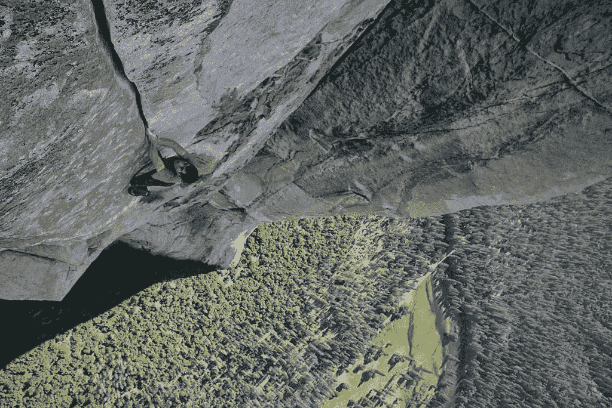
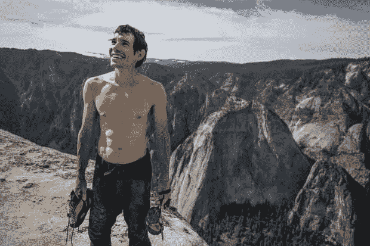

# “自由独唱”和创业企业家:5 个明显的相似之处

> 原文：<https://medium.datadriveninvestor.com/free-solo-and-the-tech-bootstrapper-5-clear-parallels-e45a4a13aece?source=collection_archive---------13----------------------->

2017 年夏天，亚历克斯·洪诺尔德(Alex Honnold)完成了一项不可能的任务，他自由独奏了约塞米蒂令人生畏的 3200 英尺高的埃尔卡皮坦山(El Capitan)。在攀岩世界里，自由单人攀岩可以被认为是一个“子专业”,攀岩者在不使用任何安全设备的情况下攀爬岩壁。

在纪录片“[自由独奏](https://www.nationalgeographic.com/films/free-solo/)”中，电影制作人金国威和伊丽莎白·柴·瓦沙瑞莉跟随 Honnold 对这张可怕的脸的准备和攀登。在没有绳子，没有安全网，没有任何东西可以抓住他的情况下完成了攀登，Honnold 和他的电影工作人员讲述了一个令人难以置信的故事，它在激励，恐吓和困惑方面具有同等的能力。100%是真实的，事实的，原始的，令人震惊的。当我昨晚和妻子一起看《自由独奏》时，我承认我的手心可能比 Honnold 出汗更多，而《纽约时报》在其[头版报道了这一成就](https://www.nytimes.com/2017/06/09/opinion/el-capitan-my-el-capitan.html)，称之为“任何类型的伟大运动壮举之一”。

 [## 在创业之旅中，拥抱学习数据驱动的投资者

### 好像建立一个数百万美元的公司还不够困难，企业家必须额外照顾他们的…

www.datadriveninvestor.com](https://www.datadriveninvestor.com/2018/10/16/on-the-entrepreneurial-trek-embrace-the-learning/) 

底线是这样的壮举似乎几乎是不可能的。在没有安全装备的情况下，爬上将近三分之二英里的高空，这种想法让我感到恶心……我从小就从 30-60 英尺的悬崖上翻下，进入鲍威尔湖的水域，这是我童年时在犹他州南部和亚利桑那州北部边境的度假天堂。当考虑到 Honnold 的巨大成就时，天生的寻求刺激者看起来就像相对懦弱的居家者。

随着《自由的索罗》片尾字幕的滚动，我坐在灵感迸发的寂静中，试图抓住像霍诺德这样的人的本质，计算风险，准备工作。很快(我认为这是合理的)，我的思绪被吸引到了企业家阶层的构成上，我在 M&A 的实践中痴迷地构建了我的职业理解、咨询和服务:技术创业者。当我考虑我刚刚贪婪地消费的内容时，毫不奇怪，我立即看到了自由独唱和自举的本质之间以及 Honnold 和自举企业家之间的大量相似之处。虽然自助者的旅程通常不是“生与死”，但一个人必须接受的成功自助的风险状况可能更接近于自由独舞者，而不是更传统、更有才华的登山运动员。

**绳子和攀岩伙伴(“没有安全网”)**

具有讽刺意味的是，在我观看 Free Solo 的前一天晚上，我和一位潜在客户共进晚餐，我觉得这位客户非常适合我在 M&A 的公司(原因有很多)。在晚餐前和晚餐期间的六个小时的讨论中，我们谈到了创始人考虑交易的一些原因。出现的一个关键主题(逐字逐句)是继续 bootstrap 变得越来越像“没有安全网的攀登”，他们担心这样做会对产品、团队和所有利益相关者的家庭产生负面影响。一位创始人表示，在某种程度上，公司在没有资金合作伙伴的情况下越成功(即他们在“自由单飞”中爬得越高)，风险就越大(他们跌得越远/损失的价值就越多)。正如在自由独奏中一样，这是一个简单但重要的真理。

这种风险状况的预期转变在创业者中并不罕见或不合理。事实上，就像 Honnold 最终考虑“减少”释放 solo 的决定一样，这项工作实际上很可能先于向更理性状态的转变。在我 15 年的职业生涯中，我与数百位(或许数千位)白手起家的创始人交谈过，其中一个最一致的感受(无论是否完全沉浸在现实中)是，创业是一步糟糕的棋，是一次远离死亡的“条件转变”。在自由单人攀岩中，现实与现实的相似之处是惊人的。

几乎在所有情况下，我的客户雇佣我帮助他们交易，并不是因为他们失去了激情，想要退休，或者觉得业务已经达到了“顶峰”。这是因为他们过去的攀登(成功)，他们承担大风险的意愿，以及他们在精神上与相当于“自由独奏”的商业斗争并取得成功的独特能力，使他们达到了不再希望“冒险”的高度……不管他们多么喜欢这样做，也不管这让他们感觉多么“活着”。我受雇帮助他们找到正确的“安全装备”和理想的“攀岩伙伴”，以便他们能够在他们热爱的领域继续攀登——只是在更合适的、风险调整后的状态下。

图片来源:“自由独奏”——国家地理

**激情**

创业者充满激情、才华横溢、坚韧不拔；我有一点偏颇的看法是，他们比任何其他类别的企业家都更善于识别产品与市场的契合度。他们愿意孤注一掷，因为他们完全相信自己的愿景，他们愿意努力达到顶峰，因为他们知道从山顶俯瞰的景色将是壮丽的。他们办理二次抵押贷款，积累信用卡余额，在没有收入的情况下工作多年，因为目的地以及痛苦的旅程是值得的——即使风险在商业世界中是无与伦比的。尽管他们每天都面临着陷阱、疲惫和巨大的风险，这种激情驱动的驱动力是他们走向成功的原因——这与自由独奏者的经历没有太大的不同。

**产品、完美主义和利害关系**

Honnold 从小就是一个完美主义者，他一直认为自由独奏是最接近“完美”的。然而，由于不成功结局的完美结局，赌注的影响基本上是无限的。Honnold 的朋友兼训练伙伴 Tommy Caldwell 也曾无数次攀登过埃尔卡皮坦峰，但从未不带绳索，他是这样说的:

*“想象一下一个奥运金牌级别的成就，如果你拿不到金牌，你就会死……我认为每个把免费独唱作为职业生涯一大部分的人现在都已经死了”*

虽然说对创业者来说风险一样高是不合理的，但相似之处是存在的，特别是当创业者倾向于完美主义以及现实环境几乎需要完美主义的时候。从第一天起，自举企业必须提供非常好的产品，使其销售能够在没有“安全网”的情况下维持运营，并且通常没有资源雇佣“攀爬伙伴”(销售人员)来帮助它做到这一点。该产品必须考虑到成功的市场“上升”,尽管有资金雄厚的竞争对手、市场噪音和在预算紧张的情况下争夺团队成员的危险。在这样的环境中，考虑到所有的约束，执行必须近乎完美。

医生在给他做了核磁共振成像后推测，Honnold 如此擅长自由独奏的一个可能原因是，他的杏仁核(大脑中控制恐惧的部分)不会像大多数人那样对潜在的压力或恐惧输入做出反应。如果顶级创业者的大脑表现出类似的模式，我当然不会感到惊讶。

**团队，有时是孤独的旅程，以及不断变化的风险状况**

一旦 Honnold 完全打算释放 solo El Capitan，他的电影制作人就犹豫了，出于道德考虑，将该项目搁置了几个月:如果被拍摄的压力以某种方式影响了他的攀登怎么办？如果他摔死了，而他们的摄像机捕捉到了悲剧呢？那么 Honnold 的女朋友呢，一个重要但可能分散注意力的新利益相关者？那些与他关系密切的人，包括电影摄制组的主要成员，担心他初露头角的关系会分散他的注意力，也许会改变他的生活，甚至结束他的生命。

正如 Honnold 的一位电影制作人评论的那样，“一段浪漫的关系不可避免地会带走盔甲，他[需要]专注。”然而，尽管存在潜在的担忧，Honnold 还是找到了实现目标所需的专注度。当被问及有了女朋友是否会改变他对冒险的看法时，他回答说，他很感激这种担心，但“绝对没有义务最大化他的生命。”而在 2017 年 6 月 3 日，Honnold 成为独唱 El Capitan 第一人的那一天，他的女朋友不在。她几个小时前就离开了，选择开车回内华达州，因为她知道他需要自己的空间。这种分离的需要，以消除与他亲近的人的危险，在电影的早些时候就出现了，当时他取消了之前在第一部分的攀登尝试。就像自举一样，当独自完成时，自由独奏通常压力会小得多。但这也可能是孤独的，对创业者周围的人的影响可能是深远的。

登山后，当 Honnold 被问及他与团队的互动以及他们是否清楚他们的担忧时，他说:

除了我自己的经历，我最好不要去想任何人的经历。我敢肯定这对其他参与的人来说压力非常大，但对我来说，这是一个足够大的挑战，甚至走到基地并穿上我的鞋。因为你抬头一看，心想，‘那是一堵(原文如此)大墙。’就像，相当疯狂。"

他没有依赖他人，而是在山里找到了自己的平静，他评论说，当他到达长城时，“没有任何不确定性……(他)完全知道整个过程中该做什么”，而且“许多扶手[感觉]像是老朋友”，因为他准备充分，一心一意。

白手起家的企业家也是如此。虽然许多人有家人和其他他们深切关心的人，但在大多数情况下，这些企业家努力保护他们的关系免受旅途压力。因此，他们必须找到一种坚忍的方式，让他们能够在没有安全网的情况下(孤立地)应对日复一日的创业风险。就像自由独奏的危险一样，自举的风险具有累积的重量，随着相关风险的影响影响到其他人的生活和幸福，这种重量只会增加。更多的团队成员需要支持，更多的家庭需要养活，更多的顾客需要服务，随之而来的是更多的责任；此外，正如 Honnold 的 El Capitan ascent 一样，随着海拔(规模)的增加、创始人年龄的增长、子女的成长以及企业变得更有价值，风险也会增加。

简而言之，当美好的生活与良好的商业运作交织在一起时，风险和相关的威胁就会复合，因为会有太多的损失。正是这种动态往往导致创业者开始使用安全装置(资金)，寻找合作伙伴(财务或战略)，并与他人分享经验。这就是我有一份工作的原因，当交易结束时，这份工作既理性(比最初的自举本身理性得多)，同时又非常情绪化……可能非常类似于在没有绳子的情况下到达埃尔卡皮坦山顶，然后意识到风险已经变得太大，无法再次尝试攀登。

Alex Honnold holds all of his climbing gear atop the summit of El Capitan. He just became the first person to climb El Capitan without a rope. (National Geographic/Jimmy Chin)

甚至 Honnold 也承认，随着更多的生命与他相交，他的观点有合理的机会改变，他说

“我的意思是，我们走着瞧，走着瞧。也许如果有一天我们有一个家庭什么的，也许我会完全不同地评价它。也许我再也找不到另一个让我充满激情的目标了。也许我再也不会独奏任何有意义的东西了。我们走着瞧。

**心态**

直到“有一天”到来，当生活、风险和其他优先事项交叉在一起，使得 Honnold 和其他自由单人登山者寻找一条风险更小的禅之路，他们继续创新，推动边界。就像自由独奏家一样，自举者也在继续，制造市场领先的产品，雇佣员工，并在面对大多数人永远不会知道的风险和恐惧时以类似的独创性执行。这将是真的，当独角兽和大量资助的企业在技术上执行，但感觉不到自由，美丽，和企业家的自由独奏的完美:自举。

关于他的特殊才能，Honnold 说“当然有比我更好的技术攀登者。但如果说我有某种特殊的天赋，那也是精神上的——在别人可能会抓狂的情况下保持镇定的能力。”我认为自己非常幸运，非常感激能与那些每天都可以很容易地谈论他们如何建立自己的企业的人一起工作。

注意:在我的下一篇文章中，我将回到我的关于资产购买协议的系列文章或者关于 T2 在并购中的可信度的系列文章

最后，我喜欢与志同道合的金融人士、企业家和其他人交流。如果你愿意，请随时在 [LinkedIn](https://www.linkedin.com/in/firmage/) 和/或 [Twitter](https://twitter.com/mfirmage) 上与我联系。

*原载于 2019 年 3 月 7 日*[*agilitygrowth.com*](http://agilitygrowth.com/free-solo-and-the-tech-bootstrapper-5-clear-parallels-part-i/)*。*