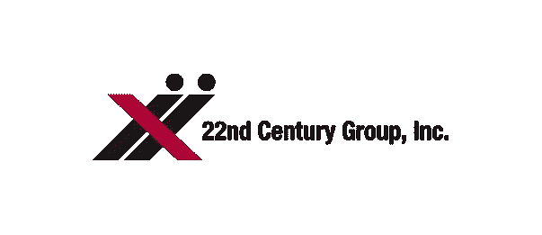

# 选择、自由意志和尼古丁成瘾

> 原文：<https://medium.datadriveninvestor.com/free-will-and-nicotine-addiction-8ba154b43924?source=collection_archive---------6----------------------->

许多成年人对自己在个人生活中做出的关于健康、财务和道德的正确选择感到非常自豪。他们相信决策的“过程”是合理的，而决策的“能力”是不言而喻的。事实上，存在着基于这些信念的完整的经济理论和政治意识形态。新古典经济学把理性代理人在完全信息下最大化效用作为公理。民主的原则是，人们最适合为自己的生活单独做出决定，为自己的社会和民族国家集体做出决定。

然而，选择和自由意志真的存在于许多实际情况中吗？

 [## 医疗保健的未来正在被一场大型技术入侵所塑造|数据驱动型投资者

### 过去十年，全球经济的所有部门都经历了大规模的数字颠覆，而卫生部门现在…

www.datadriveninvestor.com](https://www.datadriveninvestor.com/2018/11/02/the-future-of-healthcare-is-being-shaped-by-a-big-tech-invasion/) 

我将在这里考虑选择和自由意志的一些方面，关于成瘾，特别是尼古丁和吸烟。考虑更广泛的背景，如物理世界中的决定论，从量子力学水平或从思想或大脑中产生的意识中的自由意志，超出了本文的范围，所以我将把它限制在选择和对成瘾物质的自由。

Photo by [Louie Castro-Garcia](https://unsplash.com/@lofiloup?utm_source=medium&utm_medium=referral) on [Unsplash](https://unsplash.com?utm_source=medium&utm_medium=referral)

# 上瘾是一种疾病

最近，当我走出我在曼哈顿中城的办公室时，我差点被两个晕过去的男人绊倒，他们周围有大约 4 到 6 根针，其中一个人的手臂上有几股干涸的血液。走到离最近的地铁站只有几个街区的地方，我看到到处都有几十个人昏倒了。我过去对此感到震惊，但现在知道这些人病得如此严重，尤其是纽约市和整个社会没有或不能采取行动来帮助他们，这似乎很平常，并引发了一种轻微的悲伤。

我们把有明显身体伤害的人，比如断腿，作为一个简单的机械和非道德问题来对待，就像汽车轮胎漏气可以通过更换轮胎来解决一样。那些患有隐形或心理创伤(如 PTSD 或抑郁症)的人可能会发现更难获得适当的治疗，但当他们获得治疗时，这些情况被视为疾病而不是耻辱，至少相对于历史而言。相比之下，那些对药物上瘾的人可能会因购买和使用这些药物而被视为罪犯，但我们的法律制度在这方面正变得更加开明。

更隐蔽、更有害的情况是，一种疾病不被认为是一种疾病，而是被视为一种道德或性格上的失败，比如对尼古丁等更温和但非常强效的物质上瘾。如果我们认为尼古丁上瘾是一种疾病，那么在个人层面上，我们对选择和自由意志的看法以及在社会层面上的法规和法律会有什么样的影响？

## 生病时的决定

每个人都知道，当我们生病时，我们的决策能力充其量是次优的，甚至是危险的，这取决于疾病的严重程度和决策的背景。这是非常明显的，因为我们可能内心感觉完全不同，我们可能外表看起来非常不同。然而，如果我们因上瘾而生病，这可能不会在内心明显感受到，也不会在外表上看得见。

我认为，法规和法律必须对阻碍自由选择和良好决策的成瘾疾病做出解释。

# 政治意识形态与尼古丁管制

自由意志主义和其他广泛的意识形态相信个人的尊严高于集体的意志，它们含蓄地认为人类最适合做出理性的选择来最大化他们的效用，政府的作用应该尽可能小。我个人最认同自由意志主义和最小政府主义。

但是政府应该在多大程度上介入以保护人们免受自身伤害呢？如果人们是理性的代理人，在没有疾病或其他抑制他们理性和决策的情况下做出理性的选择，我相信政府应该完全不干涉私人事务。

然而，就尼古丁而言，情况就完全不是这样了。对尼古丁上瘾的人会采取行动，通常是通过吸烟，损害他们的健康和经济。

## 尼古丁和自由意志

吸烟对心脏、肺和人体其他部分的极端负面健康益处在别处有记载，所以我在这里不再赘述。我想把重点放在尼古丁的成瘾性以及它对选择和自由意志的意义上。

在这些来自疾病控制中心的 2015 年统计数据中:[戒烟](https://www.cdc.gov/tobacco/data_statistics/fact_sheets/cessation/quitting/index.htm)，一个令人清醒的统计数据是，近 70%的成年人(68%)想要戒烟。根据《英国医学杂志》2016 年的这篇文章，当人们试图戒烟时，可能需要大约 30 次尝试:

*   [在一个吸烟者纵向队列中估计成功戒烟的尝试次数](https://bmjopen.bmj.com/content/6/6/e011045)

显然，尼古丁和它引起的吸烟，至少在大多数情况下，不仅仅是一个“选择”的问题，因为成瘾物质在大脑物理过程的水平上影响生物有机体，就像任何其他物质一样。

## 尼古丁与社会经济地位

对于那些受影响的人来说，正是穷人不成比例地承受着气候变化的影响。例如，在 CDC 的网页上:[烟草使用的负担](https://www.cdc.gov/tobacco/campaign/tips/resources/data/cigarette-smoking-in-united-states.html)，有大量的统计数据显示，那些受教育程度低、收入低的人受到的伤害更大。除了有害的健康影响之外，吸烟对那些最负担不起的人来说，是对非常有限的财政资源的经常性消耗。

## 对更广泛社会的影响

尼古丁上瘾的患者不仅承受着健康负担并承担着更大的健康风险，而且他们往往处于社会经济阶梯的较低阶层。他们的健康负担和相关费用不仅影响到他们，也影响到我们其他人的公共医疗费用。至于生命终结时保险费的具体精算成本，我记得有研究表明，吸烟者在接近生命终结时的成本实际上更低，因为吸烟者在死亡时实际上死得更快、更便宜，但是，这种推理没有考虑到持续的不可量化的痛苦和终身医疗保健的慢性成本，如果他们没有处于急性临终状态，如肺气肿、心脏病和癌症的成本。

当然，这不包括生活质量。事实上，当你甚至无法呼吸，或者你的部分时间沉溺于某种嗜好时，对生命、自由和幸福的追求就会受到严重限制。

# 真正的选择和自由意志

那些认为自己是右倾、保守和/或自由主义者的人，以及在支持大型烟草公司方面有经济利益的受薪游说者和投资者给出的主要论点是，吸烟是个人的选择，政府无权对其进行管制。

**这些来自选择自由的争论是不相关的，因为尼古丁剥夺了选择自由。**

如果人们不再对尼古丁上瘾，并有能力在每次尝试吸烟的基础上决定他们是否想吸烟，这实际上是一种选择和自由意志。让我们不要被政治意识形态蒙蔽或迷惑，不要相信那些营销、宣传和重新构建问题的人，他们混淆了什么是选择自由。那些对尼古丁上瘾的人是病态的，缺乏做出选择的能力。

# FDA 法规

## 2017 年 7 月 28 日 FDA 公告

到目前为止，我一直在从理论、伦理、意识形态的角度考虑尼古丁和尼古丁监管。现在我将提出一些实用的方法来解决尼古丁是如何通过低尼古丁香烟抑制选择和自由意志的。

2018 年 7 月 28 日，FDA 发布了烟草和尼古丁监管的全面计划。

*   [FDA 宣布全面监管计划，改变烟草相关疾病、死亡的轨迹](https://www.fda.gov/news-events/press-announcements/fda-announces-comprehensive-regulatory-plan-shift-trajectory-tobacco-related-disease-death)

这一消息发布的同时，大型烟草公司的市值瞬间蒸发了数十亿美元，如奥驰亚集团、英国烟草、吉利亚和菲利普莫里斯等。

*   [FDA 宣布新的尼古丁监管计划后，烟草股下跌](https://www.nasdaq.com/article/tobacco-stocks-fall-after-fda-announces-new-nicotine-regulation-plan-cm823581)

## FDA 指令

预计美国食品和药物管理局将在 2020 年至 2022 年之间的某个时候强制要求香烟具有最低限度的成瘾性，即每克烟草中的尼古丁含量约为 0.4 毫克。相比之下，目前的香烟每克烟草含有 15.5 毫克尼古丁。

实现这一要求的途径将需要非常有力的科学证据和市场原理，因为就大型烟草公司的收入和市值而言，该法规涉及数千亿美元的巨额资金。此外，有一些非常强大和根深蒂固的政治利益，由于名副其实的军队说客从大烟草已转移到美国政府的所有部分。列举所有的科学、市场格局和监管的方方面面远远超出了这篇文章的范围，所以我在这里只提几个有代表性的。

## 科学

有充分的科学证据表明，低尼古丁香烟确实会导致戒烟。例如，由著名烟草和尼古丁研究员 Dorothy K. Hatsukami 博士领导的一项重要研究，通过测量吸烟暴露的生物标志物，寻找减少尼古丁的最佳时间方法。

*   [香烟尼古丁含量立即降低与逐渐降低对烟雾暴露生物标志物的影响:一项随机临床试验](https://jamanetwork.com/journals/jama/fullarticle/2698925)

这是一项双盲随机研究，由 1，250 名研究参与者组成，他们在 10 个不同的美国地点进行为期 20 周的干预之前，基线吸烟超过 2 周，分为以下几组:

1.  立即减少到每克烟草香烟含 0.4 毫克尼古丁；
2.  通过 5 次每月剂量变化，尼古丁从每克烟草香烟 15.5 毫克逐渐减少到 0.4 毫克
3.  保持每克烟草香烟含 15.5 毫克尼古丁。

他们发现的结论非常清楚。

> 结论:在吸烟者中，与逐渐减少或控制组相比，立即减少香烟中的尼古丁导致随着时间推移烟雾暴露的生物标志物显著更大的减少，而逐渐减少和控制组之间没有显著差异。

这只是许多关于低尼古丁香烟好处的研究中的一项，每项研究都考虑了一个细微的方面，这对降低尼古丁的广泛制度有影响。每一项特定的研究都不是不可辩驳的证据，也不是强制要求低尼古丁香烟的唯一理由，但是它们为低尼古丁香烟的好处和效用增加了越来越多的证据。

## 拟定规则的通知(NPRM)

在美国食品和药物管理局的命令生效之前，有一个公众意见的初步步骤。其中最重要的是

*   [拟制定规则通知](https://www.fda.gov/regulatory-information/fda-rules-and-regulations)

有计划在 2019 年底或 2020 年初的某个时候推出低尼古丁 NPRM，尽管随着选举周期的到来，它可能会推迟。

## 改良风险烟草产品(MRTP)

向后工作一步直到 NPRM 是下面的应用。

*   [转基因风险烟草产品](https://www.fda.gov/tobacco-products/advertising-and-promotion/modified-risk-tobacco-products)

这个 MRTP 允许一家公司销售烟草，同时宣传它有益于人们的健康。MRTP 的申请将为 NPRM 提供正当理由，因为提交的科学和同行评审出版物将确定技术可行性，这是 FDA 发布 NPRM 所要求的。

## 22 世纪集团的 MRTP

22 世纪集团目前有一个 MRTP，这是世界上唯一一家有能力种植低尼古丁烟草的公司，它拥有这方面的专利。

*   [22 世纪集团公司改良风险烟草产品(MRTP)申请](https://www.fda.gov/tobacco-products/advertising-and-promotion/modified-risk-tobacco-products)

目前，公众可以在 Regulations.gov 对 MRTP 的申请发表评论:

*   [22 世纪集团有限公司提交的
    VLN 国王和 VLN 薄荷醇国王的改良风险烟草产品申请
    燃烧后的过滤卷烟](https://www.regulations.gov/document?D=FDA-2019-N-0994-0001)

如果 22 世纪集团的 MRTP 获得批准，这将是一个关键的工具，美国食品和药物管理局发布的 NPRM 导致美国食品和药物管理局的授权。

# 个人利益

既然我已经概述了尼古丁成瘾和烟草使用的哲学、意识形态、监管和商业方面，我现在想转向个人方面。我父亲吸烟超过 35 年，在他患上肺气肿和慢性阻塞性肺病后戒烟。

整个童年，我常常醒着躺在床上听他咳嗽。恳求他停下来没有用。在许多场合，他尝试尼古丁口香糖或贴片，结果证明有效无用。我感到幸运的是，尽管抽了这么多烟，他还活着，但他不幸地生活在持续的身体痛苦中。他很幸运还活着，我也比其他许多家人死于烟草和吸烟的人幸运得多。

我目前投资了 22 世纪集团的股票。如果可以的话，我会打破我的自由市场自由意志主义观点，通过法令让这些大烟草公司破产。第二个最好的办法是起诉这些公司的危险产品，就像孟山都公司因农达产品的致癌性而被判有罪一样。我认为香烟和大烟草比农达更有害，因为农达不会上瘾。

第三个最好也是最实际的结果是美国食品和药物管理局要求将尼古丁降低到每克烟草 0.4 毫克以下。