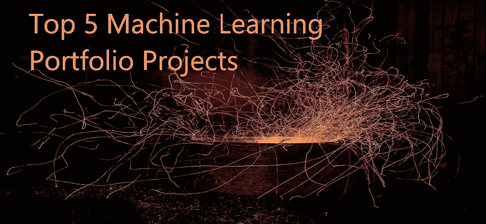
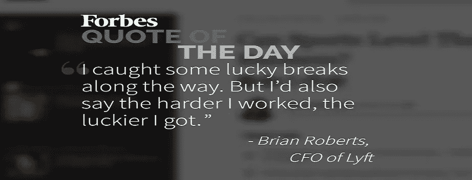
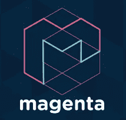
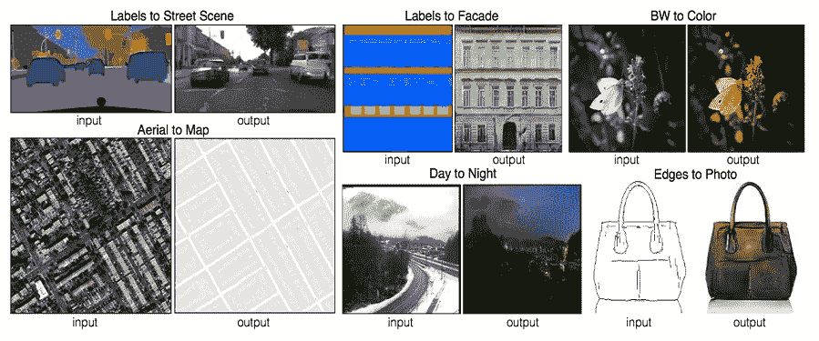
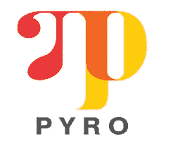
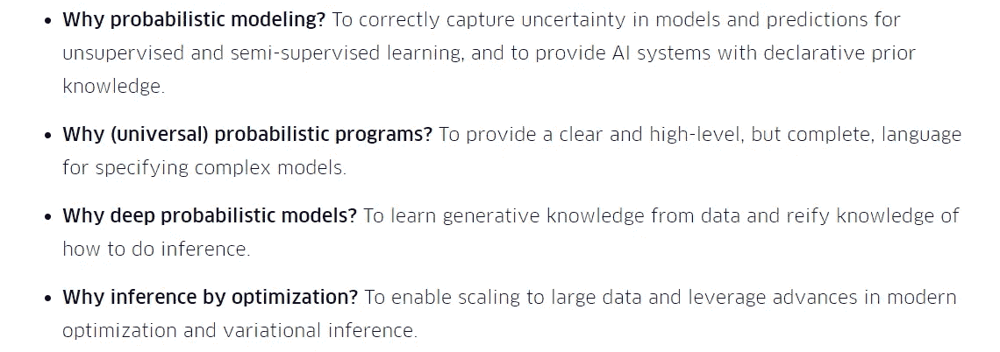
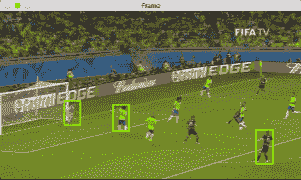

# 2019–20 年的机器学习组合项目:

> 原文：<https://medium.datadriveninvestor.com/frequently-we-get-to-hear-first-impression-is-the-last-impression-and-arguably-this-statement-f0a66bb37dd0?source=collection_archive---------0----------------------->

我们经常听到“第一个*印象是最后一个印象*”，可以说这句话足以证明在申请 ***数据科学*** 或准确地说 ***机器学习*** 领域的职位时，创建一个令人瞠目结舌的候选人组合是多么内在。预测分析领域的技术已经取得了前所未有的进步(谁预计到了[谷歌今年将通过*Swish*超越 *ReLU* ，然后在一年内发布 8 个 *TensorFlow* 版本进步)。一方面，对潜在候选人的需求一直在飙升，预计到 2020 年将增长三倍，另一方面，数字时代将人才库的规模扩大了大约 650%。](https://medium.com/@neuralnets/swish-activation-function-by-google-53e1ea86f820)

根据目前的趋势，供需平衡已经失衡，在未来 2-3 年内，竞争将变得更加激烈。因此，要么我们磨磨蹭蹭，等待数据科学市场在几年后作为另一个泡沫破裂，要么将我们的*愿景*塑造成*行动*来与那里的最佳竞争。要么抄袭招聘人员在招聘广告中要求的工作经验年限，要么利用这个领域还没有候选人资格的行业基准这一事实。如果你是这个领域的初学者(不考虑其他行业的经验)，并且缺乏这些年的经验，现在是时候掩盖这些陷阱了。

[Image Courtesy](https://www.forbes.com/forbes/welcome/)

任何*预测分析*或*研究*领域的候选人组合都**不如他们的教育学位(尽管这肯定是一个很大的奖励)或所附的证书**好，但**不如为展示生产就绪技能而开展的个人/专业项目好。一个 *Iris* 或 *Titanic* 数据集非常适合在学习这些基本概念时进行争论，但当涉及到*简历*时，我们的节目需要是一流的。下面我精选了五个惊人的项目，它们能让我们脱颖而出，打开面试的大门。是时候在我们自己的编辑器中征服这些美丽的东西了(没有投资 NVIDIA GPUs 只是为了在那里冷却，所以让我们开始行动吧),并在我们的简历中展示它们。让我们来看看这个列表:**

1.  **机器智能的音乐艺术生成:**

我们的主要目标包括创作歌曲、图像、图画和其他类似的材料。 [***谷歌大脑团队***](https://ai.google/research/teams/brain) 和其他几个贡献者已经为此给了我们一个现成的包/库——[Magenta](https://magenta.tensorflow.org/)。 *Python* 的安装说明在[这里](https://pypi.org/project/magenta/)可以得到，源代码在[这里](https://github.com/tensorflow/magenta?utm_source=mybridge&utm_medium=blog&utm_campaign=read_more)可以得到。是时候给专业词曲作者和音乐家一场艰苦的战斗了，因为我们的算法在创作音乐方面会更好。如果你需要一些这方面的灵感，那么看看 [*brain.fm*](https://www1.brain.fm/) (这些才华横溢的家伙们创作了一整部电影，所以我们不能至少创作一首歌吗，伙计们？).这里有一篇非常好的文章供你参考，文章中有来自斯坦福研究团队的几十个用例。经过这一切，如果我们仍然没有在编辑器中导入张量流，那么我们需要重新评估我们对机器学习的热爱。

**2。不成对图像到图像的转换:**

[**Pix2pix** Project](https://phillipi.github.io/pix2pix/)

这是另一个在面试中成为魔术师的机会。随意使用 *PyTorch* 或 *TensorFlow* 来创建*循环一致的对抗网络*用于不成对的图像到图像的翻译。这种算法的业务实现范围是巨大的，为了获得一种感觉，想想我们可以用根地图布局、**恶劣天气下的安全监控**等做的所有事情。首先，[浏览一下](https://arxiv.org/pdf/1703.10593.pdf)[朱俊彦](https://people.eecs.berkeley.edu/~junyanz/) *、[朴泰成](https://taesung.me/) *、[菲利普·伊索拉](https://people.eecs.berkeley.edu/~isola/)、[阿列克谢·阿弗罗斯](https://people.eecs.berkeley.edu/~efros)2017 年在 ICCV 的研究论文。(*同等贡献)。在你从这里复制 [*PyTorch 代码*](https://github.com/junyanz/CycleGAN) 或者 [*TensorFlow 代码*](https://github.com/leehomyc/cyclegan-1) 的时候不要让任何人(开玩笑！请授权研究者)。如果需要的话，这里是整个 GitHub 库的[链接供我们参考。 **[** *提示:*如果在 Windows 系统上就去找 tensor flow**。**](https://github.com/junyanz/pytorch-CycleGAN-and-pix2pix?utm_source=mybridge&utm_medium=blog&utm_campaign=read_more)

****3。深度概率编程:****

****

**有了足够的现代深度学习和武器库中的[贝叶斯建模](http://mlg.eng.cam.ac.uk/zoubin/talks/lect1bayes.pdf)技能，我们可以使用这个阿尔法释放火箭筒来发射我们需要的所有烟花。由 [**优步人工智能实验室**](http://uber.ai/) 精心制作并在生产中使用，用于关于变化率的复杂数学推理。它是建立在 PyTorch (用于自动微分)之上的**随机计算，代表了关于任何数据的生成故事，保持了规范的普遍性。在浏览 GitHub 上的[源代码时，让我们总结一下这种语言能做什么:](https://github.com/uber/pyro?utm_source=mybridge&utm_medium=blog&utm_campaign=read_more)****

****

**[Uber Official](http://eng.uber.com/pyro/)**

****4。对象跟踪、人员计数器和文本检测:****

****

**我们不能要求更多，因为[Adrian rose Brock](https://www.linkedin.com/in/adrian-rosebrock-59b8732a/)博士每周在他的 [PyImageSearch 博客](https://www.pyimagesearch.com/)上提供的东西，甚至让**这个词听起来像是一个不充分的陈述**。他是人工智能界的一个知名传奇人物，每年都会举办奢侈的 [*PyImageConf*](https://www.pyimagesearch.com/2018/01/08/pyimageconf-2018-practical-hands-computer-vision-deep-learning-conference/) (如果你离加利福尼亚州旧金山*很近，就不要错过*2018 年 8 月 26 日*)让其他中坚分子上台分享知识。他的产品清单包括*****文本检测******人物计数器*** 等等。他所有的博客文章都附有可免费下载的代码和解释，最重要的是，尽管他很忙，他还是亲自与每个对他的文章提出疑问的人进行互动。现在你们知道了，他们中的一些人是如何在 LinkedIn 上发布很酷的 OpenCV 对象跟踪项目的。那么，是什么阻碍了我们呢？*****

******5。非并行数据的语音转换:******

********

****如果我们能模仿一个著名的名人的声音或者像一个著名的歌手一样唱歌会怎么样？这个项目需要将某人的声音转换成特定的目标声音。如此称呼，是**语音风格转移**。Dabi Ahn 和 Kyubyong Park 致力于这个项目，将某人的声音转换为我们的好莱坞甜心(因此我们许多人仍然喜欢'*《泰坦尼克号》*《数据集》】[凯特·温丝莱特](https://en.wikipedia.org/wiki/Kate_Winslet)[的声音](https://soundcloud.com/andabi/sets/voice-style-transfer-to-kate-winslet-with-deep-neural-networks)。他们实施了深度神经网络来实现这一壮举，Kate Winslet 阅读的超过 [2 小时的有声书籍句子被用作数据集。我们现在可以使用他们的多对一语音转换](https://soundcloud.com/andabi/sets/voice-style-transfer-to-kate-winslet-with-deep-neural-networks)[架构&代码](https://github.com/andabi/deep-voice-conversion?utm_source=mybridge&utm_medium=blog&utm_campaign=read_more)到**让凯特·温斯莱特向招聘人员大声读出我们的简历细节吗**？如果这听起来很酷，也许你应该在你的日历上标上这个周末很忙！****

****安排和参加工作面试是一个繁琐的过程，我们都不愿意经历，但为了让我们的生活变得更好(至少在最初几周)，我们还是需要时不时地经历这个过程。我希望真正对 ML/AI 领域感兴趣的学习者尝试这些很酷的项目，如果这些项目以任何方式帮助你获得突出，我很乐意听听你的故事(请使用下面的*评论*部分)。另外，如果有任何我能帮忙的，请随时联系我。祝你面试好运！****

****作者是金融学毕业生，拥有应用统计学硕士学位。他还拥有认知计算的研究生文凭。在专业方面，他在预测分析和 BI 领域经验丰富，之前曾与戴尔和 VMware 等组织合作过。他在自己领域内的前公司培训过专业人员，并继续帮助社区发展。目前，他是一名认知计算顾问。****