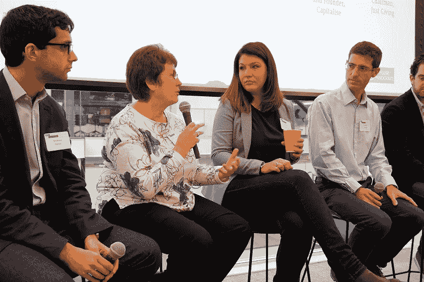

# 从 A 到退出:如何在每个阶段为你的公司融资

> 原文：<https://medium.datadriveninvestor.com/from-a-to-exit-how-to-finance-your-company-at-every-stage-bfd7754f8e13?source=collection_archive---------8----------------------->

经验丰富的投资者、贷款人和企业家分享了他们对扩大规模融资方案的见解，特别关注债务与股权。

今年 11 月，世界领先的风险资本家、债务和股权投资者以及金融科技企业家在与硅谷银行(Silicon Valley Bank)合作举办的**Financing for Scaling business**专题讨论会上汇聚一堂。他们就公司如何最有效地筹集资金以实现可持续业务增长和长期成功提供了独特的观点。

JustGiving 的主席， [**Jonathan McKay**](https://www.linkedin.com/in/jonathan-mckay-583a5/) 主持了一个专家小组，其中包括:

[艾琳·普拉茨](https://www.linkedin.com/in/elockwood/) —硅谷银行
[凯瑟琳·温斯](https://www.linkedin.com/in/catherine-wines-8060b26/) —联合创始人，WorldRemit
[本·布鲁姆](https://www.linkedin.com/in/benblume/) — Atomico —投资者
[奥利弗·卡明斯](https://www.linkedin.com/in/olivermcummings) —资本主义，前 MarketInvoice
[乔纳森·勒纳](https://www.linkedin.com/in/jonathan-lerner-bb425a/) —斯梅德威格—董事总经理

处于扩大规模风口浪尖的公司面临着艰难但令人兴奋的决定。其中最重要的是如何为他们的成长提供资金。网上有广泛的选择和丰富的信息，这可能会令人望而生畏。在“为扩大业务融资”活动中，金融专家讨论了包括股权融资在内的各种融资方式的利弊，这为投资者提供了亲身体验。债务融资提供了所有权保护，可以作为提高估值的短期桥梁。

在这里，我们揭示了他们在人生旅途的不同阶段给企业提出的建议。从 A 轮投资寻求者，到 B 轮和 C 轮，再到寻求被收购的企业。

# 当你开始扩大规模时:给首轮投资者的建议

决定你是否需要资金并不是每个初创公司都需要筹集资金。一些创始人可以在塑造公司的过程中自筹资金数年。优点是不会稀释所有权，但缺点是您可能缺乏扩大规模的资源。

WorldRemit 的联合创始人凯瑟琳·温斯(Catherine Wines)解释了为什么他们在没有风险投资的情况下运营了四年。“我们希望证明我们的模型，并以更多的方向和更少的稀释进入市场。大多数风险投资者希望看到全球规模增长的潜力，而我们只有在达到那个阶段后才能展示出来。”

**这不是数字的问题，而是愿景的问题**

在种子期或首轮融资阶段， [Atomico](http://www.atomico.com/) 的高级助理 Ben Blume 解释道，“和投资者谈谈你的愿景和机会的大小。在 B 系列和 C 系列阶段，引入更详细的业绩数据，以展示你是如何扩大规模的。"

**为个人投资者量身定制你的推介**

一刀切的做法是行不通的。明确你的推销对象，了解他们的独特兴趣，了解他们的基本信息需求。许多公司都有标准的演示模板，所以你要做好调查，确保你的演示符合他们的最低要求。

**掌握你企业的每一个财务细节**

你可能是你所在企业更广泛的经济状况的专家，但是如果你不能深入讨论微小的细节，你可能会被抓住。理解每一个财务上的细微差别，为彻底的检查做好准备。

> “在财务规划上过度投资。这将带来红利，让你的董事会满意。”
> 
> **Ben Blume，Atomico 高级助理**

**提前发送您的推介材料**

“如果你不提前送一副牌，”Smedvig 的医学博士乔恩·勒纳建议道，“你可能会面临会议质量下降的风险。”

消息灵通的投资者让会议更有成效。他们带着突出的问题、尖锐的建议和对你们是否有合作潜力的更好认识来参加会议。

**让你的推介材料尽可能简单**

请记住，投资者可能对你的行业知之甚少，不会理解你的经营环境。用外行人的术语来描述你的推介材料，并尽可能保持简单。

**利用会议展示你的产品**

“尽可能有效地利用面对面的时间，”本·布鲁姆解释道。“展示现场演示，提供产品的实际操作体验，而不仅仅是事先准备好的精心推介。”

确保你能和你的投资人一起工作

"当你刚开始投资时，对你的投资者进行尽职调查非常重要."凯瑟琳说。他们想从投资中得到什么？他们对规模会有什么反应？他们如何应对坏消息？他们的能力如何？他们的名声如何？获取参考资料。

> "花大部分时间明智地选择投资者."
> 
> **凯瑟琳·温斯，WorldRemit 的联合创始人**

# 当你准备好进入下一轮:给 B 轮和 C 轮投资者的建议

**关注客户并建立合作伙伴关系**

在首轮融资阶段，你应该寻求投资者的运营支持。在你的后期阶段，这是关于获得新客户和建立伙伴关系。像以前一样，在这方面投入尽可能多的努力。

**如果你在走下坡路，不要选择债务**

硅谷银行商业银行业务负责人艾琳·普拉茨解释说:“对于那些正在成长的企业来说，债务是一个很好的选择，他们希望提高他们的估值，并有时间筹集资金，但是当你的业务持平或下降时，这不是一个好主意。债务不应该是最后一笔钱。”

**债务可以成为有效的融资桥梁**

债务可以作为一个有效的桥梁，特别是如果你计划进一步的股权融资。如果你选择走这条路，确保你有一个明确的目标。知道你的目的地和盈亏平衡点，写下衡量标准和盈利目标，并始终实现你的计划。

**彻底规划你的债务融资**

“不要等到你只剩下 3 个月的现金才采取行动，”艾琳敦促道。“提前做好组织和准备。这样，你就能确保自己清楚地知道自己签署的贷款条款和条件是什么。”请记住，一些贷款人要求全额利息，即使你提前还清债务。

> 资金不仅仅是公平的。研究你可以获得的其他形式的资金，并就你的业务类型寻求建议。"
> 
> **奥利·卡明斯，资本主义的创始人**

**员工股权奖励应与角色相称**

“员工应该获得与其角色相称的权益，并在角色发生变化时增加权益。”乔恩说。“对我来说，将连续股权奖励作为员工奖金的想法没有商业意义。”

艾琳解释说，但在美国，用股权奖励作为员工激励是很常见的，许多企业必须提供这种奖励来吸引最优秀的人才。

“最好的员工都投入到业务中，”Ben 补充道。“但不要忘记，员工有不同的激励方式，所以为他们提供选择很重要。”

> “不要低估雇佣人才需要多少钱。这将推动您的业务发展。”
> 
> **SVB 商业银行业务主管 Erin Platts**

**不要羞于分享坏消息**

如果你在掌控自己的事业，你应该知道自己是否处在坏消息的边缘。你的董事会也应该如此，因为他们是你团队的一部分。你应该经常与你的董事会成员交流，任何事情都不应该让他们感到惊讶。他们在那里帮助你找到解决方案，恢复和他们分担责任。

# 当你准备好离开时:给想离开的人的建议

**开始时考虑你的退出策略**

但不要纠结于此。你不应该积极地规划它，但是你应该有一个想法，当你到达那个阶段时，你可以选择什么样的道路。你还应该在旅程的早期投入时间培养潜在的收购者关系——无论他们是客户还是合作伙伴。

**将积木放置到位**

不要低估准备一项收购所需的时间。如果你被一家大公司收购，在这个过程中他们会扔给你 150 名律师，这是很常见的，所以你准备得越充分——就越不令人畏惧。

**雇佣对你的独特环境有经验的公司**

如果你要卖给一个大的全球买家，找一个以前做过卖方的国际律师事务所。他们将提供宝贵的建议，知道这一举措是否适合你的企业，并能够迅速采取行动。

# 你想进一步了解你的发展战略吗？

无论您的企业处于哪个阶段，我们都会帮助您制定发展计划。联系[安德鲁·理查森](https://www.lafosse.com/andrewrichardson)了解更多关于[andrew.richardson@lafosse.com](mailto:andrew.richardson@lafosse.com)的信息

接下来去哪里？

了解更多有关我们如何通过您的[人才战略实践帮助您拓展业务的信息。](https://www.lafosse.com/talent-strategy)