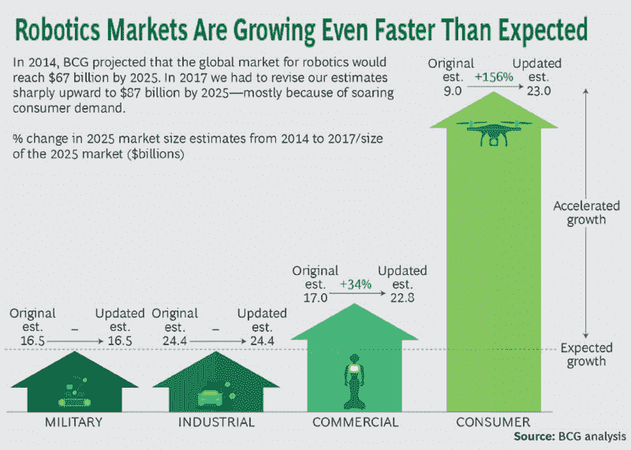

# 从人工智能到信息架构:为智能助手提供动力

> 原文：<https://medium.datadriveninvestor.com/from-ai-to-ia-powering-intelligent-assistants-5d4d95d8d3c3?source=collection_archive---------27----------------------->

在[上一篇文章](https://medium.com/datadriveninvestor/glimpsing-into-the-future-artificial-intelligence-444b1ef79e07)中，我们看了人工智能(AI)如何改变几乎每个领域；以及新架构如何促进机器人、智能助手和智能机器的崛起。一般媒体倾向于将人工智能与[失业](http://time.com/4742543/robots-jobs-machines-work/)或世界末日场景联系在一起。在本文中，让我们更积极地概述这项技术如何为我们带来新的能力。

我将探索人工智能技术的兴起将如何鼓励 [**智能助手**](https://www.amazon.com/Thank-You-Being-Late-Accelerations/dp/0374273537) (IA)被开发出来。这些智能助手将影响我们与机器的互动，并将产生深远的影响，包括我们将看到的机器如何相互“对话”。

## 人机交互

**智能助手**或**智能应用**的主要目的将是帮助我们做出更好的决定或更好地了解情况(例如参见[*【https://www.meetclaire.co/】*](https://www.meetclaire.co/)或[*【https://www.tryscribe.com/】*](https://www.tryscribe.com/)*)。*它们的崛起将为消费产品创造新的基础(例如，为消费电器设计新的微处理器)。

这些个人助理的出现标志着我们与机器互动的重大演变:我们现在很乐意与“他们”交谈。我们也开始习惯与他们进行身体上的交流。

短期内，我们将看到结合了深度学习和自然语言处理算法的**虚拟个人助理**和**消费者数字助理**的崛起。

我们正在达到语音识别的准确性(至少在英语中是这样)。

由自然语言处理(NLP)驱动的对话系统正在改变我们的交互。想想您自己使用基于屏幕的设备的经历。用例将在短期内缩小，以增加体验。

Google Now、微软 Cortana、亚马逊 Alexa、苹果 Siri 和 [Snips](https://snips.ai/) 等平台已经能够让智能应用程序进入我们的家庭，帮助我们改善健康(饮食、锻炼、心理健康)、购物(从食品杂货到服装)、特定任务(日历管理、电子邮件处理、外部信息监控)，甚至充当财务顾问。市场在不断增长:仅在美国市场，亚马逊一家预计在 2017 年就将超过**1000 万台 Echos。其技术 Alexa 现在被[3500 个品牌使用，拥有 50000 项技能](https://voicebot.ai/2018/09/02/amazon-alexa-now-has-50000-skills-worldwide-is-on-20000-devices-used-by-3500-brands/)。**

单一设备系统将开始融入网状网络，并促进与其他设备的合作，提供身临其境的连续体验。互动将通过我们所有的感官发生:音频、视频、触觉和嗅觉。以及非人类的感觉，例如雷达。

增强现实和虚拟现实等沉浸式技术将在提高生产力方面发挥重要作用。AR 可以帮助训练复杂的机器(例如见[http://visualspection.com/](http://visualspection.com/))，以及教育和游戏。虚拟现实仍然面临着一些挑战，如建立一个有用的应用程序，解决它真正解决的问题，以及谁是客户。然而，据预测，2020 年将售出近[3000 万台](https://www.extremetech.com/gaming/276470-vr-market-expected-to-improve-despite-sharp-decline-in-sales)(2016 年为 150 万台)

我们不应忽视对广告市场的影响，广告市场的重点是在正确的时间和地点投放正确的广告。如今，广告增长来自移动设备(80%来自 Android)，并受到新的信息搜索方式(由图像驱动)的影响。

这些与机器交互的新方式也将带来新的挑战，如 IT 安全性、设备管理问题、隐私和权限管理。

## 人机交互

机器或者智能的东西也会相互作用。它们将处于网络的边缘，不仅会处理信息(机器人、无人机、自动驾驶汽车)，还会在网状环境中相互交互。

将为高价值资产开发数字双胞胎([二重身](https://www.ibm.com/blogs/internet-of-things/iot-digital-twin-enablers/))，以提高其可管理性、灵活性、可靠性和效率。预测性维护将是开发的第一个关键算法。二重身也将被开发给人类。

早在 2008 年，像 Optimal Decisions Group 这样的公司就已经开始使用“人类二重身”来增加保险购买量(Optimal Decisions Group 现在是 LexisNexis 的一部分)。

医疗保健行业可能会被智能事物颠覆，但患者隐私和责任等非技术问题可能会减缓智能事物的采用。

## 机器人学

机器人值得特别关注，因为该部门的重要性。虽然人工智能是智能机器人的关键推动因素，但该行业的发展速度比预期的要快，下图总结了这一点:

[https://www.therobotreport.com/robotics-industry-growing-faster-than-expected/](https://www.therobotreport.com/robotics-industry-growing-faster-than-expected/)

总之，我们必须完全重新评估我们与机器的互动。令人着迷的是，对于许多年轻人来说，与如此多的设备互动已经是完全自然的了。

在下一篇文章中，我们将深入探讨让这些技术蓬勃发展的核心构件。

我很想听听你对那些新的智能助手的看法。