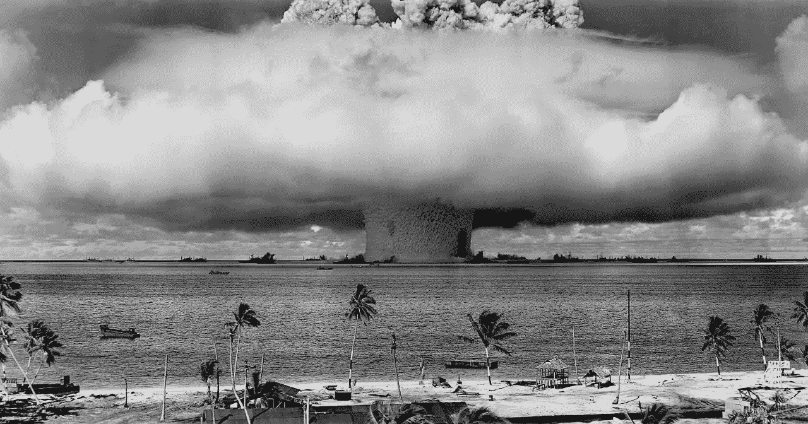
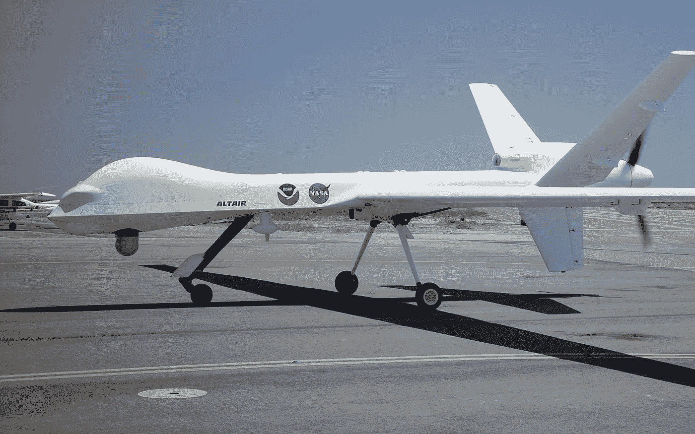

# 从原子弹到自主武器:攀登道德抽象的阶梯

> 原文：<https://medium.datadriveninvestor.com/from-atomic-bombs-to-autonomous-weapons-18cfcf5d0130?source=collection_archive---------5----------------------->

"现在我变成了死亡，世界的毁灭者."

自 1945 年以来，这些话一直困扰着一些人，但另一些人却充耳不闻。当奥本海默引用《博伽梵歌》时，他已经意识到人类历史上最伟大发明的影响，这是他自己的创造之一:原子弹。这种进步是出于超越战时敌人的需要，正如我们的大部分技术进化一样。战争的结果往往由技术进步决定，但在某一点上，我们必须考虑我们是否在胜人一筹的恶性循环中走得太远了。1925 年，在奥本海默实现之前，[日内瓦协议禁止使用化学和生物武器](https://2009-2017.state.gov/t/isn/4784.htm)，表明有些技术被认为太不人道，不能在战争中使用。我们当前的时代也不例外。我们以战争的名义进行了一次又一次的技术创新，然而却没有现代的类似《日内瓦议定书》的东西。无人机的武器化完全改变了国家间战争的面貌，世界各地的政府机构正在开发先进的人工智能系统，很快就会将自主武器添加到技术武库中。

随着技术进步的车轮继续滚动，我们必须停下来思考使用如此强大的发明来更有效地执行军事领导层所做的决定(例如，大规模杀伤敌人，入侵平民拥有的系统)的后果。在政府与公民的关系中，我们必须考虑一些关键的伦理问题，因为它关系到技术与战争之间的联系。也就是说，我们必须问，增加我们武器的效力是否会导致更大的伤害——无论我们是否有意造成这种后果。此外，计算机科学家应该(除了考虑摆在他们面前的技术挑战之外的因素)传播易于理解的、关于易于武器化的算法的危险的准确信息，以便公众理解它们在战争范围内的严重性。

 [## 不管准备好了没有，革命就在我们面前|数据驱动的投资者

### “对于技术如何影响我们的生活和重塑经济，我们必须形成全面的全球共识……

www.datadriveninvestor.com](https://www.datadriveninvestor.com/2019/02/12/ready-or-not-the-revolution-is-upon-us/) 

尽管如此，导致他在洛斯阿拉莫斯的发现的民间工作与原子弹的最终发明一样重要。一个政府在战争中的努力和它的平民人口之间有一种有趣的关系，而且这种关系一直都是如此。如今，硅谷是许多这样的平民的家园。这些开发者不是在发明炸弹。相反，许多人在人工智能方面取得了进步。在很大程度上，硅谷的开发者有着完全非政府的目标。然而，由自动驾驶软件公司开发的技术可以重新用于自动战争。在很大程度上，开发者没有意识到他们的发明(或者更常见的，这些发明的小片段)可能会被用来杀死大量的人。这个问题最初似乎是不可克服的，但是我们可以通过(1)确保我们评估一项技术被滥用的可能性，以及(2)在人权问题出现之前制定监管措施来部分缓解这个问题。这两者都是崇高的目标，特别是当他们的目标是普通公民时，但如果我们希望防止负面的道德后果，它们是必要的。

此外，当额外的障碍进入道德反馈循环时，那些重新利用技术的人(可能是军事人员)的心理杀戮代价更小。为了简单地说明这一点，我们可以把一个人良心上的一级压力定义为亲手杀死另一个人的行为。考虑热追踪导弹或武器化无人机。人们远程操作这些无人机，但无人机实施的暴力行为并不是操作者亲眼所见。因此，这可以被视为二级道德砝码。第三个道德标准是将人类完全排除在循环之外。考虑创造一种自主武器——创造者将永远不必目睹他们行动的后果。我们的战争已经发生了从一级到二级的转变，我们已经看到了像“双击”无人机袭击这样的战略造成的[巨大悲剧，导致无数平民和第一反应者丧生。然而，从二阶到三阶道德权重的转变更令人担忧，即使这种转变尚未发生。将杀戮行为简化为“智力”的增加将会产生深远而持久的影响。](https://defendmedicalimpartiality.org/?p=2126)

General Atomics MQ-1 Predator, the most commonly used drone to carry out American drone strikes

世界需要知道不必面对战争后果的罪恶感会造成多大的破坏。在这一点上，我们开始意识到大规模的强大算法可以是多么无情，但我们尚未意识到的是，作为一个全球社会，改变这种强大技术的目标是多么容易。毕竟，有了足够多的抽象层，一个视频游戏 aim-bot 和一个真枪实弹打死人的东西有什么不同呢？在我看来，意识到这些系统彼此多么相似的人对那些不知道的人有责任。计算机科学家需要阻止人工智能驱动的杀戮的力量被释放到大众身上，我们应该将我们的知识传播给其他公众。担忧可能需要从计算机科学领域之外开始，但绝对必要的是，这个问题被那些最意识到其严重性的人所接受和放大。