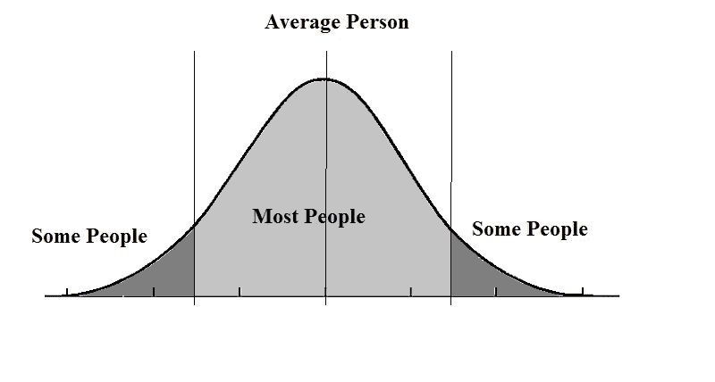

# 从咨询到产品增长:第 3 周

> 原文：<https://medium.datadriveninvestor.com/from-consulting-to-product-growth-week-3-c913c6fa9c77?source=collection_archive---------24----------------------->

在我的第三个星期后，我想我正式退出了“新员工”区，进入了“新员工”区。作为一名前顾问，我认为我最应该准备的事情之一是快速上升期。我习惯了为期五周的项目，在这种情况下，我必须在第三天成为“专家”，并在两周内提交可交付成果。但这里的利害关系是不同的，这意味着成为“专家”是根本不同的。当你是一个手指按在按钮上的人时，尤其是在一个快速发展的环境中，人们期望快速得到切实的结果，你需要成为一个不同类型的专家。在我的咨询任期结束时，我很乐意把自己标榜为拥有 40%信息的专家。在一天结束的时候，我的可交付成果的影响仅限于我的客户选择的程度。此外，还有顾问的时间表，但也有业务的时间表。因此，即使我们不得不在极度紧张的情况下生产出可交付的产品，最终也是由客户决定的。作为一名操作员，这意味着我不可能只掌握 40%的信息就成为专家，我的截止日期是业务的真正截止日期。

 [## 数据驱动的投资者

### 事实上，在各行各业，数据的大规模激增正在改变我们感知世界的方式。而且只有…

go.datadriveninvestor.com](http://go.datadriveninvestor.com/youtube) 

至此，本周最具洞察力的三个要点:

# **不要问用户产品答案:**

这听起来可能与我到目前为止所宣扬的相反。我认为顾客反馈和以顾客为中心是产品的关键原则。但我没能明确的是，用户不需要告诉你答案；事实上，他们不应该。

在我工作的头几周，我意识到直接问用户什么有效，什么无效并不能引出你想要的答案。这是真的，有几个原因:

1.  ***用户并不总是即将到来的*** *。我立即注意到的一件事是，即使骑手们有负面经历，他们也经常给他们的旅程打五颗星。车手们担心他们的评级会对他们的车手产生负面影响。这说明了用户评论是如何受到外部因素影响的。此外，人们经常撒谎，试图掩盖他们不愿分享的真相。*
2.  ***问答案限制了可能性。*** 如果你只根据顾客告诉你他们想要的来改变产品，那么你就把自己限制在了他们的可能范围内。这阻碍了消费者甚至没有意识到他们需要的类别定义产品的创新。一个出租车司机会告诉你他们需要一项服务，允许他们从手机上随意进入一个人的车后座吗？最好的产品是那些顾客永远不会知道他们离不开的产品。
3.  ***表现，不诉说。*** 人都是理想化的，尤其是对自己。我回想起我上一份咨询工作，当时每个人都被要求参加一项以商业为导向的性格测试。这是一个很好的概念，将人们分成四种不同的业务类型，以帮助阐明与团队合作的方式。然而，对于每一个问题，很明显每个答案会把你引向哪一个业务领域。人们倾向于对自己想要的个人资料有偏见，并据此选择答案。对大多数人来说，这是潜意识的；人们创造他们自己的自我概念，并回答调查以产生与之一致的结果。这说明了讲述而不是展示的局限性。观察到的行为比自我报告有无限的价值。它是诚实的，不带偏见的，并启发答案(而不是命令他们)。

这就是说，观察用户行为是收集客户反馈的最佳手段。观察到群组 A 中的客户点击蓝色底部的次数比群组 B 中的客户点击橙色按钮的次数多，这比客户告诉你他们喜欢蓝色按钮而不是橙色按钮要有力得多。

# **设定具体的量化目标**

在我担任新职位的短暂时间里，我已经意识到这是我的团队需要改进的地方。团队的文化是快速行动，部署，然后学习和迭代。快速进入市场是一种有价值的经营方式，但只有知道如何继续、改变或停止你进入市场的东西，你才能做到。

该团队将定义成功的衡量标准，但没有明确定义如何解释成功的阈值。相反，无论我们为项目设置了什么 KPI，我们都要寻找一个“显著的”提升。

这有几个问题。首先，有一个更科学的方法来衡量一件事是否“值得注意”使用 p 值来衡量统计显著性更容易更精确。然而，更重要的是，在业务和业务的总体目标的背景下规划 KPI 的数量级。举例来说，拼车行业是一个双边市场:你需要随着乘客的增长增加司机的供应。当在新市场推出拼车服务时，必须有足够的供应量，以提供一定的可接受的服务质量(即，合理的接送 eta、城市的服务区域等)。).在这种情况下，确定城市驱动力增长计划所需的供应阈值至关重要(即增长占预测需求的百分比或作为骑手增长的函数)。

这可能是一个极端的情况，但是同样适用于更简单的计划。即使对于简单的产品计划或增长活动，也存在时间投入和去优先化，这使得成功的定义必须大于统计指标的显著变化。

# **不要忽视一次性的**

加入我的团队后，我很快就被告知要通过阅读客户反馈和客户服务单来掌握客户如何与我们的产品和服务互动。这些反馈有好有坏，让我对我们的客户正在经历的事情以及每一件事情的大致程度有了一个基本的了解。

Source: [Huffington Post](https://www.huffingtonpost.com/hans-hickler/pay-attention-to-the-midd_b_5924640.html)

很容易只关注大多数反馈渠道中出现的问题。这些当然应该优先考虑。但这并不是说那些不太常见的问题应该被忽视。

首先，这些边缘案例可能是更大问题的症状。例如，在某些地区，我们的服务仍处于初级阶段。可能有一个主要的地图或路线错误没有得到适当的关注，因为在那个地区还没有一吨的骑手。然而，随着该服务在该地区的发展，这一错误可能会产生更深远的影响。

此外，有多种标准来确定这些问题的轻重缓急。考虑严重程度至关重要(我们对反馈进行分类，然后为每个反馈分配不同的严重程度，这将触发不同的跟进方式)。甚至在严重性之外，解决它也需要一定程度的努力。例如，有多个映射和路由问题完全由几个高薪员工(在客户服务之外)手动解决。花在这些问题上的时间可能会比用更简单、自动化的方式解决的常见问题花费更高的成本。

这星期到下次为止！