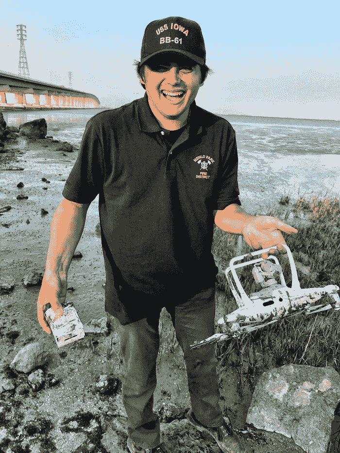

# 从斑点狗到无人机:消防员如何受益于技术

> 原文：<https://medium.datadriveninvestor.com/from-dalmatians-to-drones-how-firefighters-benefit-from-technology-6049e788a069?source=collection_archive---------17----------------------->

不过，不要误解我们的意思:我相信消防队员总是可以使用一只好的斑点狗。

老实说，犬科动物很方便——但谁知道无人机技术会对消防和救援公共服务产生如此大的影响，对吗？鉴于加州最近发生了有史以来最致命的野火，情况确实如此，当时一位名叫杰克·麦坎德斯的 19 岁少年使用无人机彻底改变了方法。

# McCandless 实际上是门洛帕克消防区的专家

你猜对了，他是无人机领域的专家。

事实证明，许多消防员看到了它们的好处——考虑到他的亲和力、技能和对那些“飞行机器人”的理解，McCandless 也是如此疯狂的是:McCandless 并不总是从事消防和救援工作。事实上，在 16 岁的年纪，这个孩子就在美国宇航局艾姆斯为一家公司从事卫星项目。

所以，换句话说，是的，孩子很聪明。

话虽如此，但让我们搞清楚一件事:无人机技术是尖端的。然而，消防队员们确实意识到，成功地操作一个机器人确实需要技巧。他们是非常多的手艺，被磨砺成一门手艺，很可能变成一门学科。

然后，他们毫无疑问地意识到，无人机需要专业化和技能，因此在 2014 年启动了门洛帕克无人机计划。好处是显而易见的:摄像机、瞄准镜、侦察和显而易见的搜救行动被提升了一个档次，让消防队员多了一套或两三个眼睛来关注现场情况，以获得更好的安全、服务和结果。

最初接触 McCandless 是为了用他的技能、直觉、想象力和驱动力来领导这个项目，扩大无人机技术的可能范围。凭借他的技术实力，这个家伙设法让无人机做消防员所希望的事情，甚至管理整个规模和能力各异的无人机舰队。

他会说他的角色属于*研发*部门。他可能是对的。事实是，他在无人机技术方面有很多工作，可以让任何人受益:配备煤气表、盖革计数器的无人机，甚至是水上救援中的闩锁式救生设备。无人机能完成的任务真的是无所不能。

# 这就是为什么无人机可能是拯救你生命的另一个原因

同样，你总是有你的达尔马提亚给你安慰，你希望在一天的辛勤工作后拯救生命。你怎么看待无人机技术？ [**注册一个免费的 VIGYAA 账户，现在就开始写作吧！**](https://vigyaa.com/accounts/login/)

*最初发表于*[*【vigyaa.com】*](https://vigyaa.com/@pierre/from-dalmations-to-drones-how-firefighters-benefit-from-technolo-002bcf3c/)*。*