# 从分布式共识算法到区块链共识机制

> 原文：<https://medium.datadriveninvestor.com/from-distributed-consensus-algorithms-to-the-blockchain-consensus-mechanism-75ee036abb65?source=collection_archive---------0----------------------->

分布式一致性确保分布式系统中节点之间的数据一致性，或者就提议达成一致。这个话题对于任何使用分布式系统的技术人员来说可能都很熟悉，比如 [HDFS](https://hadoop.apache.org/docs/r1.2.1/hdfs_design.html?spm=a2c41.13497414.0.0) 、 [MQ](https://www.ibm.com/support/knowledgecenter/en/SSFKSJ/com.ibm.mq.helphome.doc/product_welcome_wmq.htm?spm=a2c41.13497414.0.0) 、[动物园管理员](https://zookeeper.apache.org/?spm=a2c41.13497414.0.0)、[卡夫卡](https://kafka.apache.org/?spm=a2c41.13497414.0.0)、[雷迪斯](https://redis.io/?spm=a2c41.13497414.0.0)和[弹性搜索](https://www.elastic.co/products/elasticsearch?ultron=%5BB%5D-Elastic-%5BAMER%5D-US+CA-Exact&blade=adwords-s&Device=c&thor=elasticsearch&gclid=CjwKCAjwzJjrBRBvEiwA867byg-0XrrDCsJbQteyGh8wp41Z5Ms6o5i38Zk1HvISwOqP8ux7IM8M_BoC_mcQAvD_BwE)。随着分布式网络的快速发展和日益复杂，开发人员一直在理论和实践上探索解决这一难题的可能方案。

接下来，随着区块链技术的兴起，尤其是开放网络中的公共区块链和许可网络中的私人区块链，这个共识问题再次受到关注，需要从新的角度来考虑。

 [## 信息图:云之旅|数据驱动的投资者

### 聪明的企业领导者了解利用云的价值。随着数据存储需求的增长，他们已经…

www.datadriveninvestor.com](https://www.datadriveninvestor.com/2018/09/22/infographic-journey-to-the-clouds/) 

在本文中，我们将探讨分布式共识和相应的共识算法的问题和挑战。我们还将简要分析这些共识算法的适用性和局限性，并讨论这些传统共识算法与新区块链技术的结合。随后，本文从人的可靠性角度出发，重点研究了公共区块链领域的一致性算法和机制。本文还考虑了传统计算机科学中的分布式共识算法和区块链共识机制之间的关联，并展示了如何在公共区块链领域中看到新的共识思想。

# 分布式共识的问题和挑战

为了充分理解分布式共识，我们需要首先建立对分布式网络特征的理解。分布式网络的主要特征和特性是什么？或者分布式网络可能会出现哪些问题？让我们在本文的这一部分研究一下这些问题。

# 崩溃故障

首先，让我们考虑现金故障。分布式网络中的崩溃故障通常可能与以下问题之一有关:

*   节点或复制副本可能会随时停机，短时间停止运行，稍后恢复。
*   网络随时可能中断。
*   发送的邮件可能在传递过程中丢失，无法被接收。
*   发送的消息可能会延迟很长时间才能收到。
*   邮件在传递过程中可能会遇到乱序问题。
*   该网络可以被分割。例如，由于在中国和美国的集群之间的通信不良，整个网络可能被分成例如中国集群和美国集群的两个子网络。

上述问题在分布式系统中很常见。它们本质上是分布式系统中不可靠、不稳定的物理硬件导致的不可避免的风险。例如，网络或通信信道不可能总是稳定可靠的。物理机器或 CPU 上的磁盘并不总是处于良好状态。因此，可以肯定地说，崩溃故障是分布式系统中需要解决的最基本和最常见的故障类型。

# 拜占庭断层

崩溃故障基于一个简单的假设:要么节点不正常工作或响应，要么虽然正常工作和响应，但无法实现不一致，也就是说，空闲对它们来说没问题，但不能犯一些错误。网络中的恶意节点可能随时改变和伪造数据，这使得解决一致性问题变得更加困难。这些可能改变和伪造数据或响应信息的问题通常被称为拜占庭故障。碰撞断层被称为非拜占庭断层。

拜占庭起源于兰波特的论文。毫不夸张地说，拜占庭容错(BFT)是最复杂、最严格的容错模型。以此类推，一些将军一起计划攻击一座城堡，每个将军可以选择开始攻击或撤退。然而，要成功拿下城堡，所有的将军必须同步行动。其次，考虑到将军们彼此之间距离太远，无法使用直接通信，信使被用来传递消息。然而，消息并不可靠。它们可能在很长时间后成功传递消息，也可能无法传递消息，甚至随消息而改变。将军们也不一定可靠，比如其中一个可能是不按计划行事的叛徒。这个故事中的信使代表分布式网络中的通信通道，将军代表节点。

[Byzantine fault tolerance](https://lisk.io/academy/blockchain-basics/how-does-blockchain-work/byzantine-fault-tolerance-explained)

# 容错

分布式一致性算法需要解决的最关键的问题是如何实现确定性和一致性，以便在整个分布式网络中返回可靠的一致性结果，这可能充满风险和不确定性。解决死机故障自然相对容易。用于解决这类故障的算法被称为崩溃容错(CFT)算法或非拜占庭容错算法。拜占庭故障可能会导致未经授权的更改，具有更高的复杂性，也更难解决。解决这些问题的算法被称为拜占庭容错算法。

这两种容错算法的界限是什么？这两类故障发生在什么场景下？真的有必要考虑未经授权的更改吗？这些问题的答案可能取决于实际的网络环境和业务场景。

## 崩溃容错

一般来说，如果一个系统处于可靠的内部网络中，我们只需要考虑崩溃容错(CFT)的问题。例如，对于许多公司的分布式组件，如分布式存储、消息队列和分布式服务，我们只需要考虑 CFT。其原因如下:整个企业网络是封闭的，受到多重防火墙的保护，使得外部访问和攻击不太可能发生。各个节点以统一的方式部署，机器和运行的软件不太可能在没有适当授权的情况下被更改。分布式网络在这一点上相对“纯粹”，我们只需要特别注意通信网络和机器硬件。我们需要考虑网络延迟和不稳定性，以及机器随时可能经历的停机和故障。

## 拜占庭容错

然后，还有拜占庭容错(BFT)，它涉及在更大的环境中评估整个分布式网络。除了物理硬件，还需要采取一些“人为”的因素。毕竟，执行不当行为的是特定的人而不是机器。假设分布式网络是相对开放的，比如某个特定行业几十家公司的私有网络。或者假设一个完全开放的网络，例如，任何人都可以访问的网络。节点机和这些机器上的软件是由个别公司或个人自己部署的。如果好处足够诱人，一个人可能会在这些节点中的一个上发起 DDoS 攻击，对软件代码和代码执行逻辑，甚至是持久存储在网络磁盘上的数据进行授权的、通常是恶意的更改。在这种情况下，我们面临更大的挑战。除了不可靠的通讯网络和机器硬件，我们还需要考虑和处理系统中的“麻烦制造者”。

# 不可能三角形

为了解决实际场景中遇到的这些问题，许多计算科学家进行了大量的理论研究。这些理论研究对于工程技术人员来说可能显得过于抽象和繁琐，其中一些研究是关于枯燥的数学问题。然而，这些理论可以为如何解决这些问题提供重要的指导。而且，这些理论显示了可能的解决方案的理论限制是什么，以及哪个方向可以探索，哪个方向不可行。站在巨人的肩膀上，我们没有必要把所有的精力都花在制造“永动机”上。既然你们大多数人对这些理论都有所了解，我们就简单回顾一下吧。

# 费希尔、林奇和帕特森(FLP)不可能

早在 1985 年，Fisher、Lynch 和 Paterson 发表了分布式共识的不可能性定理。前面，我们也已经表明，容错协作计算的一个自然而重要的问题不能在完全异步的计算模型中解决。也就是说，在异步网络中，不可能实现容忍甚至单个节点故障的一致性算法。在此基础上，这个定理没有考虑拜占庭失效。还假设网络非常稳定，并且所有消息都被正确且准确地传递一次。在本文中，我们展示了一个令人惊讶的结果:没有一个完全异步的共识协议能够容忍甚至一个单独的未宣布的进程死亡。我们不考虑拜占庭失败，并且我们假设消息系统是可靠的——它准确无误地传递所有消息一次。

当然，这只是理论上的。它显示了解决这些问题的理论局限性，但并不意味着这些问题在实践中无法解决。如果我们愿意放宽限制，做出一些牺牲，我们可以在工程中找到切实可行的解决方案。

FLP 不可能性定理最基本的前提是异步网络模型。异步模型和同步模型的特征分别是什么？

*   在异步模型中，从一个节点到另一个节点的消息延迟是有限的，但可以是无限的。这意味着如果一个节点没有收到消息，它不能准确判断消息是丢失了还是被延迟了。换句话说，我们不能根据超时来确定一个节点是否经历了故障。
*   在同步模型中，消息传递的延迟是有限的。这意味着我们可以根据我们的经验或抽样准确估计可能的最大消息延迟，以确定消息是否丢失或节点是否因超时而出现故障。

幸运的是，我们真实的网络环境更类似于同步模型。因此，我们可以根据经验或采样来确定最大超时。例如，你给你的一个朋友邮寄了一本书。然而，三天过去了，这本书仍然没有送到你的朋友手中。在这一点上，你的朋友可能会发现很难确定是交付被延迟了还是书在交付过程中丢失了。然而，如果一个月后这本书仍然没有送到你的朋友手中，你和你的朋友基本上可以得出结论，这本书在运送过程中丢失了。这个结论是基于我们的经验和统计数据:一个项目通常可以在一到两周内成功交付。异步模型反映了代码间通信的最坏情况和极端情况。异步模型与同步节点有一些共同之处:在异步模型中工作的共识协议也在同步模型中工作。同步模型对异步模型进行了修改和限制，因此同步模型更接近真实场景，并且有可能解决实践中的一致性问题。

此外，即使在异步网络模型中，FLP 也没有指出共识是不可达的，只是说它不总是在有限时间内可达的。在实践中，如果放松对有界时间的限制，仍然有可能找到解。

根据[对 DLS](http://groups.csail.mit.edu/tds/papers/Lynch/jacm88.pdf) 的研究，一致性算法根据网络模型可以分为三大类。

*   部分同步模型中的一致协议可以容忍高达 1/3 的任何故障。在部分同步模型中，网络延迟是有限的，但我们无法预先知道边界。这种类型的容错也包含拜占庭错误。
*   异步模型中的确定性协议不能容忍错误。如前所述，在异步模型中，网络延迟是无限的。这个结论实际上就是 FLP 不可能性定理所暗示的:完全异步网络中的确定性协议甚至不能容忍单个节点出现错误。
*   同步模型中的协议可以令人惊讶地支持 100%容错，尽管当故障节点的数量超过总节点的 1/2 时，它们会限制节点行为。在同步模型中，网络延迟是有限的(小于已知常数)。

从不同的角度来看，FLP 实际上涵盖了分布式系统的三个属性:安全性、活性和容错性。

*   安全性意味着系统中节点间达到的值是一致且有效的。安全性是保证系统一致性的最基本要求。安全的核心是保证它不能做坏事。
*   活性表示系统中的单个节点必须达成一致(在有限时间内)，即系统必须向前移动，不能总是处于不一致状态。活跃度其实是更高的要求。这意味着你不能做坏事，但也不能总是无所事事。你必须做点好事，就是让整个系统平稳正常运行。
*   容错要求协议在节点故障的情况下也必须有效。

FLP 不可能性意味着，在异步网络中，没有分布式共识协议可以同时满足这三个特性。在分布式系统中，节点故障几乎是不可避免的。因此，必须考虑容错。FLP 不可能性意味着任何共识协议除了容错之外只能具有活性或安全性。在实践中，我们常常可以做出一些牺牲。比如我们可以牺牲一定程度的安全性，也就是说系统总能很快达成协议但协议不是很可靠。我们还可以牺牲一定程度的活跃度，这意味着系统可以达成非常可靠的协议，但这个过程需要太长时间，或者由于无休止的辩论而永远无法达成协议。幸运的是，许多实际情况显示了很强的鲁棒性，使得事件不太可能使一致协议无效。

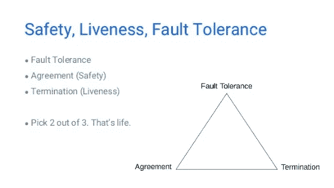

[FLP impossibility diagram](https://www.slideshare.net/oryband/the-stellar-blockchain-and-the-story-of-the-federated-consensusblockchain-academy)

此外，FLP 不排除像拉斯韦加斯这样的随机化算法。许多一致性算法采用拉斯韦加斯算法，以避免 FLP 不可能性对确定性和异步网络造成的限制。这些非确定性共识算法涉及拉斯维加斯规则:共识在网络中总是可达到的，但是达到共识所需的时间可能是无限的。当使用这些类型的算法时，很可能在每一轮中都达成一致的决定。T 秒内达成共识的概率(P)会随着 T 的增加呈指数增长，会越来越接近 1。事实上，这种方法已被许多成功的共识算法所采用，是 FLP 不可能性范围内的一个逃生出口。本文后面描述的比特币共识机制也采用了这种方法。

# 一致性可用性划分容差(CAP)定理

众所周知的一致性可用性分区容忍度(CAP)定理从不同的角度明确指出“在共享数据系统的三个属性(数据一致性、系统可用性和网络分区容忍度)中，一个人在任何给定时间只能实现两个”。CAP 与 FLP 非常相似，但又不完全相同。他们关注不同的视角。即使非常相似的概念也没有完全相同的含义。例如:

*   FLP 侧重于分布式一致性问题，而 CAP 侧重于分布式网络中的数据同步和复制。
*   FLP 声明 FLP 的所有三个属性不能在异步网络模型中实现，而 CAP 声明 CAP 的所有三个部分不能在所有场景中实现。
*   FLP 的活性强调协商一致协议的内部性质。CAP 的可用性部分强调了一致性协议的外部属性。

理论上，只能实现两个 CAP 部分。然而，边界选择不是二元的。介于两者之间的整个范围都是有用的，因为它混合了不同级别的可用性和一致性，通常会产生更好的结果。

[CAP theorem diagram](https://www.researchgate.net/figure/Visualization-of-CAP-theorem_fig2_282679529)

在实践中，我们经常需要根据实际的业务场景进行一些权衡。例如:

*   许多传统的关系数据库(例如 MySQL)经常使用 ACID(原子性、一致性、隔离性和持久性)，并通过同步事务操作来确保强一致性。可用性通常不是很好，因为节点数量很少(大多数情况下只有主节点和次节点)。相对简单的网络拓扑也降低了分区容差。
*   NoSQL 存储系统(如 HBase)通常采用 Base(基本可用、软状态、最终一致)，通过多个节点和副本保证高可用性。节点数量更大，网络环境也更复杂，还要考虑分区容忍度。然而，BASE 只能实现弱一致性并确保最终一致性。

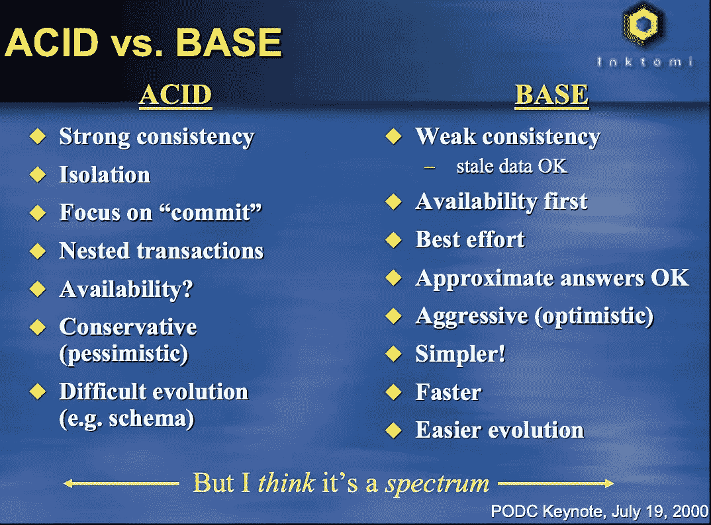

[Comparison between ACID and BASE](https://people.eecs.berkeley.edu/~brewer/cs262b-2004/PODC-keynote.pdf)

当然，这些说法并不是最终结论。由于单个系统在不断发展，今天正确的结论明天可能就不正确了。为了变得更好，系统必须不断探索合适的场景，并找到最佳平衡点。

# 分布式一致性算法

为了处理分布式系统中各种真实而复杂的问题和挑战，许多基于理论指导的解决方案已经被开发出来。本文不描述这些算法的实现细节和具体区别。而是只做一个概括性的介绍，从一个更广阔的角度做一个整体上的比较。

# Paxos 算法

最著名的分布式一致性算法之一是 Lamport 提出的 Paxos，尽管它的复杂性也是“臭名昭著”的。Lamport 提出了这种创造性的机制，这种机制很实用，可以通过工程实现，可以最大限度地保证分布式系统的一致性。Paxos 广泛应用于许多分布式系统，包括 Chubby 和 ZooKeeper。基本 Paxos(单个法令，即每次只同意一个值)有两个作用:提议者可以处理客户请求并主动提议提议值。接受者被动地响应提议者发送的信息，对提出的提议进行投票，并在决策过程中坚持价值观和状态。为了简化模型，可以忽略学习者角色。这不影响模型中的决策。

如图所示，共识决策过程使用两阶段提交协议:

*   在第一阶段，广播 Prepare RPC 命令以找到由协议决定的最终值，并阻止未完成的旧提议。
*   在第二阶段，广播 Accept RPC 命令，要求接受者接受商定的特定值。多 Paxos 由多个基本 Paxos 实例组成，可以决定一系列值。

Paxos 在实践中的可实现性也基于许多假设和限制。Paxos 只能用于处理 CFT，不能用于处理拜占庭故障。因此，它是非拜占庭容错算法。从 FLP 的角度来看，Paxos 实现了容错和安全，放弃了活性(安全但不活)。也就是说这个算法可能永远不会结束或者达成共识，虽然这种情况可能性很小。从 CAP 的角度来看，Paxos 只保证了 C(一致性)和 P(分区容忍度)，但是弱化了可用性的级别。为了提高 Paxos 系统的可用性，我们可以增加学员数量。

尽管有这些缺点，Paxos 仍然是可靠的、有效的，并且在实践中经过了良好的测试。本质上，Paxos 是异步系统中的一个(占主导地位的)分布式共识协议。Chubby 的发明者甚至说“只有一个共识协议，那就是 Paxos”——其他所有的方法都只是 Pax OS 的残破版本。Paxos 在实践中有效的原因是，可能影响 Paxos 系统活性和可用性的条件通常不容易触发。如果这些情况真的发生，其影响也不是很不可接受。

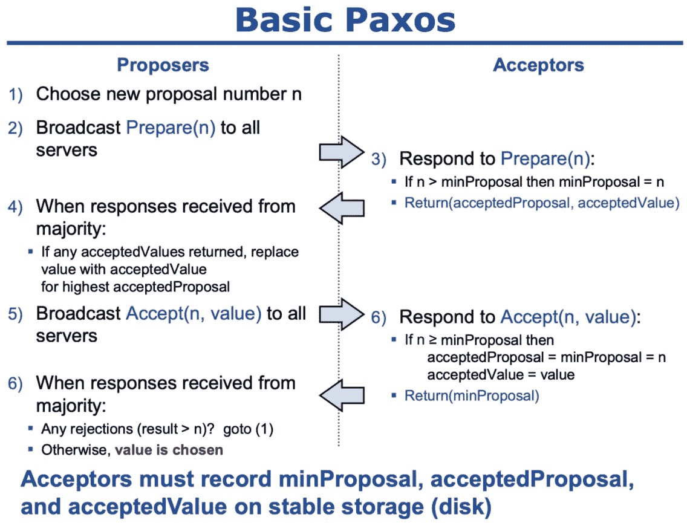

[Basic Paxos RPC communication and decision-making process](https://ongardie.net/static/raft/userstudy/paxos.pdf)

# Raft 算法

由于 Paxos 的复杂性，Ongaro 在 2014 年提出了一种更简单的算法——Raft。Raft 在工程上更容易理解和实现。这也是 Raft 最初的目标。在不影响功能的情况下做了很多通俗易懂的设计细节。

Raft 算法是一种基于 leader 的不对称模型。系统中的节点在任何时间点只能处于三种状态之一:领导者、追随者和候选者。在初始阶段，所有的节点都是追随者。要成为领导者，一个节点(追随者)必须成为候选人，并发起一轮选举人票。如果节点没有收到足够的投票，该节点将再次成为追随者。但是，如果它获得了大多数选票，该节点将成为领导者。如果领导者遇到失败，并发现在它从失败中恢复后，新的领导者被选举出来，则原来的领导者会自动返回到追随者状态。

Raft 还引入了及时识别过期信息的术语概念。一个术语类似于 ZooKeeper 中的纪元文件。任期数随时间单调增加，在给定的任期内最多只能选举一名领导人。如果日志的最后一个条目具有不同的术语，则具有较晚术语的日志是最新的。

Raft 还引入了心跳包和超时。为了维护其权威，当选的领导者必须不断地向群集中的其他节点发送心跳包。如果跟随者在给定的选举超时期间没有接收到心跳包，则认为领导者已经崩溃，跟随者将其状态改变为候选，并开始领导者选举。

Raft 中的领袖选举通过心跳和随机超时来实现。日志复制是通过强有力的领导来实现的:领导者接收客户端命令，将其附加到其日志中，并将日志复制到其他追随者。Raft 通过只允许领导者决定是否提交日志来确保安全。

这里将不详细描述选择和复制。了解更多关于 Raft 中选举和复制的信息。请注意，领导者选举和领导者组织的正常操作相对简单。Raft 中的领导者更换过程实际上要复杂一些。

然而，尽管 Raft 的原理/机制与 Paxos 并不完全相同，但是它们所解决的问题以及它们所采用的折衷政策可以被认为是相似的。也就是说，Raft 只能解决崩溃故障，强调容错性、安全性和一致性，削弱了活性和可用性的水平。

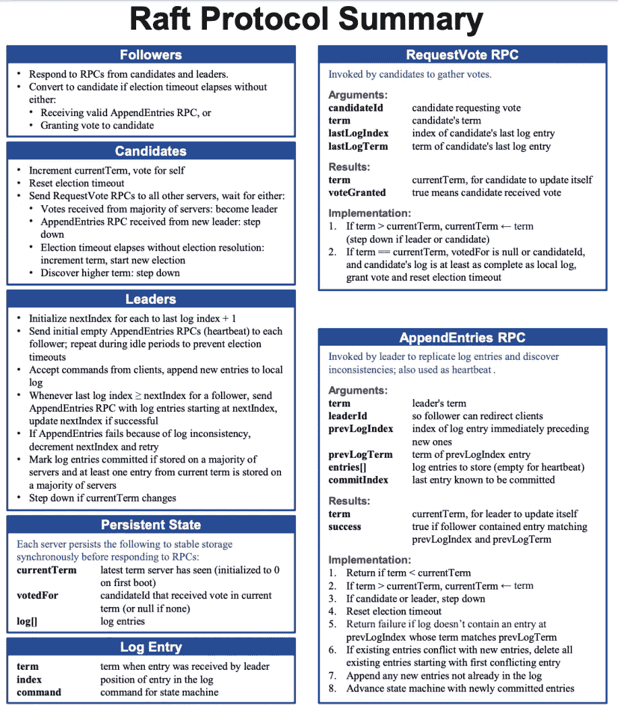

[Raft overview](https://ongardie.net/static/raft/userstudy/raft.pdf)

# 实用拜占庭容错(PBFT)

尽管自从 1982 年 Lamport 提出拜占庭将军问题以来，已经进行了许多关于 BFT 解决方案的讨论，但是这些问题的许多解决方案是低效、缓慢和复杂的。这种情况在 1999 年得到了改善，当时 Castro 和 Liskov 提出了实用的拜占庭容错(PBFT)算法。PBFT 是第一个将复杂度从指数级降低到多项式级的算法。PBFT 实现了几千个 TPS 和可行的解决方案来应对实际中恶意行为的节点。已经证明，如果系统中恶意节点的数量不超过总节点数的 1/3，PBFT 算法将正常工作。

PBFT 系统中的所有节点按顺序排列，一个节点是主节点，其他节点被视为备份节点。系统中的所有节点相互通信，并基于多数原则达成共识。每个 PBFT 共识回合被称为一个视图。主导节点在每个视图期间被改变，并且如果在主导节点没有广播请求的情况下已经过了一定量的时间，则可以用称为视图改变的协议来替换主导节点。这种副本超时机制确保崩溃的或恶意的领导者能够被检测到，并且通过重新选举新的领导者来启动新的视图。

如图所示，从客户端发起请求到接收响应经历了五个阶段。共识过程采用三阶段协议。以下内容简要描述了这五个阶段:

1.  启动:客户端(客户端 c)向集群发起服务请求 m。
2.  预准备:领导节点(副本 0)验证请求消息 m 的有效性，将序列号 n 分配给视图中的请求 m，并将分配的预准备消息广播给所有备份节点(副本 1–3)。
3.  准备:备份节点验证请求消息 m 的有效性，并接受序列号 n。如果备份节点接受分配方案，则它向其他节点广播相应的准备消息。在此阶段，所有副本都需要达到全局一致的顺序。
4.  提交:一旦从集群接收到分配协议消息，所有节点(主节点和次节点)就向所有其他节点广播提交消息。在此阶段，所有副本都同意该顺序，并确认收到的请求。
5.  执行和回复:收到来自集群的提交消息后，节点执行请求 m 并向客户端发送回复。客户端等待来自 f+1 个不同节点的相同回复，并认为请求已经成功执行。f 表示群集中潜在故障节点的最大数量。所有节点直接向客户端返回消息也是为了防止主节点在请求过程中出现问题。

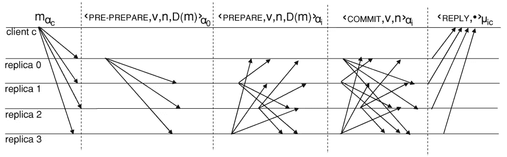

[PBFT normal operations](http://www.pmg.csail.mit.edu/papers/bft-tocs.pdf)

PBFT 基于异步网络模型实现安全性，但是它依赖消息超时来执行定期同步。由于采用了 leader-plan 解决方案，消息同步过程非常快，并且还实现了顺序写入。然而，领袖连任是困难的。当时间非常接近超时窗口时，恶意领导者可能开始发送消息，导致系统严重变慢。这种缺点可以用来对网络发起攻击，并使正确运行的节点看起来不正确，从而导致无休止的领导者选举。

与 Paxos 和 Raft 相比，PBFT 可以处理更多的问题:除了崩溃故障，它还可以处理可能引起麻烦和未经授权的更改的拜占庭问题。然而，从 PBFT 采取的权衡政策来看，PBFT 仍然类似于 Paxos 和 Raft。从 FLP 的角度来看，PBFT 也强调了容错性和安全性，弱化了活跃度。从 CAP 的角度来看，PBFT 强调对网络分区故障和一致性的容忍，弱化了可用性水平。

尽管存在这些缺点，但如果错误或恶意节点的数量不超过总节点数的 1/3，PBFT 在实践中仍然是有效和可行的。PBFT 不是唯一的 BFT 算法。其他类似 BFT 的算法也在不断发展，例如，Lamport 曾经建议 BFT·帕克斯(Paxos 的增强版本)处理拜占庭故障。最近，基于 PBFT 和 Raft 的结合提出了 BFT Raft 算法。但从问题范围和机制来看，这些算法还是类似于以前的思路和框架。本文将不介绍这些算法。

# 适用场景

从 Paxos、Raft 和 PBFT 到 Paxos 和 Raft 的各种变体以及新的类似 BFT 的算法，分布式一致性算法一直在发展、改进和演进。许多大公司也开发了符合其业务场景的分布式共识算法。虽然这些算法不是很完美，但在具体的商业实践中发挥了重要作用。那么这些算法的应用场景是什么？这些算法的局限性是什么？

诸如 Paxos 和 Raft 之类的非 BFT 算法只能处理机器硬件故障，而不能处理存在恶意节点的情况。这些非 BFT 算法只能在非常可靠的网络环境中运行，例如，公司的内部网络。在这种相对封闭的网络中，访问需要严格的授权，确保各个节点的身份是已知和可靠的。这有助于消除恶意节点，并允许算法有效运行。

BFT 算法对网络环境有非常严格的要求。即使存在恶意节点，只要恶意节点不超过总节点数的 1/3，整个系统仍然是安全的。然而，这带来了新的问题。如何准确知道网络中恶意节点的数量？恶意节点占总节点的比例是多少？如果访问网络需要权限，这个问题相对容易解决。例如，在由 10 个分支机构组成的专用网络中，只有 10 个授权公司可以访问该网络。即使某些公司(少于 3 家)恶意行为，企图在未经授权的情况下更改数据，整个系统仍然是可靠和安全的。在这样一个允许的网络中，可能恶意行为的节点数量已经被估计。当一些节点确实有恶意行为时，它们的真实身份可以很快被定位。这间接提高了网络的安全性。

# 限制

然而，BFT 算法可能在无许可(开放许可，无许可控制)开放网络中引起问题。如果分布式网络是开放的，任何人都可以访问，并且网络访问的成本很低，则不知道网络中可能有多少潜在的恶意节点。即使当一些节点恶意行为时，确定它们的身份也是一个困难的问题。一个典型的攻击场景是 Sybil 攻击，攻击者可以伪造身份来控制大量节点，然后控制整个分布式网络。

此外，BFT 算法的最大限制是只能协调少量节点(例如，不超过 100 个节点)。如果节点数以千计，系统表现出非常差的性能，甚至无法达成一致，影响系统的活性和可用性。您可能已经注意到，在 PBFT 的三阶段协议中始终需要多播:在预准备阶段，主节点向所有次节点广播请求；在准备阶段，次要节点向所有其他节点广播；在提交阶段，单个节点(主节点和辅助节点)向所有其他节点广播。从这个过程我们可以知道，通信次数是节点数的平方。当系统有大量节点时，这种广播机制将是一场灾难。系统几乎无法在短时间内达成共识。

从前面的内容中，我们可以得出一个结论，传统的分布式一致性算法如 Paxos、Raft 和 PBFT 一般适用于需要权限控制且节点数量较少的可靠分布式网络。

# 私有区块链中的应用

事实上，这些传统的共识算法在区块链时代也获得了新的活力:它们被进一步理解和使用。这些一致性算法被广泛用于私有区块链场景，其中网络环境相对可靠。由于以下特征，私有区块链的应用是有前景的:

*   准入授权:私人区块链并不完全开放，一般由几个或几十个企业组成。只有经过授权的公司或组织才能入网(通常需要完成实名认证后才能入网)。
*   数据保护:私有区块链中的信息和数据不是完全公开的，只有授权方可以看到。这对于行业或企业数据安全尤为重要。例如，关于跨境转移的交易信息在银行业中非常重要，而供应链上的税务系统中的税务信息也非常敏感。
*   监督:通常，可以在私有区块链中设置监督和观察节点，以监控和审计敏感信息，从而满足法规遵从性要求。

在当前阶段，私有区块链可以被认为是实现快速解决方案实施和解决特定行业中的痛点的好选择。民营区块链在区块链行业的应用也预示着未来区块链发展的进一步探索。因为加入私有区块链需要授权，事先已经建立了一定程度的信任，网络环境相对可靠。网络中恶意行为和攻击的概率极低，即使发生了，也可以轻松快速地确定责任。因此，传统的一致性算法也可以应用于这些场景。请参见以下示例:

*   [HyperLedger Fabric](https://www.hyperledger.org/projects/fabric) v1.0 利用 Solo 和 Kafka pub/sub 系统执行订购；v1.4 还引入了 [Raft 算法](https://hyperledger-fabric.readthedocs.io/en/release-1.4/orderer/ordering_service.html)。目前，所有这些采用的算法都是 CFT 算法。Raft 主要是为后续支持 BFT 算法做铺垫。(Raft 是 Fabric 开发拜占庭容错(BFT)订购服务的第一步。正如我们将看到的，一些 Raft 开发决策就是由这个驱动的。)
*   R3 Corda 也采用了可插拔的一致性设计。它允许 Raft 算法和 BFT 算法，前者实现高速，需要高度可靠的环境，后者实现相对低速，需要不太可靠的网络环境。更多信息参见[这份文件](https://docs.corda.net/key-concepts-notaries.html)。
*   [企业以太坊联盟(EEA)](https://entethalliance.org/) 也支持 BFT 算法、Raft 和 PoET。参见[本文档](https://entethalliance.org/wp-content/uploads/2018/05/EEA-TS-0001-0-v1.00-EEA-Enterprise-Ethereum-Specification-R1.pdf)。
*   蚂蚁金服区块链 BaaS 平台也采用了 PBFT 算法。

# 无权限网络中的挑战

如果网络完全开放，没有权限，任何人都可以在任何时候访问，整个系统能否在有限的时间内达成共识？如何协调一个网络中的所有节点，比如包含一万个节点而不是只有几十个节点？

在回答前面的问题之前，你实际上需要问自己以下问题:为什么一个网络需要完全开放和无权限？什么样的场景会需要 1 万个节点？这种节点需求在实际场景中真的存在吗？这些问题的答案与区块链的公共区块链直接相关。为了回答这些问题，我们需要回顾一下分布式系统的目标。

# 权力下放的意义

为什么我们需要一个分布式系统？这个问题不难回答。通常，分布式系统可以提高容错能力。毕竟，分布式系统依赖于许多不同的节点，所有节点同时发生故障的概率比单个节点低得多。此外，分布式系统还支持附着阻力。攻击或破坏许多节点比攻击单个节点要困难得多。

但是，前面的内容仍然局限于物理硬件。这些优势可以降低物理机器硬件出现故障的可能性。但是，不考虑人为因素。如果一个系统足够重要(例如，一个电子货币系统)，除了机器故障，我们需要更多地关注人为因素。部署节点的人会不会故意恶意行为？如何才能防止系统中节点间的腐败和勾结？

以太坊创始人 Vitalik Buterin 提到了去中心化的意义，如下图所示。传统的分布式系统从容错和抗攻击的角度(系统中有多少台物理机，系统可以允许多少台机器上同时发生故障)实现架构去中心化。同样，现在我们需要考虑如何实施政治分权和抵制合谋。有多少人或组织最终控制着系统中的节点？我们如何防止腐败和勾结？如果我们说传统的分布式系统注重网络和机器硬件的可靠性，那么我们现在需要考虑的是“可靠性”:我们能否找到一种有效的技术来防止人为的恶意行为？我们如何确保重要网络中的大多数节点不被某个人或组织恶意控制？

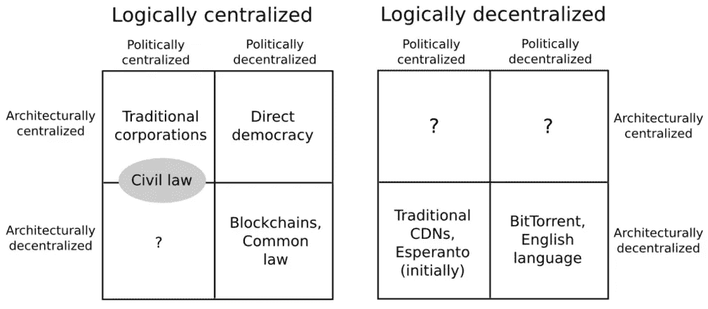

[Three dimensions of decentralization](https://medium.com/@VitalikButerin/the-meaning-of-decentralization-a0c92b76a274)

值得一提的是，这个问题还是很有争议的。很多人从来没有想到过腐败和官商勾结或者认为完全没有必要考虑。也许他们认为他们对这个技术问题无能为力。毕竟这个问题离我们生活的现实世界很远。在我们生活的这个世界里，集中式平台获得了良好的声誉，提供信用背书，并控制着所有的规则和流程。例如，很少有人担心银行会故意做假账，挪用存放在银行的资产。毕竟，银行通常被认为是可靠的。如果银行不可靠，人们可能无法开展任何商业活动。

然而，银行可靠只是我们的假设。我们只有“信任”和“怀疑”两个选择，我们必须选择前者，因为如果我们不信任银行，我们便无法进行商业活动，经济发展也会停滞不前。但是，没有切实可行的方法可以证明银行非常可靠。

如果可靠性实际上是必要的和有意义的，你能找到让这个世界更可靠的解决方案吗？你能证明和你做生意的陌生人是可靠的，而不是必须相信那个陌生人是可靠的吗？不要相信；请核实。你不需要相信那个陌生人，也没有必要去相信那个陌生人。你只需要验证那个陌生人。

要解决这个问题，所有人都必须平等。每个人都可以平等自由地参与决策过程。每个人都可以自由进出“议会”。这其实就是技术民主，包括以下技术要素:网络必须是无权限的，任何人都可以随时进出网络；节点必须是对等的，可以直接通信；不存在中间或集中的权力机构(完全对等)；每个节点都可以成为簿记员。

由于网络是无许可的、完全开放的、透明的、民主的，参与的节点数量可能非常大，恶意节点的概率也非常高。那么，我们如何通过一定的机制来协调节点的行为，保证整个系统的一致性，在这种节点数量庞大、恶意动作可能性很高的无权限分布式网络环境中？如前所述，共识算法无法做到这一点。我们需要寻求新的解决方案。

此外，权力下放可能是区块链领域最有争议的问题。有人认为，分权是区块链的价值观，是公共区块链存在的灵魂和前提，应该尽可能保证制度的分权度。而另一些人则认为完全分权过于理想，不太可能实现，应结合实际情况考虑弱集权或多集权，同时兼顾效率。不考虑价值判断，单纯从技术角度来看，去中心化程度越高，系统的安全性越高。因此，在公共区块链制度设计中，应尽可能保证制度的分权度。但结合维塔利克·布特林对分权含义的解读，在追求分权的过程中，不应停留在表面上的分权，而应综合考虑分权的各个维度，根据实际情况进行必要的权衡。

# 工作验证(PoW)机制

开放网络中分布式共识的创新解决方案是比特币中的工作证明(PoW)机制。

## 比特币

2008 年 10 月 31 日，中本聪发表了比特币白皮书《比特币:一个点对点的电子现金系统》，奇迹般地为这类问题提供了创造性的解决方案，使得在复杂的网络环境中协调成千上万的节点成为可能。事实上，中本聪并没有发表白皮书来解决这个技术问题。相反，中本聪想得更大。他创造性地发明了比特币，一种完全点对点的电子现金系统，消除了传统支付需要依赖的可信第三方中间人。在系统实现的过程中，开放式网络中多个节点之间的一致性问题得到了解决。也可以说，比特币解决的核心问题是对等网络中电子货币的双重支出问题。然而，比特币的实现机制不仅仅是分布式网络技术，它还结合了密码学、经济学、博弈论等思想，并以非确定性的概率模式实现了节点之间的一致性。因此，简单地称之为算法已经不能准确表达其含义。称之为共识机制可能更恰当，因为它的实施确实依赖于一整套政策和制度。在这里，我们不会过多阐述比特币的思想意义和实现细节，而只关注其共识机制的实现。

比特币实际上是数字签名的电子链。硬币所有者可以通过签署前一次交易的哈希值和下一个所有者的公钥来转移硬币，并将这些添加到硬币的末尾。收款人通过验证签名来验证硬币所有者形成的链。但问题是收款人无法核实收到的硬币是否没有被双花，也就是失主可能把同样的硬币转给了两个人。所以我们需要一个收款人的机制，保证之前的币主在那之前没有把币转给别人。要保证这一点，唯一的办法就是让每个人都知道所有的交易。在没有可信的第三方的情况下，要实现这一点，所有的交易都必须广播给所有人。因此，我们需要一个系统，所有参与者都同意他们接收硬币的顺序，以形成一个独特的序列记录历史。这其实是一个分布式共识的问题。

比特币系统提供的解决方案是使用由所有节点组成的时间戳服务器。时间戳服务器给事务块的散列加上时间戳，并广播它。每个时间戳在其散列中包含前一个时间戳，形成一个链，每个额外的时间戳加强前一个时间戳。为了在对等网络中实现分布式时间戳服务器，比特币使用了工作证明(PoW)机制。在进行哈希运算时，PoW 需要找到某个值，使得整体哈希值的前几位都是零，并且随着零位数的增加，平均工作量呈指数级增加。此外，哈希没有规则。要确保哈希的前几个数字为零，唯一的方法就是一遍又一遍地强制随机试错。一旦消耗了足够的 CPU 计算能力并且找到了满足条件的散列值，就不能改变该块，除非再次使用 CPU 来重做它。

此外，PoW 解决了大多数决策问题。在比特币中，最长的链代表了大多数决定。如果大部分计算能力由诚实节点控制，诚实链将迅速增长并超越其他链。如果攻击者想要在没有适当授权的情况下改变之前的块，攻击者必须重做相应块及其所有后续块的 PoW 任务，然后赶上并超过诚实节点。这个很难。数学上不难证明，随着后期节点数量的增加，速度较慢的攻击者追上诚实节点的概率呈指数下降。一般来说，6 个街区后追上几乎是不可能的。此外，PoW 任务的难度不是固定的，而是使用移动平均法动态调整，主要考虑硬件计算速率的增加和矿工数量的增减。如果计算速度快，难度增加，计算速度慢，难度降低。通过难度的动态调整，比特币的区块生成时间大致稳定在 10 分钟左右。

整个网络运行如下:

1.  新事务被广播到所有节点。
2.  每个节点将接收到的事务打包到一个块中。
3.  每个节点通过不断改变块的随机数来执行 PoW 任务，以使块的散列满足指定的条件。
4.  一旦一个节点完成 PoW 任务，它就向所有其他节点广播该块。
5.  在接收到该块之后，其他节点验证该块内的事务的有效性，并且如果验证通过，则接受该块。
6.  节点如何表示接受该块？也就是说，当添加下一个块时，被接受的块的散列值被作为下一个块的先前散列值。

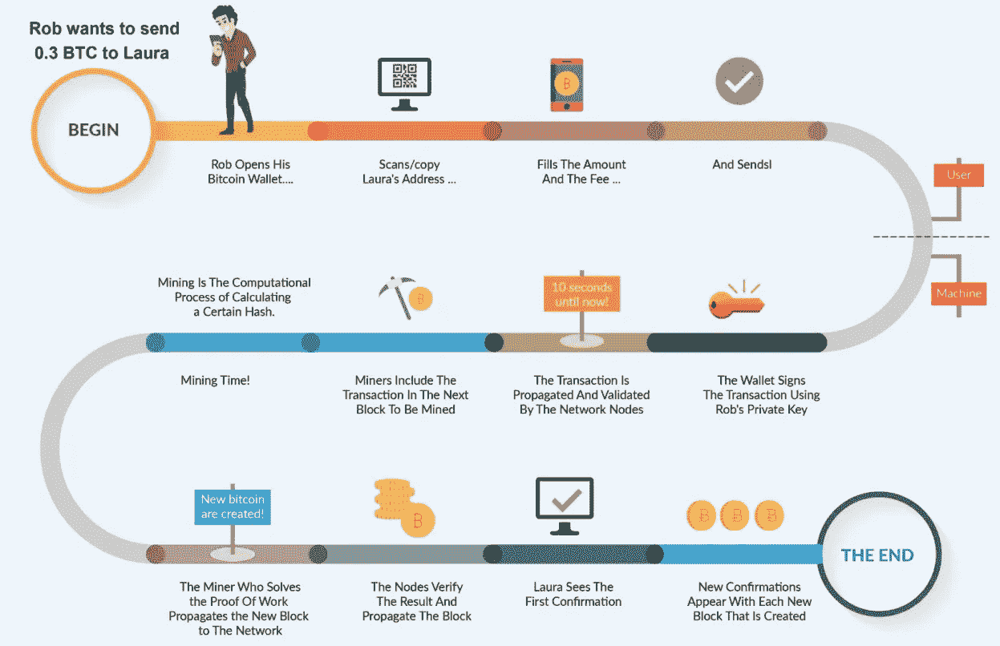

[Bitcoin transaction process](https://www.giottus.com/Bitcoin)

这里不详细描述交易和挖掘的细节。但是，简而言之，我们可以说的是，在比特币中，最长的信息链总是占上风。如果一个节点发现一条链比自己长，它会自动切换到最长的链上工作。

既然 PoW 的成本很高，如何鼓励大家贡献自己的计算能力，成为保证整个比特币网络安全的节点？比特币提供了两种激励政策:

1.  一个节点挖出某个区块会获得一定数量的比特币，这其实是唯一的比特币发行机制(一级市场)。所有的比特币都只能通过挖矿挖出来，然后进入流通。
2.  矿工处理交易信息可以获得一定的服务费，实际上就是现有比特币的流通(二级市场)。当 2100 万个比特币全部被挖出来，用户只能被服务费激励。

这些激励政策也隐含着鼓励节点诚实。如果一个贪婪的攻击者拥有超过一半的 CPU 计算能力，他就要做出选择:是修改交易记录，把花掉的比特币转回，还是去挖新币，老老实实地赚服务费？很有可能老老实实开采更有利。毕竟他能赚到的币比其他所有节点赚到的币总和还多。同时，摧毁比特币系统也会破坏他自身财富的有效性。如果比特币不再可靠，价值会迅速崩溃。此外，攻击者并不像人们想象的那样可以随意操纵、擅自更改或伪造交易记录。他能做的就是把最近花掉的比特币偷回来。

## 动力为什么起作用？

比特币在没有任何组织或团体维护的情况下，稳定运行了 10 年，仅仅依靠社区志愿者的自愿维护。在此期间从未出现过大的问题。这是一个奇迹，也足以证明比特币背后共识机制的有效性。比特币为什么能做到这一点？为什么比特币背后的共识机制如此有效？Bitnodes 数据显示，比特币节点数量超过 1 万个(比特币的节点类型很多，不同口径的节点数量可能不同。这里只考虑完整的节点)。为什么比特币可以在无权限的网络环境下协调上万个节点？

依我拙见，以下原因可能适用:

*   有效的激励政策:激励政策有效地鼓励更多的节点参与到比特币对等网络中。节点越多，比特币网络越安全。
*   PoW:挖掘生成块消耗 CPU 计算能力，人为制造障碍，增加成本，从而增加攻击者的成本。
*   博弈论:激励策略也考虑到了博弈均衡，让理性节点更多的受益于保持诚实。
*   通信效率:比特币节点之间的通信效率不低。您可能会注意到，还涉及到了事务和块的广播。然而，这种广播不是在两个节点之间广播，而是由某个节点(发生事务或计算功率的节点)向所有其他节点广播信息。此外，事务的广播不需要到达所有节点。只要有很多节点接受广播，很快就会打包。2014 年，Miller 等人(来自中等难度谜题的匿名拜占庭共识:比特币的一个模型)严格证明了消息复杂度不随网络规模增加而增加，而是一个常数。此外，块的广播也允许消息丢失。如果一个节点没有接收到一个块，当它接收到下一个块时，就会意识到自己已经错过了前一个块，并主动向其他节点请求该块。
*   概率一致性:与其他共识算法相比，比特币共识机制最特殊之处在于不追求确定性一致性，而是追求概率一致性。当一个块刚被挖出来的时候，它包含的事务信息并没有得到所有节点的确认，它包含的数据也不是最终一致性的结果，仍然有可能被攻击者更改。然而，随着后来节点数量的增加，授权更改的概率呈指数下降，而最终一致性的概率显著增加。一旦后续节点数超过 6(即约 60 分钟后)，一致性可视为确定性和最终性。

比特币共识机制不再局限于分布式算法的层面，而是包含了更多的思想，如经济学、博弈论、概率论等。因此，称之为共识机制可能更为恰当。不过，我们还是可以把比特币 PoW 共识机制放到一致性的框架里。从 FLP 和 CAP 的角度来看:

1.  比特币最大限度地考虑了崩溃容错和网络分区容忍，这也是网络开放性的必要要求。开放的网络环境极其复杂，随时向所有人开放，节点分布在世界各地，随时可能发生机器故障、网络分化、系统攻击，因此必须考虑容错。使用 PoW 机制，比特币不仅可以实现崩溃容错，还可以结合密码学非对称加密技术实现拜占庭容错，防御未经授权的更改和攻击。
2.  比特币尽可能保证活跃度和可用性。比特币的分块生成时间总是在 10 分钟左右，也就是说系统总能在 10 分钟内达成一致。比特币网络在最近十年从未宕机。从这个角度来说，确实做到了极致的可用性。但必须指出的是，比特币的可用性与我们通常理解的互联网领域的可用性有很大不同。对于互联网领域的系统可用性，不仅要求系统运行稳定不停机，对服务体验也有明确的要求，比如响应时间。如果你用支付宝转账，但是不是随时可用，3 秒内钱没到，而是被告知系统忙，需要等 10 分钟甚至 30 分钟，那么这项服务就被认为不可用。然而，这种现象一直在比特币中发生。比特币每 10 分钟就有一个区块，区块大小只有 1 MB，无法容纳太多交易。如果同时存在太多事务，只能等到这些事务可以打包到下一个块中。所以，可能要 20 分钟，30 分钟，甚至更久。从这个角度看，比特币网络实际上放松了对响应时间的要求，实现了相对基本的可用性:读可用性极高，而写可用性很低。
3.  比特币对于安全性和一致性不再追求确定性，而是采用概率保证，基本可以认为是保证了最终的安全性和一致性，但这里的“最终”仍然是有时间限制的，是基于概率的。例如，如果我刚刚转移给你一个比特币，没有人可以说结果是确定的和最终的。但随着时间的推移，不断有新的区块被挖掘出来，“我给你转了钱”的交易信息也会被更多的节点确认，被更多的后续区块加固。这个结果确定的概率在不断增加。一旦经过足够的时间(例如 1 小时)，我们可以从概率的角度考虑，结果被改变的概率极低，系统达到最终一致性的概率极高。在实践中，我们可以认为该系统确保了最终的一致性。

总体来看，比特币 PoW 共识机制在 FLP 和上限的限制下实现了很好的妥协和权衡。在实践中，它确实为开放和复杂网络中的分布式一致性问题提供了可行的解决方案。比特币过去十年稳定可靠的运行也证明了这一点。

此外，在由 [Miller 和 LaViola](https://socrates1024.s3.amazonaws.com/consensus.pdf) 进行的一项研究中，比特币 PoW 经过了严格的分析和证明，具有以下特征:

*   比特币网络可以被视为由大约无限个节点组成。每个节点贡献少量的计算能力，并且相应地每个节点创建块的概率较低。
*   PoW 机制依赖于同步网络模型。在该模型中，如果网络延迟为 0，该机制可以容忍 50%的故障。但从实际观察到的网络延迟来看，比特币可以容忍 49.5%的故障。如果网络延迟等于块生成时间(10 分钟)，则只能容忍 33%的故障。如果网络延迟接近无穷大，则该机制的容错性也接近 0。
*   比特币 PoW 机制是可扩展的，因为共识时间和消息复杂度与网络大小(网络中的节点数)无关，只与错误节点的计算能力有关，可以认为是一个无量纲常数。

PoW 机制不仅在实践中是可靠的，而且在理论上是可以检验的。PoW 机制使用同步模型和随机概率来规避 FLP 确定性异步模型的不可能性定理。与 PBFT 算法 O(n2)的复杂度相比，PoW 独立于网络规模的可扩展性具有很大的优势:节点越多，系统越安全。而且，系统的效率并没有降低。

## 权力到底是什么？

PoW 机制的魔力在哪里？事实上，你可能知道，战俘的概念并不深刻，事实上它并不是由中本聪首先提出的。早在 1993 年，这个想法就被提出来对抗垃圾邮件(通过处理定价或者对抗垃圾邮件)。然而，直到中本聪创造了比特币，它才被广泛使用。PoW 的本质在于故意制造障碍，增加参与者的成本，从而将参与者的恶意企图降到最低。例如，请求者需要做一些额外的工作来检测 DDoS 攻击和垃圾邮件。再比如，登录网站需要输入验证码是很常见的，这也是为了增加登录成本，防止网站被攻击。这类任务的核心特征是非对称的:对于服务请求者来说，完成任务肯定是困难的。对于服务提供商来说，验证任务必须简单快速。对于比特币 PoW 来说，它是非对称的:需要大量的计算能力，经过不断的试错，才能找到一个使哈希符合条件的 nonce(随机数)，而验证找到的 nonce 是否符合条件只需要一个简单的哈希运算验证。

比特币权力本质上是一个 CPU 一票制。为什么是 CPU 而不是 IP 地址？这还是基于任务的难度。如果采用一 IP 一票制，系统可以很容易被拥有大量 IP 地址的人(如 IP 提供商)控制。相对而言，至少在 ASIC 或 FPGA 不可用的时候，CPU 还是比较贵的硬件，不容易有大量的计算能力(CPU +电功率)。这实际上隐含地为比特币的价值提供了一个现实世界的锚:虚拟货币系统通过计算能力找到了现实物理世界的价值锚，尽管在很多人看来，这种计算能力的消耗毫无意义，是一种能量的浪费。

很多人都在思考如何降低比特币挖矿成本。这种想法当然有积极意义。PoW 的成本需要适当:如果难度和成本都太高，确实会浪费更多的能量，但比特币网络的安全性也得到了提高。如果难度和成本都太低，就达不到防范攻击的目的，比特币网络的安全性也会降低。这其实是一个取舍问题，也是一个主观的价值判断，取决于大众对比特币的理解和定位。价值判断总是充满主观偏见。目前，关于比特币的争论如此之大，是因为公众尚未达成共识，尚未对比特币的未来提出共同的愿景。

简而言之，比特币 PoW 是一套完整的机制，包括技术上的权衡，以及经济和博弈上的考虑，共同保证了比特币网络的安全性和可靠性。

## PoW 机制的局限性

一切都不是完美的，PoW 机制也无一例外的有其局限性。其实从比特币的诸多非议中也能略知一二。通常，PoW 机制被认为具有以下限制:

1.  高成本和能源浪费:对比特币浪费能源的批评声不绝于耳。根据 Digiconomist 的数据，比特币的年耗电量与新西兰基本相当，也相当于澳大利亚耗电量的 1/5。每笔比特币转账交易的成本是每 10 万笔 visa 转账交易的 3 倍。虽然这种比较有时不公平(比特币交易是清算，而 visa 交易除了交易成本还有额外的清算成本)，但很多人不同意。如前所述，这也是一种主观的价值判断，但毕竟是一种观点，有时也是真正的痛点。比如，恐怕没有人愿意用比特币买一杯咖啡，因为服务费可能比咖啡还高。“罪魁祸首”是 PoW 机制所需的 CPU 计算功耗。因此，有人不断尝试改进，甚至提出新的解决方案。
2.  效率低:我们习惯了互联网的便捷，习惯了秒级转账，百万级 TPS。但是对于比特币交易，我们可能要等上几十分钟，每秒只支持 7 笔交易。我们不是很满意。这种比较也不公平。银行系统只有几个数据中心，后台最多几百台机器，交易只进入其中一台机器，所以在事后的清算过程中保证了最终的一致性。而，比特币没有单点。它协调几万台机器，交易就是清算。但是，这种低效率确实是事实，也有人在不断尝试改进。例如，增加每个比特币区块的大小限制，以允许每个比特币区块包装更多的交易。这就是比特币现金的作用。再比如，比特币的分块生成时间缩短，允许更快的分块生成。这就是莱特币的作用。尽管如此，由于 PoW 机制保证网络安全所需的巨大 PoW 成本，提高网络效率是困难的。
3.  集中化风险:随着特制挖矿芯片的出现，如 ASIC 和 FPGA，普通个人 PC 几乎不可能挖出比特币。挖矿越来越向有能力研发芯片的巨头公司集中，挖矿池(为了平滑收益，大量节点组成联盟共同挖矿，利益平均分配)的出现也加剧了这种趋势。此外，比特币块大小限制的提高也会导致运行所有比特币节点需要很大的存储空间，这样比特币就无法在普通 PC 上运行，只能在专门的大型计算机上运行。这些中心化倾向无疑损害了比特币网络的安全性。毕竟，由全球普通 PC 组成的比特币网络的安全性远高于由几家巨头公司直接或间接控制的比特币网络。尽管这个问题的争议更大，不同的人有不同的观点，但许多人仍在努力寻找新的解决方案。

# 刷卡机

在这些新的解决方案中，利益证明(PoS)无疑最受关注。同样面对开放复杂网络中的一致性问题，提出了一种全新的解决方案。

## 基本 CcON

2011 年，一个叫 QuantumMechanic 的用户率先在 BitcoinTalk 论坛提出了股权证明的想法。之后这个想法不断发展完善，被越来越多的人所信赖。

PoS 的基本概念如下:

*   所有节点不再同时竞争挖掘，而是每次只使用一个节点作为验证者:在比特币网络中，所有节点都需要执行 PoW 任务，即所有节点都需要执行复杂的哈希运算，消耗大量的 CPU 计算能力，而只有最先找到答案的节点才能获得奖励。所有节点之间的这种同时竞争无疑会消耗大量资源。那么，一次只能有一个节点工作吗？如果有，那么幸运儿会怎么选？在 PoS 中，不再需要采矿或矿工。相反，一次只需要选择一个节点作为验证器来验证块的有效性。如果选择一个节点作为验证器来验证下一个块，它将验证该块中的所有事务是否都有效。如果所有事务都被验证为有效，则该节点对该块进行签名，并将其添加到区块链。作为回报，验证者将收到与这些交易相关的交易费用。在 PoS 中，每个共识只有一个节点工作，工作非常轻松，从而达到节省资源的目的。
*   要成为验证者，必须提供押金:为了防止验证者恶意行为，节点必须预先将令牌存入指定的账户，作为成为验证者的安全押金或抵押担保。一旦发现节点有恶意行为，保证金将被没收，从而鼓励诚实工作。只要来自恶意行为的利益不超过存款限额，节点将是诚实的。
*   被选为验证者并不是完全随机的，而是与所提供的存款金额成正比。例如，爱丽丝提供 100 个硬币的押金，而鲍勃提供 500 个硬币的押金，那么随机选择鲍勃作为验证者来产生下一个块的概率比爱丽丝大 5 倍。这其实类似于股份公司，按照出资比例来划分权利，比如话语权，受益权。大股东贡献更多，承担更多责任，相应回报也更大。

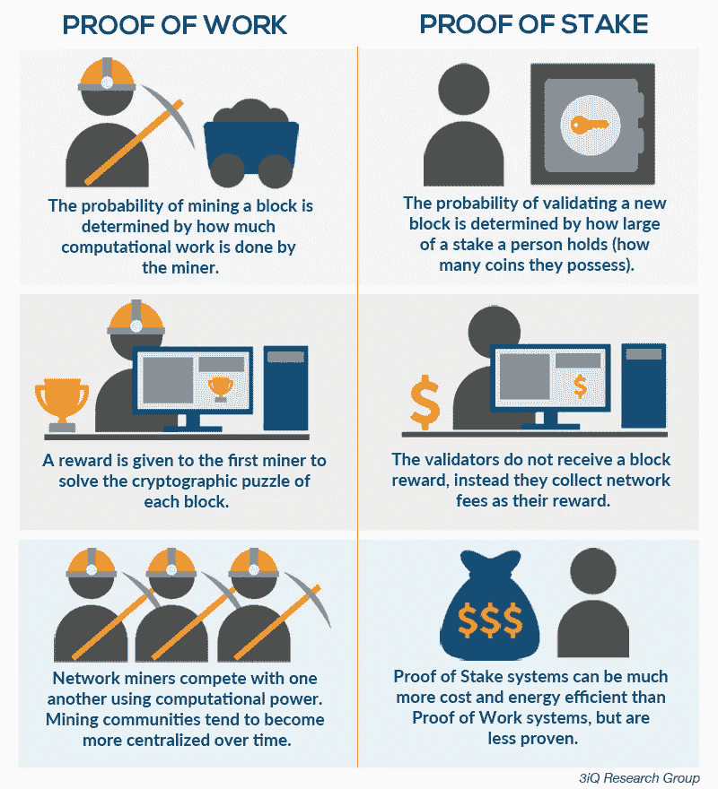

[PoW and PoS comparison diagram](https://hackernoon.com/consensus-mechanisms-explained-pow-vs-pos-89951c66ae10)

不难看出，PoS 也采用了经济学和博弈论的思想，通过激励政策和惩罚机制来保证网络的安全性和可靠性。

## PoS 为什么会起作用？

PoS 协议仍然符合传统的拜占庭容错(BFT)算法的结论。目前，对 PoS 的研究可以分为两条主线:一条是同步网络模型，另一条是部分异步网络模型。基于链的 PoS 算法几乎总是依赖于同步网络模型，其有效性和安全性可以像 PoW 算法一样被严格证明。请参考本文件中的[。](https://nakamotoinstitute.org/static/docs/anonymous-byzantine-consensus.pdf)

此外，从 CAP 的角度来看，基于链的 PoS 算法类似于 PoW 算法，同样尽可能的实现了容错，在可用性和一致性之间更加保证了可用性。

如果传统的一致性算法(Paxos、Raft 和 PBFT)实现确定性的最终性或一致性，那么 PoS 类似于 PoW，而是寻求概率性的最终一致性。从传统 CAP 的角度来看，这其实是一致性的弱化。但从实际可行性来看，也是一种全新的思考和突破。

从 PoS 的设计策略来看，可以分为两种。供参考参见，[本文](https://arxiv.org/pdf/1710.09437.pdf)。

*   第一种是前面提到的连锁式 PoS。它主要模仿 PoW 机制，通过伪随机分配区块创建权给利益相关者来模拟挖掘过程。典型代表有 PeerCoin，和 Blackcoin。其安全性和有效性可以从 PoW 的类比来看。
*   另一类是基于 BFT 的 PoS，基于近 30 年的 BFT 共识算法研究。基于 BFT 算法设计 PoS 的思想最初是在 Tendermint 中提出的。以太坊 2.0 中的 Casper 也沿袭了这一传统，做了一些修改和改进。这类 PoS 算法的安全性和有效性可以通过参考 BFT 算法来看出。例如，可以从数学上证明，只要协议参与者的 2/3 以上的节点诚实地遵循协议，算法就可以保证最终状态不存在冲突块，而不管网络延迟如何。但是这样的算法也不是完美的，尤其是对于 51%的攻击，还没有完全解决。目前，该领域仍处于开放探索阶段。

## 关于 PoS 的辩论

PoS 的思路并不复杂，更容易被诟病的恰恰是与现实世界相似，按照出资比例获取收益的制度。人们已经在警惕现实世界中的马太效应。这种制度导致的结果是，富者越富，贫者越穷:代币多的人会有更多的机会成为验证者，从而参与网络，赚取更多。

但在这个问题上的观点争议很大，很多人提出了完全不同的观点，认为 PoS 比 PoW 更公平，更有利于对抗集权趋势。主要原因是电力开采依赖于现实世界中的物理硬件和电力资源，容易产生规模经济。买 1 万台矿机的公司比买 1 台矿机的个人更有议价能力，甚至可以用更低的成本开发自己的矿机。并且，拥有一万台矿机的矿山对电费有更高的议价能力，可以迁移到电费低的国家和地区的电站附近，甚至可以以更低的成本自建电站。后果就是机构越大，综合挖矿成本越低，这也正是现实世界中真正发生过的事情。相比之下，PoS 在现实世界中不需要依赖硬件，没有规模经济优势。如果不考虑价格操纵，1 个硬币的价格和 1 万个硬币的价格是线性增加的。从这个角度来说，PoS 可能更公平，更有利于去中心化。

PoS 另一个问题是它的安全性。毕竟 PoS 不再像 PoW 一样进行复杂的 CPU 运算来证明自己。在 PoW 中，如果要发动攻击，需要控制 51%的计算能力(最近有研究发现，只需要 25%的计算能力就能使攻击成为可能)，这意味着需要大部分矿机和计算能力资源。在 PoS 中，如果要控制整个系统，需要 51%的令牌。哪个更安全？其实不好说，但是从现实世界的例子来看，如果把比特币的算法切换到 PoS 上，控制比特币系统大概需要一半的比特币市值，大概是 400-1600 亿美元(一个比特币的价格区间:5000-20000 美元)。这个数字远远高于矿机的成本。用这么大的资金发动攻击几乎是不可能的。在这方面，PoS 可能更安全。

此外，由于 PoS 部署成本低(硬件要求低)，代币在现实世界中很容易被分叉，产生一堆山寨币。这个问题在 PoW 是不存在的。PoW 靠硬件挖矿，所以很容易改变比特币的一个参数。但是，如果真的要运行它，就需要很大的计算能力和大量矿工的支持。比如从比特币分叉比特币现金，经历了波折。PoS 根本没有这种顾虑。任何人都可以下载开源代码，随意修改。通过赢得几个节点的支持，他们可以宣称自己创造了一个全新的令牌。比如从 EOS(一个代币名称)可以很容易的分叉出几十个或者几百个 altcoins，每个都声称自己是独一无二的。这确实是事实，但不好说是好是坏。

## PoS:改进和优化

PoS 机制最重要的部分是下一个块中验证者或创建者的选择机制。谁会是那个幸运儿呢？上面提到的根据账户资金比例和概率进行选择，其实是最简单的方式。这种方法确实容易导致富人获得一劳永逸的收益，从而损害网络中其他参与者的积极性。目前，有许多想法可以改善这个问题，其中比较有趣的是基于硬币年龄的方法。在挑选创作者时，不仅会考虑资金的多少，还会考虑币龄。所谓币龄，是指硬币在一个账户上的留存时间。例如，1 枚硬币转入指定账户 10 天，可以认为币龄为 10，每次硬币所在的账户发生变化，币龄都会从 0 重新计算。这样就可以限制资金量大的节点频繁成为创建者。比如可以设置只有币龄 30 的节点才有机会成为创建者，节点成为创建者后币龄立即清零。这实际上限制了大参与者的利益，为中小参与者提供了更多的机会。

在 PoS 基础上改进的著名解决方案是委托利益证明(DPoS ),其中采用了代理委托机制。在 dpo 中，不再可能让所有节点都成为创建者。取而代之的是，节点相互投票，只有投票最高的节点才能参与块创建过程。详情如下:

*   代理的职责包括保证自己节点的连续运行，收集事务信息并打包成块，验证签名和广播块，解决网络中可能出现的一致性问题。
*   对于大多数 dpo 链，网络中的所有令牌持有者都可以投票选举代理，投票权与持有的令牌数量成正比。代币持有者也可以将投票权委托给他人代为投票，而不是直接投票。
*   投票是动态的和可变的，这意味着代理人可以在任何时候当选或退出。一旦代理被发现恶意或欺诈，他/她将失去收入和声誉。这是对代理诚实和确保网络安全的激励。代理可以把收到的块奖励按比例分发给给他投票的用户(这其实相当于买票，有些场景是不允许的)。
*   与传统的 PoS 不同，代理不再需要持有大量的代币，而是必须相互竞争以赢得代币持有人的选票。
*   DPoS 限制了事务块中验证者的数量，这在一定程度上牺牲了去中心化但提高了效率，因为在网络上达成共识所需的工作量大大降低了。

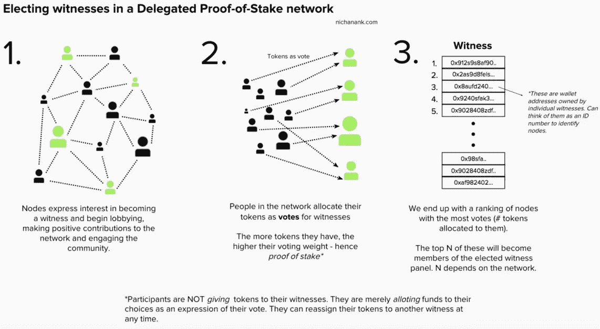

[The process of electing the validator/witness in DPoS](https://www.nichanank.com/blog/2018/6/4/consensus-algorithms-pos-dpos)

不难发现，DPoS 通过引入投票机制，尽可能地保证了节点的广泛参与。此外，通过限制验证器的数量(通常为 21-101)，系统尽可能高效。尽管争议很大，DPoS 仍然是一个可行的解决方案，越来越多的区块链系统也在尝试改进和探索。

## 在公共区块链中的应用

在公共区块链中，许多项目采用 PoS 机制。著名的有:

*   [以太坊](https://www.ethereum.org/?spm=a2c41.13497414.0.0):目前以太坊还在使用 PoW 机制。但以太坊创始人、公共区块链领域的领军人物维塔利克·布特林(Vitalik Buterin)对 PoS 机制更为青睐，也多次阐述过 PoS 的设计理念(见[本博](https://medium.com/@VitalikButerin/a-proof-of-stake-design-philosophy-506585978d51?spm=a2c41.13497414.0.0))及其相对于 PoW 的优势(见[本文](https://github.com/ethereum/wiki/wiki/Proof-of-Stake-FAQ?spm=a2c41.13497414.0.0#what-are-the-benefits-of-proof-of-stake-as-opposed-to-proof-of-work))。以太坊目前正在开发基于 PoS 的 Casper 协议(见[本文](https://arxiv.org/pdf/1710.09437.pdf?spm=a2c41.13497414.0.0&file=1710.09437.pdf)供参考)，预计今年下半年发布。这种从 PoW 到 PoS 的转变也标志着以太坊 2.0 时代的开始。如下图所示，在以太坊 2.0 PHASE0 中，将发布使用 Casper 协议的 PoS 信标链作为协调层(参考见[本网站](https://github.com/ethereum/wiki/wiki/Sharding-roadmap?spm=a2c41.13497414.0.0))。

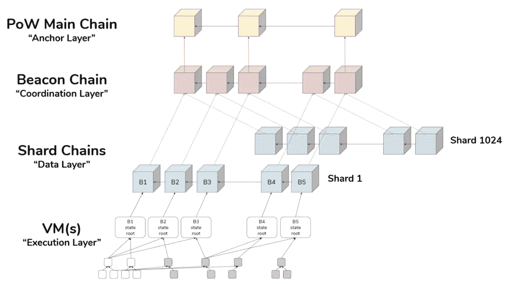

Ethereum 2.0 layers and phases

*   [EOS](https://eos.io/):DPoS 的发起人 Daniel Larimer 发起了 EOS 公共区块链项目，项目中很多节点会互相竞争，希望成为拥有记账权的 21 个超级节点之一。这种类似于现实世界理事会制度的设计引起了巨大的争议，超级节点选举也可能蕴含着巨大的商业利益，已经超出了技术讨论的范围，这里不再讨论。

# X 的证明？

事实上，PoS 机制的兴起不仅是由于其自身的特点，如低成本、高效率和分散化，还因为它为使用博弈论机制设计的更广泛的技术打开了大门，以便更好地阻止集中式卡特尔的形成，如果它们形成，也阻止它们以有害于网络的方式行事。

随着区块链的快速发展，尤其是区块链的大众化，近年来，其他 X？这种机制也正在出现。从上面的诸多机制中，我们可以看到 PoS 概念的影子，即如何从经济学和博弈论的角度设计一个制度，尽可能保证去中心化、安全性和效率。以下是对这些机制的简要描述:

*   租借的利害关系证明(LPoS):很多令牌非常少的节点可以租借令牌给其他节点，从而形成合力，增加成为验证者的概率。一旦节点赢得选举，获得奖励，服务费会按比例分配，其实类似于矿池的思路。
*   经过时间证明(PoET):所有节点必须等待一定的时间才能成为记账方，等待时间完全是随机的。要保证公平性，两个核心问题是:如何保证等待时间确实是完全随机的？如何保证某个节点真的等到了指定的时间？目前的解决方案依赖于英特尔的特殊 CPU 硬件，即英特尔 SGX 系统。目前，它只能应用在许可的网络环境中，如前面提到的企业以太坊联盟(EEA)。
*   活动证明(PoA): PoA 结合了 PoW 和 PoS 思想。在 PoA 中，初始过程类似于 PoW。矿工们还在争着解决问题，挖矿，只不过挖出来的块只包含了头信息和矿工的地址。一旦挖掘出一个区块，系统会自动切换到 PoS 模式。块头信息指向随机的股份持有者，其验证预先开采的块。
*   重要性证明(PoI):鉴于 PoS 机制倾向于鼓励人们持有硬币而不是流通硬币，并倾向于导致富人越来越富的问题，PoI 在计算节点对系统的重要性中纳入了更多维度:除了硬币数量和硬币在账户上的保留时间，交易对手(与其他账户的净交易越多，得分越高)， 以及最近 30 天的交易次数和规模(交易越频繁，金额越大，得分越高)也在考虑之列。
*   容量证明(PoC):也称为空间证明(PoS)。想法和 power 类似，只是用存储空间而不是 CPU 计算能力来衡量。
*   燃烧证明(PoB):矿工必须燃烧一定数量的代币，这意味着将一定数量的代币转移到一个食者地址(黑洞地址，代币只进不出，即私钥未知的地址)来证明自己。本质上，它接近于 PoW 的概念。不同的是，power 消耗计算能力资源，而 PoB 直接消耗令牌。
*   重量证明(pow Weight):pow Weight 基于 PoS 中对代币数量的考虑，考虑了更多的权重因素。例如，FileCoin(IPFS 分布式文件系统上的令牌)考虑了您拥有的 IPFS 数据的大小。其他加权因子包括但不限于时空证明(PoSt)和声誉证明(PoR)。

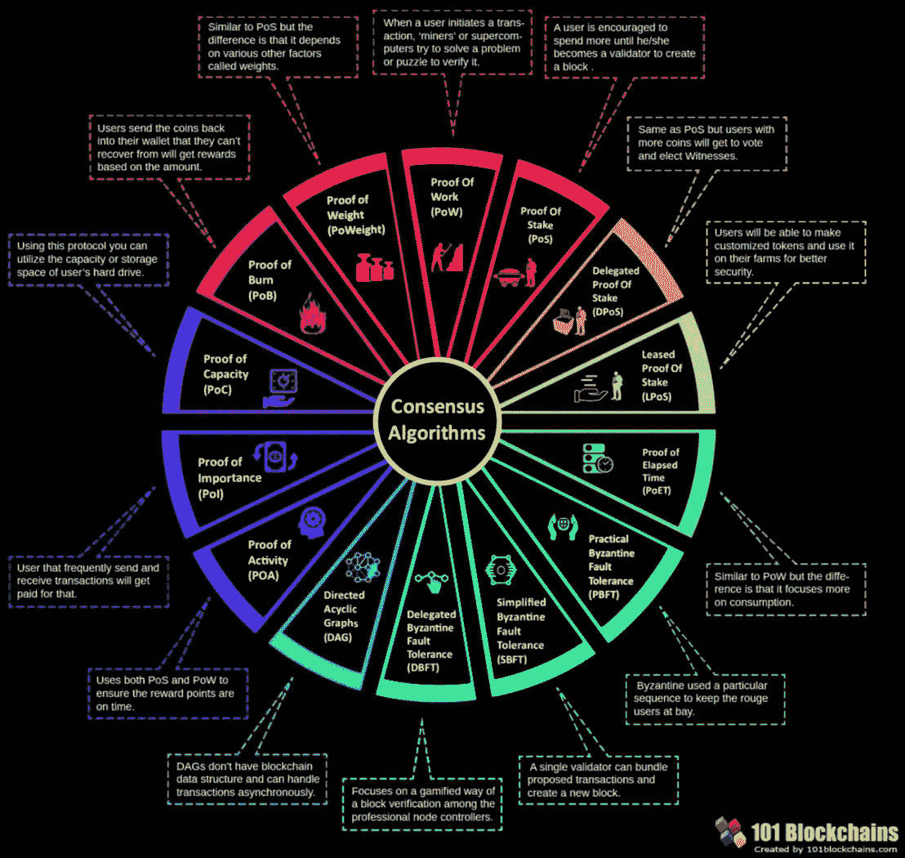

[An Overview of consensus algorithms](https://101blockchains.com/consensus-algorithms-blockchain/)

可以看出，虽然 Proof-X？机制层出不穷，各不相同，要解决的核心本质问题是一样的:谁会是记账的幸运儿？这些机制只是采取不同的政策制定游戏规则，让节点尽可能公平地证明自己，公平地选择幸运者。所有这些策略，包括 CPU 计算能力、持有令牌数、存储空间大小、随机等待时间、烧毁令牌数、节点活跃度、节点贡献度，都是对特定场景下开放网络一致性问题的探索。

# 关于信任的一切

从 PoW 到 PoS，再到“X(你能想到的一切)”的证明，无权限网络中的一致性问题一直在探索中。“一致性”的内涵也在发生变化，从如何防止网络和机器硬件的故障来保证网络节点间的数据一致性，到如何防止开放网络中人的恶意行为来保证节点间数据的真实一致性。可以说，我们已经从硬件的可靠性走向了“人的可靠性”，而公共区块链技术也被视为“信任机器”但是“人的可靠性”这个问题太复杂了，甚至超出了技术范畴。现阶段能做的，还远远不能保证“人的可靠性”。但在大多数情况下，还处于人们对机器、对协议的信任阶段。幸运的是，我们终于迈出了这一步，开始正视这个棘手的问题，探索创新的解决方案。

[The trust machine](https://www.economist.com/leaders/2015/10/31/the-trust-machine)

# 摘要

这个世界充满了不确定性，计算机科学也是如此。自从计算机出现以来，我们不得不面对机器硬件的不确定性:意外故障可能产生的问题。而且，自从互联网兴起以来，我们不得不面对网络的不确定性:通信消息可能的延迟、无序和丢失。不确定性问题最自然的解决方案是冗余。大量的节点用于保证系统的整体安全，避免单点故障(SPOF)，增强容错和攻击防御能力。正是在这个基础上，大规模分布式网络蓬勃发展。如何在不确定的网络和节点之间找到确定性，协调多个节点之间的一致性，正是分布式一致性算法需要解决的问题。能够处理故障类型错误的 CFT 算法包括最经典的 Paxos 算法和更简单的 Raft 算法。当网络中正常节点超过一半时，算法的有效性可以得到保证。这些算法通常用于具有可信环境的封闭网络中，以协调几个到几十个节点之间的一致性，例如公司内部的分布式存储、分布式服务协议和分布式消息系统。此外，它们还可以应用于由少数需要授权才能访问的组织组成的私有连锁网络。

但是，不确定的不仅仅是网络和机器本身，还有人在网络中控制节点的行为。在攻击者可能更改数据或未经授权攻击网络的情况下，如何保证分布式网络的一致性，正是 BFT 算法需要解决的问题。最常见的 BFT 算法是 PBFT 算法。当网络中正常节点超过 1/3 时，可以保证算法的有效性。即便如此，PBFT 应对网络中恶意行为的能力仍然有限，其性能也会随着网络中节点数量的增加而显著下降。这些限制也导致了 PBFT 算法只能用在更可靠的许可网络环境中，来协调几个到几十个节点之间的一致性，比如在私有链场景中。

然而，在一个无许可的开放网络中，不确定性问题更加严重，尤其是网络节点背后的人的行为的不确定性。如何防止网络中的控制者通过腐败和合谋形成巨头，从而控制网络中一半以上的节点，达到控制、破坏和攻击网络的目的，是开放网络中要解决的问题。从这个角度来看，开放网络中的一致性也隐含着安全的前提:它不仅要求节点之间能够达成共识，而且这种共识确实是由众多节点控制者的真实表达形成的。要实现这种一致性和安全性，不仅要实现物理硬件节点的结构去中心化，还要尽可能保证节点背后实际控制者的去中心化。为此，需要:保证任何人都可以随时部署和运行网络协议，成为网络中的一个节点，并且可以随时访问网络；保证节点间对等通信，无任何集控节点；并且保证节点的角色完全对等，所有节点都能按照规则公平参与记账。如何协调开放网络中数万个节点之间的行为，保证网络的一致性和安全性，是公共区块链共识机制要解决的问题。其中最典型的是比特币发起的 PoW 共识机制，以及随后的 PoS 共识机制。这些共识机制不再局限于技术上的一致性，而是更多的引入了经济学和博弈论的思想，从经济学和博弈论的角度尽可能的保证网络的一致性和安全性。

从封闭分布式网络环境中的一致性到许可私有链场景中的一致性，再到无许可公共区块链开放网络环境中的一致性机制，问题越来越复杂，挑战越来越严峻。从纯技术角度看，对共识的研究是一脉相承的。这些共识算法或共识机制还受到传统分布式共识理论研究中的 FLP 不可能性和 CAP 定理的限制。Paxos、Raft 和 PBFT 都强调容错和安全性/一致性，而弱化活跃度和可用性。PoW 和 PoS 从全新的角度考虑问题，尽可能保证容错性、活性和可用性，放弃对安全性和一致性的确定性的追求，只以概率的方式追求最终的安全性和一致性。

此外，对共识的思考也在不断深化，从单纯的节点之间的数据一致性，到强调节点背后的人之间的共识和认同，从保证网络和硬件的可靠性，到尽可能保证组成网络的节点背后的人的可靠性。虽然人与人之间的可靠性非常复杂，超出了纯粹的技术范畴，但令人欣慰的是，我们已经在路上了，在这个领域正在进行的创新和积极探索，一定会让这个世界变得更加可靠。

# 原始资料

 [## 从分布式共识算法到区块链共识机制

### vic 2019 年 8 月 30 日 473 分布式一致性确保了分布式系统或……

www.alibabacloud.com](https://www.alibabacloud.com/blog/from-distributed-consensus-algorithms-to-the-blockchain-consensus-mechanism_595315?spm=a2c41.13497414.0.0)