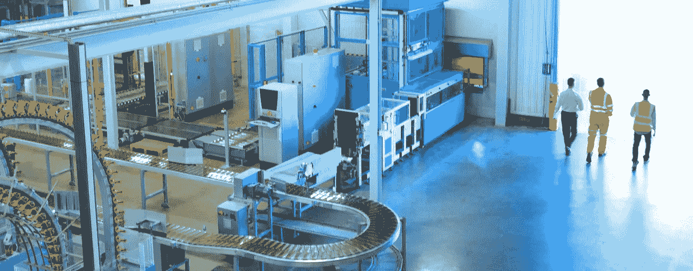

# 从无人机到石油公司:机器学习目前能做什么

> 原文：<https://medium.datadriveninvestor.com/from-drones-to-oil-companies-what-machine-learning-is-currently-capable-of-e0534a73a77?source=collection_archive---------21----------------------->

还记得你童年时看的那些关于飞行汽车和空中城市的电影，你从来不相信它曾经变成了现实吗？没错，它还没有成为现实，但我们已经有了飞行无人机，而不是飞行汽车——智能编程收集城市街道上的信息，就在上空漂浮。这被称为*对象检测*，对于每个数据科学家来说，这都是一项有趣的任务。但是机器学习不仅仅局限于制造自主机制，它的兴趣领域更广，更广…

当谈到机器学习的机会有多种多样时，要考虑到世界上巨大的行业和公司。零售、制造、医疗保健和生命科学、旅游和酒店、金融服务、能源原料和公用事业……我是否已经计算了对世界经济、福祉和治理影响最大的所有领域？它们现在都在以某种方式实现机器学习服务——无论是无人驾驶的谷歌汽车，还是通过*图像处理*和*物体检测*收集城市街道状况信息的无人驾驶飞机，或者是被教会识别数百万张面孔并嵌入强大推荐引擎的脸书机制(你可以通过 feed 中多年未见的老朋友的面孔来了解这一点)。是不是很迷人？现在让我们更深入地发现机器学习目前为每个大型行业做了什么。

**零售。**

在现代社会中，我们在购物时所做的决定并不总是受到我们自己严格的必须购买产品清单的指导，但我们总是禁不住要花钱买“我一直想买却忘记了的东西”。这些优惠就在我们眼前——通过手机或个人电脑到处追逐我们。那么这种神奇是如何发生的呢？似乎有人直接进入了我们的潜意识，并从那里窃取了信息。实际上，这并没有什么魔力——只是数据工程师和机器学习分析的微妙工作。

推荐引擎、购物篮分析、保修分析、价格优化、库存管理、客户情绪分析、终身价值预测等等。这个术语对那些关心企业高收入的人来说确实有意义。我们的 IT 公司— [SPD-Ukraine](https://spd.group/) 在 R\retail 领域拥有丰富的专业知识和特别的兴趣。上面提到的一系列服务是帮助我们的零售商从他们的顾客身上赚取更多的“魔棒”。想提高销量又不想在充沛的保养上花费额外的费用？去找一个 ML 专家，他会利用顾客过去的购买信息来预测顾客的行为；预测他们的**终生价值**通过分析他们已经花了多少钱来知道他们据称能在你的产品上花多少钱。这是通过收集、清理和分类客户购买历史和偏好的数据来实现的。ML 算法甚至能够检测出顾客特征和他们选择购买的东西之间隐藏的相关性。检查网上商店中**顾客的购物篮**有助于零售商了解这个特定用户的最佳位置、价格和产品布局组织。

机器学习为零售业所做的最后但并非最不重要的两点是**保修分析**和**价格优化**。对零售商和顾客来说，最优价格是每一笔生意成功的关键因素，有时很难估计。但 ML 使用这样的机制，即通过复杂的计算过程，从顾客的承受能力、一件商品的主要成本和竞争对手对同一产品的价格等输入中提取出最佳价格选择的输出。另一件事是保修索赔监控。通过挖掘算法和细分分析，我们可以生成可操作的实时计划和建议，以降低成本和提高质量。

**制造业。**

通过让 ML 专家分析*重复出现的数据模式*，M 制造公司现在能够使用数百万个数据单元来为他们的业务造福。一旦从过去的数据中学到的东西被应用到新的数据中，重要的趋势和异常就会被发现。因此，在农业、化学、机械工程等领域中，ML 可用于监控制造过程并在故障导致需要修复的情况之前防止故障。

第二，随着最大似然法的出现，最终产品的质量甚至在它存在的早期就可以非常准确地预测。这可以消除测试产品的必要性，只要它已经没有缺陷。

第三，算法还可以为电力公司实时预测**未来需求**和**价格波动**，并使得基于过去的数据优化成本价格和需求成为可能。同样，我们都期待着自动驾驶汽车将取代大部分人类体力工作的时代，所以这也是我们需要由数据科学创造的**神经网络**(模仿人类大脑中的神经元)的地方。只有深度学习技术才能使这些机器实时解释它们的周围环境，而不是在预定义的条件下。

这是第一部分的结尾，在这里我们了解了机器学习在**零售业**和**制造业**中的应用。请尽快阅读关于*医疗保健、酒店*和*能源原料*和*公用事业*的内容…

[社民党-乌克兰](https://spd.group)