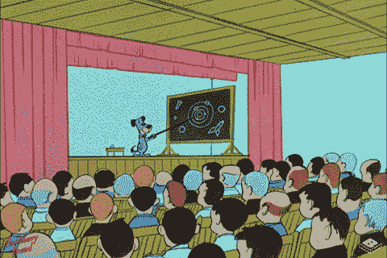

# 从有想法到变成网络课程不到 10 天。我就是这么做的！

> 原文：<https://medium.datadriveninvestor.com/from-idea-to-online-course-in-less-than-10-days-6ea42e9d498e?source=collection_archive---------13----------------------->

create an online course

我在这个平台上已经有一段时间了。我想通过给你我在网上直播课程时所采取的具体策略来回报你。

去年，我创建了一门在线课程，单月收入超过了 3 万美元。这是一笔交易，它并没有在一个月内停止，而是在一年内仅从一门课程中赚了超过 30 万美元。

课程最大的好处是，如果你知道自己在做什么，你可以创造任何东西，并很快拥有听众。

对于大多数人来说，因为他们沉迷于课程的细节，他们通常要花上好几个月的时间来创建一门课程。我采用这种方法，预先推出我的课程，并从中获利。

但这些事已经够多了。让我们开始吧，直接进入战略。

**这是为期 10 天的课程挑战！**

在这个系列中，您将了解如何找到您的课程定位，您的竞争对手在哪些方面做得非常糟糕，如何构建您的课程内容和基础，如何确定外包和委托的方式以帮助扩展您的课程，免费和付费营销渠道，以及成功发布的步骤。

**兴奋地向你展示这个:**

**也可以随便问什么。下面是第一天:**

**第一天:找到你有利可图的课程利基**

所以让我们开始吧！在今天的帖子中，我们将讨论如何帮助你找到理想的课程定位。在你开始创作内容和招收学生之前，你需要确定一个课程主题。这听起来很容易，但是对你的课程主题进行思考是很重要的。以下是一些需要记住的要点:

*   从头脑风暴一些似乎适合你的想法开始。然后，使用以下指针缩小列表范围。
*   确定并致力于一个途径；定义一个你 100%投入的领域，你精通的领域…然后精通它！不要试图涵盖一个以上的主题，领域，或利基。这正是成功企业所做的:他们提供一到两种核心产品或服务，然后努力让它们变得出众。
*   考虑你想教谁。一些学生在寻找一个小问题的快速解决方案，但是一些学生在寻找一个转变。那些愿意投资于更有影响力的结果的学生将会更投入，维护费用更低，并且很可能有更大的购买力。
*   考虑这个话题:它让你兴奋吗？你会喜欢教它和谈论它吗？与你的任务相关吗？
*   分析一下你在这方面的记录。在这方面，你的社交媒体和公共网站对你有什么看法？你以前在什么地方帮助过别人，在什么领域？
*   做一些研究，以确定现在是否是教授你的主题课程的好时机。它与当今市场相关吗？查看谷歌搜索结果和亚马逊书籍，看看哪些话题是热门的，人们对这些话题有什么看法。
*   考虑它是否能解决你个人的“为什么”以及你想以什么而出名。这是你将来想谈论的话题吗？或者写一本关于。
*   记住，你不需要成为这方面的专家；事实上，这有时可能是负面的(更多关于第 4 天的“初学者的好处”)。

为你和你的学生选择正确的课程主题将会扩大你的专业知识和权威，并给正确的学生带来最大的好处。这就是好课程和伟大课程的区别。

既然你已经选择了你的课程主题，请查看明天的帖子，看看如何在竞争中脱颖而出。

**第二天:在**发现你的竞争对手有哪些不足之处

在今天蓬勃发展的在线学习市场中，你可能会看到许多主题与你相似的课程。对一些人来说，这可能令人沮丧。但是不要担心——有一些可靠的方法可以帮助你的课程脱颖而出。让我们来学习如何发现你的竞争对手在哪些方面做得不好(这样你就可以知道如何在这些方面不做得不好)。

**第一阶段:研究**

带上你的侦探，花些时间上网。在 **Miestro** 和其他网站如 Teachable、Udemy、Thinkific 等上查看类似的课程。看看学生们对他们的评价。去课程所有者的网站、社交媒体和搜索引擎，看看你是否能找到客户或学生的任何负面评论。一边走一边记笔记。

**第二阶段:分析**

根据您在第 1 阶段找到的信息，做一些细致的分析来确定三件事:竞争对手做得不好的地方，他们做得好的地方，以及缺少的地方。你可以从有什么和没有什么中学到东西——他们在课程中没有提到什么？学生们说他们想要更多的是什么？你有哪些竞争对手没有提供的东西？

**第三阶段:实施**

使用你的研究和分析笔记，头脑风暴一些你可以在引人注目的营销内容中使用的语言，这些语言可以展示你有多棒(与竞争对手相比)，你提供了什么使你的课程独特和特别，以及你的课程将如何解决学生的痛点并帮助他们成功实现目标。

将这种语言放在手边——在明天的帖子中，你将学习如何创建和组织你的课程内容。

**第三天:如何勾勒和构建世界级的课程内容**

在今天的帖子中，你将学习如何概括和组织你的课程内容。这个过程有两部分:内容大纲和基础系统。

**课程内容大纲**

一个好的大纲将确保你的课程包括所有的步骤、技巧和工具，这些都是你的学生取得成功所需要的。更进一步，大纲应该帮助你以最有效的顺序定位内容，以确保你的学生获得最大的价值。以下是你如何建立一个杀手大纲。

第一步:首先列出学生实现目标需要学习的所有技能，或者从 A 点(问题的起点)到 B 点(你提供了解决方案的终点)应该采取的步骤。如果你需要帮助建立这个列表，做一些研究。看看与你的主题相关的课程或书籍，看看它们包含了什么主题/课程；寻找任何出现的模式。

*提示:为了让自己有条理，可以考虑以下方法之一:*

*   *老派:写下每个主要话题、技能，或者在索引卡上用一两句话来描述。*
*   新学校:看看 Trello，它基本上是索引卡的应用程序版本。

**步骤 2** :使用你列出的技能或步骤，按逻辑顺序排列(这取决于你的课程主题——我们将在接下来的基础系统部分讨论)。把这想象成一本书的目录——在这一点上，大纲应该是你课程内容的框架。

**第三步**:补缺时间。在每个主题下，列出你的课程需要包含的个别课程。请记住你在第二天的帖子中所做的调查——你的竞争对手做得不好的地方，他们做得好的地方，以及他们没有包括的地方。这是你填补这些空白的地方，确保你的课程能够脱颖而出。

**第四步**:将主题和副主题以模块/课程的形式进行编排。标准的课程格式如下所示:

**模块 1:主题**

第一课:副题

*   细节
*   工作表、工具、讲义、家庭作业

第二课:副主题

*   细节
*   工作表、工具、讲义、家庭作业

注意:不是每节课都需要工作表、讲义或家庭作业。

第五步:以每节课的脚本或长篇描述的形式继续扩展你的内容。此时不要担心编辑或校对，只要写就行了。你可以用它来制作视频脚本、幻灯片、工作表、课文，甚至是你的博客或其他营销材料的配套内容。

**课程基础体系**

如果你的课程没有一个基础体系，你会有一种缺失了什么的感觉。这是将你的课程与其他课程区分开来的要素，并将你的内容以一种给你的学生带来高价值和成功的方式联系在一起。

**一个好的课程基础会具备这些要素:**

*   你独特的教学方法。
*   你独特的词汇只适用于你和你的课程。
*   考虑创造首字母缩略词和其他措辞来帮助你的内容坚持。
*   一种逻辑组织，要么逐渐地，要么作为一个集合。
*   渐进的组织是有序的。最适合需要先教一步再教下一步的课程。
*   收款组织是无序的；这将适用于具有一组相关品质或主题的课程。
*   引人注目和独特的包装。这就是你的内容是如何呈现的。创建自己的图表、视觉效果、图形、公式等。为了帮助你的内容产生最大的影响。
*   内容故事或背景环境。例如，这可能以你个人故事的形式出现。

**底线:**寻找让你的课程令人难忘、吸引人、有趣且有个性的方法。不仅你的学生会喜欢它，而且它很难复制，这赋予了它更多的价值。价值越高，收费就越高——我们将在第 4 天讨论课程定价。

**第 4 天:为你的课程定位要求溢价**

现在你已经建立了一个坚实的课程基础和内容计划，让我们来解决一个更困难的话题:如何为你的课程定价。不幸的是，没有明确的答案或方法来计算出任何特定课程的神奇数字应该是多少。但是，因为它是更可取的要求溢价定价，有一些事情你应该在决定之前考虑。

**你应该要求溢价定价的诸多理由:**

人们指望你能带来重大的、变革性的成果(这是你的营销材料所承诺的，对吗？).对他们来说，结果比付出的代价更重要。事实上，更便宜的价格使人们感到不安，对你或你的产品更不信任。较高的价格通常与较高的价值相关。

溢价定价与你的品牌地位和感知密切相关。你希望在市场上被人如何看待？就像街区里的廉价男人或女人，打折的球场垃圾箱，清仓区？还是标着承诺高质量高价值的价格的奢侈品？

通过优惠的价格，你吸引了合适的顾客。寻求真正转型和解决紧迫痛点的人会知道，投资于承诺结果的解决方案是值得的。这个人是有投入的——他们致力于这个过程，致力于他们的成功，并且他们会尽可能努力地去实现这个目标。

请相信我，以每门 1000 美元的价格出售 10 门课程比以每门 100 美元的价格出售 100 门课程要省力得多。

将你的课程定价过高不仅意味着权威，还会迫使你将自己定位为权威，并在营销材料中为潜在客户的价值信号提供答案。可以说，你给自己施加了压力，要求自己兑现溢价的承诺。

即使是新课程的创建者也可以要求溢价，尽管他们是新手。这是因为“初学者的好处。”

新课程创建者更有可能为每个学生提供更密切的个人关注——他们和学生一样需要反馈和验证。

新手也更有可能向学生提供定制的反馈。例如，他们还没有机会开发一个“常见问题”脚本。

因为课程是新的，并且正在验证过程中，新课程的创建者与学生的成功有着切身的利害关系。

综上所述，请记住“溢价定价”并不意味着欺骗你的学生，收取高于你课程价值的费用。它把价格定得很高，因为这就是你的课程的价值，也是你将提供的东西。

显而易见，溢价定价可以使大多数课程创建者(和学生)受益，但课程内容和结构也应该效仿，以提供高质量的服务和产品。在第 5 天的帖子中，我们将讨论如何构建您的课程，以最大限度地提高学生的参与度并取得成功。

**第五天:构建你的课程以获得最大效果**

如果你熟悉在线课程，你就会知道它们有各种各样的形式。成功的课程创造者知道多样化是一件好事。具体来说，使用各种内容媒体将有助于你的课程与众不同。在 Miestro 上建立您的课程为您提供了构建课程的灵活性和无限选择，并将帮助您的课程脱颖而出。

在课程建设中，有许多媒体选项可供选择:

*   书面讲稿
*   幻灯片
*   问卷或测验
*   现场问答讨论(Google Hangouts、优步会议等)。)
*   课程文档(例如，通过 Google docs 托管)
*   PDF 指南

视频——摄像机上只有你的脸、截屏/幻灯片、教师在背景中使用白板、叠加有脸的幻灯片等。

因为如今视频正迅速成为内容之王，尤其是在课程创作领域，让我们更近距离地看看这种媒体。

**为你的课程制作视频**

以下是你应该知道的关于为你的课程制作视频的一些事情:

即使你是一个业余爱好者，也有可能为你的课程制作视频。首先，你真正需要的是一部智能手机和一台电脑。

考虑一个三脚架或支架来保持拍摄稳定。

花 5 美元左右就可以下载视频应用程序，从标准的电话录音中升级质量。

永远记住尽可能在你的视频中注入一点个性和幽默。让它们变得令人愉快将有助于学生参与其中，并使它们令人难忘。但是保持娱乐价值与教育价值的平衡——在线课程应该教育第一，娱乐第二。

**尝试几个便宜(免费)的装备技巧:**

自然采光既容易又免费。只要让窗户在你前面，而不是在你后面，除非你有灯来平衡阳光。

让自己出现在屏幕的一侧——这在你添加文本或截屏时会很方便。

千万不要跳过视频编辑。是的，它可以是详细的，技术性的，有点复杂，但即使是一个 DIY 者也可以很好地掌握它，以制作一个好的视频。我们将在第 6 天讨论视频编辑选项。

请记住，如果没有为观众提供高质量和有价值的内容，即使是由行业专家控制的最昂贵的设备制作的最高质量的视频也可能完全失败。

**为您的课程制作幻灯片**

在线课程内容的另一个非常常见的媒介是幻灯片，所以这里有一些要点供考虑:

确保创建的幻灯片与视频格式相同(即 16:9 的宽高比)。这将确保兼容性。

保持书面内容简短、甜蜜、切题。没有段落。当制作多个(短)点时，使用项目符号—如果需要，将每个点扩展到另一张幻灯片。

挑选 2-3 种颜色用于整副牌。一种深色、一种浅色和一种强调色应该可以覆盖它；让它们看起来简单又舒服。

保持字体简单易读。无衬线字体在移动设备上更容易阅读。

字体大小很重要——越大越容易阅读，所以不要犹豫使用大字体。

尽量避免使用俗气的图片(这会给你的高价课程带来低质量的感觉)。有许多免费图片网站提供“无库存”图片。

**附加内容建筑技巧**

总的来说，让你的课程简明扼要。事实证明，这有助于提高学生的成功率以及对课程的整体参与度和满意度。大多数学生可能每天都有时间完成至少一节 15 分钟的课，但对于 2 小时的课来说就不是这样了。即使完成一堂简短的课也会给你的学生一种成就感，并让他们继续学习。但是，用“没完没了”的视频课程让他们沮丧，例如，他们必须在多天内开始和停止多次，这不会让你成为一个快乐的学生。相反，专注于在最少的时间内提供最大的价值——考虑哪种媒介选项可以为你提供这种平衡。

此外，与普遍的看法相反，没有必要在开始之前完成整个课程。没错。专注于完成前一两个模块(建议从 20%的内容开始)。事实上，这样做有很多好处:

1.  您能够尽快回答任何学生的需求，并将他们的反馈整合到新的课程、功能或工具中。这将允许您增强未来的模块，而不必重做那些视频或幻灯片。
2.  你也能够处理任何技术问题。也许学生在视频中听不清你的声音，你发现你需要一个新的麦克风。你用那个坏了的麦克风重做了剩下的视频，节省了几个小时。
3.  最终的回报是:你可以在未来的模块和课程中加入更多学生喜欢的东西，什么最有效，什么能带来最好的结果，以及更少的，嗯…糟糕的东西。
4.  所以仔细考虑你的中等选择。如果你不担心变得太技术性，不要担心——第 6 天会给你选择外包那些可怕的必做之事。

**第 6 天:外包那些没人想做或谈论的硬东西**

创建一个在线课程需要创造力、动力和毅力——所有这些你，课程的创建者，都必须具备。然而，你不需要大量的技术知识。谢天谢地，还有另一个选择:外包。

是的，你没看错。把那些需要你很长时间才能完成的任务，或者那些你没有能力或耐心自己完成的任务租出去。有时候多花一点钱会让世界变得不同。

以下是一些你可以考虑外包给专业人士的事情:

1.  **视频编辑**——考虑将你的视频编辑外包给专业人士，进行更长时间、更技术性的视频编辑。
2.  **文案**——一名自由撰稿人可以为你提供一些用于营销材料的文案，帮助推销你的课程。考虑在几个不同的地方使用该副本的片段。
3.  校对和编辑——除非你对自己的写作技巧非常有信心，否则你可以考虑聘请一名编辑来检查你的课程材料，看看有没有明显的错误，尤其是如果你有很多书面材料的话。
4.  平面设计——平面设计师可以帮助你准备讲义、图片和视觉材料。其中一些你可以用在你的课程材料和市场营销中。
5.  **营销** —考虑雇佣一名自由职业者来帮助你营销和销售你的课程。他们可以帮助你计划社交媒体发布，有策略地措辞并在你的博客上放置 CTA，甚至为你发送发布周的电子邮件并监控回复。
6.  那么你在哪里可以找到这些领域的熟练专业人士呢？看看像 Upwork、99designs、Fiverr、Toptal 或 Freelancer 这样的网站。根据你喜欢的服务和你的预算，你肯定会找到至少几个不错的选择。

说到找人来帮你工作……第 7 天的帖子会给你一些建议，告诉你如何建立一个团队来扩展你的课程创建业务。敬请期待！

**第 7 天:建立一个团队来扩展你的课程业务**

你可能会问，什么比创建一门在线课程更好？创造了很多！为了扩大你的课程创建业务并使其更上一层楼，你最好为自己建立一个团队。

如果你还记得，在第 6 天，我们谈到了将某些类型的任务外包给熟练的专业人员，他们很可能是你的合同工。今天，我们将在此基础上，讨论您可能希望作为团队永久成员加入的角色。

1.  社交媒体营销经理:这是一个管理社交媒体营销活动和社交媒体领域日常活动的人。他们可能参与创建和管理您所有社交媒体网站上的所有发布内容。他们将监控评论、反馈和互动，以确定培养销售线索和销售的方法，或者改进课程设置。他们将通过回复评论和与用户互动来与“你的公众”互动。
2.  平面设计师:跳出第 6 天讨论的自由职业者的位置，这个人将负责为课程和营销目的(销售线索磁铁等)创建图形、视觉效果、pdf 指南、课程幻灯片、视频和其他图形内容。).
3.  文案:这位全职团队成员不仅协助创建课程内容，还负责营销材料内容、定期(每周)发布的相关博客帖子、供其他团队成员在各自角色中使用的消息(即，社交媒体帖子，有长有短、销售线索磁铁和幻灯片的内容等)。).他们将负责你的外部网站和整个课程内容的信息传递，反过来，他们将与你的其他团队成员携手合作。
4.  当然，建立一个稳固的团队需要时间，但从长远来看，这种努力是值得的。然而，从短期来看，我们仍然需要销售您的第一道菜。在下一篇文章中，我们将回顾一些最有效的销售技巧。

**第八天:用扎实的文案推销你的课程**

也许你对在线课程有一个成功的想法，但这并不意味着你知道如何销售它。文案可能不是你的菜。也许这是你决定外包给专业人士或委托给团队成员的一项艰巨任务。但是万一你决定自己去对付这只野兽，有几件事你应该知道。

一、到底什么是文案？它本质上是书面形式的销售。它制作促销和营销材料来帮助你销售你的产品或服务。它绝对比表面上看起来更像一种艺术形式。

好的课程文案会清楚地传达你的课程所提供的信息。它应该是有教育意义的，提供价值，而不仅仅是冷冰冰的推销。它还会在潜在客户有机会提问之前回答他们的问题。以下是你的邮件应该回答的几个问题:

*   “我能信任你吗？”
*   你可以通过如何在营销材料中展示自己来回答这个问题。通过分享你之前经历的细节，并相应地调整你的公众形象，将自己定位为权威(你的社交媒体对你有什么评价？)，你会显得更值得信任。
*   “这些信息对我真的有价值吗？”
*   你可以通过向你的目标学生展示他们从你的课程中获得了什么，以及你的课程能为他们解决什么紧急问题来回答这个问题。“你有问题，我有解决办法。”一个简单但有效的等式。
*   "为什么我需要现在而不是以后修你的课？"
*   要回答这个问题，你可以在营销中制造紧迫感，并提醒你的学生，他们的问题不会自行消失。他们可以现在就采取行动解决问题，或者任其恶化。
*   "你会给我成功所需的工具和信息吗？"
*   要回答这个问题，你可以清楚地表明你的课程提供了循序渐进的指导，包括指南、工作表等。所以他们永远不用猜。
*   “为什么我不能读一本关于这方面的书，为自己节省几千美元？”
*   你可以解释说，这门课程旨在让学生对自己、教师和其他学生负责。不仅如此，您的课程还旨在为他们提供频繁的反馈和实时指导，以跟踪进度并确保实现目标。一本书能做到吗？
*   "是什么使你的课程比其他课程好得多？"
*   你可以通过展示他们的其他选项来回答这个问题，以显示你的课程价值。这看起来会像这样:
*   替代方案 1:书本——没有参与、反馈或指导。
*   选择 2:私人教练——最昂贵的选择，不允许学生按照自己的速度和时间表学习。
*   替代方案 3:更便宜的课程——清仓架上的课程不包括你独特的课程基础和系统，它能最大限度地提高学习和解决问题的能力。

不管怎么切片，都避免不了文案。但好消息是，你可以通过从你的原始副本中创建其他材料来最大化你投入的价值。考虑在博客帖子、社交媒体帖子、免费网络研讨会、给你的部落发电子邮件等事情中使用上述问题的答案。

幸运的是，一旦你有了固定的拷贝，你有很多方法和渠道来销售你的课程。我们将在第 9 天讨论免费和付费选项。

**第 9 天:建立你的电子邮件列表，用免费和付费流量销售你的课程**

欢迎来到第 9 天！你现在有课程和营销材料，但你需要学生！今天，我们将讨论如何建立您的电子邮件列表并销售您的课程。大多数选项都是免费的，但你可能会发现在这方面花些钱是值得的，所以我们也包括了付费选项。

**建立你的邮件列表**

首先，让我们明确一点:你的邮件列表将决定你课程目标的成败。道理很简单:你的电子邮件订户越多，你推销课程的机会就越多。尽管电子邮件的转化率最低(1-2%)，但多一百封电子邮件可能意味着多卖出一两门课程。

谢天谢地，有很多方法可以建立你的电子邮件列表。这些通常分为两类:现场和场外策略。现场策略包括以下内容:

*   为您当前的博客文章添加内容升级。也许你可以创建一个方便的 pdf 指南，为你的读者提供一些额外的有用信息，除了他们刚刚阅读的博客文章。“免费”送出，以换取他们的电子邮件地址。
*   考虑将销售线索磁铁或 CTA 添加到您的主页或最常访问的页面。但是不要在这里撒野——你不想让 CTA 在你的读者点击的每个页面上弹出来而惹恼他们。通过分析你的交通模式，优先考虑你把这些放在哪里。

站外策略可以包括在你与人互动的任何网站上提供免费赠品:

*   脸书个人资料横幅
*   推特简历和大头贴
*   Instagram 简历和帖子
*   Pinterest 图钉
*   LinkedIn 个人资料和标题
*   您的电子邮件签名
*   书面内容的 Bios(想想客座博文)

另一个非常好的选择是开发一系列脸书现场“课程”,在那里你每周教授一个主题，持续几周。当然，每集都应该与你的课程主题相关，并且应该提供他们何时/何处可以获得更多信息的信息(例如，你的课程将在何时/何处推出，或者他们可以在你的网站上找到什么)。

正如你所看到的，大部分都是免费的。当你准备出售你的课程时，考虑付费选项(下面讨论)。

**付费期权**

现在该谈正事了。您已经通过一些免费选项扩大了您的电子邮件列表，但让我们看看一些付费方式来扩大您的列表并销售您的课程。

*   联合网上研讨会虽然可能需要时间和金钱来制作，但在网上研讨会后获得可靠的线索或销售方面非常有成效。至少，你会看到你的电子邮件订户有所增加。
*   考虑投放广告——脸书和 YouTube 为广告投放提供了很好的场所。
*   也调查一下 Google AdWords。

推销你的课程的一个小技巧:尽可能线下销售。在网上销售需要大量的书面工作和专业知识，但电话销售显示出 20-50%的转化率。它更便宜，更容易，更快！只要给你的订户详细介绍你的课程提供了什么，以及你如何能提供帮助，然后告诉他们联系你以获取更多信息。

在增加你的清单后，只剩下一件事要做:开始你的课程。第 10 天见！

**第 10 天:开始你的课程**

万岁！您已经到达终点，准备开始您的课程！恭喜你。为了确保您的辛勤工作得到回报，我们将通过回顾四个发布阶段以及每个发布应该包含的内容来结束本系列。

**发射阶段**

每次课程启动都应该有四个阶段:

1.  销售线索构建阶段—这是我们在第 9 天讨论的内容。
2.  这个阶段通常持续大约 4 周或更长时间，这取决于你的偏好和建立你的电子邮件列表的需要。
3.  线索构建阶段的主要目标是准备一份或多份内容，通过各种方法帮助您构建电子邮件列表。
4.  预发布(1 周)
5.  预发布阶段的目标是深入市场，让他们了解您可以为他们解决的问题。
6.  你应该专注于为你的课程建立预期。
7.  发布会(2 周)
8.  这是你的购物车正式开放的地方。
9.  您将向您的订户宣布该课程已经开放。通过明确你的早期优惠(激励)何时结束以及你的购物车何时关闭来制造紧迫感。查看下一部分，为您的发布制定有效的电子邮件序列。
10.  推广你的课程的方法可以包括以下任何一种，但是不要试图全部都做，否则你会发疯的。专注于几件事，并努力把它们做好:
11.  脸书广告
12.  社交媒体接管
13.  合资网络研讨会
14.  视频/网络研讨会系列
15.  客座博客
16.  播客采访
17.  七。现场脸书视频
18.  八。挑战或训练营
19.  发布后(1 周)
20.  发布后阶段的目的是降价销售，并为没有注册该课程的订户提供另一个从您这里购买产品的机会，但价格更低。
21.  你也可以考虑问问他们为什么不买。
22.  **发送邮件**

那么，在发布时，你应该对你的订户说些什么呢？让我们回顾一下标准的发布电子邮件序列。这些电子邮件应该被设计来建立兴奋感和紧迫感。在发布期间，你的目标应该是每天发送一封邮件。

电子邮件 1 :第一封电子邮件应该是你在发布前几天发送的课程预告。让他们知道快到了。

电子邮件 2 :这封电子邮件也应该在你的课程开始前发送，但是它应该提供更多关于你的课程的细节。谈论好处，你计划如何解决他们的问题，并让他们朝着自己的目标前进。记下他们报名参加你的课程会得到的任何令人兴奋的奖励。

**邮件 3** :在你开业的那天发送这封邮件。让他们知道该课程是可用的，并强调参加该课程的价值。如果你有任何社会证明(证明书等)。)，考虑将它们包含在这封电子邮件中。

**电子邮件 4** :这封电子邮件应该包含关于你的课程的常见逻辑问题的答案。大多数学生都想提前知道这样的事情:课程将提供多长时间，你们是否提供付款计划或退款保证，时间承诺是多少，等等。

电子邮件 5 :在这封电子邮件中，提供一份有趣的惊喜奖励或激励，让他们现在就注册。这不应该是你最初计划的一部分——它应该给每个人一个真正的惊喜。让它变得多汁，让他们很难说不！

电子邮件 6:这是你变得有点个人化的地方。感谢你的订户在过去一周左右允许你侵入他们的收件箱。表示感谢和真诚。

**Email 7** :让你的名单知道你的课程马上就要截止了，但是他们今天报名的话还是可以抢到货的。提醒他们福利和奖金。

**电子邮件 8** :你的最后一封电子邮件实际上应该是在你最后一天发送的三封系列邮件:

*   第一封邮件应该在早上发出——告诉你的订户这是他们购买的最后一天，以及你将关闭购物车的时间。
*   第二封邮件应该在中午发出。提醒他们推车要关门了，并再次感谢他们。
*   最后一封邮件在下班前一小时发出。简短，甜蜜，紧急。

你正式上线了！出色的工作。正如你所看到的，开设一门课程不一定容易或迅速，但它是完全可行的，即使没有专业人士、昂贵的设备或昂贵的广告。只要你的课程为你的学生提供了真正的价值，并且你遵循了我们提供的建议，你很快就会达到你的课程目标。**无耻之徒:**如果你最终真的这么做了，看看[www.miestro.com](http://www.miestro.com/)，同样的后台也在运行我们的在线课程，却没有那些疯狂的费用。

页（page 的缩写）学生:编辑后添加我们的脸书小组，我们将在这里继续讨论，[加入我们的脸书](https://www.facebook.com/groups/miestro/)