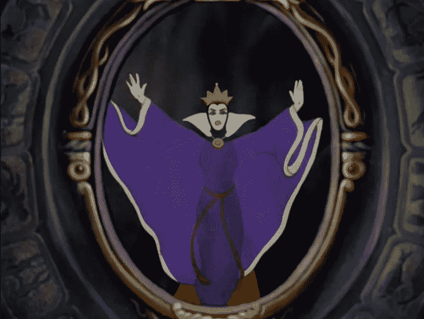

# 从物联网到物联网智能

> 原文：<https://medium.datadriveninvestor.com/from-internet-of-things-to-intelligence-of-things-30585def5d9d?source=collection_archive---------14----------------------->

我们都会阅读和观看许多改编自华特·迪士尼电影《白雪公主和七个小矮人》的作品。我已经忘记了故事中所有的对话，除了《邪恶的女巫》中的这几行，

source : [http://www.criticalcommons.org/Members/TextualObject/clips/magic-mirror-scene-from-snow-white/view](http://www.criticalcommons.org/Members/TextualObject/clips/magic-mirror-scene-from-snow-white/view)

*“魔镜，墙上的魔镜，
谁是世界上最美丽的人？”*

我把这面互动的镜子当成迪士尼虚构的东西之一。毕竟，在迪斯尼五彩缤纷的幻想世界里，任何东西都可以唱歌、跳舞和飞翔。但是今天，在现实中，我们确实有这样的镜子，可以很快告诉我，我是不是我家所有女人中最漂亮的。他们将很快加入物联网。

 [## 今年值得关注的人工智能趋势|数据驱动的投资者

### 预计 2019 年人工智能将取得广泛的重大进展。从谷歌搜索到处理复杂的工作，如…

www.datadriveninvestor.com](https://www.datadriveninvestor.com/2019/02/19/artificial-intelligence-trends-to-watch-this-year/) 

在数字技术的推动下，我们的外部世界正在成为我们思维的延伸。有了物联网和人工智能，物理世界通过界面与我们对话，这些界面可以是留给我们想象的“任何东西”。随着我们将数据和人工智能注入这个不断增长的“物”群，我们正在从物联网向物联网智能发展。

今天，商品和服务离迪士尼的魔镜只有一步之遥。这个扩展我们愿望的概念给了我们一种力量，当我们的愿望在大脑中出现的时候，我们就能实现它们。
连接革命创造了按需经济，这反过来又彻底改变了消费者行为。

随着组织蓬勃发展，创建下一个理想的客户交互，我们可以看到客户体验变得更加由物联网驱动。物联网结合机器学习正在进化为物的人工智能。它已经渗透到许多行业，即改善购物体验的零售、预测性维护的汽车服务、互联电器和家庭解决方案等等。

请在下面分享您对智能事物如何在帮助公司超越传统客户体验并融入用户世界中发挥关键作用的评论。