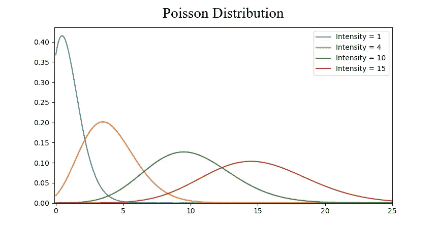
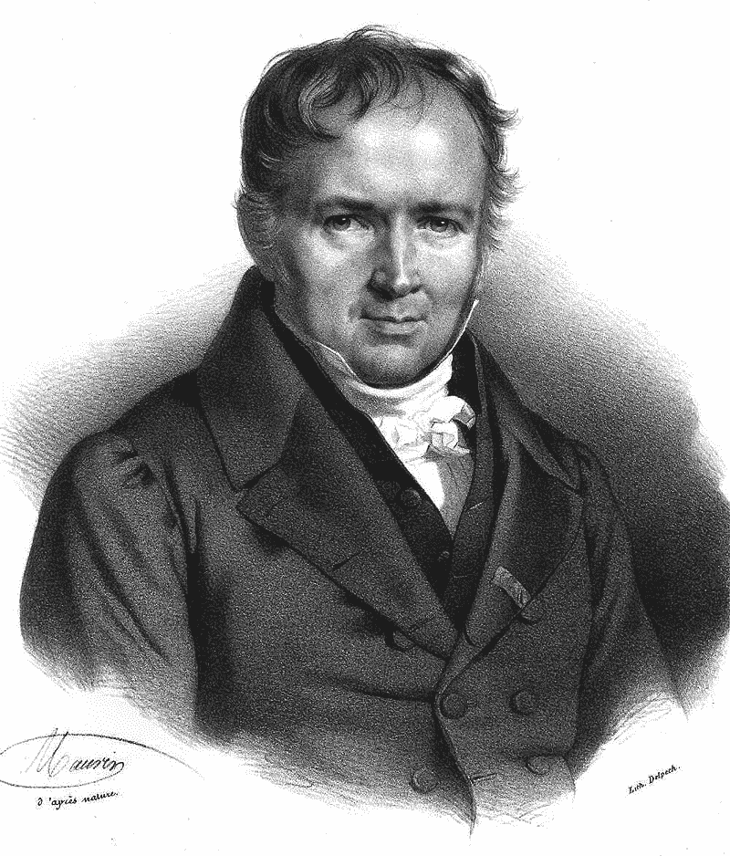

# 从数学到创新像表演者一样挑战秩序

> 原文：<https://medium.datadriveninvestor.com/from-mathematics-to-innovation-to-challenge-the-order-like-a-performer-52aee4ac48ba?source=collection_archive---------35----------------------->

> 数学以你能想到的所有事物的形式方面而闻名。事物的支柱。

分布不是你不熟悉的东西。举几个例子来说明。

> 财富分配
> 
> 人才分布
> 
> 能量分布
> 
> 质量分布
> 
> 等等。

> 为了更好地理解，它可以被形象化为类似于这样的形式:

Taken from [there](https://fromosia.wordpress.com/2017/03/19/stochastic-poisson-process/)

你会得到像这样不切实际和远离实践的东西。 ***数值不同但原理不变*** 。用敏锐的头脑开始洞察事物是有起点的。

# 看看他:

Taken from [wiki](https://en.wikipedia.org/wiki/Sim%C3%A9on_Denis_Poisson#/media/File:Simeon_Poisson.jpg)

> 西蒙·丹尼斯·泊松

法国数学家和物理学家(1781 年 6 月—1840 年 4 月)

在回忆录中:

*关于青年计划运动的不平等*

出版于 1809 年

他挑战天体力学的概念。最稳定的东西之一。

以— **大数定律而闻名。**

尽管身体不好，天生笨拙，天生无法画出令人满意的图表，但他毕竟是一名数学家。他挑战了天体力学的理解**而不是**。

这位数学家的重要之处在于他在常识中表现出的智慧，而珍珠看起来很普通。从大的方面来看，天体力学似乎是稳定的。

> 这不是情绪波动
> 
> 这不是货币的波动
> 
> 这不是一种政府

> 如果挑战天体组织不适合你，那就选别的吧。这是一个例子，如果一个聪明的头脑可以挑战天体力学的理解——它可以挑战一切。结果，复杂变得简单——困难变成了宽松。

你可能知道，统计是对确定性的补救。不管你对任何事情有多确定，最终都会被一个问题挑战。 ***事物是可能的——确定性是分布的。***

当我们谈到创新这个话题时，这很重要。

> 事物是可以替代的

当为了在竞争中生存和发展，必须用新的方法来做旧的事情时，人们需要考虑如何改进事情。方法是挑战现有的假设，提出新的更好的解决方案。

这无疑需要某种心态，这种心态能够挑战事物，让它们变得更新、更好。因此，我们正在接近一些能激发心智的东西。

> 关键是要思考的比给的多。自然，跟随比思考容易。这些行为也分布在人群中。最简单的≠越好。大多数人更喜欢简单的方法。

当然，做任何事情，尤其是做一些以前没有做过的事情，你都需要自信来做决定和执行。在那里，我们遇到了西蒙·丹尼斯·泊松的另一个出名之处。

> 大量的数字

这是显而易见的——大数定律讲的是大数。

## 想象一下。

有人出于营销目的做了一项调查，以了解对某种产品的需求。然后给两个人一些问题，让他们做出有见地的决定。然后从两种意见中得出结论。显然不足以做出任何明智的决定。这就是大量数字出现的原因。

显然，做市场调查时，知道两三万人要说什么是很不一样的。这是关于更大的数字。

另一个例子——一枚硬币。从理论上讲，你知道 50%的概率是正面或反面。但是如果有人做了一个实验，连续三次都有一条尾巴，那么很明显有 100%的概率是有尾巴的。

> 有些不对劲

大数字是重复尝试高音量的准则。三次尝试不足以得出结论。将同一枚硬币翻转 300 万次，达到 ***平衡*** 。最终，它会给出每个事件将近 50%的概率。正如我们理论上估计的那样。与理论相比，实践可能是有害的，大量的数据使它不那么有害。

## 这是显而易见的，但为什么有关系呢？

心灵的发现是为了做决定。忽视大数定律可能代价高昂，并导致**草率的概括**。没有确凿的事实就提出理论是错误的。然后，客观事实没有免疫系统，所以它们变得灵活弯曲，以满足基于快速进入结论的理论。知识驱动的事情不是这样的。大量的暗示将防止草率的概括。

> 两者都为决策奠定了基础。草率的概括或大数定律——支持任何不同结论的两条边。

大数定律给出了更全面的理解。就像头脑在复杂中导航的指南针。你有了均衡的标准。大数定律给出了答案。

如果你在各种情况下反复感觉糟糕，这就像扔硬币一样。你知道，即使很多时候你得到的是反面，而不是正面和反面的混合——从长远来看，平衡将会出现。糟糕的环境是暂时的。

## 回归创新

知道某人是否在创新是件好事。***创新需要发现许多行不通的方法和行之有效的新方法*** *。等于反复处于糟糕的环境中，问题来得比心跳还快。*

有些人可能认为创新是浪费时间，没有回报。大数定律是正确的——时间不会被浪费。

托马斯·爱迪生以发现一万种行不通的方法而闻名。大多数人没有时间去发现新的方法，而是坚持一个有效的方法。

> 它相应地分配创新人才

不幸的是，经常有稀缺的资源来做实验，以在实践中满足大数定律。所以不是每个人都有足够的时间投入到实验中，直到做对为止。这就是为什么思想实验或计算机模拟会做得更快。它发生在练习之前。数学在变得实用之前往往是形式化的。这就是为什么桥梁在建造之前就已经规划好了。

大数定律是一个很好的视角。它提供了一个更大的图景，并防止有害的仓促结论。 ***每一个事件都只是他们潜能池中的一个小点*** 。大数定律将防止错误和草率的结论。这可能是一个足够好的决策策略。

> 从大的方面来看，即使一项策略产生了一些可能令你不安的负面事件，但从长远来看，它只是偏离了均衡。人生如谋略，谁是谋略者？

# 你决定