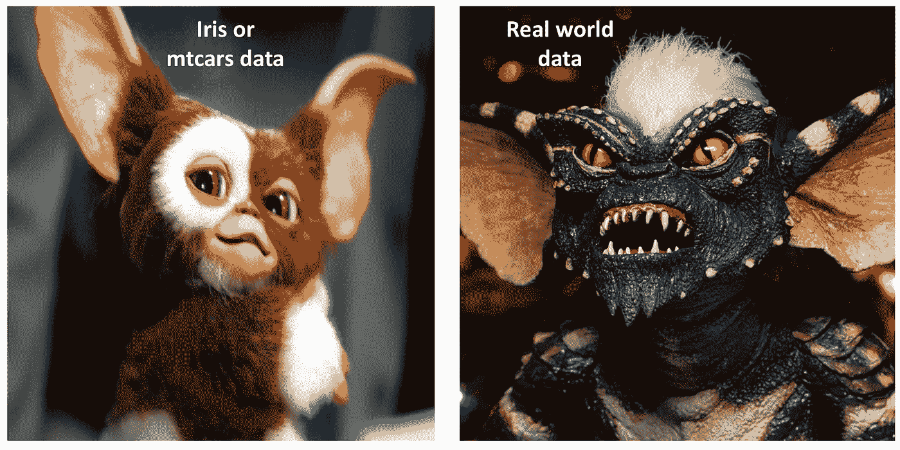
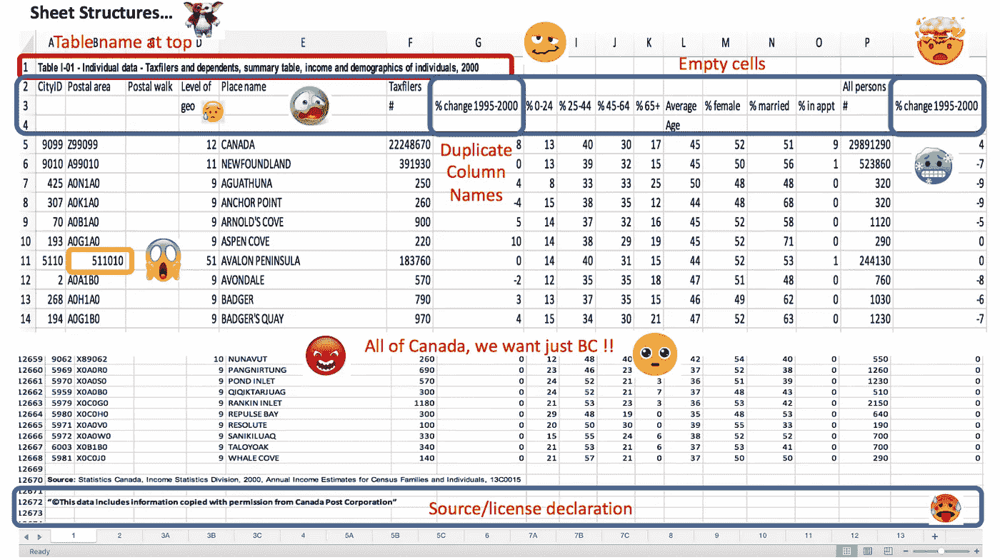
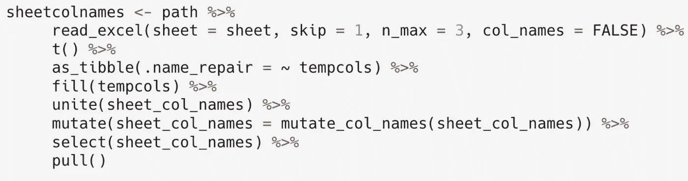
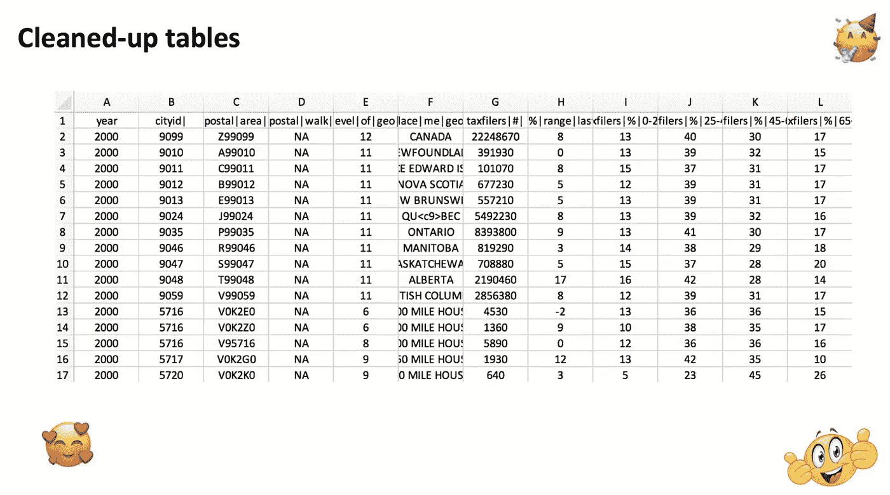

# 从混乱到整洁:数据科学工作流程案例

> 原文：<https://medium.datadriveninvestor.com/from-messy-to-tidy-the-case-for-a-data-science-workflow-4190b409ed4c?source=collection_archive---------1----------------------->

不是所有杂乱的数据都是平等产生的，它们都有自己独特的`symptoms`和`maladies`。真实世界的数据是严酷的，遵循很少的逻辑，不干净，不适合一个矩形，并且不会受到数据争论的影响。作为数据科学家，我们经常经历一个摔跤阶段，将数据塑造成一种适合建模、可视化和通信的格式。事实上，漂亮的图表和可视化只是冰山一角，真正的工作在于 80%的时间花在清理杂乱的数据上。

Gremlins in real world data vs. sample exercise datasets such as iris or mtcars

我最近经历了一个炼金术的过程，用 R 把杂乱的数据变成整齐的数据，所以在这里分享一些从这个过程中得到的经验。

 [## 成为数据科学家所需的 8 项技能——数据驱动型投资者

### 数字吓不倒你？没有什么比一张漂亮的 excel 表更令人满意的了？你会说几种语言…

www.datadriveninvestor.com](https://www.datadriveninvestor.com/2019/02/07/8-skills-you-need-to-become-a-data-scientist/) 

首先，这是我看到的一个例子: ***(1)*** 【空单元格】***(2)***excel 表顶部的表格名称，***【3】***重复字段，***【4】***隐含字段名称， ***(5)*** 不一致属性，以及 ***(6)***

那么，我们该如何着手解决这个问题呢？这种历史存档数据的巨大规模，确切地说是 177 个表和子表，表明一个接一个地手工做这件事是浪费时间和精力。另一方面，编写可重复和可再现的代码更有可能。这就是我开始使用 **R** 特别是 **tidyverse** 套件来处理这些数据的原因。一路上，我被介绍给了`reproducible research`和`reiterative procedural programming`，在那里代码不仅可以被使用和重用，还可以与他人分享以获得反馈和学习最佳实践。我在这个过程中陷得越深，就越意识到交流和分享的必要性。最近的一个例子证明了对可再生代码的需求，这就是导致可视化距离 5500 万光年的 *M87* 星系黑洞的数据和算法。卫星数据中肯定有很多杂乱的噪音和细微差别。这些数据已经与世界各地的 200 多名科学家共享，这需要真正好的文档和代码实践来共享。它还强调了数据科学团队的必要性，因为一个人的团队不仅孤独，而且不够多样化，无法处理手头的复杂问题。

面向过程编程的最佳实践之一是`DRY`或`Don't Repeat Yourself`，另一个是面向对象编程的`SOLID`。这些原则是由罗伯特·马丁(“鲍勃叔叔”)创造的，他是敏捷实践的先锋力量，也是敏捷宣言的作者。我相信`SOLID,`的`S`也就是单一责任原则非常有价值，因为我们编写的函数和循环一次执行一个任务。这可能是与其他函数对话或对数据执行迭代任务。

下面是一个可以在每张纸上使用 177 次的函数示例。这几行代码让我避免了超过 177 次点击、人为错误，以及几年后可能出现的严重腕管综合症。

Function to extract ‘years’ from file names

下面列出了另一个函数，它节省了我大量的时间来修改列名。我们可以让代码来处理它，而不是一次一个地清理所有工作表的标题。这些例子都使用了 **tidyverse** 并且在这里有机会首先真正感谢首席科学家(Hadley Wickham)和科学团队，他们用他们的软件包和库让非统计学家和计算机科学家更容易使用 R。这些套件的优势在于，它们不仅快速、高效、易学，而且彼此兼容，因此可以结合使用。

这是最终表格产品的外观，所有字段都已清理干净，足以进行更有趣的下一阶段建模、可视化和交流这些海量数据的真实值。有关所有功能的列表，请参见 [github](https://github.com/bcgov/statscan-taxdata-tidying) 页面。

我借此机会感谢与我一起工作的高级数据科学家，他们教会了我 R 的最佳实践，并让我以可重复和开放的方式实现代码，这是我一个人无法做到的。数据科学是一项*团队运动*，我真的希望它保持下去。

**参考文献**:

*   [潮汐](https://www.tidyverse.org)
*   [R 为数据科学](https://www.amazon.com/R-Data-Science-Hadley-Wickham/dp/1491910399/ref=as_li_ss_tl?ie=UTF8&qid=1469550189&sr=8-1&keywords=R+for+data+science&linkCode=sl1&tag=devtools-20&linkId=6fe0069f9605cf847ed96c191f4e84dd)
*   [程序化与面向对象](https://www.youtube.com/watch?v=Uks_t77_nyk)编程、可视化和交流这些海量数据的真实价值。