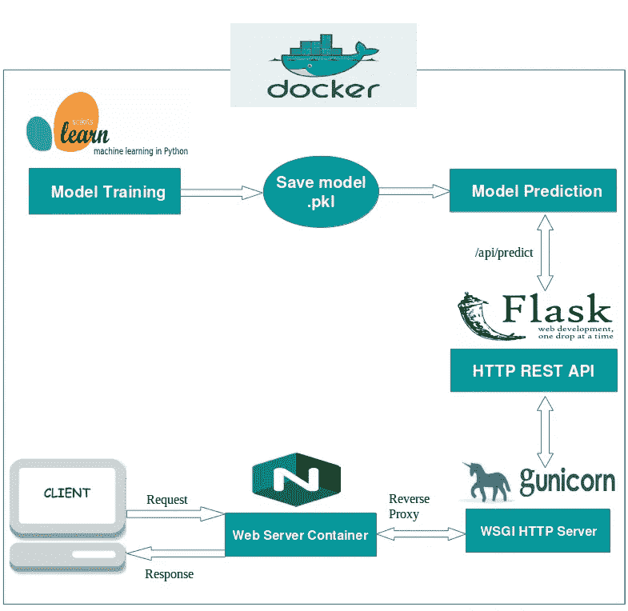
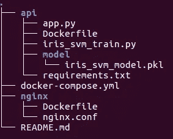
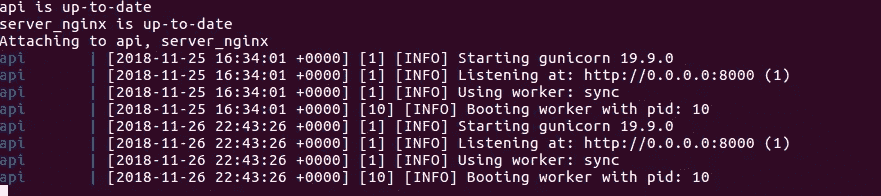
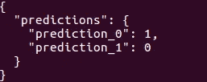

# 从模型开始到部署

> 原文：<https://medium.datadriveninvestor.com/from-model-inception-to-deployment-adce1f5ed9d6?source=collection_archive---------1----------------------->

## 利用包装在 Docker 容器中的 Flask、Nginx 和 Gunicorn 进行机器学习模型培训和可扩展部署


We all have been in this position after we are done building a model :p

在某些时候，我们都在努力部署我们训练有素的机器学习模型，许多问题开始浮现在我们的脑海中。部署 ML 模型的最佳方式是什么？我如何为模型的预测服务？我应该使用哪个服务器？我应该使用 flask 还是 django 来创建 REST API？在 docker 里面发货呢？别担心，我会帮你搞定的！！:)

在本教程中，我们将学习如何在生产中训练和部署机器学习模型，更侧重于部署，因为这是我们所有数据科学家都会遇到的问题。

此外，我们将使用 docker 容器，一个用于 flask app，另一个用于 docker-compose 附带的 Nginx web server。如果你是码头工人或集装箱化的新手，我建议你阅读 [*这篇文章*](https://www.analyticsvidhya.com/blog/2017/11/reproducible-data-science-docker-for-data-science/) 。

# **高层建筑**



High level design of large scale Machine Learning model deployment

# 安装

[*这里是这个项目的 GitHub 链接*](https://github.com/Akxay/dockerized_scalable_ml)



This is the folder structure that we will follow for this project

让我们将这部分分成三个部分:
—使用 python 训练机器学习模型& scikit-learn
—使用 flask 和 gunicorn 创建 REST API
—使用 Nginx 在生产中部署机器学习模型&将整个包放入 docker 容器中

# **模特培训**

为了使事情简单和全面，我们将使用虹膜数据集来训练 SVM 分类器。

iris_svm_train.py

在这里，我们正在训练一个具有线性核的支持向量机，它给出了相当不错的 97%的准确率。您可以随意地尝试训练部分，尝试 Random Forest 或 Xgboost &执行超参数优化以提高精确度。
确保执行‘iris _ SVM _ train . py’，因为它会将模型保存在‘model’文件夹中( [*参考 github repo*](https://github.com/Akxay/dockerized_scalable_ml) )。

# 构建 REST API

创建一个 flask 应用程序非常简单。不开玩笑！你所需要知道的就是客户端(用户)的请求是如何发送到服务器的，服务器是如何发送回响应的，以及一些关于 GET 和 POST 的方法。下面，我们正在加载我们保存的模型，并处理来自用户的新数据(请求),以便将预测(响应)发送回用户。

app.py

我们将使用 gunicorn 来服务我们的 flask API。如果你在 windows 上，你可以使用 waste(纯 Python WSGI 服务器)作为 gunicorn 的替代。
执行命令:**guni corn-w1-b:8000 app:app**并在浏览器中点击 **http://localhost:8000** ，以确保您的 flask 应用已经启动并运行。如果你收到信息“hoilaaaaaaaaaaa！，那你就好走了！！

```
If you want to test the predict(Post) method, use curl command or use Postmancurl --header "Content-Type: application/json" --request POST --data'[{"sepal_length":6.3,"sepal_width":2.3,"petal_length":4.4,"petal_width":1.3}]' [http://localhost:8000/predict](http://localhost:8080/predict)
```

# 在生产中部署 ML 模型

*最后，有趣的部分开始了:)*
我们将使用 Nginx web 服务器作为 Gunicorn 的反向代理，这意味着用户将从浏览器点击 Nginx，它会将请求转发到您的应用程序。Nginx 位于为你的 flask 应用服务的 Gunicorn 前面。
关于我们有 gunicorn 时为什么需要 Nginx 的更多信息:[链接](https://serverfault.com/questions/331256/why-do-i-need-nginx-and-something-like-gunicorn)

nginx.conf

# 包装 Docker 容器内的所有物品

恭喜你，你已经进入了最后一部分。
现在，我们将创建两个 docker 文件，一个用于 API &一个用于 Nginx。我们还将创建一个 docker-compose 文件，该文件将包含关于我们的两个 docker 容器的信息。你必须安装 [docker](https://docs.docker.com/install/) 和 [docker-compose](https://docs.docker.com/compose/install/) 才能工作。让我们发布我们的可扩展 ML 应用程序，并使其可移植&生产就绪。

Docker file for API (keep it in api folder)

我们已经为 api 创建了一个 docker 文件，该文件需要与包括 requirements.txt(包含有关您的应用程序所需的 python 包的信息)在内的其他文件一起保存在“API”文件夹中。

Docker file for Nginx(keep it in nginx folder with nginx.conf file)

docker-compose.yml

yml 是将所有内容绑定在一起的主文件。如您所见，它包含两个服务，一个用于 api，一个用于服务器(nginx)。现在，您只需要一个命令就可以运行您的 ML 应用程序:

```
*cd <project/parent directory>
docker-compose up*
```



Output of above command

干杯！您的 dockerized 可扩展机器学习应用程序已经启动并运行，在端口 8080 上接受请求，并准备好为您的模型的预测服务。
使用 curl 或使用 Postman 打开一个新的终端来运行预测方法

```
*curl --header "Content-Type: application/json" --request POST --data'[{"sepal_length":6.3,"sepal_width":2.3,"petal_length":4.4,"petal_width":1.3}]'* [*http://localhost:8080/predict*](http://localhost:8080/predict)
```



Predictions from your deployed ML model

感谢您能坚持到这里，如果您在项目运行中遇到任何挑战或有任何反馈，请在下面评论。快乐学习！！