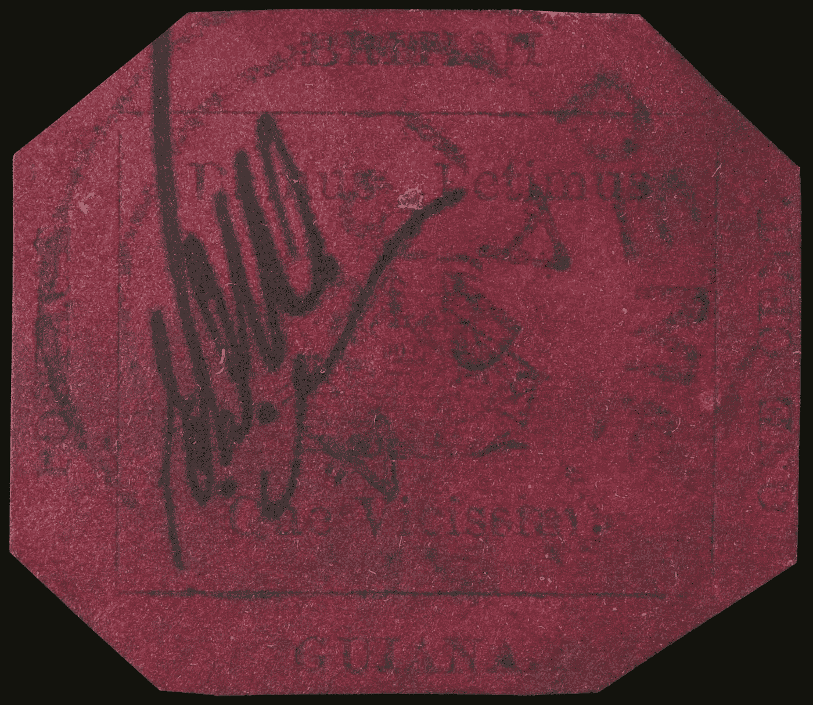

# 从 1 美分增加到 940 万美元

> 原文：<https://medium.datadriveninvestor.com/from-one-cent-to-9-4-million-50d51b1d5c89?source=collection_archive---------16----------------------->

这是一张不起眼的纸，在 19 世纪几乎卖不了什么钱，但当纽约的苏富比拍卖行拍卖时，英属圭亚那品红色一分黑邮票拍出了近 1000 万美元。

苏富比称其为“世界上最著名和最有价值的邮票”，同样，就尺寸和重量而言，它也是世界上最昂贵的物品。

它创下了任何邮票的新的世界拍卖纪录，达到 948 万美元——接近其原始面值的 10 亿倍。

这种邮票在邮票发明 16 年后才开始流通，是现存的唯一一种邮票。

这是当地一家报纸在 1856 年紧急印刷的一分和四分邮票的一部分，当时来自英国的一批货物被延误，当地邮政局长即将耗尽供应。

它的第一个主人是英属圭亚那的一个 12 岁男孩，他于 1873 年在家庭文件中发现了这枚邮票，并以 6 先令的价格卖给了一个经销商，这样他就可以买更多的邮票。

这张八角形的纸随后经过世界各地众多集邮者的手，直到已故的千万富翁(也是被判谋杀罪的人)约翰·e·杜邦在 1980 年以创纪录的 93.5 万美元买下它。

据信，在杜邦入狱期间(他于 2010 年死于狱中)，这件拍卖品被锁在了一个金库里，这是英属圭亚那几十年来的首次公开亮相。