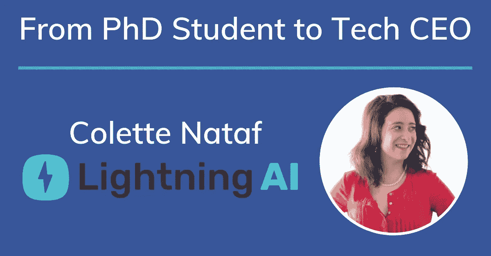
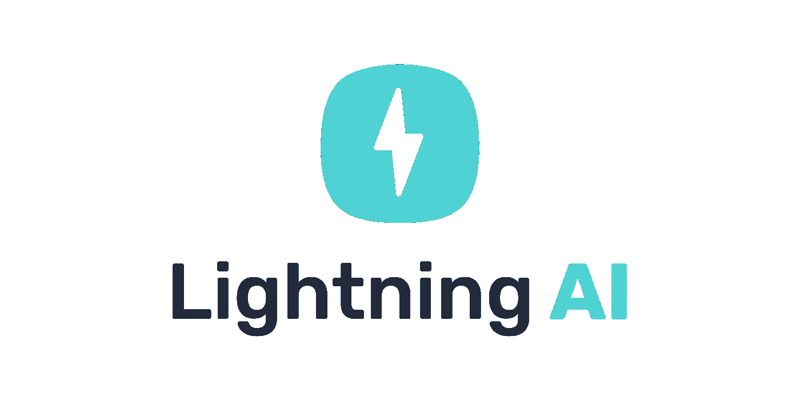

# 从博士生到科技 CEO

> 原文：<https://medium.datadriveninvestor.com/from-phd-student-to-tech-ceo-5f63ba71de76?source=collection_archive---------18----------------------->

Colette Nataf — Founder & CEO of Lightning AI

五年前，我是一名经济学博士生，在马里兰大学学习拍卖理论。我正在学习多价格拍卖的理论基础，以及人类和买家的行为如何影响整体结果。

我最终搬到了硅谷，并创办了一家人工智能营销初创公司。

如果你五年前告诉我，我将经营一家盈利的初创公司，并为 Curology 和 Peloton 等客户提供支持，我会感到震惊。但通常情况下，成功不会像我们想象的那样发生。

# 从失败中学习

在我读博士期间，我成为了一名表演营销人员，尽管不是故意的。作为一个副业，我已经开了一家教育技术公司，有一个软件可以帮助学生通过 sat 考试。那是 2013 年，在与我能找到的所有营销人员交谈后，我留下了一个挥之不去的问题:

为什么没有人告诉我运行*数字*广告来获得更多的客户？

我不断收到的营销建议感觉就像是上世纪 90 年代的。朋友和导师告诉我去挨家挨户，发送直接邮件活动，并建立关系，以发展我的业务。但我无法摆脱这种感觉，即数字化是未来的发展方向。

我决定相信自己的直觉，开始运行 Google AdWords 活动，使用所有的华而不实的东西来制作最好的广告。这是一次彻底的失败。我浪费了 500 美元，并感受到了我每年 20000 美元研究生工资的刺痛。但即使在那个低谷，我仍然有一种预感，我可以利用我对数据的爱好来推动业务增长。

我的教育技术业务增长乏力，硕士毕业在即，这让我感到沮丧，于是我疯狂地改变了信念。我和丈夫收拾好我们的房子，带着狗挤进车里，穿越整个国家来到硅谷。

# 向上爬

当我们第一次搬家时，没有任何计划——只是一种直觉。我们俩都没有工作。但我知道自己擅长数学，学得很快，所以我说服了一家名为 MileIQ 的初创公司，让它相信我能想出如何开展有效的广告活动。这是我需要的休息。仅仅六个月后，我们被微软收购，我感受到了创业生活的匆忙。硅谷的起伏令人上瘾，我深陷其中。毕业仅一年后，我就在旧金山获得了四份工作机会，分别是营销总监和增长职位总监。

收购后不久，我加入了 Intercom，我知道我会让他们获得独角兽估值。我在那里呆了三个月，彻底改变了公司购买广告和获取新用户的方式。利用我在 MileIQ 学到的技能，我能够帮助 Intercom 取得惊人的成果。

我有一个想法，我在对讲机中向领导团队提出。我敢打赌，计算机可以做我日复一日手工做的同样的工作。团队告诉我给他们三年时间来全面执行和实施这一战略。

我没有三年的时间来等待，所以我决定开始兼职做顾问。2015 年 9 月，我有了第一批咨询客户。当时，我正在帮助公司有效地开展他们在脸书的广告活动。但是一旦我开始赚足够的钱来支付旧金山的房租，我就开始了“创业”的飞跃。我离开对讲机，闪电 AI 正式诞生。

Lightning AI uses a mix of AI-powered technology & managed services to track, measure, and grow advertising campaigns.

# 从顾问到创业创始人

这些最初的咨询客户塑造了最终成为我的业务闪电人工智能的一切。其他公司遇到了我在 MileIQ 和 Intercom 遇到的完全相同的问题——他们希望在保持每次收购成本不变的情况下实现指数级增长。在短短六周内，我开发了一个网络应用程序，允许用户快速创建新的脸书广告活动。事情并不完美，需要做很多工作和改进，但我们很快就推出了最初的产品，并能够为我们的客户服务。回想起来，我最初的咨询客户群对闪电人工智能的成功和发展至关重要。在业务测试期间，他们提供了数据和有用的见解。我不确定没有他们我今天会在哪里(也许我现在还在对讲机工作！).

从一开始，我的目标一直是一样的:建立一个计算机系统，使用数据科学而不是营销人员的直觉来创建和优化营销活动。闪电人工智能解决了一个问题，无论未来发生什么，经营这家公司给了我一种自豪感、喜悦和成就感，这是我在其他任何地方都感受不到的。

# 我对女性创业者的建议

在早期，我得到了很多建议，但我能给的最好的建议是尽快进入市场。如果你花了一个月又一个月的时间来建设，那么这几个月你就无法获得收入和向用户销售。如果你在这个世界上没有什么东西，你就不知道你是否真的有生意。

对我个人来说，我也很快认识到我需要和其他人在一起才能有效地工作。我不太擅长独自在家工作，如果我知道，我会马上加入一个共同工作空间，并结识其他创始人。如果你是一个年轻的创始人或未来的企业家，请注意:学习和联系其他企业家社区。

# 那么，闪电人工智能的下一步是什么？

我们刚刚过了我们的第二个生日，有时候我真的不敢相信才过了两年。我们已经筹集了资金，雇佣了员工，创造了一个完整的产品，并建立了一个解决问题的人工智能平台。我们正准备在今年秋天推出 Lightning AI 的全自助版本，我们已经实现了将世界级营销决策权交到每个企业主手中的愿景。

几周前，我发现自己在想，我在马里兰州攻读博士学位的同学们都在忙些什么。如果我留下来，不再追求我的硅谷越野梦，相信我还能在学校里，这太疯狂了。我永远不会拥有我的公司，我可能还坐在教室里学习拍卖理论。虽然感觉像是经历了几十年的生活，但其实才几年而已。

我创造闪电人工智能是基于一种直觉，即计算机可以做出营销人员每天都在纠结的优化和决策。我是对的。所以，如果你能从我的旅程中学到什么的话，那就是跟随直觉，跳跃，永远不要停止学习。你永远不知道你会在哪里结束。

> 其余的还没有写下来。