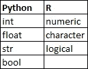
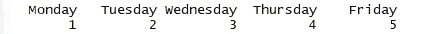

# 从 Python 到 R

> 原文：<https://medium.datadriveninvestor.com/from-python-to-r-10f977887a3b?source=collection_archive---------13----------------------->

## 用 Python 例子学习 R


Photo by [Daniel Reche](https://www.pexels.com/@daniel-reche-718241?utm_content=attributionCopyText&utm_medium=referral&utm_source=pexels) from [Pexels](https://www.pexels.com/photo/eggs-in-tray-on-white-surface-1556707/?utm_content=attributionCopyText&utm_medium=referral&utm_source=pexels)

我原以为学习 R 会是另一项伟大的努力，就像学习 Python 一样，但事实证明两者之间有很多相似之处。让我们看一些代码，你会发现如果你懂 Python，你就懂 r。

# 基本数据类型



Data types for Python & R

*   数字:在 Python 中有两种数字类型:整型和浮点型。r 将这两者归为数字。
*   字符串:封装在" "中的任何东西在 Python 中都是字符串，在 R 中它们被称为字符。
*   True & False : Python 调用 True & False 语句 bool，R 调用这些逻辑。R logicals 是大写的，但可以缩写成 T 或 f。

[](https://www.datadriveninvestor.com/2019/03/25/a-programmers-guide-to-creating-an-eclectic-bookshelf/) [## 创建折衷书架的程序员指南|数据驱动的投资者

### 每个开发者都应该有一个书架。他的内阁中可能的文本集合是无数的，但不是每一个集合…

www.datadriveninvestor.com](https://www.datadriveninvestor.com/2019/03/25/a-programmers-guide-to-creating-an-eclectic-bookshelf/) 

检查两种语言之间的数据类型如下:

```
#R
class("Hello data")
output: "character"#Python
type("Hello data")
output: str
```

同样，它们都使用“#”来注释掉代码。

# 分配

在 Python 和 r 中，将基本数据类型存储到变量中略有不同。

```
python_assignment = "Hello World"
r_assignment <- "Hello World"
```

# 基本数据结构

## 向量

为了存储值，R 使用向量。向量的问题在于它只能存储一种数据类型。Python 中类似的东西是什么？一个列表，或者元组？不完全是，它们可以同时存储多种数据类型。为了进行精确的比较，我们需要使用 numpy 数组。

R 中的向量可通过使用组合功能`c()`创建。

```
#R
r_vector <- c(1, 2, 3)#Python
import numpy as np
python_array = np.array([1, 2, 3])
```

像 numpy 数组一样，算术可以在向量上执行。

```
#R
r_vector * 3
[1] 3 6 9#Python
python_array * 3
Out[3] array([3, 6, 9])#Adding two vectors/arrays
#R
r_vector2 <- c(4, 5, 6)
r_vector + r_vector2
[1] 5 7 9#Python
python_array2 = np.array([4, 5, 6])
python_array + python_array2
Out[3] array([5, 7, 9])
```

在 R 中，可以像在 Python 中一样对向量进行子集化。方括号`[]`的符号相同。两者的主要区别在于 Python 中的索引从 0 开始，而 R 中的索引从 1 开始。

```
#R
r_vector <- c(3, 5, 7)
r_vector[1]
[1] 3#Python
#If you sliced an array with an index of 1 you'll get the following:
python_array = np.array([3, 5, 7])
python_array[1]
Out[3] 5#If we want to last number we simply specify it.#R
r_vector[3]
[1] 7#Python
python_array[3]
Out[2] IndexError
#We get an error because the index lies out of bounds.
```

R 在设置子集时与 Python 不同的另一个特点是最终数字是包含性的。如果您想让子集 a 向量包含最后一个值，您只需包含该值，而在 Python 中，您需要+1 最后一个数字来包含它。

```
#R
r_vector[1:3]
[1] 3 5 7#Python
python_array[1:3]
Out[2] array([5, 7])
```

我从 R 中学到的一件事就是给向量命名。在 Python 中，这些是结构化数组。与用 Python 命名数组相比，给向量命名更容易。让我们看几个例子。

```
#R
r_vector <-c(1, 2, 3, 4, 5)
names(vectors) <- c("Monday", "Tuesday", "Wednesday", "Thursday", "Friday")
#The output of r_vector will now contain the original vector and the 
#name of the values
r_vector
```



The output of r_vector after assigning names

```
#Python
python_array = np.array([("Monday", 1), ("Tuesday", 2), ("Wednesday", 3), ("Thursday", 4), ("Friday", 5)], 
dtype=[("day", "U10"), ("value", "<i1")])#You can extract the values for the fields like so:
python_array["day"]
Out[3] ['Monday' 'Tuesday' 'Wednesday' 'Thursday' 'Friday']python_array["value"]
Out[5] [1 2 3 4 5]
```

不幸的是，我还在想如何在使用命名数组时得到和 R 一样的输出，当我想通了我会更新这篇文章。

在这篇文章中，我们讨论了 R 和 Python 之间的相似之处和不同之处。在下一篇文章中，我们将讨论矩阵和数据帧。