# 从标量到张量:带有直观例子的机器学习基础数学第 1/3 部分

> 原文：<https://medium.datadriveninvestor.com/from-scalar-to-tensor-fundamental-mathematics-for-machine-learning-with-intuitive-examples-part-163727dfea8d?source=collection_archive---------4----------------------->

[](http://www.track.datadriveninvestor.com/ExpertViewTeali1)

为了理解机器学习算法的数学，特别是深度学习算法，从基础到更高级建立数学概念是必不可少的。不幸的是，数学理论在许多情况下太难/抽象/枯燥，难以消化。想象你正在吃一个比萨饼，喝一杯可乐总是更容易和更有趣。

这篇文章的目的是**为基础数学理论提供直观的例子**使学习体验更加愉快和难忘，那就是鸡翅配啤酒，薯条配番茄酱，里脊配葡萄酒。

包含 3 门课程的机器学习基础数学课程组织如下:

**从标量到张量**:带有直观例子的机器学习基础数学**第 1/3 部分**

*   什么是标量、向量、矩阵和张量？
*   标量、向量和矩阵之间的加法
*   标量、向量和矩阵之间的乘法
*   单位矩阵和逆矩阵
*   对角矩阵和对称矩阵

[**从范数到正交**:机器学习的基础数学与直观示例**第 2/3 部分**](https://medium.com/@alina.li.zhang/from-norm-to-orthogonality-fundamental-mathematics-for-machine-learning-with-intuitive-examples-57bb898e69f2)

*   向量的 1-范数，2-范数，最大范数
*   正交和标准正交向量
*   正交矩阵

[**从特征分解到行列式**:带有直观例子的机器学习基础数学**第 3/3 部分**](https://medium.com/@alina.li.zhang/from-eigendecomposition-to-determinant-fundamental-mathematics-for-machine-learning-with-1b6b449a82c6)

*   矩阵的特征分解:特征值和特征向量
*   跟踪运算符
*   行列式方阵

在这篇文章中，我们将通过直观的例子来浏览 1/3 部分，从标量到张量。

## **什么是标量、矢量、矩阵和张量**

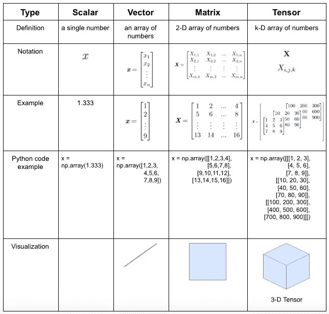

**标量**是单个数字。通常我们写标量用*斜体*小写，比如“*x”*。标量可以是任何类型的数，例如自然数、有理数或无理数，如下所示:

*   自然数:3，4，5，…
*   有理数:4/3，1.666666…
*   无理数:

下面的代码展示了如何使用 Numpy 的 N 维数组[**ndarray**](https://docs.scipy.org/doc/numpy-1.13.0/reference/arrays.ndarray.html)**创建一个标量变量。**

```
import numpy as np

x = np.array(1.666666)
```

****Vector** 是一个数字数组。通常，我们用**粗体**和小写字母表示向量，并将向量的元素放在方括号内的列中:**

**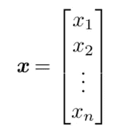**

**下面的代码展示了如何用 Numpy 生成一个 vector。**

```
x = np.array([1,2,3,4,5,6,7,8,9])
```

**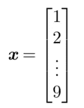**

****矩阵**是一个二维的数字数组，通常用**粗体**和大写的变量名表示，例如:**

**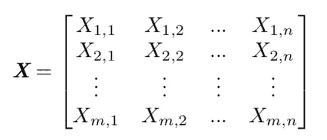**

**下面的代码展示了如何用 Numpy 创建一个 4*4 的矩阵。**

```
x = np.array([[1,2,3,4],[5,6,7,8],[9,10,11,12],[13,14,15,16]])
```

**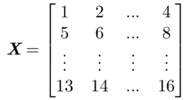**

****张量**是一个 k-D 数组的数字。张量的概念有点复杂。你可以把张量看作一个数字的容器，这个容器可以是任何维度的。例如，标量、向量和矩阵被认为是最简单的张量:**

*   **标量是一个 0 维张量**
*   **向量是一维张量**
*   **矩阵是一个二维张量**

**由此，我们可以推出三维张量是一个立方体，四维张量是一个立方体的向量，五维张量是一个立方体的矩阵，6-D 张量是一个立方体，等等。**

**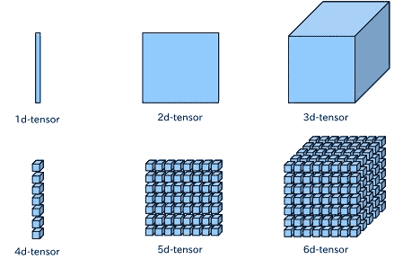**

**Photo credit to [*knoldus*](https://i.stack.imgur.com/Lv1qU.jpg)**

**我们用粗体大写字母表示张量，并通过写下式来识别坐标( *i，j，k* )处的张量元素:**

****

**下面的代码显示了如何用 Numpy 创建一个三维张量。**

```
x = np.array([[[1, 2, 3],[4, 5, 6],[7, 8, 9]],
              [[10, 20, 30],[40, 50, 60],[70, 80, 90]],
              [[100, 200, 300],[400, 500, 600],[700, 800, 900]]])
```

**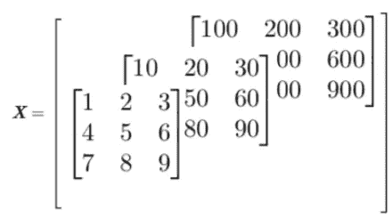**

**3-D tensor**

****在工业中，我们通常以三维张量存储时间序列数据，以四维张量存储图像数据，以五维张量存储视频数据等。****

## ****标量、向量和矩阵之间的加法****

****标量+矩阵** =向矩阵中的每个元素添加标量:**

**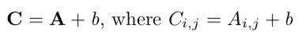****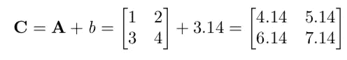**

****向量+矩阵** =将向量添加到矩阵中的每一行:**

**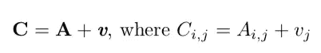******

****矩阵+矩阵** =只要矩阵具有相同的形状，就将它们对应的元素相加:**

**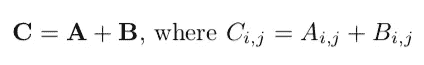****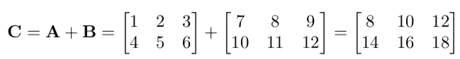**

## **标量、向量和矩阵之间的乘法**

****标量矩阵** =矩阵的每个元素乘以标量**

**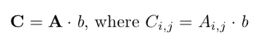****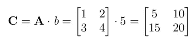**

****矩阵向量** = [矩阵中每一行与向量的点积](https://en.wikipedia.org/wiki/Dot_product)**

**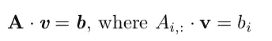****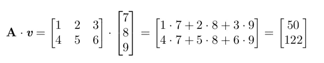**

## **单位矩阵和逆矩阵**

**为了计算矩阵的逆矩阵，我们需要建立单位矩阵的概念。单位矩阵从结构上看很简单:沿主对角线的所有项都是 1，而其他所有项都是 0，例如:**

**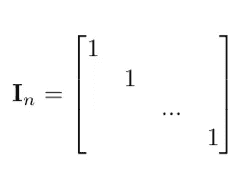**

**Identity matrix**

**矩阵 **A** 的逆矩阵表示和定义如下:**

**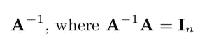**

**矩阵逆矩阵存在的充要条件:**

*   **矩阵必须是**正方形****
*   **矩阵的所有列必须是 [**线性无关的**](https://en.wikipedia.org/wiki/Linear_independence)**

**在下面的例子中，矩阵的第二列可以被认为是第一列乘以 2，因此矩阵是线性相关的，这意味着它没有逆矩阵。**

**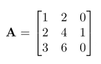**

## **对角矩阵和对称矩阵**

**一个矩阵是对角的当且仅当，**

**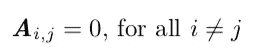****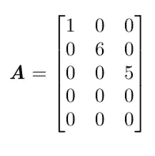**

**一个对角元素由向量 ***v*** 给出的正方形对角矩阵可以表示为 diag( ***v*** )，例如**

**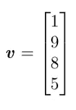****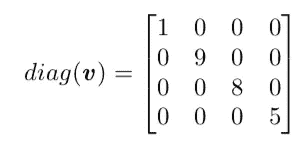**

**对称矩阵是等于其自身转置矩阵的任何方阵:**

**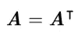**

**例如，下面的 3*3 矩阵是对称的:**

**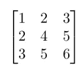**

**恭喜你！你刚刚用直观的例子完成了机器学习基础数学的三分之一。有例子就明白了，对吧？**

## **[下一步:**从范数到正交性**:带有直观示例的机器学习基础数学**第 2/3 部分**](https://medium.com/@alina.li.zhang/from-norm-to-orthogonality-fundamental-mathematics-for-machine-learning-with-intuitive-examples-57bb898e69f2)**