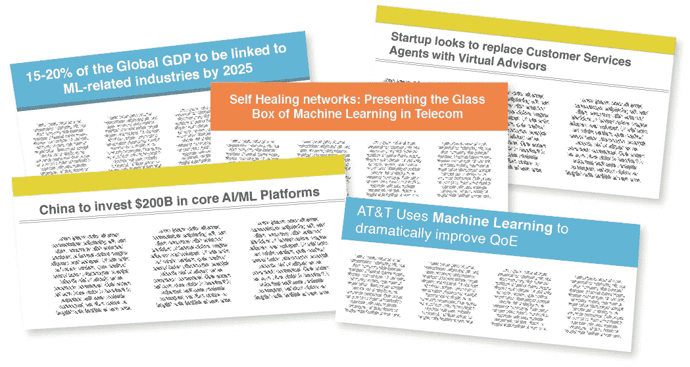
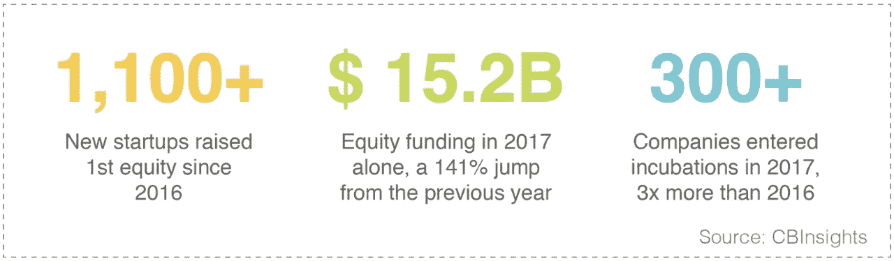
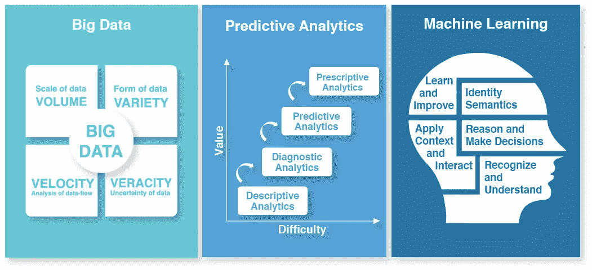
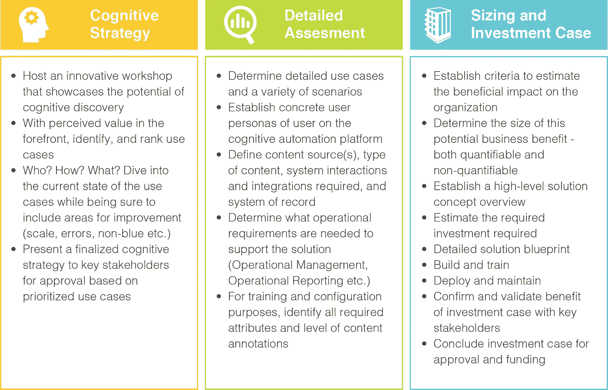

# 从自动驾驶汽车到自动驾驶网络:人工智能在电信业的崛起

> 原文：<https://medium.datadriveninvestor.com/from-self-driving-cars-to-sef-driving-networks-rise-of-ai-in-telecom-adc9ca7e0cc0?source=collection_archive---------12----------------------->

除非你一直躲在岩石下，否则你很可能听说过人工智能的迷人世界以及它将对我们生活产生的变革性影响。兴奋的某些部分让我们想起了 90 年代的网络泡沫——当时技术炒作达到了顶峰。从首席执行官和分析师到草根开发者，各个层面似乎都非常兴奋；所有人都期待人工智能不仅能极大地改变我们的生活，还能改变世界。好吧，我们真的不能责怪他们，考虑到在这个领域投资数十亿美元所带来的兴奋。在所有明星完美结盟的情况下，也许最好稍微“剥洋葱”，希望更好地理解人工智能到底是什么，为什么现在和为什么所有的炒作，以及它如何显著改变电信行业的格局，特别是。

 [## 在自动驾驶汽车发生事故的情况下，谁应该承担法律责任？-数据驱动型投资者

### 我仍然认为自动驾驶汽车是一种奢侈品，而不是必需品…

www.datadriveninvestor.com](https://www.datadriveninvestor.com/2018/11/02/who-is-legally-accountable-in-the-case-of-an-autonomous-vehicle-accident/) 

# 什么是人工智能，为什么现在炒作？

# 人工智能本质上是人类教机器如何学习和模仿他们的智力。

就像一个蹒跚学步的孩子——通过经验学习，不断吸收信息，解码信息并理解模式——我们向机器输入大量数据，这些数据会创建自己的算法，并不断调整它们以满足它们的目标。随着时间的推移，程序变得越来越聪明，越来越像人类，也就是说，越来越少人工，越来越聪明。

在过去的几年里，一些因素导致人工智能更接近释放其真正的潜力——主要是，大量的数据变得可用，以及更快的 GPU 来处理这些数据。

随着数十亿的东西连接到网络上，产生了大量的信息。从有史以来到 2004 年，大约有 5eb 的信息被创建和捕获。形象地说，试着想象一堆书，从地球一直延伸到冥王星，来回 80 次。当然，令人印象深刻，但是在过去十年中，捕获的数据量呈爆炸式增长，据报道，仅在过去两年中就产生了全球 90%的集体数据。现在，由于处理速度的进步，计算机可以更快、更有效地理解所有这些信息。

正因为如此，科技巨头和风投公司正在向市场注入现金和新应用。仅中国就已在这一领域投资 1090 亿美元，国与国之间的竞争正在升温。原因是，到 2025 年，预计全球 GDP 的 15 %- 20%将与人工智能相关产业相关联！头脑麻木，不是吗？

# AI 与预测分析和大数据有什么不同？投资这三个项目会有财务收益吗？

通常，人们会问大数据、预测分析和机器学习之间有什么区别。他们希望能够区分这三者，以确保资源的充分分配，并为所有利益相关者设定正确的期望..

**大数据:**大型、复杂且难以使用现有数据库管理工具处理的“数据集”的集合。

**预测分析:**从现有数据集中提取信息以确定模式并准确预测未来结果、趋势和行为的实践。

**机器学习:**机器执行通常需要人类智能(视觉感知、决策、学习等)的任务。).这考虑到了局势的整个背景。

简而言之，为收集见解和学习创造大数据湖是所有公司必须投资的基础。使用机器学习这种从数据中释放价值的自我学习引擎，组织可以提取见解、预测结果并执行类似人类的任务。对大数据、预测分析和机器学习这三个领域的投资正迅速上升到桌面赌注。业务和 IT 团队需要“密切合作”来确定所需产出的优先级。相反，我们发现孤立工作会导致众所周知的大海捞针，而不是找到对业务至关重要的洞察力。

# 我们应该在 AI 和机器人过程自动化(RPA)上下注吗？每个人似乎都在部署它们，我们现在应该投资它们吗？

我亲爱的华生，这些是不该问的问题！如果你愿意的话，这个比喻是车在马的前面。正确的问题应该是，“我如何使用技术快速高效地解决我的业务问题？”

然而，首先让我们深入 RPA 和 AI，以区分两者。我们的目标是以最有效的方式搭建从人工到数字劳动的桥梁。考虑到底线的压力，“数字劳动力”不再是一个考虑因素，而是全球大多数公司的一项要求。RPA 和 AI 是两套独特的工具，用于从一端到另一端的旅程，即数字劳动=认知计算(AI) + RPA(数字工作)。

基本 RPA 包括自动化入门级事务性、基于规则且可重复的流程。它涉及在明确定义的参数内处理结构化数据，以便机器人自主完成任务。然而，数字劳动是由自学和适应性技术驱动的自动化。它涉及自我学习、超级数据集的消化、假设生成和基于证据的学习。所有有趣的东西！

我们采访的大多数公司和企业都喜欢人工智能的概念，并希望直接投入其中。然而，这是一个实现的旅程，意味着你需要先问自己一些问题。真正的用例是什么？你能阐明痛点吗？你能清楚地量化收益以帮助确定人工智能和/或自动化是否是必要的吗？然后集体决定哪一个是最好的行动和执行方案。

# AI 的电信具体用例有哪些？有什么财务上的好处？

电信业正处于十字路口。没有哪个行业像它一样受到比特和字节的驱动，同时又因为同样的原因面临着去中介化的挑战。商业模式在变化，[客户期望](https://perspectives.mobilelive.ca/blog/evolving-customer-behaviours-and-expectations)和行为在不断演变，传统的经济学和范式变得站不住脚。这就是为什么 2014 年是全球电信总收入首次出现小幅负增长的一年。从那时起，每一个投资者关系电话都被关于增加收入、降低 OPEX 和资本支出的问题轰炸。

*这里有一些人工智能可以帮助减轻痛苦的方法:*

## 资本减少(十年节省 100-120 亿美元)

在加拿大的三家电信公司中，每年用于发展和维护各自网络的资本支出总计约为 100 亿美元。使用这一运行速度，即使不考虑由于 5G 和光纤部署支出增加而导致的约 40%的峰值，未来十年*的资本支出也将达到约 1000 亿美元。*

鉴于技术的生命周期已经大大缩短——CDMA 持续了 25 年，HSPA 可能持续了 10 年，LTE 甚至更短。投资周期正在缩短，是时候恢复元气了。与此同时，电子产品的成本已经下降，大部分资金投入到网络和安装的优化上。

根据最新统计，从一种技术升级到另一种技术的资本成本中有 70%花费在劳动力和基础设施上，只有 30%花费在实际的 OEM 相关电子产品上。从技术上讲，这将把电信公司定位为基础设施的参与者，而不是纯粹的电信公司。然而，人工智能和其他组合技术可以被利用来显著地降低优化劳动成本。许多原始设备制造商已经开始为 SON(自我优化网络)提供他们自己的软件，但这实际上类似于让狼来保护羊。电信公司需要有自己的 POV，并随着时间的推移不断发展，以确保基本的卫生和最佳实践保持在内部。此外，按地理位置预测用户使用情况并确保网络规模正确，将不会在工程师的办公桌旁完成，而是通过深入的场景分析和规划，考虑所有参数。最后，频谱拍卖定价的优化可以使用博弈论和决策树来完成。鉴于运营商愿意在 it 上花费数十亿美元，我们预计一剂健康的人工智能将用于节省数千个咨询小时，并在此过程中节省数百万(如果不是数十亿)美元。

我们估计，通过在整个过程中全面使用[认知技术](https://perspectives.mobilelive.ca/blog/top-10-tmt-predictions-for-2018)，至少可以减少 10-15 %( 100 亿美元)的资本封套。

## OPEX 减排(十年节省 30-50 亿美元)

**预测性维护:**在电信硬件(如信号塔、电力线等)出现问题之前，通过检测通常会导致故障的信号来解决问题的能力。这大大减少了停机时间，并显著改善了客户体验和客户流失指标。

**视频分析:**AT&T 没有定期派遣现场工作人员检查现场硬件，而是在无人机和人工智能方面进行了大量投资，以分析捕捉到的视频数据，这将主动为现场团队提供帮助并解决问题。

自动驾驶网络:未来，政府可能会禁止人类驾驶汽车，因为这是一种鲁莽或不必要的冒险行为。同样，我们也没有理由不抛弃网络工程师！一个完美的世界应该是网络自我运行的地方；远离我们肮脏低效的手。这为削减成本和提高效率提供了机会。理想情况下，我们不需要这么多员工来管理运营商网络。一个由经济但复杂的人工智能驱动的人员较少的网络将比以往任何时候都更受欢迎。这在今天确实令人向往，但也是需要努力的方向。

**客户服务聊天机器人:**每个电信客户一年打四次电话，平均每次 15 美元，用于密码重置、账单查询或更改计划细节。这三家运营商每年约 20 亿美元的 OPEX 可以通过配备聊天机器人来大幅削减。自动化 10-15%的客户服务查询，将客户转给合适的代理，并将有购买意向的潜在客户直接转给销售人员，这将对底线产生重大影响！此外，利用 NLP、情感分析和文本到语音转换，虚拟客户服务代理可以用来代替人类，而客户无法区分两者。这可能会在 5 到 10 年后成为现实；把每次通话的费用从 15 美元降到 15 美分。

**为客户提供语音和话音服务:**允许客户通过口头语言而不是远程控制来浏览、探索和购买内容(例如 DISH network 和亚马逊的 Alexa 合作伙伴关系)。

**安全和欺诈:**检测信用卡交易中的欺诈活动，或识别网站和客户的网络流量，寻找利用网络和基础设施漏洞的机会。

## 增加收入

人工智能算法可以帮助将历史模式、心理分析和行为(加上“相似”模式)与持续的实时参与结合起来，为消费者提供相关、有针对性的情境体验。结果将是追加销售推荐和优惠，有助于提高优惠的转化率，并增加钱包份额。同样的算法可能被用来预测用户为某个产品支付特定价格的意愿，估计产品价格弹性，并量化销售线索关闭的可能性。

# 我们如何将人工智能作为一个组织来处理？需要多少投资？

最好是使用一个好的框架在整个组织范围内开展工作。我们过去使用的一些框架包括:

我们知道[人工智能可能会令人生畏](https://perspectives.mobilelive.ca/blog/top-10-tmt-predictions-for-2018)并且复杂，这就是为什么我们鼓励您与我们合作，以更好地了解启动和运行人工智能程序所需的基本功能。从构建用例、决策模式、经济影响分析、选择要部署的治理模式和平台，我们已经经历了这个过程几次。每个企业都是独一无二的；我们期待更多地了解您的具体需求，以确定我们如何加快您的数字化转型。

[让我们连接](https://perspectives.mobilelive.ca/cs/c/?cta_guid=f66f7397-0910-4aaf-984b-68e8f58dba50&placement_guid=2e3f7fc5-0019-4152-999c-f2bbff309ef3&portal_id=1644951&canon=https%3A%2F%2Fperspectives.mobilelive.ca%2Fblog%2Fai-in-telecom&redirect_url=APefjpEK6p_cwSfL_WudXxaV60N6xNoZfcmfSYh91xWIIeGG140_t_HKPDeAJBi5E7a9SVDrKuOdKOxOndAk-gUlKxb01_rXoWq-e4NcdLrQkDV-S3ARDjoL3xBgW7DYFJYdbyK4LcEZ7s4iG_ufiHUCDxrptMel1hBKW_l4BXPxgXnn7s8Rx2FShFE2QzNUCFuYldcbSCf0ijlTCZHPY377sXA3MvEhSX09SwiqE8Fn2sfZhZUlxd8&click=67e4c98f-5ccb-4762-8bc8-b81e44de1014&hsutk=ac5b8267f924ee5a2d0912a8946064dc&pageId=5643837256&__hstc=85135174.ac5b8267f924ee5a2d0912a8946064dc.1543892554193.1552078851111.1552324810057.111&__hssc=85135174.1.1552324810057&__hsfp=2998348656)让你的人工智能程序启动并运行。

*最初发表:*[T5【https://perspectives.mobilelive.ca/blog/ai-in-telecom】T6](https://perspectives.mobilelive.ca/blog/ai-in-telecom)