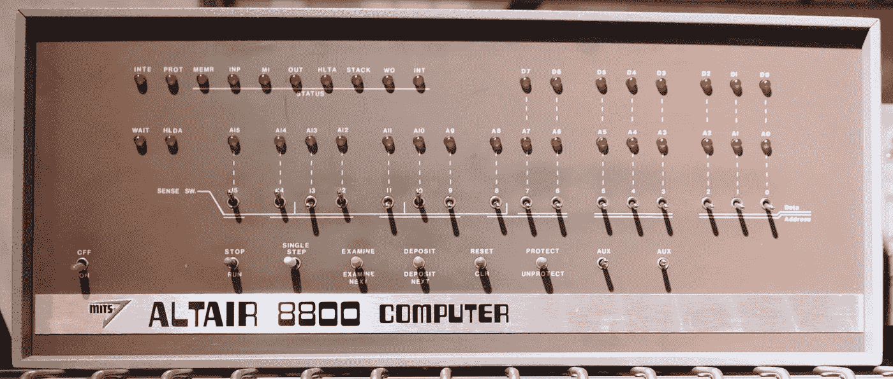
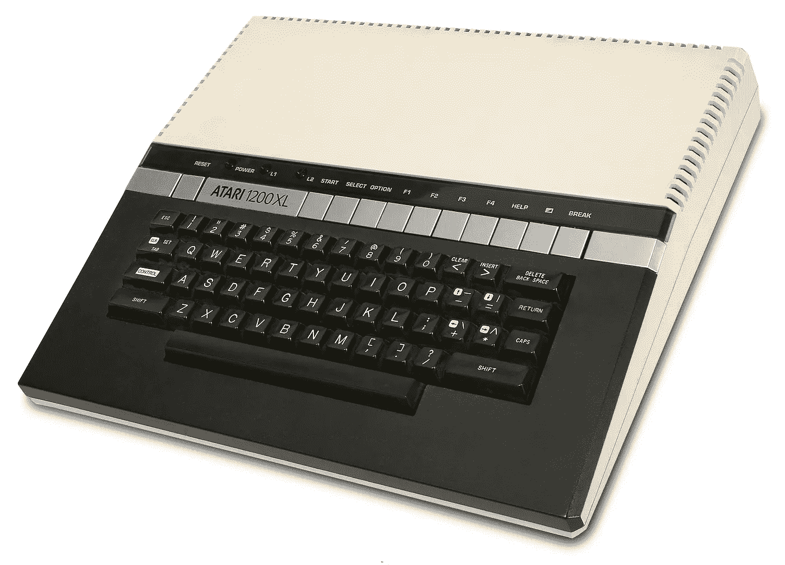

# 我们从哪里来

> 原文：<https://medium.datadriveninvestor.com/from-whence-we-come-97a375810d01?source=collection_archive---------33----------------------->

# 回归基础

曾几何时，我们自娱自乐。

我们没有任何麦金塔电脑，也没有任何数量的 Windows。有苹果，或康茂德，或 IBM。

所有这些都有基本的。

对于那些不知道的人来说:BASIC(或" T0 " Be ginner 的**A**ll-**P**pure**S**ymbolic**I**construction**C**ode ")是一种编程语言，对于对计算机感兴趣的一代人来说，它是使用计算机的第一个门户(回到“计算机用户”几乎等同于“计算机程序员”的时代)。

从 1977 年到 1984 年(Macintosh 的推出)，几乎每台售出的家用个人电脑都装有 BASIC，每台 IBM 或 Windows 电脑都装有 Windows Me(1990 年推出)。

一种面向业余爱好者、没有受过正规训练的人的语言是革命性的。这听起来有些夸张，但请考虑一下:计算机可以成为数学或科学的工具，这一直是显而易见的。它们可以是任何能把数字变成其他数字的东西。但是对于作家来说呢？游戏玩家？学生？非 STEM 人员可能想要或需要给计算机编程的想法并不是计算机人员所考虑的。

> [**《BASIC 五十年，让计算机个人化的编程语言》**](http://time.com/69316/basic/) **—时间，2014 年 4 月 29 日**

1964 年，约翰·g·克米尼和托马斯·e·库尔茨是达特茅斯大学的数学教授。当时编码发生在穿孔卡片上，如果你对计算机技术好的话，第二天你就会得到结果。Kemeny 和 Kurtz 是文理学院的数学系学生，他们发现需要一种可以自学并能立即看到成果的编程语言。

## 有趣的事实:第一批 BASIC 程序运行于 1964 年。直到 1966 年第三次修订时才添加了输入命令。

用户友好的命令，加上实现的新的分时系统，任何人都可以从任何连接的终端使用它，(可能还有一个新实现的要求，即每个达特茅斯数学学生都要上一堂 BASIC 课)，使这种新的编程语言取得了巨大的成功。

然而，下一个大的进步还需要大约十年。

By Todd Dailey — Altair 8800 at the Computer History Museum, CC BY-SA 2.0, [https://commons.wikimedia.org/w/index.php?curid=29491529](https://commons.wikimedia.org/w/index.php?curid=29491529)

牛郎星 8800 于 1975 年推出。这是第一台在商业上获得成功的个人电脑，以 439 美元一套的价格出售，或者以 621 美元一套的价格组装。当这个美女(闪烁的灯光！开关！)是 1975 年 1 月*大众电子*的封面模特，预定量飙升；希望卖几百的设计师，第一个月反而卖了几千。保罗·艾伦(Paul Allen)就是受那个流行的电子封面启发的人之一，他和他的好友比尔·盖茨(当时是哈佛大学二年级学生)将 BASIC 移植到了 Altair 8800 上。他们成立了一家公司来销售 Altair BASIC，并称之为 Micro-Soft。它们是许多版本中的第一个:T2 苹果 II T3 和 T4 Tandy T5，辛克莱基本 T7，甚至 BBC 基本 T9。

BASIC 是当年个人电脑的杀手级应用；从 1977 年开始，几乎每台个人电脑都配有这款产品。包括这个。

(By Daniel Schwen, CC BY-SA 3.0, [https://commons.wikimedia.org/w/index.php?curid=16255854](https://commons.wikimedia.org/w/index.php?curid=16255854))

上图:雅达利 1200XL。我的第一台电脑。实际上，它是一台游戏机；它播放所有的雅达利卡带，配有操纵杆，连接到普通电视。不过，你可以看出这是一台真正的电脑；看到键盘了吗？只有真正的电脑才有。

我当时七岁。我们只有几盒子弹:大金刚、Q-bert 和 BASIC。“大金刚”和“Q-bert”很有趣，不要误会我的意思，但当我在这些游戏上碰壁时，我会拿起基本的墨盒，插上电源，玩一会儿。

大概直到我第三次尝试它(并实际查看它附带的手册)时，我才发现它不仅仅可以在屏幕上显示我刚刚输入的内容。你可以做东西，可以做事情的东西。它可以发出声音，或者制作图形。图书馆里有书，医生办公室候诊室里有杂志，里面有我可以输入的程序。

这是一个巨大的痛苦。我很快就回到了大金刚和 Q-bert，更不用说乐高和星球大战了。

不过，有了后知之明，并且对 Ruby 这样的脚本语言有了更多的经验，我可以肯定地说:这是一个巨大的痛苦。

> "这是一个巨大的痛苦。"—爱德华·柴尔德里斯，2018 年

我知道这一点，因为 34 年后，我终于用 BASIC 编写了我的第一个程序。

我称之为“埃迪的六面骰子”

[你可以在这里运行这段代码](https://www.calormen.com/jsbasic/)，因为互联网是一个神奇的地方。这 19 行代码花了我大约一个半小时到两个小时来编写和调试，主要是因为我所能记得的关于 BASIC 的所有代码行都是有编号的，`GOTO`是一个东西，你把`END`放在最后。

然后我在 Ruby 中做了同样的事情。我称之为“埃迪的六面骰子滚轴. rb”。

这 20 行代码花了我大约 20 分钟的时间来编码和调试，因为 Ruby 是我在过去五周醒着的时候做得最多的一件事。

对于用现代语言编写代码的人来说，一些关于 BASIC 的东西应该马上跳出来。首先，显式行号。当 BASIC 问世时，还没有文本编辑器，只有命令行。所有的东西都是一行一行地打出来的；没有向上翻页和放置光标来插入你发现你需要的东西。你想要一个新的行，你输入一个新的数字，解释器会知道在第 100 行之后第 200 行之前读第 150 行。

(你可以在我的代码行编号中看到，我不得不添加，比如说，一个变量声明，或者循环之间的屏幕分隔符。)

这让我们想到了另一个程序员应该想到的东西:`GOTO`。作为一种非结构化编程语言，BASIC 中实现控制流的主要方式是通过`GOTO`直接到达您想要的行。这也是当时对 BASIC 的主要批评，最著名的批评来自计算机科学家 Edsger Dijkstra 在他的信中。这导致了不可读的，不可维护的“意大利面条代码”，就像直接阅读一本选择你自己的冒险书籍。

所以基本上，我知道我不可能不说出这个“基本上…”的双关语。而且，BASIC 感觉像是脚本语言的早期版本。可能是一个例子。因为它是解释的而不是编译的，所以反馈是即时的；即使您有语法错误，解释器也会很高兴地继续解释，直到它停止并把您转储回命令行。

同样显而易见的是，随着规模的增长，它将很快变得难以维护。您的代码中没有包含其他文件；BASIC 中没有代码库。您可以编写一个输入子例程，从第 10000 行开始，但是祝您好运，可以在其他程序中重用它；命令行文本编辑器中没有复制粘贴功能，你要做什么，每次都要重新输入吗？不，谢谢，BASIC，我们不再是初学者了。