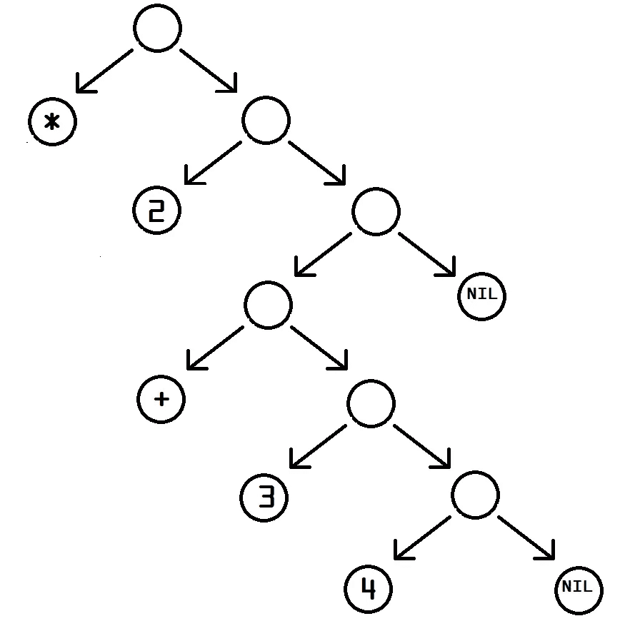

# 我们从哪里来。2

> 原文：<https://medium.datadriveninvestor.com/from-whence-we-come-pt-2-78b53eaa7975?source=collection_archive---------11----------------------->

# 说话口齿不清

LISP 是一个编程语言家族，最初由麻省理工学院的约翰·麦卡锡于 1958 年发明。他试图描述一个通用函数，一种生成算法的图灵完备语言。


John McCarthy, 2006 (CC-BY-SA-2.0)

当 Russell 意识到可以用机器码实现 *eval* 函数时，Steve Russell 将它实现到了一个解释器中。这对麦卡锡来说是一个惊喜，他原本打算只用于阅读，而不是真正的计算。

Lisp 是第二古老的高级编程语言(即独立于你编写它的计算机)，仅次于 1957 年发明的 Fortran。它影响了一系列其他程序的发展，比如 Smalltalk、Logo、Haskell、Perl、JavaScript 和 Ruby。

来自我们的老朋友[埃德格·w·迪克斯特拉](https://en.wikipedia.org/wiki/Edsger_W._Dijkstra)，1972 年:

> LISP 被戏谑地描述为“误用计算机的最聪明的方式”。我认为这个描述是一个很大的褒奖，因为它传达了解放的全部味道:它帮助我们许多最有天赋的人类同胞思考以前不可能的想法。"

这就是为什么 Lisp 真的很酷:[同形异义](https://en.wikipedia.org/wiki/Homoiconicity)。这意味着代码结构与代码使用的数据结构相同。代码是数据，数据可以是代码。程序，所有的程序，任何语言，都是为了对数据做事情而写的；当数据变得更复杂时，程序可以重写自己。

我们一直在大脑中这样做。这叫学习。

出于这个原因，Lisp 一直是人工智能研究的核心，包括逻辑编程、人工神经网络和自然语言处理等相关领域。

这是 Lisp 代码的一部分:

```
(defun good-enough-p (guess x)
  (format t "~% Guess =~7,4f     Guess^2 = ~7,4f    Error= ~7,4f" guess 
          (* guess guess) (abs (- (* guess guess) x)))
  (< (abs (- (* guess guess) x)) .001))
```

(代码基本上是从[这里](http://forrest.psych.unc.edu/teaching/p285/p285pgmexmpchap3.html)随机选取的)



(* 2 (+ 3 4)), as a tree. By Natecull at English Wikipedia, CC BY-SA 3.0, [https://commons.wikimedia.org/w/index.php?curid=57538978](https://commons.wikimedia.org/w/index.php?curid=57538978)

您首先会注意到的是括号。一切都在括号之间:它被称为一个 [*s 表达式*](https://en.wikipedia.org/wiki/S-expression) ，由两个或更多的*原子*(数据字符串、运算符、变量调用之类的东西)组成，或者其他 s 表达式。在递归定义中，你可以用其他 s 表达式生成一个 s 表达式，这意味着 s 表达式是[二叉树](https://en.wikipedia.org/wiki/Binary_tree)(左图):每个父节点有两个子节点。

您将看到的另一件事是前缀符号:首先是操作符(+，-，逻辑比较器)，然后是操作数。

`a * ( b + c ) / d`

被写成

`(/ (* a (+ b c) ) d)`

所以让我们回到 Eddie 的六面掷骰子，现在是 Lisp 味的:

```
;This does not work:(defvar sum 0)
(defvar die)
(defvar num)
(princ "How many dice are you rolling? ")
(setq num (read))
  (princ "num equals ")
  (write num)

(defun rolldie ()
    (+ 1 (random 6))
)(loop 
    for x from 1 to num
    do ( 
    (setq die rolldie())
    (print rolldie())
    (+ sum rolldie())
    )
)
(write sum)
```

我试图让它工作，但一个小时以来，我一直得到一个语法错误:

`EVAL: (SETQ DIE ROLLDIE NIL) is not a function name; try using a symbol instead`

无论我如何谷歌，我都无法找出我做错了什么，所以如果任何人有任何建议，请留言，我会尝试一下。

编辑(12/7):我的好友[查尔斯](https://medium.com/@thatoneguywiththehair)分享了这个:

> 这里的问题是，你的`do`的整个主体被当作一个语句(或者原子，我猜？).相反，循环的主体应该是多个`do`
> 
> 您还会注意到，您必须将`(+ sum die)`的值赋回`sum`。Lisp 是纯函数式的，严格遵循不变性原则。没有变化的变量，年轻的先生！

所以，这段代码或多或少是有效的:

```
(defvar sum 0)
(defvar die)
(defvar num)
(princ "How many dice are you rolling? ")
(setq num (read))(print "num equals ")
(write num)

(defun rolldie ()
    (+ 1 (random 6))
)
(loop for x from 1 to num
  do (setq die (rolldie))
  do (setq sum (+ sum die))
  do (print "Die")
  do (princ x)
  do (princ ": ")
  do (princ die)
)
(print "Your sum is")
(princ sum)
```

您可以在这里运行它，只需知道您必须将输入放入 STDIN 标签中。另外，我不知道如何输出那些没有引号的字符串，因为 [Lisp 有太多的输出函数](https://www.tutorialspoint.com/lisp/lisp_input_output.htm)。

> “有传言说，将 Lisp 和 GUI 编程结合起来必然会导致 CRT 显示器爆炸，这已经杀死了数千名程序员，但这一切都被掩盖了。”

*—找到* [*此处*](http://wiki.c2.com/?LispShowOffExamples)

从我读到的一切来看，Lisp 不适合轻松的人。很难读，很难学，很难跟。它很强大，让那些掌握它的人看起来像是奇才，甚至对其他软件工程师来说也是如此。它不会让简单的事情变得更容易，但它会让不可能的事情变得可能。我听说是这样。

此外，很多人同意:理解 Lisp [会让你成为更好的任何其他语言的编码者。也许是因为这种范式与 C 之类的东西如此不同，它迫使你以不同的方式考虑问题，这种体验会一直伴随着你。](https://www.google.com/search?q=lisp+makes+you+a+better+programmer)

我不断回想起的问题是， ***我*** 会学 Lisp 吗？阅读像 [Eric S. Raymond](https://en.wikiquote.org/wiki/Eric_S._Raymond) 和 Edsger Dijkstra wax rhapsodic 这样的人关于 Lisp 如何能像 Scott Pilgrim 宇宙中的素食主义者一样给你超能力的文章让我想明白，至少，这到底是为什么。然而，要学的东西太多了，要找工作，要实现合理的目标。学习 Lisp，对我来说，是摆在桌面上的。然而，桌子是长的。


from [https://xkcd.com/297/](https://xkcd.com/297/)