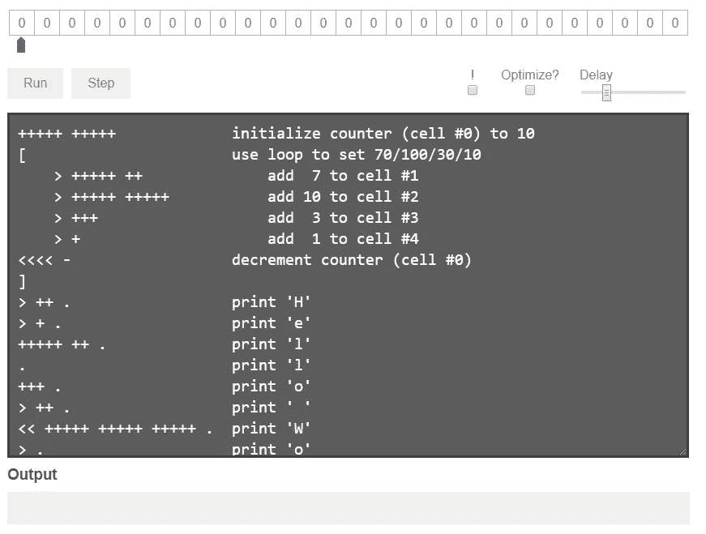
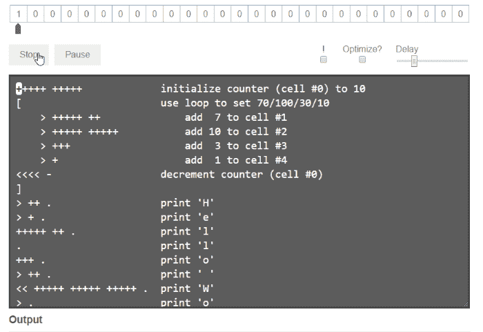
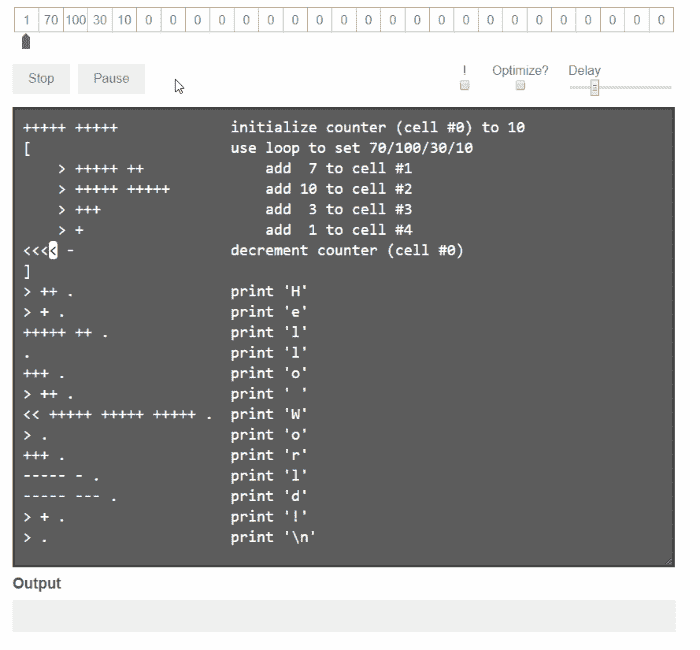

# 我们从哪里来。5

> 原文：<https://medium.datadriveninvestor.com/from-whence-we-come-pt-5-d2e0df781abe?source=collection_archive---------7----------------------->

[](http://www.track.datadriveninvestor.com/1B9E)

## Brainf*ck:或者说我是如何学会停止担忧，爱上头痛的

> "19.一种不影响你思考编程方式的语言是不值得了解的。”
> 
> — [《编程警句》](http://pu.inf.uni-tuebingen.de/users/klaeren/epigrams.html)，艾伦·珀利斯，1982 年

有些编程语言是为完成工作而设计的，有些是软件工程师用来解决问题的工具。还有一些语言是用来做其他事情的。它们被称为[深奥的编程语言](https://esolangs.org/wiki/Esoteric_programming_language)，或者 [esolang](https://esolangs.org/wiki/Esoteric_programming_language) (因为为什么要用三个词……)，它们唯一的共同点是它们都有一些不同于常规语言的地方。也许他们是来探索计算机科学概念的，因为[是一种新的不同的编码方式](https://esolangs.org/wiki/Befunge)。也许他们想变得怪异和与众不同，就像[嵌入](https://esolangs.org/wiki/INTERCAL)。也许它们被设计成不可能使用，就像[不可读](https://esolangs.org/wiki/Unreadable)。

或者也许它们只是被设计成最小的图灵完全语言。其中最著名的是 brainfuck。

[Brainfuck](https://esolangs.org/wiki/Brainfuck) (又名 brainf***，brainf*ck，brainfsck，b****fuck(因为 compsci 的书呆子都很搞笑)，brainf**k，branflakes，或者 BF)是 Urban Müller 在 1993 年创建的，他想用尽可能最小的编译器创建一种语言。他受到了 [False](https://esolangs.org/wiki/FALSE) 的启发，另一个 esolang 的编译器大小只有 1024 字节，但穆勒去掉了所有的 frou-frou，比如字符串变量。或逻辑运算符。或者乘法。

[](https://www.datadriveninvestor.com/2019/02/21/best-coding-languages-to-learn-in-2019/) [## 2019 年最值得学习的编码语言——数据驱动的投资者

### 在我读大学的那几年，我跳过了很多次夜游去学习 Java，希望有一天它能帮助我在…

www.datadriveninvestor.com](https://www.datadriveninvestor.com/2019/02/21/best-coding-languages-to-learn-in-2019/) 

穆勒的 BF 编译器以 240 个字节的微弱优势扭转了局面，这让我非常惊讶；穆勒原来的[自述](http://de4.aminet.net/dev/lang/brainfuck-2.readme)是 *684* 字节。但是人们不能放任不管，最终发布了几个小于 200 字节的编译器；一个有进取心的人设法组装了一个 100 字节的编译器。

*那么它是如何工作的呢？*你现在问这个问题，这很偶然，因为这是我告诉你它如何工作的部分。语法只包含八个命令，文档也很简单:

```
Cmd  Effect                               
---  ------                               
+    Increases element under pointer      
-    Decrases element under pointer       
>    Increases pointer                    
<    Decreases pointer                    
[    Starts loop, flag under pointer      
]    Indicates end of loop                
.    Outputs ASCII code under pointer     
,    Reads char and stores ASCII under ptr
```

当然，简单并不等于容易。为了了解发生了什么，我们将使用[这个我发现的便捷的 brainfrak 可视化工具](https://github.com/fatiherikli/brainfuck-visualizer)来观察机器模型输出“Hello World！”。实际的 branflake 代码是这样的:

```
+++++ +++++ [> +++++ ++> +++++ +++++ > +++ > + <<<< -] > ++ .                  > + . +++++ ++ . . +++ . > ++ . << +++++ +++++ +++++ . > . +++ .      ----- - . ----- --- . > + . > .
```



from [http://fatiherikli.github.io/brainfuck-visualizer/](http://fatiherikli.github.io/brainfuck-visualizer/)

您正在查看的模型由数据单元阵列组成，也称为磁带；每个单元的大小通常为 8 字节，但这取决于具体实现。还有一个数据指针，它将根据`<` 和`>` 告诉它做什么来回移动，以及由括号`[]`定义的循环。输出被读作 ASCII 字符代码:`H` 是 72，`e` 是 101，依此类推。

出于显而易见的原因，代码被大量注释；breenfreak 编译器会忽略八个命令之外的所有内容，所以您可以键入任何想要的内容作为注释，只要它没有任何`< > + - . , [ ]`



这里，程序正在运行第一个循环。第一个单元格被用作循环计数器，后面的四个单元格用来保存我们用来读取字符的整数值。我们需要' H '，' e '，' l '，' o '，' '，' W '，' r '，' d '和'！'，以及一个换行符，这比我们分配的单元格要多，但没关系，我们会在磁带上来回切换。



这里，我们正在运行程序的输出部分，在这里它一个字符一个字符地打印出`Hello World!`。您可以看到数据指针左右移动，这取决于哪个单元格的值最接近我们想要的下一个字符的值。

很明显，这里有很多方法可以得到你想要的输出；因为它只是硬编码的文本，你可以只把指针放在一个单元格中，然后有几百个加号和减号，但是这一点也不好玩。

> "18.没有循环和结构化变量的程序不值得编写。”
> 
> — [《编程警句》](http://pu.inf.uni-tuebingen.de/users/klaeren/epigrams.html)，艾伦·珀利斯，1982 年

这个博客的粉丝会问，*好吧，那么 Eddie 的 6 面掷骰子，beihnfight 版在哪里？*

对此我的回答是:

如果你们谁想试试，请便。[你可以从这个随机数发生器开始。](https://github.com/pablojorge/brainfuck/blob/master/programs/random.bf)

有一个词可以形容图灵——像 bumfight 这样的完全极简主义语言:[图灵·塔皮特](https://esolangs.org/wiki/Turing_tarpit)。

> "小心图灵陷阱，在这个陷阱里，一切皆有可能，但没有一件有趣的事是容易的."
> 
> — [《编程警句》](http://pu.inf.uni-tuebingen.de/users/klaeren/epigrams.html)，艾伦·珀利斯，1982 年

脑力劳动是一项智力运动，它之所以受欢迎是因为咒骂很有趣。使用它的唯一理由是证明你能使用它。我没有任何不好的意思。书呆子们利用他们的空闲时间来展示他们性感的大脑，这是互联网产生的原因。

我很高兴脑残是一件事。仅仅是阅读和思考它就让我欣赏计算机如何执行程序，以及在进入`if` 语句的所有抽象下实际发生了什么。你可能会说这是愚蠢和无用的，但双关语也是如此，你可以从我的编码手中拿走我的计算机编程双关语。

*查看本系列往期词条关于* [*基础*](https://medium.com/datadriveninvestor/from-whence-we-come-97a375810d01) *，*[*LISP*](https://medium.com/datadriveninvestor/from-whence-we-come-pt-2-78b53eaa7975)*，*[*COBOL*](https://medium.com/@eddiec76/from-whence-we-come-pt-3-ee6df5134cee)*，*[*Elm*](https://medium.com/datadriveninvestor/from-whence-we-come-pt-4-2f649b8111f7)*。*